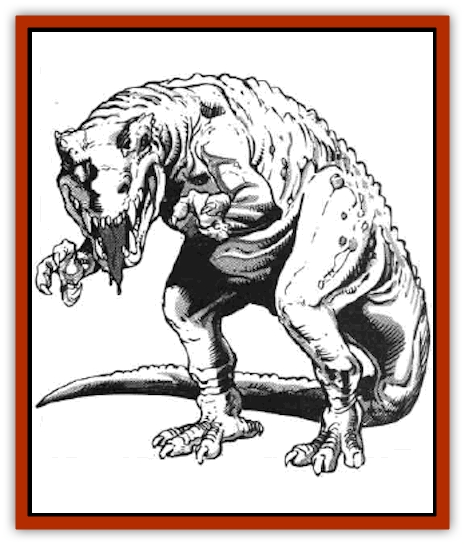

# Bonesnapper

| Statistic | **Bonesnapper** |
| --- | --- |
| **Activity Cycle:** | Day |
| **Alignment:** | Neutral |
| **Armor Class:** | 4 |
| **Climate/Terrain:** | Tropical or subtropical/Forests and swamps |
| **Damage/Attack:** | 1-8/1-4 |
| **Diet:** | Carnivore |
| **Frequency:** | Rare |
| **Hit Dice:** | 4 |
| **Intelligence:** | Non- (0) |
| **Magic Resistance:** | Nil |
| **Morale:** | Special |
| **Movement:** | 6 |
| **No. Appearing:** | 1-3 |
| **No. of Attacks:** | 2 |
| **Organization:** | Solitary |
| **Size:** | M (5' tall) |
| **Special Attacks:** | Nil |
| **Special Defenses:** | Nil |
| **THAC0:** | 17 |
| **Treasure:** | C |
| **XP Value:** | 120 |

The dreaded bonesnapper is a fearsome beast descended from the [[Dinosaur_I|giant carnivorous lizards]] that roamed the world many thousands of years ago. Known for its savage aggression, territorial protectiveness, and incredible stupidity, the bonesnapper is a dangerous beast.

Adult bonesnappers stand an average of five feet tall. They may weigh as much as 500 pounds. Their tough hide is not scaled, but it is very thick and leathery, providing them with excellent protection from all manner of physical attacks. As a rule, bonesnappers are dark green or olive in color, enabling them to blend in with their forest environment.

**Combat:** As has been noted, the bonesnapper is not a clever opponent. In combat it rushes straight at the nearest foe, often letting out a great roar in the charge. If it is attacked from another direction, the bonesnapper whirls about and pursues its new adversary.

The bonesnapper's primary attack mode is a bite with its powerful jaws and jagged teeth. Although the teeth are not unusually sharp, the strength of the jaw muscles is enough to inflict 1d8 points of damage with each bite (and the tail can be swept around to hit the same opponent for 1d4 points of damage).

Bonesnappers always fight to the death, as they are not smart enough to know when they should run away. Because they are so amazingly stupid, bonesnappers are easily distracted and can often be tricked or trapped with little or no risk to creatures stalking them.

**Habitat/Society:** Young bonesnappers, both male and female, are solitary creatures. They travel the wilds, living a nomadic existence and hunting when they can. As they grow older, however, they eventually stop wandering and seek out a mate.

Once two bonesnappers have mated, they take up residence in a large cave or similar lair and begin a new lie together. Bonesnappers that have ceased their travels become very territorial, chasing away or killing any large carnivores that live near their lair.

In the spring of each year, the female makes a nest. She begins by digging a pit one foot in diameter and six inches deep in the ground. Once this is completed, she lines it with straw or other grasses and then deposits an egg into it. The egg hatches within a month and a young bonesnapper emerges. The baby spends the first month of its life in the lair with its mother while the male hunts for the family. In its second month, however, the young bonesnapper joins its parents in a family quest for prey. This pattern continues for about one year, when the half-grown bonesnapper leaves its parents. By its third birthday the baby bonesnapper will have reached full size.

The lair of a bonesnapper couple is always underground. Because of the creature's habit of dragging the bodies of its victims back to its lair before consuming them, the cave is always covered in bones. The creature's name is drawn from its habit of breaking victims' bones to get at the marrow. Although a bonesnapper periodically drags items like armor or backpacks out of its cave and leaves them scattered about the entrance, it never takes steps to clear out the bones.

**Ecology:** Bonesnappers are dangerous hunters, despite their low intelligence. As such, they tend to be the dominant carnivores in their territories. Wandering bonesnappers are given a wide berth by any creature familiar with them.

Because they are not far removed from their dinosaur ancestors, a spell that calls for the eye of a dinosaur can often be cast with the eye of a bonesnapper. Since the bonesnapper is easier to find and kill than most large, carnivorous dinosaurs, this is fairly common.

[[Lizard_Man|Lizard men]] find the flesh of bonesnappers quite tasty and often hunt them. Most other races, however, find bonesnapper hide far too tough to be enjoyable. It is worth noting that in many lizard man cultures, a hunter must seek out and kill a bonesnapper single handedly in order to enter adulthood. Although the bonesnapper is far more powerful than the average lizard man hunter, its limited intelligence makes the fight fairly even.

---
## Discovery & Documentation

**Source Publication:** MC5 Greyhawk Appendix (1989)
**Campaign Setting:** Advanced Dungeons & Dragons 2nd Edition
**Author(s):** Grant Boucher, William W. Connors, Steve Gilbert, Bruce Nesmith, Chris Mortika, Skip Williams

### Other Creatures Found in This Source Book
   * [[Aspis|Aspis]]
   * [[Beastman|Beastman]]
   * [[Booka|Booka]]
   * [[Brownie_Buckawn|Brownie, Buckawn]]
   * [[Brownie_Quickling|Brownie, Quickling]]
   * [[Crystalmist|Crystalmist]]
   * [[Dragon_Cloud|Dragon, Cloud]]
   * [[Dragon_Oerth_Greyhawk|Dragon (Oerth), Greyhawk]]
   * [[Dragonfly_Giant|Dragonfly, Giant]]
   * [[Dragonnel|Dragonnel]]
   * [[Elf_Grugach|Elf, Grugach]]
   * [[Elf_Valley|Elf, Valley]]
   * [[Golem_Necrophidius|Golem, Necrophidius]]
   * [[Grell_Wild|Grell, Wild]]
   * [[Grung|Grung]]
   * [[Hobgoblin_Norker|Hobgoblin, Norker]]
   * [[Hook_Horror|Hook Horror]]
   * [[Horgar|Horgar]]
   * [[Hound_Yeth|Hound, Yeth]]
   * [[Iguana_Giant|Iguana, Giant]]
   * [[Ingundi|Ingundi]]
   * [[Kech|Kech]]
   * [[Kyuss_Son_of|Kyuss, Son of]]
   * [[Mite|Mite]]
   * [[Needleman|Needleman]]
   * [[Plant_Carnivorous_Oerth|Plant, Carnivorous (Oerth)]]
   * [[Plant_Carnivorous_Vampire_Cactus|Plant, Carnivorous, Vampire Cactus]]
   * [[Plasmoid_General_Information|Plasmoid, General Information]]
   * [[Rat_Oerth|Rat (Oerth)]]
   * [[Raven_Crow|Raven/Crow]]
   * [[Scarecrow|Scarecrow]]
   * [[Shadow_Slow|Shadow, Slow]]
   * [[Skulk|Skulk]]
   * [[Snail|Snail]]
   * [[Sprite|Sprite]]
   * [[Taer|Taer]]
   * [[Tentamort|Tentamort]]
   * [[Turtle_Giant|Turtle, Giant]]
   * [[Tyrg|Tyrg]]
   * [[Wolf_Mist|Wolf, Mist]]
   * [[Wraith_Oerth|Wraith (Oerth)]]
   * [[Zygom|Zygom]]
