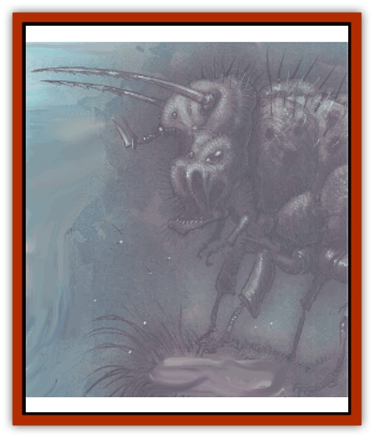

# Bonespear

| Statistic | **Bonespear** |
| --- | --- |
| **Activity Cycle:** | Night |
| **Alignment:** | Neutral |
| **Armor Class:** | 1 head, 5 body |
| **Climate/Terrain:** | Acheron, Gehenna, Outlands |
| **Damage/Attack:** | 1d4+2 or 2d6 |
| **Diet:** | Carnivore |
| **Frequency:** | Rare |
| **Hit Dice:** | 5+2 |
| **Intelligence:** | Semi- (2-4) |
| **Magic Resistance:** | Nil |
| **Morale:** | Steady (11-12) |
| **Movement:** | 6 |
| **No. Appearing:** | 1 |
| **No. of Attacks:** | 2 spears or 1 bite |
| **Organization:** | Solitary |
| **Size:** | L (8' body) |
| **Special Attacks:** | Harpoon |
| **Special Defenses:** | Nil |
| **THAC0:** | 15 |
| **Treasure:** | Nil |
| **XP Value:** | 650 |

Not all the hideous creatures of the planes are fiends. Some're just natural predators who get by in a dangerous and unnatural setting. The bonespear's one of these. It appears to be a relative of the [[Cave_Fisher|cave fisher]], and shares some of its cousin's hunting tactics. Bonespears are found on some of the lawful planes, ranging from Carceri to Arcadia, and on parts of the Outlands a well.

A bonespear's a large, insectile creature with a hard, chitinous shell. Its head is a huge, misshapen sphere with a pair of jutting, barbed bone horns. Beneath these horns are the creature's eyes and a gaping maw full of jagged teeth. Six pairs of thick, clawed legs line its body. The bonespear doesn't use its legs for fighting, but likes to anchor itself to good, hard rock with its twelve feet. It'd take a basher with the muscle of a [[Giant_Fire|fire giant]] to move a bonespear that's got itself set.

**Combat:** The bonespear's most dangerous weapon are the two horns that give it its name. Buried behind the horn sockets the bonespear's got a large air bladder surrounded by tough, thick muscle. By suddenly squeezing the bladder, the bonespear uses a powerful blast of compressed air to fire its horns at anything that looks edible. The horns're joined to the creature's skull by a tough braid of sinew, and the sinew's anchored in another muscle that can reel the horns in like a winch.

The bonespear's horns can be fired up to 40 feet away. If a horn's attack roll exceeds the number required to hit by 4 or more points, the horn sticks in the victim like a harpoon. Otherwise, the bonespear drags its horn back for another shot - a process that takes a full round. If the horn hits but doesn't stick, the victim just suffers the listed damage; if it hits and sticks, the victim incurs the damage, and the bonespear tries to reel him in.

The bonespear can retract its horns with an effective Strength of 17. The round after a bonespear hools something, the victim and the monster both make Strength checks. Whoever rolls the highest number wins the contest. If the victim wins, he holds his ground and isn't dragged any closer to the bonespear. If the bonespear wins, the victim is dragged 10 to 40 feet closer to its mouth. When the victim has been dragged up to the bonespear's head, the monster attacks with its fearsome jaws.

The bonespear's barbed horns can be ripped out of a wound, if the creature removing the horns succeeds in a Strength check. Unfortunately, this inflicts 1d4+2 points of damage on the victim. The horns themselves are as sturdy as iron spears, but the sinew connecting them to the monster's head can be severed. The sinew strand is AC 2 and can withstand 12 points of damage before being severed; only Type S weapons can do this. The bonespear takes no damage from having one horn severed, but if both horns are severed the creature'll retreat fromthe combat.

Bonespears don�t move fast and don�t hunt in open ground. They're naturally inclined to seek good locations for ambushes. A bonespear might conceal itself in a thicket near a waterhole or wedge itself into a crevasse overlooking a path, and then wait for its prey to come near. Because of the creature's skill in concealing itself and springing its ambush, its victim receives a -1 penalty to any surprise check.

**Habitat/Society:** Bonespears're solitary creatures; they don't take to competition from their own kind, and fight vicious territorial battles over prime hunting ground. They mate only once every 3 years, and the female abandons the eggs as soon as she lays them. Not many bonespears reach adulthood.

Generally, a bonespear's regarded as a dangerous pest, and few Outlanders'll rest until the creature's driven away or killed. Bonespears keep their chosen hunting area clear of the telltale remains of their kills, burying bones, scraps of armor, and other such debris in shallow pits around their hiding places. A bonespear's horn can make a short, serviceable spear in a pinch, equal to a javelin but not balanced for throwing. The tough, sinewy connective tissue can provide 40 feet of light, strong line for a cutter in need of some rope.

**Ecology:** Young bonespears prey on birds and common animals such as rabbits and squirrels. As they grow toward their mature size, bonespears begin taking larger and larger prey. They're not afraid to harpoon anything, and in some places bonespears pose a significant threat to minor fiendlings such as [[Baatezu_Least_Nupperibo|nupperibo]] or [[Baatezu_Lemure|lemures]]. Despite their natural weaponry, bonespears are preyed on in turn by more powerful fiends. There are rumors of domesticated bonespears in some corners of Carceri or Baator.

---
## Discovery & Documentation

**Source Publication:** Planescape II (1996)
**Campaign Setting:** Planescape
**Author(s):** Rich Baker, Karen S. Boomgarden

### Other Creatures Found in This Source Book
   * [[Aasimar|Aasimar]]
   * [[Abrian|Abrian]]
   * [[Arcane|Arcane]]
   * [[Balaena|Balaena]]
   * [[Beholder-kin_Observer|Beholder-kin, Observer]]
   * [[Bloodthorn|Bloodthorn]]
   * [[Darkweaver|Darkweaver]]
   * [[Demarax|Demarax]]
   * [[Dhour|Dhour]]
   * [[Eater_of_Knowledge|Eater of Knowledge]]
   * [[Eladrin_Greater_Firre|Eladrin, Greater, Firre]]
   * [[Eladrin_Greater_Ghaele|Eladrin, Greater, Ghaele]]
   * [[Eladrin_Greater_Tulani|Eladrin, Greater, Tulani]]
   * [[Eladrin_Lesser_Bralani|Eladrin, Lesser, Bralani]]
   * [[Eladrin_Lesser_Coure|Eladrin, Lesser, Coure]]
   * [[Eladrin_Lesser_Noviere|Eladrin, Lesser, Noviere]]
   * [[Eladrin_Lesser_Shiere|Eladrin, Lesser, Shiere]]
   * [[Fhorge|Fhorge]]
   * [[Ghostlight|Ghostlight]]
   * [[Guardinal_Avoral|Guardinal, Avoral]]
   * [[Guardinal_Cervidal|Guardinal, Cervidal]]
   * [[Guardinal_General_Information|Guardinal, General Information]]
   * [[Guardinal_Equinal|Guardinal, Equinal]]
   * [[Guardinal_Leonal|Guardinal, Leonal]]
   * [[Guardinal_Lupinal|Guardinal, Lupinal]]
   * [[Guardinal_Ursinal|Guardinal, Ursinal]]
   * [[Hollyphant|Hollyphant]]
   * [[Incantifer|Incantifer]]
   * [[Ironmaw|Ironmaw]]
   * [[Keeper|Keeper]]
   * [[Khaasta|Khaasta]]
   * [[Leomarh|Leomarh]]
   * [[Monster_of_Legend|Monster of Legend]]
   * [[Mortai|Mortai]]
   * [[Noctral|Noctral]]
   * [[Quill|Quill]]
   * [[Razorvine|Razorvine]]
   * [[Reave|Reave]]
   * [[Retriever|Retriever]]
   * [[Rilmani_Abiorach|Rilmani, Abiorach]]
   * [[Rilmani_General_Information|Rilmani, General Information]]
   * [[Rilmani_Argenach|Rilmani, Argenach]]
   * [[Rilmani_Aurumach|Rilmani, Aurumach]]
   * [[Rilmani_Cuprilach|Rilmani, Cuprilach]]
   * [[Rilmani_Ferrumach|Rilmani, Ferrumach]]
   * [[Rilmani_Plumach|Rilmani, Plumach]]
   * [[Shadowdrake|Shadowdrake]]
   * [[Spellhaunt|Spellhaunt]]
   * [[Spider_Hook|Spider, Hook]]
   * [[Sunfly|Sunfly]]
   * [[Sword_Spirit|Sword Spirit]]
   * [[Tanar'ri_Lesser_Bulezau|Tanar'ri, Lesser, Bulezau]]
   * [[Tanar'ri_Lesser_Maurezhi|Tanar'ri, Lesser, Maurezhi]]
   * [[Tanar'ri_Lesser_Yochlol|Tanar'ri, Lesser, Yochlol]]
   * [[Tanar'ri_General_Information|Tanar'ri, General Information]]
   * [[Tanar'ri_True_Alkilith|Tanar'ri, True, Alkilith]]
   * [[Terlen|Terlen]]
   * [[Tso|Tso]]
   * [[T'uen-rin|T'uen-rin]]
   * [[Vaporighu|Vaporighu]]
   * [[Vorr|Vorr]]
   * [[Wastrel|Wastrel]]
   * [[Wraithworm|Wraithworm]]
   * [[Yugoloth_Lesser_Canoloth|Yugoloth, Lesser, Canoloth]]
   * [[Zoveri|Zoveri]]
