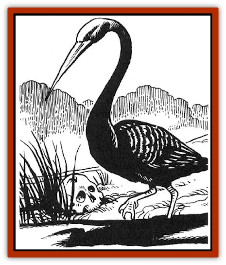
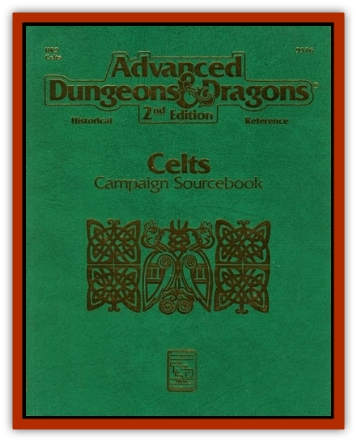

# Boobrie

| Statistic | **Boobrie** |
| --- | --- |
| **Activity Cycle:** | Day |
| **Alignment:** | Neutral |
| **Armor Class:** | 7 |
| **Climate/Terrain:** | Temperate/Lakes |
| **Damage/Attack:** | 2d4 or 1d6 |
| **Diet:** | Carnivore |
| **Frequency:** | Rare |
| **Hit Dice:** | 4+4 |
| **Intelligence:** | Animal (1) |
| **Magic Resistance:** | Nil |
| **Morale:** | Unsteady (5-7) |
| **Movement:** | 2, Fl 20, Sw 6 |
| **No. Appearing:** | 1-2 |
| **No. of Attacks:** | 1 |
| **Organization:** | Solitary |
| **Size:** | M (20' wingspan) |
| **Special Attacks:** | Wing buffet |
| **Special Defenses:** | Nil |
| **THAC0:** | 17 |
| **Treasure:** | (O, W) |
| **XP Value:** | 420 |

The boobrie is a giant [[Bird|bird]], looking much like a loon or northern diver which has grown to the size of a man. It is completely black in color. It haunts the lakesides of western Scotland and supplements its diet of fish by devouring lambs and calves that stray too close to the waterside. It has been known to wait in ambush in the reeds by the side of a lake and attack anything the size of a sheep or smaller - including young children - which wanders within reach. Its call is harsh and loud and can carry for several miles.

**Combat:** The boobrie attacks with its 2-foot beak, and can also rear up to deliver a wing-buffet once every three rounds. The wing-buffet automatically hits any creature directly in front of the boobrie and not more than 5 feet away. It causes Id6 damage, and the opponent must make a Dexterity ability check or be knocked down, dropping any hand-held items.

**Habitat/Society:** Boobries inhabit upland lakes in the more remote parts of northern and western Europe. In the spring they form pairs and build nests of floating vegetation which can be up to 20 feet across. They lay 1d4 eggs, and throughout the late spring and early summer they are busy gathering food for their young. Any treasure they have will be in the nest at this time of year, having been brought there on the bodies of human prey.

**Ecology:** Boobries eat [[Fish|fish]] and any mammals they can catch. They have no natural enemies other than [[Dragon_General_Information|dragons]], [[Wyvern|wyverns]], and other such monsters, and humans who often try to kill boobries to protect their livestock.

---
## Discovery & Documentation

**Source Publication:** HR3 Celts Campaign (1992)
**Campaign Setting:** Advanced Dungeons & Dragons 2nd Edition
**Author(s):** Graeme Davis

### Other Creatures Found in This Source Book
   * [[Horse_Water-|Horse, Water-]]
   * [[Phouka|Phouka]]
   * [[Water_Leaper|Water Leaper]]
