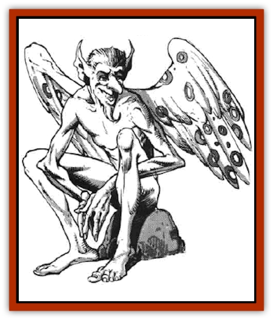

# Booka

| Statistic | **Booka** |
| --- | --- |
| **Activity Cycle:** | Day |
| **Alignment:** | Neutral (chaotic good) |
| **Armor Class:** | 7 |
| **Climate/Terrain:** | Temperate to subarctic/Inhabited regions |
| **Damage/Attack:** | Nil |
| **Diet:** | Omnivore |
| **Frequency:** | Uncommon |
| **Hit Dice:** | ½ |
| **Intelligence:** | Very (11-12) |
| **Magic Resistance:** | 10% |
| **Morale:** | Average (8-10) |
| **Movement:** | 12, Fl 18 (A) |
| **No. Appearing:** | 1-4 |
| **No. of Attacks:** | 0 |
| **Organization:** | Family |
| **Size:** | T (1' tall) |
| **Special Attacks:** | Nil |
| **Special Defenses:** | Invisibility |
| **THAC0:** | 20 |
| **Treasure:** | J |
| **XP Value:** | 35 |

Bookas are delightful relatives of [[Sprite|pixies]], [[Sprite|sprites]], and fairies. Like most of the faerie folk, their time is taken up with a existence not unlike that of the [[Brownie|brownie]], though they tend to favor attics and eaves as living quarters.

Bookas average between 10 and 14 inches tall, with rare examples of the race reaching heights of 15 or even 16 inches. They have slender humanoid bodies with more or less human features. They are noted for having long, pointy noses and broad ears, which make them somewhat homely by most human standards. Their wings are slight and delicate, brightly colored like those of a butterfly.

Bookas have their own tongue, which is similar to that of the other faerie races. Roughly half of them are able to speak elvish while one in four can converse in the common tongue of men. It is not uncommon to find at least one booka in a given area who is also familiar with the thieves' cant.

**Combat:** Bookas are, by and large, one of the most peaceful races known to man. They do everything possible to avoid entering into combat, for they are all but helpless in a fight.

While it is true that a booka can deliver a painful bite, there is no significant damage done by it. At worst, the booka's victim suffers a nasty welt with a minor loss of blood. In general, a booka bite is about as dangerous as a paper cut.

Bookas are able to become *invisible* at will. This power is so basic to them that they can do it at any time, even when engaged in another action. They use this ability to evade enemies or attackers.

If a booka has been angered by the actions of another creature, it may take steps to injure or even kill the offender. In such cases, very delicate and clever traps are set up.

**Habitat/Society:** Bookas make their homes in every region of the globe that is home to men. As a rule, they like rustic settings, especially farming communities, in warm climates. A family of bookas selects a farming family that reflects their basically good natures and takes up residence in the home. In warm regions, they may be found in any portion of the house, while colder climes always find the bookas dwelling near the fireplace, stove, or other heat sources.

On bright, sunny days they spend their time seeking out wild flowers and enjoying the benefits of country living. On mornings when everyone in the house is quiet and the weather is nice, they often sweep and dust the home in which they dwell, as payment for their shelter. If the bookas are disturbed in their work, or if their nest is discovered, they quickly leave the house in search of a quieter place to live.

If a booka is captured or harmed in any way, its companions take steps to revenge this insult. This usually involves tricks and traps being placed around the offender's home, the severity of which is determined by the injury inflicted on their fellow. If the offence is minor, the bookas can be placated with a valuable offering of gold, jewelry, or magic, placed in a spot frequented by the bookas. If the injury was severe or even fatal to the booka in question, no bribes are accepted and the traps are lethal and quite ingenious. It is for this reason that many assassins use the term "booka bait" to describe someone who has been set up for execution with an unusually insidious trap.

**Ecology:** Because of their inability to engage in direct combat, bookas might be considered easy prey for larger creatures. Their natural ability to turn invisible makes them safe from most attacks, however. In addition, intelligent creatures know that the wrath of a booka family makes hunting them a very hazardous practice.

Although it is not a commonly used component, a lock of booka hair, freely given by the booka, has been known to be employed in the creation of magical inks for scrolls that deal with invisibility or the detection thereof.

---
## Discovery & Documentation

**Source Publication:** MC5 Greyhawk Appendix (1989)
**Campaign Setting:** Advanced Dungeons & Dragons 2nd Edition
**Author(s):** Grant Boucher, William W. Connors, Steve Gilbert, Bruce Nesmith, Chris Mortika, Skip Williams

### Other Creatures Found in This Source Book
   * [[Aspis|Aspis]]
   * [[Beastman|Beastman]]
   * [[Bonesnapper|Bonesnapper]]
   * [[Brownie_Buckawn|Brownie, Buckawn]]
   * [[Brownie_Quickling|Brownie, Quickling]]
   * [[Crystalmist|Crystalmist]]
   * [[Dragon_Cloud|Dragon, Cloud]]
   * [[Dragon_Oerth_Greyhawk|Dragon (Oerth), Greyhawk]]
   * [[Dragonfly_Giant|Dragonfly, Giant]]
   * [[Dragonnel|Dragonnel]]
   * [[Elf_Grugach|Elf, Grugach]]
   * [[Elf_Valley|Elf, Valley]]
   * [[Golem_Necrophidius|Golem, Necrophidius]]
   * [[Grell_Wild|Grell, Wild]]
   * [[Grung|Grung]]
   * [[Hobgoblin_Norker|Hobgoblin, Norker]]
   * [[Hook_Horror|Hook Horror]]
   * [[Horgar|Horgar]]
   * [[Hound_Yeth|Hound, Yeth]]
   * [[Iguana_Giant|Iguana, Giant]]
   * [[Ingundi|Ingundi]]
   * [[Kech|Kech]]
   * [[Kyuss_Son_of|Kyuss, Son of]]
   * [[Mite|Mite]]
   * [[Needleman|Needleman]]
   * [[Plant_Carnivorous_Oerth|Plant, Carnivorous (Oerth)]]
   * [[Plant_Carnivorous_Vampire_Cactus|Plant, Carnivorous, Vampire Cactus]]
   * [[Plasmoid_General_Information|Plasmoid, General Information]]
   * [[Rat_Oerth|Rat (Oerth)]]
   * [[Raven_Crow|Raven/Crow]]
   * [[Scarecrow|Scarecrow]]
   * [[Shadow_Slow|Shadow, Slow]]
   * [[Skulk|Skulk]]
   * [[Snail|Snail]]
   * [[Sprite|Sprite]]
   * [[Taer|Taer]]
   * [[Tentamort|Tentamort]]
   * [[Turtle_Giant|Turtle, Giant]]
   * [[Tyrg|Tyrg]]
   * [[Wolf_Mist|Wolf, Mist]]
   * [[Wraith_Oerth|Wraith (Oerth)]]
   * [[Zygom|Zygom]]
