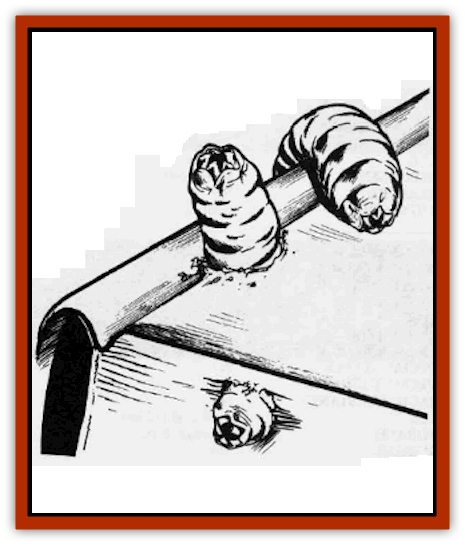

# Bookworm

| Statistic | **Bookworm** |
| --- | --- |
| **Activity Cycle:** | Any |
| **Alignment:** | Neutral |
| **Armor Class:** | 2 |
| **Climate/Terrain:** | Any land |
| **Damage/Attack:** | Nil |
| **Diet:** | Special |
| **Frequency:** | Rare |
| **Hit Dice:** | � (2 hit points) |
| **Intelligence:** | Non- (0) |
| **Magic Resistance:** | Nil |
| **Morale:** | Special |
| **Movement:** | 12, Br 3 |
| **No. Appearing:** | 1-2 (10-40) |
| **No. of Attacks:** | 0 |
| **Organization:** | Solitary |
| **Size:** | T (1&rdquo; long) |
| **Special Attacks:** | See below |
| **Special Defenses:** | See below |
| **THAC0:** | 20 |
| **Treasure:** | See below |
| **XP Value:** | 15 |

This small [[Worm|worm]], only one inch long, is greatly feared by mages because it is attracted to paper in all forms. It can smell scrolls, maps, arcane tomes, and spell books at a distance of 60 feet.

Normally a dull gray color. a bookworm's chameleon-like abilities enable it to instinctively blend into any background. Its high Armor Class is due to its speed and agility. If found motionless the bookworm is AC 9.

**Combat:** The bookworm initially imposes a -7 on the surprise rolls of adventurers because of its color-changing ability. If the victim can see invisible things, the bookworm's modifier is reduced to -4. Note that these chances apply even to creatures normally hard to surprise (like rangers and monks), because of its small size, speed (very great in proportion to its size), and inoffensive nature. If the bookworm does initially gain surprise, it may then be discovered (25%) on the outside of a victim's leg or pack. Otherwise, it will remain unnoticed unless the victim bearing paper hears the creature's noisy munching (base 50% chance per round). A feeding bookworm is motionless until attacked. After any attack it will flee (if possible) by first jumping 10 feet and then crawling back to its lair at top speed.

A bookworm can burrow through dead wood or leather at a rate of 3 inches per round and through a leather scroll case or pack in one segment but cannot digest living matter of any type. It will destroy spell books and scrolls at the rate of one spell level per round (i.e., five rounds for a scroll of a single 5th-level spell).

**Habitat/Society:** A bookworm lair is always a library or storeroom of some kind, whether in use or long-forgotten. When a bookworm is encountered, there may be undamaged paper items remaining (30% chance). In such cases, the surviving objects will be as follows: a map (60%), scroll (30%), or an arcane work of mage level 1-8 (10%). If spell books are indicated, they should be appropriate for the level of the characters finding them but will be 0-90% (1d10-1) destroyed by the worms.

A breeding pair of bookworms lays 80 eggs; about half of these hatch a month later. The larvae have less than an hour to find paper nourishment, or they die. When first hatched, the larvae are pure white, but they develop their dull gray color from ingesting the ink on the paper that makes up their diet. Unfortunately, the buildup of ink in their systems eventually kills them. The average lifespan of a bookworm is two or three years. A bookworm breeds only once in its lifetime, after which it dies.

When an adventurer is careless enough to encounter a new brood of bookworm larvae, he can inflict incredible damage by carrying them unwittingly with him to other places. A handful of larvae hiding in a backpack traveling down a city street can find new homes readily, destroying the libraries of sages, temples, magic-users, and governments in the process.

**Ecology:** A bookworm will always be attracted to the largest volume of paper in an area.

Because of its unusual diet, the bookworm is a valuable ingredient in various alchemical preparations. Chief among these is the ink used to inscribe *protection from magic* scrolls. Bccause it is the residual ink in the bookworm's body that is the "active ingredient" in this case, the darker the bookworm, the better it is for this purpose.

The bookworm itself can be a useful tool under the right circumstances. Releasing a bookworm in a mage's tower could exact revenge of a most lasting sort. There are a few cases on record, also, of criminals gaining release from prison when important documents turned up missing during their trials. Such use of a bookworm is both difficult and dangerous: difficult because it is hard to keep a bookworm alive under captivity, and dangerous because the bookworm, once released, may not leave its owner. Releasing a bookworm at an enemy's hideout and then having it follow you home is an unpleasant experience at best.

---
## Discovery & Documentation

**Source Publication:** MC1 Volume I (w/binder #1) (1991)
**Campaign Setting:** Advanced Dungeons & Dragons 2nd Edition
**Author(s):** Jay Batista, Scott Bennie, Grant Boucher, William W. Connors, Steve Gilbert, Heike Kubasch, James Lowder, David Edward Martin, Bruce Nesmith, Jean Rabe, Rick Swan, John J. Terra, Gary L. Thomas

### Other Creatures Found in This Source Book
   * [[Bat|Bat]]
   * [[Bear|Bear]]
   * [[Behir|Behir]]
   * [[Boar|Boar]]
   * [[Brownie|Brownie]]
   * [[Bugbear|Bugbear]]
   * [[Carrion_Crawler|Carrion Crawler]]
   * [[Cat_Great|Cat, Great]]
   * [[Catoblepas|Catoblepas]]
   * [[Dragon_General_Information|Dragon, General Information]]
   * [[Dragonfish|Dragonfish]]
   * [[Elemental_Air_Kin_Aerial_Servant|Elemental, Air Kin, Aerial Servant]]
   * [[Elemental_Earth_Kin_Sandling|Elemental, Earth Kin, Sandling]]
   * [[Elephant|Elephant]]
   * [[Gnoll|Gnoll]]
   * [[Hobgoblin|Hobgoblin]]
   * [[Homunculus|Homunculus]]
   * [[Hornet_Giant|Hornet, Giant]]
   * [[Horse|Horse]]
   * [[Hyena|Hyena]]
   * [[Jackal|Jackal]]
   * [[Jackalwere|Jackalwere]]
   * [[Korred|Korred]]
   * [[Lich|Lich]]
   * [[Lizard|Lizard]]
   * [[Lizard_Man|Lizard Man]]
   * [[Lycanthrope_General_Information|Lycanthrope, General Information]]
   * [[Lycanthrope_Seawolf|Lycanthrope, Seawolf]]
   * [[Lycanthrope_Werebear|Lycanthrope, Werebear]]
   * [[Lycanthrope_Weretiger|Lycanthrope, Weretiger]]
   * [[Lycanthrope_Werewolf|Lycanthrope, Werewolf]]
   * [[Manticore|Manticore]]
   * [[Medusa|Medusa]]
   * [[Mind_Flayer|Mind Flayer]]
   * [[Minotaur|Minotaur]]
   * [[Mudman|Mudman]]
   * [[Mummy|Mummy]]
   * [[Nixie|Nixie]]
   * [[Nymph|Nymph]]
   * [[Ogre|Ogre]]
   * [[Ooze_Slime_Jelly_I|Ooze/Slime/Jelly I]]
   * [[Ooze_Slime_Jelly_II|Ooze/Slime/Jelly II]]
   * [[Orc|Orc]]
   * [[Owl|Owl]]
   * [[Owlbear_I|Owlbear I]]
   * [[Pegasus|Pegasus]]
   * [[Piercer|Piercer]]
   * [[Pudding_Deadly|Pudding, Deadly]]
   * [[Rakshasa|Rakshasa]]
   * [[Rat|Rat]]
   * [[Ray|Ray]]
   * [[Remorhaz|Remorhaz]]
   * [[Satyr|Satyr]]
   * [[Scorpion|Scorpion]]
   * [[Selkie|Selkie]]
   * [[Shadow|Shadow]]
   * [[Skeleton|Skeleton]]
   * [[Skunk|Skunk]]
   * [[Snake|Snake]]
   * [[Spectre|Spectre]]
   * [[Spider|Spider]]
   * [[Sprite|Sprite]]
   * [[Toad_Giant|Toad, Giant]]
   * [[Treant|Treant]]
   * [[Troll|Troll]]
   * [[Umber_Hulk|Umber Hulk]]
   * [[Unicorn|Unicorn]]
   * [[Vampire|Vampire]]
   * [[Wight|Wight]]
   * [[Will_O'Wisp|Will O'Wisp]]
   * [[Wolf|Wolf]]
   * [[Wolfwere|Wolfwere]]
   * [[Wraith|Wraith]]
   * [[Wyvern|Wyvern]]
   * [[Yeti|Yeti]]
   * [[Yuan-ti|Yuan-ti]]
   * [[Zombie|Zombie]]
