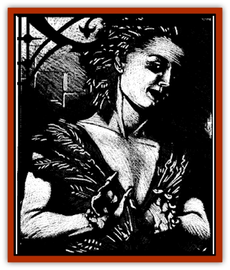

# Boowray

| Statistic | **Boowray** |
| --- | --- |
| **Activity Cycle:** | Any |
| **Alignment:** | Lawful evil |
| **Armor Class:** | 2 |
| **Climate/Terrain:** | Temperate forest |
| **Damage/Attack:** | 1d4 |
| **Diet:** | None |
| **Frequency:** | Rare |
| **Hit Dice:** | 4 |
| **Intelligence:** | Very (11-12) |
| **Magic Resistance:** | Nil |
| **Morale:** | Champion (15-16) |
| **Movement:** | 12, Fl 24 (B) |
| **No. Appearing:** | 1 |
| **No. of Attacks:** | 1 |
| **Organization:** | Solitary |
| **Size:** | T (2' tall) |
| **Special Attacks:** | See below |
| **Special Defenses:** | +1 or better weapon to hit |
| **THAC0:** | 17 |
| **Treasure:** | Nil |
| **XP Value:** | 1,400 |

This whispering spirit delights in corrupting the innocent and inspiring good folk to evil actions. Once it attaches itself to a victim, it provides a constant stream of wicked advice. Over time even the most stalwart souls may find themselves seduced by the sinister allure of evil.

The boowray is a non-corporeal spirit that is normally invisible. When it chooses to become visible, it appears as a tiny, semitransparent humanoid with greenish skin, bright yellow eyes, and mint leaves instead of hair. It dresses in a leafy jerkin tied off at the waist. Its innocent, harmless appearance gives no indication of its malign intent.

Boowrays seem to speak the common languages of the domain in which they are encountered. As others in proximity to the boowray and its victim seem unable to hear the creature, it appears to be somewhat telepathic.

**Combat:** The boowray is an elusive foe and the greatest difficulty in fighting one is simply finding him. They are usually invisible, but can become visible at will. Those who strike at the creature when it is invisible suffer a -4 penalty to their attack rolls. This, in addition to the creature's minute size, can enable it to escape almost any search.

If forced to engage in physical combat, the boowray can bite once per round for 1d4 points of damage. It constantly keeps an eye out for some means of escape and will make the most of its ability to fly and turn invisible. Boowrays can only be struck by magic weapons of a +1 or better nature.

The boowray is immune to all spells that affect its thoughts. Thus, they cannot be *charmed*, given a *command*, or placed under any similar spell.

The boowray is completely and utterly devoted to the spiritual collapse of its victims. While it has the power to use a *suggestion* spell once per day, it finds that the satisfaction caused by such magically inspired trouble is only fleeting. Real pleasure comes from an actual shift in the alignment of the chosen victim.

Any time a victim takes an evil action at the prompting of a boowray a Ravenloft powers check must be made. No check is required if the character acted under the influence of the creature's *suggestion* spell. The seductive charm of the boowray imposes a 5% penalty to the check.

A boowray may be driven off through the casting of a *dispel evil* spell. A victim may gain temporary relief from the whispering with any manner of *silence* spell. A victim may also use wax, cotton, or the like to block out the sound of the boowray, but will also be unable to hear anything else while in this state.

**Habitat/Society:** When a boowray first selects a target, it whispers helpful advice and warnings into the victim's ear. Claiming to be a guardian spirit or other helpful magical entity, the wicked creature quickly earns the trust of its prey. Having secured itself as a faithful friend, the boowray begins to prey upon the victim's natural weaknesses and character flaws. It will sow discord by feeding any petty resentment, jealousy, anger, greed, or prideful thoughts the victim may harbor, no matter how well hidden. The boowray is diabolical and will pursue its goals with great subtlety.

Boowrays are solitary creatures, but they occasionally meet for festive gatherings in dark clearings where they exchange tales of their accomplishments.

**Ecology:** The [[Human_Vistana|Vistani]] word for the boowray, *terrepopolo*, translates roughly as people of the land, apparently in reference to their seemingly close bond to the Demiplane of Dread. They do not appear to eat or sleep, and only serve to spread the evil on which the land itself seems to thrive.

---
## Discovery & Documentation

**Source Publication:** Ravenloft Appendix III (1991)
**Campaign Setting:** Ravenloft
**Author(s):** Kirk Botulla

### Other Creatures Found in This Source Book
   * [[Akikage|Akikage]]
   * [[Animator_Common|Animator, Common]]
   * [[Animator_Greater|Animator, Greater]]
   * [[Animator_Minor|Animator, Minor]]
   * [[Animator_General_Information|Animator, General Information]]
   * [[Bakhna_Rakhna|Bakhna Rakhna]]
   * [[Baobhan_Sith|Baobhan Sith]]
   * [[Beetle_Scarab|Beetle, Scarab]]
   * [[Boneless|Boneless]]
   * [[Bruja|Bruja]]
   * [[Carrionette|Carrionette]]
   * [[Carrion_Stalker|Carrion Stalker]]
   * [[Cat_Midnight|Cat, Midnight]]
   * [[Cat_Skeletal|Cat, Skeletal]]
   * [[Cloaker_Resplendent|Cloaker, Resplendent]]
   * [[Cloaker_Shadow|Cloaker, Shadow]]
   * [[Cloaker_Undead|Cloaker, Undead]]
   * [[Corpse_Candle|Corpse Candle]]
   * [[Death's_Head_Tree|Death's Head Tree]]
   * [[Doppelganger_Ravenloft|Doppelganger (Ravenloft)]]
   * [[Familiar_Pseudo-|Familiar, Pseudo-]]
   * [[Familiar_Undead|Familiar, Undead]]
   * [[Feathered_Serpent|Feathered Serpent]]
   * [[Fenhound|Fenhound]]
   * [[Figurine_Ceramic|Figurine, Ceramic]]
   * [[Figurine_Crystal|Figurine, Crystal]]
   * [[Figurine_Ivory|Figurine, Ivory]]
   * [[Figurine_Obsidian|Figurine, Obsidian]]
   * [[Figurine_Porcelain|Figurine, Porcelain]]
   * [[Figurine_General_Information|Figurine, General Information]]
   * [[Fleas_of_Madness|Fleas of Madness]]
   * [[Furies|Furies]]
   * [[Geist|Geist]]
   * [[Ghost_Animal|Ghost, Animal]]
   * [[Golem_Flesh_Ravenloft|Golem, Flesh (Ravenloft)]]
   * [[Golem_Mist_Ravenloft|Golem, Mist (Ravenloft)]]
   * [[Golem_Wax_Ravenloft|Golem, Wax (Ravenloft)]]
   * [[Gremishka|Gremishka]]
   * [[Hag_Spectral|Hag, Spectral]]
   * [[Head_Hunter|Head Hunter]]
   * [[Hearth_Fiend|Hearth Fiend]]
   * [[Hebi-No-Onna|Hebi-No-Onna]]
   * [[Hound_Phantom|Hound, Phantom]]
   * [[Hound_Skeletal|Hound, Skeletal]]
   * [[Imp_Wishing|Imp, Wishing]]
   * [[Ivy_Crawling|Ivy, Crawling]]
   * [[Jack_Frost|Jack Frost]]
   * [[Jolly_Roger|Jolly Roger]]
   * [[Kizoku|Kizoku]]
   * [[Lashweed|Lashweed]]
   * [[Leech_Magical|Leech, Magical]]
   * [[Leech_Psionic|Leech, Psionic]]
   * [[Lich_Defiler|Lich, Defiler]]
   * [[Lich_Drow|Lich, Drow]]
   * [[Lich_Elemental|Lich, Elemental]]
   * [[Lich_Psionic|Lich, Psionic]]
   * [[Living_Tattoo|Living Tattoo]]
   * [[Lycanthrope_Loup-garou|Lycanthrope, Loup-garou]]
   * [[Lycanthrope_Werejackal|Lycanthrope, Werejackal]]
   * [[Lycanthrope_Werejaguar_Ravenloft|Lycanthrope, Werejaguar (Ravenloft)]]
   * [[Lycanthrope_Wereleopard|Lycanthrope, Wereleopard]]
   * [[Lycanthrope_Wereray|Lycanthrope, Wereray]]
   * [[Mist_Ferryman|Mist Ferryman]]
   * [[Moor_Man|Moor Man]]
   * [[Obedient|Obedient]]
   * [[Odem|Odem]]
   * [[Paka|Paka]]
   * [[Plant_Blood_Rose|Plant, Blood Rose]]
   * [[Plant_Fearweed|Plant, Fearweed]]
   * [[Radiant_Spirit|Radiant Spirit]]
   * [[Recluse|Recluse]]
   * [[Remnant_Aquatic|Remnant, Aquatic]]
   * [[Rushlight|Rushlight]]
   * [[Sea_Spawn_Master|Sea Spawn, Master]]
   * [[Sea_Spawn_Minion|Sea Spawn, Minion]]
   * [[Shadow_Asp|Shadow Asp]]
   * [[Shattered_Brethren|Shattered Brethren]]
   * [[Skeleton_Archer|Skeleton, Archer]]
   * [[Skeleton_Insectoid|Skeleton, Insectoid]]
   * [[Skin_Thief|Skin Thief]]
   * [[Spirit_Psionic|Spirit, Psionic]]
   * [[Strahd_Skeleton|Strahd Skeleton]]
   * [[Strahd_Zombie|Strahd Zombie]]
   * [[Unicorn_Shadow|Unicorn, Shadow]]
   * [[Vampire_Drow|Vampire, Drow]]
   * [[Vampire_Nosferatu|Vampire, Nosferatu]]
   * [[Vampire_Oriental|Vampire, Oriental]]
   * [[Virus_General_Information|Virus, General Information]]
   * [[Virus_I|Virus I]]
   * [[Virus_II|Virus II]]
   * [[Virus_III|Virus III]]
   * [[Vorlog|Vorlog]]
   * [[Will_O'Dawn|Will O'Dawn]]
   * [[Will_O'Deep|Will O'Deep]]
   * [[Will_O'Mist|Will O'Mist]]
   * [[Will_O'Sea|Will O'Sea]]
   * [[Zombie_Cannibal|Zombie, Cannibal]]
   * [[Zombie_Desert|Zombie, Desert]]
   * [[Zombie_Wolf|Zombie Wolf]]
   * [[Zombie_Fog|Zombie Fog]]
