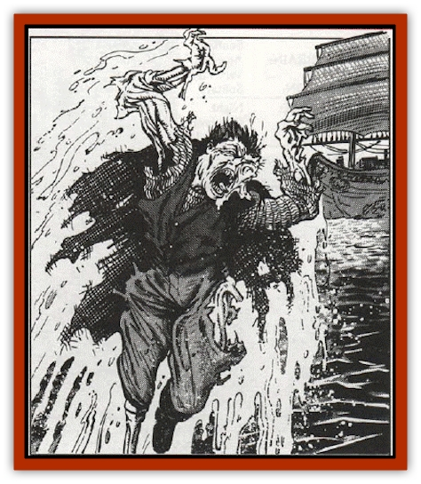

# Bowlyn

| Statistic | **Bowlyn** |
| --- | --- |
| **Activity Cycle:** | Night |
| **Alignment:** | Chaotic evil |
| **Armor Class:** | 10 |
| **Climate/Terrain:** | Any ocean or sea |
| **Damage/Attack:** | 1-6 (1d6) |
| **Diet:** | Special |
| **Frequency:** | Very rare |
| **Hit Dice:** | 4+3 |
| **Intelligence:** | Average (8-10) |
| **Magic Resistance:** | Nil |
| **Morale:** | Fearless (20) |
| **Movement:** | 18 |
| **No. Appearing:** | 1 |
| **No. of Attacks:** | 1 |
| **Organization:** | Solitary |
| **Size:** | M (6' tall) |
| **Special Attacks:** | See below |
| **Special Defenses:** | See below |
| **THAC0:** | 13 |
| **Treasure:** | Nil |
| **XP Value:** | 975 |

The bowlyn (or *sailor's demise*, as it is often called) is a strange and dreadful spirit that haunts ocean-going vessels. In many ways, the creature has been likened to a [[Poltergeist|poltergeist]] or similar restless spirit that haunts the place of its death.

Like the poltergeist, a bowlyn is typically invisible. Unlike the former, however, it can become visible when it wishes to. When visible (or invisible and viewed by someone who can see such things), the bowlyn appears as a gaunt and skeletal seaman. Although the creature's features are torn and twisted by the trauma of its death, it is often possible for those who knew it in life to recognize their former shipmate. Such individuals are entitled to an Ability Check on Wisdom to see if they can identify their former companion. Those who do are instantly required to make a horror check and may, at the DM's discretion, be called upon to make a fear check as well.

Bowlyn do not communicate with the living in any way, although they do constantly moan and wail in agony as they seek to exact vengeance upon those they blame for their deaths.

**Combat:** Bowlyn generally engage only in indirect combat. When they do opt to use their deadly touch in melee, however, it inflicts 1d6 points of damage and causes the victim to save vs. paralysis or instantly be overcome with nausea. Individuals so affected suffer a -4 penalty on all attack rolls, saving throws (including fear and horror checks), and proficiency checks until they are cured with any form of healing magic. Any healing spell, even one as minor as *goodberry* or *cure light wounds* will remove the nausea from the character.

When a bowlyn chooses to attack through indirect means, it generally does so by causing accidents aboard the ship on which it died. These accidents will often begin as minor mishaps (a secured line coming loose or damage to a minor navigational instrument) and gradually grow into severe hazards (the crow's nest breaking free with a sailor in it or the destruction of all navigational charts). More often than not, the latter stages of a bowlyn haunting result in men being hurled overboard to die by drowning (see the *Player's Handbook* for rules on this).

The bowlyn can be successfully attacked only with magical weapons or spells. It has the traditional spell immunities associated with undead and cannot be affect by *charm*, *sleep*, *hold*, or similar spells. Because it is not solid, spells that are meant to bind a physical form (like *web*) will not affect it. Bowlyn are immune to the damaging effects of holy water, but can be turned as if they were ghasts by priests or similar characters.

Because the bowlyn is a spirit tied directly to the sea, it can be destroyed without combat by any captain wise (or foolish) enough to run his ship aground while the bowlyn is haunting the vessel. In such cases, the creature is instantly annihilated and the mysterious accidents it has been causing will cease. Of course, if the bowlyn learns that a captain or crew mean to do this, the spirit will take action to prevent it.

Over the course of its "visit" to the ship, the creature will stage one mishap per night. If possible, it will arrange accidents similar to the one in which it died, or incidents related to its former duties on the ship. Thus, a bowlyn that was once a navigator might arrange for a fire in the ship's chart room.

On the last night of its haunting, the bowlyn will attempt to sink, cripple, or destroy the ship. In order to spread fear and panic among the crew, the bowlyn will arrange for those near the scene of an accident to catch fleeting glimpses of its being.

**Habitat/Society:** Bowlyn are undead spirits who, like the poltergeist, do not rest easily in their graves. Without exception, they were sailors on ocean-going vessels who died due to an accident at sea. In life, they were cruel or selfish persons; in death they blame their shipmates for the mishap that took their lives. Thus, they return from their watery grave to force others beneath the icy waves.

Typical hauntings do not occur immediately after the death of the sailor fated to become a bowlyn. It takes the spirit of the seaman from 1-10 years to return from the grave. The first appearance of a bowlyn always takes place on the anniversary of its death and the haunting lasts for 1-6 weeks.

**Ecology:** The bowlyn is a dangerous creature. Since it exists only to torment those it blames for its death, it has no place in the natural world. While the accidents arranged by a bowlyn often affect persons it never knew in life, the focus of its attacks will always be those it served with prior to death.

---
## Discovery & Documentation

**Source Publication:** MC10 Ravenloft Appendix I (1989)
**Campaign Setting:** Planescape
**Author(s):** William W. Connors

### Other Creatures Found in This Source Book
   * [[Bastellus|Bastellus]]
   * [[Bat_Ravenloft|Bat (Ravenloft)]]
   * [[Broken_One|Broken One]]
   * [[Bussengeist|Bussengeist]]
   * [[Darkling|Darkling]]
   * [[Doom_Guard|Doom Guard]]
   * [[Doppelganger_Plant|Doppelganger Plant]]
   * [[Elemental_Ravenloft|Elemental (Ravenloft)]]
   * [[Ermordenung|Ermordenung]]
   * [[Ghoul_Lord|Ghoul Lord]]
   * [[Goblyn|Goblyn]]
   * [[Golem_III|Golem III]]
   * [[Golem_IV|Golem IV]]
   * [[Golem_Ravenloft|Golem (Ravenloft)]]
   * [[Grim_Reaper|Grim Reaper]]
   * [[Human_Abber_Nomad|Human, Abber Nomad]]
   * [[Human_Ravenloft|Human (Ravenloft)]]
   * [[Imp_Assassin|Imp, Assassin]]
   * [[Impersonator|Impersonator]]
   * [[Lycanthrope_Werebat|Lycanthrope, Werebat]]
   * [[Lycanthrope_Wereraven|Lycanthrope, Wereraven]]
   * [[Mist_Horror|Mist Horror]]
   * [[Mummy_Greater|Mummy, Greater]]
   * [[Quevari|Quevari]]
   * [[Quickwood|Quickwood]]
   * [[Ravenkin|Ravenkin]]
   * [[Reaver|Reaver]]
   * [[Scarecrow_Ravenloft|Scarecrow (Ravenloft)]]
   * [[Shadow_Fiend|Shadow Fiend]]
   * [[Skeleton_Giant|Skeleton, Giant]]
   * [[Strahd's_Skeletal_Steed|Strahd's Skeletal Steed]]
   * [[Treant_Evil|Treant, Evil]]
   * [[Treant_Undead|Treant, Undead]]
   * [[Valpurgeist|Valpurgeist]]
   * [[Vampire_Dwarf|Vampire, Dwarf]]
   * [[Vampire_Elf|Vampire, Elf]]
   * [[Vampire_Gnome|Vampire, Gnome]]
   * [[Vampire_Halfling|Vampire, Halfling]]
   * [[Vampire_General_Information|Vampire, General Information]]
   * [[Vampire_Kender|Vampire, Kender]]
   * [[Vampyre|Vampyre]]
   * [[Widow_Red|Widow, Red]]
   * [[Wolfwere_Greater|Wolfwere, Greater]]
   * [[Zombie_Lord|Zombie Lord]]
