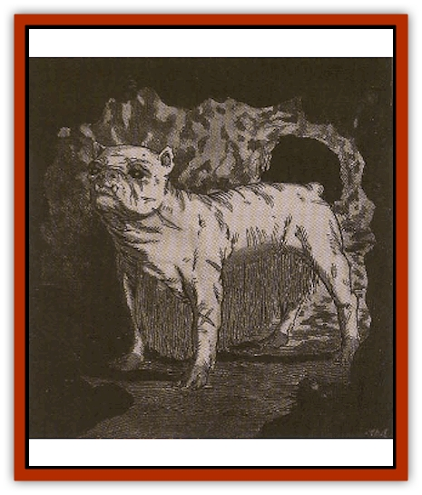

# Brak Twan

| Statistic | **Brak Twan** |
| --- | --- |
| **Activity Cycle:** | Any |
| **Alignment:** | Neutral |
| **Armor Class:** | 6 |
| **Climate/Terrain:** | Any dwarven inhabited |
| **Damage/Attack:** | 2-8 |
| **Diet:** | Omnivore |
| **Frequency:** | Rare |
| **Hit Dice:** | 3+3 |
| **Intelligence:** | Semi- (2-4) |
| **Magic Resistance:** | +2 to saving throws vs. spell |
| **Morale:** | Steady (12) |
| **Movement:** | 12 |
| **No. Appearing:** | Varies |
| **No. of Attacks:** | 1 |
| **Organization:** | Solitary |
| **Size:** | M (4-5' long) |
| **Special Attacks:** | Rending, throat attack |
| **Special Defenses:** | Nil |
| **THAC0:** | 17 |
| **Treasure:** | Nil |
| **XP Value:** | 120 |

The [[Dwarf|dwarven]] tunnel hound, or brak twan, is an ugly [[Dog|dog]] by anyone's standards. It has a flat, box-shaped head, short ears, black eyes, and a broad chest. Its skin is pink and hairless all over its body, except for its belly where silky, gray hair grows almost to the ground. Its skin is tough and ieathery. Dwarves use the tunnel hound mainly as a guard or for hunting, so its skin is usually criss-crossed with battle scars. Some dwarves have their dog tattooed or paint its skin with runes and patterns. Some dwarves match their dog's tattoos to their own. Dwarven battleragers in particular tend to have a certain fondness for these ugly, scarred animals.

This dog is fiercely loyal to its owner and favors dwarves over all other races. However, it can also form a strong bond with gnomes, and it tolerates humans and [[Halfling|halflings]]. The tunnel hound is always suspicious of [[Elf_Half-|half-elves]] and [[Elf|elves]], and it never obeys them as masters. If [[Orc|orcs]], [[Goblin|goblins]], or their kin are upwind within 100 yards, or anywhere within 20 yards, a tunnel hound detects them by scent and leaps to its feet, snarling and ready to fight. Otherwise, its sense of smell is not as acute as that of a normal dog.

What it lacks in that sense, it makes up for in others. Bred and raised in dark runnels, it has developed keen eyesight (60' infravision), and it also has keen hearing. Because of this, a brak twan receives a +2 bonus to its surprise rolls.

**Combat:** The tunnel hound's tough skin, sturdy body, and massive jaws make for a fearsome opponent. When a tunnel hound hits with a roll four or greater over the number needed, it keeps its jaws clamped on the victim. Each round following, the hound hits automatically, rending its foe for another 2-12 points of damage. The victim must make a successful Open Doors check to pry open the dog's jaws. On a natural 20 to hit, the dog clamps its jaws on its enemy's throat (assuming it has a throat) crushing the victim's windpipe and choking its victim to death in 3 rounds. This special choking attack might not work against very large opponents at the DM's discretion.

The tunnel hound has also picked up some of its masters' resistance to magic, gaining a +2 to saving throws vs. spell.

**Habitat/Society:** Tunnel hounds are bred and raised by hill, mountain, and deep dwarves, and there have been some reports of gray dwarven raiding parties that use tunnel hounds as attack dogs. Dwarven kennel owners believe that the tunnel hound was created by the Maker along with the first dwarves, but common thought is that the breed evolved from a prehistoric mastiff thousands of years ago.

A litter can produce anywhere from 3-10 puppies. They require little or no training to be useful as guard or war dogs, as battle (not to mention a protective disposition) seems to come naturally to them. A tunnel hound is full grown and combat ready at around the age of 1 to 2 years. They rarely live past the age of fifteen.

Dwarven breeders will gladly sell available tunnel hound pups or adults to any they think deserving of such a loyal animal. These dogs seem to have a certain pride when it comes to combat, and if a potential victim seems nonthreatening or submissive, the dog usually does not attack unless so commanded by its owner. The only exception to this is in combat with goblins, orcs, and their horrid kin.

**Ecology:** The tunnel hound is a domesticated animal and has little impact on its environment, other than keeping the dwarven tunnels free of rats, kobolds, goblins, and such. Packs of feral tunnel hounds have been encountered from time to time, roaming deserted dwarven mines or ancient halls. These wild dogs can be a menace to nondwarven explorers, though a dwarf can usually shoo them away or capture them for redomestication.

---
## Discovery & Documentation

**Source Publication:** Dragon269 (2000)
**Campaign Setting:** Dragon Magazine
**Author(s):** Jack Pitsker, David Day

### Other Creatures Found in This Source Book
   * [[Byut_Fey_Deer|Byut (Fey Deer)]]
   * [[Guttar_Dwarven_Ox|Guttar (Dwarven Ox)]]
