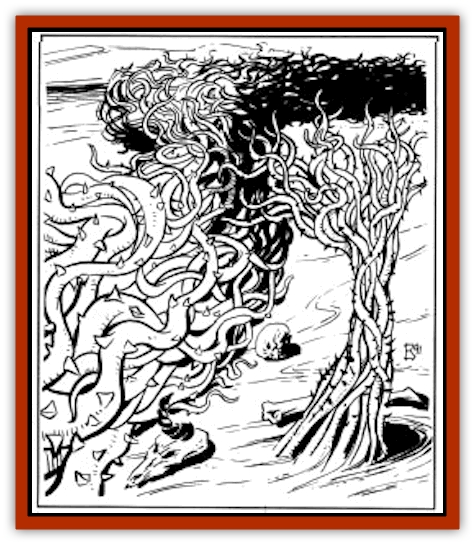

# Brambleweed

| Statistic | **Tree** | **Weed** |
| --- | --- | --- |
| **Activity Cycle:** | Day | Day |
| **Alignment:** | Neutral | Neutral |
| **Armor Class:** | 5 | 8 |
| **Climate/Terrain:** | Any | Any |
| **Damage/Attack:** | 1-4/thorn | 1 hit point/thorn |
| **Diet:** | Photosynthesis | Photosynthesis |
| **Frequency:** | Common | Common |
| **Hit Dice:** | 2-4 | 1 per 10' square |
| **Intelligence:** | Non- (0) | Non- (0) |
| **Magic Resistance:** | Nil | Nil |
| **Morale:** | N/A | N/A |
| **Movement:** | 1&rdquo; per day | 1' per day |
| **No. Appearing:** | 1-20 | 10-1000 |
| **No. of Attacks:** | 0 | See below |
| **Organization:** | Solitary | Trellis |
| **Size:** | S-M (2-7') | G (50'+) |
| **Special Attacks:** | Nil | Nil |
| **Special Defenses:** | Nil | See below |
| **THAC0:** | - | 20 |
| **Treasure:** | Incidental | Incidental |
| **XP Value:** | 0 | 15 per 10' square |

Brambleweed is a thick, thorny, vine-like plant that grows with incredible speed. Only the leading edge of a brambleweed mass actually grows; the rest is an almost impassable wall of thorns.

## Brambleweed

Brambleweed grows as a thick, twisted, tangled mass of thorny brown-grey vines. The bramble vine does not put forth leaves. The stems are the actual photos synthetic component of the plant. The ends of each vine are the only parts that grow. As the vine grows, the older part of the brambleweed hardens from lack of moisture. In this fashion, the brambleweed forms its own trellis as it grows. Although hardened from lack of moisture, the underbramble remains tough, creating a deadly defense for the newer shoots. Hardened brambleweed does not burn.

**Combat:** Brambleweed is an excellent defensive plant/weapon. Many a creature has found death trying to reach a goal that lies on the other side of the tangled brambleweed mass. Death usually results from impalement or deep, bloodletting cuts caused by the thousands of razor-sharp thorns. Brambleweed has 100 1- 2" thorns per 10. square section. Each thorn does only 1 point of damage. The brambleweed does not make an attack, but if a victim is thrown into a section of brambleweed make an attack roll. On a successful hit, 1d100 is rolled to see how many thorns actually hit the victim.each one does a single point of damage. Once in brambleweed, most people die attempting to extract themselves.

## Bramble Tree

The bramble tree is a cultivated form of brambleweed. Using only the thickest sections, a horticulturist will repeatedly cut the top off a vertically planted stem of bramble. Continually reducing the length causes the plant to create a new outer layer to survive. When the bramble reaches the desired thickness, it is allowed to grow. Constant trimming and adjustment will keep the bramble growing in the desired fashion, creating a bramble tree.

**Combat:** A four-inch-round section of brambleweed will often grow thick and straight for short lengths. These bramble lengths make excellent thorny staffs or clubs since they inflict twice as much damage as a plain one. The extra damage is from the dozens of 1-4" thorns that cover the weapon. The wielder should be cautioned that if the weapon is fumbled there is a good chance that they will impale themselves on the sharp, spiked thorns.

**Ecology:** Various groups grow brambleweed and cultivate bramble trees for the defense of settlements and water supplies. The brambleweed creates an almost impassable defensive barrier, and the cultivated brambletrees are excellent offensive weapons. The height and length of the bramble growth is dependent on moisture available and any cultivation. The most effective method of encouraging bramble to grow is by sprinkling small amounts of water in the evenings and mornings on the growing green tips. This provides the plant with needed moisture. A solidly thorned brambletree staff costs four times as much as a normal wooden staff.

---
## Discovery & Documentation

**Source Publication:** MC12 Dark Sun Appendix I - Terrors of the Desert (1991)
**Campaign Setting:** Dark Sun
**Author(s):** Tom Prusa, Louis J. Prosperi, Walter M. Baas

### Other Creatures Found in This Source Book
   * [[Animal_Herd_Athas|Animal, Herd (Athas)]]
   * [[Animal_Household_Athas|Animal, Household (Athas)]]
   * [[Antloid_Desert|Antloid, Desert]]
   * [[Banshee_Dwarf|Banshee, Dwarf]]
   * [[Beetle_Agony|Beetle, Agony]]
   * [[Bog_Wader|Bog Wader]]
   * [[B'rohg|B'rohg]]
   * [[Burnflower|Burnflower]]
   * [[Cat_Psionic|Cat, Psionic]]
   * [[Cha'thrang|Cha'thrang]]
   * [[Cistern_Fiend|Cistern Fiend]]
   * [[Clam_Giant|Clam, Giant]]
   * [[Cloud_Ray|Cloud Ray]]
   * [[Drake_Athas_Air|Drake (Athas), Air]]
   * [[Drake_Athas_Earth|Drake (Athas), Earth]]
   * [[Drake_Athas_Fire|Drake (Athas), Fire]]
   * [[Drake_Athas_Water|Drake (Athas), Water]]
   * [[Dune_Runner|Dune Runner]]
   * [[Dune_Trapper|Dune Trapper]]
   * [[Elemental_Athas_Greater_Air|Elemental (Athas), Greater, Air]]
   * [[Elemental_Athas_Greater_Earth|Elemental (Athas), Greater, Earth]]
   * [[Elemental_Athas_Greater_Fire|Elemental (Athas), Greater, Fire]]
   * [[Elemental_Athas_Greater_Water|Elemental (Athas), Greater, Water]]
   * [[Elemental_Athas_Lesser_Air_Earth|Elemental (Athas), Lesser, Air/Earth]]
   * [[Elemental_Athas_Lesser_Fire_Water|Elemental (Athas), Lesser, Fire/Water]]
   * [[Elemental_Athas_General_Information|Elemental (Athas), General Information]]
   * [[Erdland|Erdland]]
   * [[Esperweed|Esperweed]]
   * [[Flailer|Flailer]]
   * [[Floater|Floater]]
   * [[Giant_Athas|Giant (Athas)]]
   * [[Golem_Athas_I|Golem (Athas) I]]
   * [[Golem_Athas_II|Golem (Athas) II]]
   * [[Golem_Athas_III|Golem (Athas) III]]
   * [[Golem_Athas_General_Information|Golem (Athas), General Information]]
   * [[Halfling_Renegade|Halfling, Renegade]]
   * [[Hej-kin|Hej-kin]]
   * [[Id_Fiend|Id Fiend]]
   * [[Insect_Swarm_Athas|Insect Swarm (Athas)]]
   * [[Kank_Wild|Kank, Wild]]
   * [[Kirre|Kirre]]
   * [[Megapede|Megapede]]
   * [[Mul_Wild|Mul, Wild]]
   * [[Nightmare_Beast|Nightmare Beast]]
   * [[Plant_Carnivorous_Athas|Plant, Carnivorous (Athas)]]
   * [[Pterran|Pterran]]
   * [[Pterrax|Pterrax]]
   * [[Pulp_Bee|Pulp Bee]]
   * [[Pyreen|Pyreen]]
   * [[Rasclinn|Rasclinn]]
   * [[Razorwing|Razorwing]]
   * [[Roc_Athas|Roc (Athas)]]
   * [[Sand_Bride|Sand Bride]]
   * [[Sand_Cactus|Sand Cactus]]
   * [[Sand_Vortex|Sand Vortex]]
   * [[Scrab|Scrab]]
   * [[Silt_Horror|Silt Horror]]
   * [[Silt_Runner|Silt Runner]]
   * [[Sink_Worm|Sink Worm]]
   * [[Sloth_Athas|Sloth (Athas)]]
   * [[So-ut|So-ut]]
   * [[Spider_Cactus|Spider Cactus]]
   * [[Spider_Crystal|Spider, Crystal]]
   * [[Spirit_of_the_Land|Spirit of the Land]]
   * [[T'Chowb|T'Chowb]]
   * [[Thrax|Thrax]]
   * [[Tohr-kreen_I|Tohr-kreen I]]
   * [[Villichi|Villichi]]
   * [[Zhackal|Zhackal]]
   * [[Zombie_Plant|Zombie Plant]]
