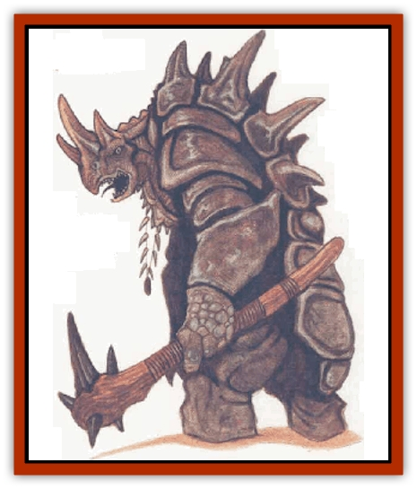

# Braxat

| Statistic | **Braxat** |
| --- | --- |
| **Activity Cycle:** | Night |
| **Alignment:** | Neutral evil |
| **Armor Class:** | 0 |
| **Climate/Terrain:** | Mountains (Athas: Tablelands, Hinterlands, mountains) |
| **Damage/Attack:** | By weapon +6 |
| **Diet:** | Carnivore |
| **Frequency:** | Rare |
| **Hit Dice:** | 10 |
| **Intelligence:** | High (13-14) |
| **Magic Resistance:** | Nil |
| **Morale:** | Fanatic (18) |
| **Movement:** | 15 |
| **No. Appearing:** | 1 or 2 |
| **No. of Attacks:** | 1 |
| **Organization:** | Solitary |
| **Size:** | H (15' tall) |
| **Special Attacks:** | Psionics, breath weapon |
| **Special Defenses:** | Psionics, hit only by magical or metal weapons |
| **THAC0:** | 11 |
| **Treasure:** | R,V |
| **XP Value:** | 7,000 |

**Psionics Summary**

| Level | Dis/Sci/Dev | Attack/Defense | Score | PSPs |
| --- | --- | --- | --- | --- |
| 10 | 2/3/10 | MT,PB,PsC/IF,MBk,TW | 15 | 50 |

**Psychoportation -** *Science:* teleport; *Devotions:* blink, dimensional door, phase, summon object.

**Telepathy -** *Sciences:* psionic blast, tower of iron will; *Devotions:* awe, contact, intellect fortress, mind blank, mind thrust, psionic crush.

A braxat is a huge, imposing creature that appears to be a cross between mammalian and reptilian stock. Thick, articulated shells cover its back and shoulders, providing excellent protection against attack. Its square, [[Lizard|lizard]]like head is defended by a crown of three to five horny protrusions. A braxat is warm-blooded and walks upright like most humanoids, though its great size allows it to tower over even the tallest [[Giant_Half-giant|half-giant]].

Highly intelligent and completely evil, a braxat terrorizes the wilderness it occupies. It speaks a mysterious language known only to other braxats, but can also articulate its thoughts in most human tongues.

**Combat:** Hunters by nature, a braxat's tactic reflect its cunning, intelligence, and evil tendencies. It enjoys the hunt, stalking its prey and inspiring as much fear as possible before moving in for the kill. The kill isn't accomplished by a quick, merciful stroke. The braxat enjoys inflicting pain - it likes to play with its prey before delivering the killing blow.

The braxat uses its psionic abilities to best advantage, telepathically weakening foes and employing psychoportive powers to avoid injury and confuse its prey. After its psionic attacks, the braxat wades in to engage in physical combat. Its weapon of choice is a massive spiked club that inflicts 2d4 points of damage (plus its Strength bonus of +6).

The braxat's breath weapon is only used as a last resort, for this tends to render the prey unfit for consumption. The breath weapon takes the form of a cone of acid that is one-foot in diameter at its base and extends for 10 feet. At its farthest point, the cone has a five-foot diameter. Anything touched by the acid suffers 2d10 points of damage. Those who make a successful saving throw vs. breath weapon take half damage.

The heavy shells and thick hide of a braxat make it immune to damage from weapons that aren't enchanted or made of steel. All other weapons bounce harmlessly off its hide, though a strong attack from such a weapon might still knock a braxat off its feet.

**Habitat/Society:** Braxats are found all across Athas, though not in great numbers. They wander the wastes in search of prey and to find new ways to indulge their evil tendencies. Though solitary in nature (it's said that not even another braxat is safe from their evil ways), braxats can rarely be found in mated pairs. When a mated pair of braxat is encountered, the evil they can accomplish is similarly doubled. If the pair has produced young, the young are hidden in a remote cave somewhere within the pair's hunting territory.

**Ecology:** Terrible and greatly feared, braxats usually hunt and attack by night. They use the pale light of Athas's twin moons to search for prey. Braxats will eat anything if they're hungry enough, including caravan mounts (although not even a starving braxat will eat a [[Animal_Domestic_Athas_I|kank]]), but they prefer to stalk intelligent beings. This has more to do with the thrill and enjoyment they receive than with the taste of human, [[Dwarf_Athas|dwarf]], or [[Elf_Athas|elf]].

Braxat shells make excellent shields (improving AC by 2) and armor plates (AC 2) if properly worked.

Sometimes these great hunters  become the hunted when an elf tribe or a band of raiders decide to harvest braxat shells. This dangerous course often turns deadly, as braxats are smart enough and vicious enough to set traps and ambushes for even the strongest hunters.

---
## Discovery & Documentation

**Source Publication:** Dark Sun Campaign Setting (original) (1991)
**Campaign Setting:** Dark Sun
**Author(s):** Timothy B. Brown, Troy Denning, William W. Connors, J. Robert King, Brom and Tom Baxa,

### Other Creatures Found in This Source Book
   * [[Animal_Domestic_Athas_I|Animal, Domestic (Athas) I]]
   * [[Belgoi|Belgoi]]
   * [[Dragon_of_Tyr|Dragon of Tyr]]
   * [[Dune_Freak|Dune Freak]]
   * [[Gaj|Gaj]]
   * [[Giant_Athach|Giant, Athach]]
   * [[Gith|Gith]]
   * [[Jozhal|Jozhal]]
   * [[Kluzd|Kluzd]]
   * [[Silk_Wyrm|Silk Wyrm]]
   * [[Tembo|Tembo]]
   * [[Wezer|Wezer]]
