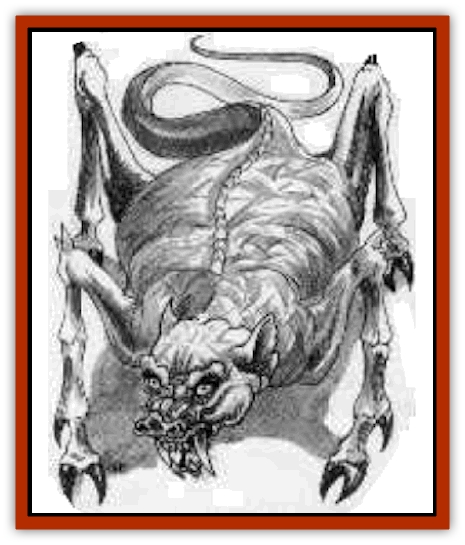

# Breiryn

| Statistic | **Breiryn** |
| --- | --- |
| **Activity Cycle:** | Night |
| **Alignment:** | Chaotic good |
| **Armor Class:** | -2 |
| **Climate/Terrain:** | Any |
| **Damage/Attack:** | 1d6/2d6 (half during daylight) |
| **Diet:** | Unknown |
| **Frequency:** | Mythical |
| **Hit Dice:** | 11 |
| **Intelligence:** | High to exceptional (13-16) |
| **Magic Resistance:** | 25% (Nil during daylight) |
| **Morale:** | Champion (16) |
| **Movement:** | 18, Sw 18 |
| **No. Appearing:** | Unknown |
| **No. of Attacks:** | 2 |
| **Organization:** | Solitary |
| **Size:** | L (6-7' tall) |
| **Special Attacks:** | Acidic web nets, spells |
| **Special Defenses:** | +1 blunt weapons or better to hit |
| **THAC0:** | 9 |
| **Treasure:** | F |
| **XP Value:** | 7,000 |

The breiryn (BREE-rin) vaguely resembles a massive [[Spider|spider]]. It has only four legs, but those end in ebony, cloven hooves. Its face is apelike and deeply wrinkled, ending in a piggish snout and two long, downward curving tusks. Its body is nearly as broad as it is tall and exudes a repulsive, musky odor. They breiryn's torso is covered by coarse bits of hide that look like broken glass. Its legs and long, whiplike tail are smooth and shiny. It is said to be dark gray.

This creature moves only under the cover of darkness, aided by its magnified senses. Its ears can pick up a human heartbeat at 50 feet. In daylight its senses drop in strength - it can see only 30 feet, it is practically deaf, its normal damage is halved, and its magic resistance fails.

The breiryn speaks most human tongues, and it can communicate with freshwater [[Fish|fish]]. Once a day, the breiryn can cast *airy water*, as if it were a 7th-level wizard. Twice a day, the breiryn can turn itself *invisible*, per the spell.

While a wizard is companion to the breiryn, he gains the ability to breathe water and to see for 90 feet as if he had infravision.

**Combat:** This [[Garradalaigh_General_Information|garradalaigh]] avoids daylight combat at all costs. At night, however, it is quick to join a fight when wizards are in jeopardy. When fighting, the breiryn rears up on its back legs; using its tail for support, it strikes with its front hooves. Though the blows are not hard, an unusual venom secreted from the hooves inflicts the real damage, and protections from poison are useless.

In addition, every four rounds the creature can spit an acidic web net. The net is 15 feet square and capable of engulfing one L-size figure, two M-size figures, or three S-size creatures. The web inflicts 1d4 points of damage for three consecutive rounds and then dissipates. To break free, the victim must roll more than half of his strength score on 1d20.

Because of the breiryn's unusual hide, edged weapons inflict no damage. However, +1 or better blunt weapons inflict full damage.

**Habitat/Society:** When the breiryn associates with a human, it is only with a wizard, usually one below 8th level. It considers higher level mages stuffy. Few other details have passed down through the legends, which generally place this creature around the Zhainge River in central Khinasi.

**Ecology:** A breiryn can eat nearly anything - plant or animal. Its chief delicacies are reported to be potions, other consumable magical items, and candles.

---
## Discovery & Documentation

**Source Publication:** Book of Magecraft (1994)
**Campaign Setting:** Birthright
**Author(s):** Carrie A. Bebris, Anne Brown, Jean Rabe, Steven Schend, Ed Stark

### Other Creatures Found in This Source Book
   * [[Audreeana|Audreeana]]
   * [[Cabhaigh|Cabhaigh]]
   * [[Daegandal|Daegandal]]
   * [[Garigal|Garigal]]
   * [[Garradalaigh_General_Information|Garradalaigh, General Information]]
   * [[Rhoeghn|Rhoeghn]]
   * [[Siddwynd|Siddwynd]]
   * [[Tualleiaght|Tualleiaght]]
