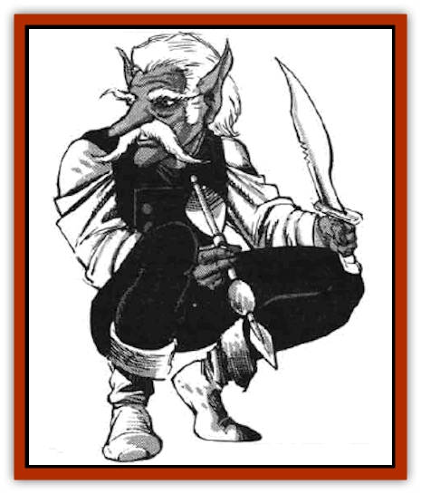

# Brownie - Buckawn

| Statistic | **Brownie, Buckawn** |
| --- | --- |
| **Activity Cycle:** | Day |
| **Alignment:** | Neutral |
| **Armor Class:** | 3 |
| **Climate/Terrain:** | Temperate/Forests |
| **Damage/Attack:** | By weapon |
| **Diet:** | Omnivore |
| **Frequency:** | Rare |
| **Hit Dice:** | 1-1 |
| **Intelligence:** | Average to very (8-12) |
| **Magic Resistance:** | 10% |
| **Morale:** | Steady (11-12) |
| **Movement:** | 12 |
| **No. Appearing:** | 5-20 |
| **No. of Attacks:** | 1 |
| **Organization:** | Clan |
| **Size:** | T (2' tall) |
| **Special Attacks:** | See below |
| **Special Defenses:** | See below |
| **THAC0:** | 20 |
| **Treasure:** | X |
| **XP Value:** | 420 |

Buckawns are similar to the more common [[Brownie|brownie]], but they are trickier and less friendly. Unlike their better-known kin, they distrust all other races and shun all contact with them. If they are pressed or disturbed, buckawns have no qualms about removing the offending party once and for all.

Buckawns look much like normal brownies, but they generally have darker skin and lighter hair. They tend to dress in russets and greens, enabling them to blend in with the wild lands they inhabit.

Brownies and buckawns speak the same tongue, although they find each other's accents to be quite horrid. Most buckawns can also speak one or more of the languages of sylvan creatures, such as [[Sprite|pixies]], [[Sprite|sprites]], [[Nymph|nymphs]], or [[Satyr|satyrs]].

**Combat:** Although small in stature, a buckawn makes a very dangerous adversary. The reasons for this center on the creature's great dexterity and natural magical abilities.

Buckawns are very nimble creatures whose great agility makes them difficult targets in combat. While this accounts for their low Armor Class, it also enables them to hide in shadows or move so silently that they stand an 80% chance of success at either endeavor.

Buckawns have keen senses. Their hearing is far more sensitive than that of normal humans, and they know every sound of the forest around them, so unusual sounds are quickly detected. In fact, their hearing is so keen that anyone attempting to evade detection by moving silently near a buckawn does so with a -50% penalty. Their sense of smell, likewise, is highly refined - they can detect strange scents as quickly as a bloodhound.

While these other senses are fine indeed, buckawn vision is truly wondrous. Buckawn sight extends into the infrared band of the spectrum, giving them excellent vision in dark places. Further, they can detect invisible creatures at a glance without the slightest effort on their part. All these things combine to make it impossible to surprise a buckawn in the wilds.

Buckawns are able to employ a wide variety of magical powers in their own defense. Once each round they are able to invoke any one of the following powers: *audible glamer*, *change self*, *dancing lights*, or *turn invisible*. In addition, they are able to employ *entangle*, *pass without trace*, *summon insects*, or *trip* spells once each per day. In all cases, these powers are initiated with but a thought, requiring no recognizable casting of any sort. They take effect instantly and can be employed while the buckawn engages in another action. All buckawn spells function as if cast by a 6th-level caster.

Buckawns favor knives and darts in combat. They are quick to employ poison or other drugs on their weapons if they have some special hatred for their opponent. Buckawn poisons are among the most potent ones known to man, imposing a -4 penalty to all saving throws made against them.

**Habitat/Society:** Buckawns are a reclusive folk. Only on the rarest of occasions will a buckawn clan have anything to do with other creatures. Further, it is worth noting that this attitude applies also to buckawns from other clans. While they are not instantly attacked or driven away, strange buckawns are treated with extreme caution until their motivations and capabilities are known.

A buckawn clan lives in a single home carved into the bowels of a great tree. More often than not, this is the largest tree in the forest. One third of the clan is charged with hunting the small animals the buckawn like to eat, while the rest of the band is split evenly between domestic upkeep and gathering the fruits and nuts that round out their diet. On rare occasions, a buckawn clan may keep a herd of chipmunks or squirrels as livestock, thus eliminating the need to hunt.

**Ecology:** Buckawns are magical creatures that fit into the fabric of wilderness life in much the same way that sprites, pixies, and [[Dryad|dryads]] do. They are a reflection of the life force in the woodlands; so long as their woods are green and growing, the buckawn are bright and alive. If any form of rot or decay works its way into their comer of the world, the buckawn sicken and die if they cannot overcome this enemy of the forest.

Buckawn poisons are very valuable because of their great potency. While these are hard to come by, they are worth twice as much as normal poisons.

---
## Discovery & Documentation

**Source Publication:** MC5 Greyhawk Appendix (1989)
**Campaign Setting:** Advanced Dungeons & Dragons 2nd Edition
**Author(s):** Grant Boucher, William W. Connors, Steve Gilbert, Bruce Nesmith, Chris Mortika, Skip Williams

### Other Creatures Found in This Source Book
   * [[Aspis|Aspis]]
   * [[Beastman|Beastman]]
   * [[Bonesnapper|Bonesnapper]]
   * [[Booka|Booka]]
   * [[Brownie_Quickling|Brownie, Quickling]]
   * [[Crystalmist|Crystalmist]]
   * [[Dragon_Cloud|Dragon, Cloud]]
   * [[Dragon_Oerth_Greyhawk|Dragon (Oerth), Greyhawk]]
   * [[Dragonfly_Giant|Dragonfly, Giant]]
   * [[Dragonnel|Dragonnel]]
   * [[Elf_Grugach|Elf, Grugach]]
   * [[Elf_Valley|Elf, Valley]]
   * [[Golem_Necrophidius|Golem, Necrophidius]]
   * [[Grell_Wild|Grell, Wild]]
   * [[Grung|Grung]]
   * [[Hobgoblin_Norker|Hobgoblin, Norker]]
   * [[Hook_Horror|Hook Horror]]
   * [[Horgar|Horgar]]
   * [[Hound_Yeth|Hound, Yeth]]
   * [[Iguana_Giant|Iguana, Giant]]
   * [[Ingundi|Ingundi]]
   * [[Kech|Kech]]
   * [[Kyuss_Son_of|Kyuss, Son of]]
   * [[Mite|Mite]]
   * [[Needleman|Needleman]]
   * [[Plant_Carnivorous_Oerth|Plant, Carnivorous (Oerth)]]
   * [[Plant_Carnivorous_Vampire_Cactus|Plant, Carnivorous, Vampire Cactus]]
   * [[Plasmoid_General_Information|Plasmoid, General Information]]
   * [[Rat_Oerth|Rat (Oerth)]]
   * [[Raven_Crow|Raven/Crow]]
   * [[Scarecrow|Scarecrow]]
   * [[Shadow_Slow|Shadow, Slow]]
   * [[Skulk|Skulk]]
   * [[Snail|Snail]]
   * [[Sprite|Sprite]]
   * [[Taer|Taer]]
   * [[Tentamort|Tentamort]]
   * [[Turtle_Giant|Turtle, Giant]]
   * [[Tyrg|Tyrg]]
   * [[Wolf_Mist|Wolf, Mist]]
   * [[Wraith_Oerth|Wraith (Oerth)]]
   * [[Zygom|Zygom]]
