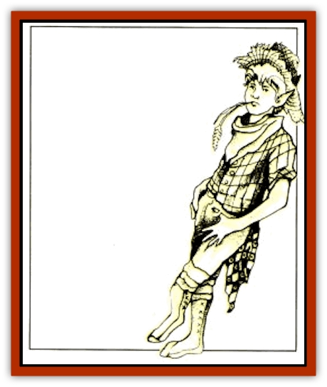

# Brownie - Dobie

| Statistic | **Brownie, Dobie** |
| --- | --- |
| **Activity Cycle:** | Night |
| **Alignment:** | Neutral good |
| **Armor Class:** | 5 (9) |
| **Climate/Terrain:** | Temperate rural |
| **Damage/Attack:** | By weapon (1d2 or 1d3) |
| **Diet:** | Herbivore |
| **Frequency:** | Rare |
| **Hit Dice:** | 1-4 hp |
| **Intelligence:** | Average (8) |
| **Magic Resistance:** | Nil |
| **Morale:** | Average (8-10) |
| **Movement:** | 9 |
| **No. Appearing:** | 2-8 |
| **No. of Attacks:** | 1 |
| **Organization:** | Tribal |
| **Size:** | Tiny (2' tall) |
| **Special Attacks:** | Spells |
| **Special Defenses:** | Save as 9th-level priest |
| **THAC0:** | 20 |
| **Treasure:** | Nil |
| **XP Value:** | 120 |

Dobies are small humanoids, similar in appearance to their cousins, the [[Brownie|brownies]]. They live peaceful, reclusive lives. When they encounter humans or othee civilized creatures, dobieis try to be helpful neighbors to the "big folk", with mixed results.

Dobies resemble small [[Elf|elves]], with brown eyes and hair, and work-a-day clothing to math. Their features are generally plain; they have ears that are only slightly pointed, their faces are more reminiscent of tired farmers than bright-eyed children. While they move with a free gait, no one would call them nimble. In fact, their image is more "country bumpkin" than "mischievous faerie".

While they converse among themselves in the language of brownies, all dobies know the common tongue, and that of at least one other faerie creature (such as [[Sprite|sprite]] or [[Sprite|pixie]]).

**Combat:** Dobies are inoffensive creatures; if threatened they prefer to walk or sneak away than to fight. Still, they are very protective of their big-folk neighbors, and will fight to defend them and their property against all comers.

The drab colors of their tough clothing combine with their size and activity level to help them hide in any natural setting, giving them an effective AC of 5 outdoors or in a building furnished in natural materials. In strange environments, a dobie's Armor Class is 9.

In combat, a dobie prefers to cast *confuse languages* (the reverse of *comprehend languages*), *grease*, *forget*, *fumble*, and *ray of enfeeblement* (once per day each at the minimum level to cast each spell) to confound and confuse opponents. A dobie also can use a tool, such as a hoe or hammer, as a makeshift weapon, inflicting 1d2 points of damage per hit. If they come across a real weapon, such as a dagger or short sword, their inexperience means that they still only inflict 1d3 points of damage when they hit.

Dobies are particularly gullible, suffering a -3 penalty to saving throws against illusions and charm attacks.

**Habitat/Society:** Small families of dobies live in crude cottages made of twigs and thatch hidden in the thickets at the corners of a farmer's fields. If there are more than four dobies on one farmer's property, they will be split into two or more households at the corners of the fields. Like brownies, they glean food from the fields after the harvest, but they are far from efficient, and the end result won't be the perfectly clean fields of their cousins, but something more akin to the natural habitats of birds and rodents.

As good creatures, dobies feel obligated to pay for the food they glean and the land they live on. They offer payment in deed, such as temporarily guarding treasure or doing household chores. The dobie won't ask what sort of chores need doing; normally performing his favors at night or when there's nobody around to see him, but his labors seldom go unnoticed.

Unfortunately, dobies almost always botch the favors they try to perform. If they milk the farmer's cows, they forget to close the barn door afterward, allowing the cows to wander afield. If they rescue the wayward cows, they are likely to break fences and trample gardens as they lead the cattle back to the farm. If their "landlord" knows that dobies are the cause of the accidents, and berates them about it, the dobies will misconstrue the criticism as a complaint about the amount of work done, and they will redouble their efforts to make good on their debt. While one cannot fault their intentions, if it weren't for the times that their fumbling accidentally benefits the dobie's landlord, one could almost consider them a curse, instead of a blessing.

A dobie's fumbling becomes a blessing when thieves, brigands, or other hostile beings (including wild animals) appear on the property. Dobies are protective of their adopted families, and will try to defend the goods and lives of their landlords against attack, especially if the farmer isn't there to defend it himself. The scene after a typical fight with a dobie family will be a jumbled mess of broken furniture, smashed crockery, and the like, but at least the lives and major goods of the farmer will have been safeguarded.

Few dobies ever become "house dobies", actually living in the big folks' home and performing services for them on a daily basis. This is not because they don't want to be close to their neighbors, but because the inadvertent damage they do is likely to convince the family they adopt that the house is haunted by some [[Poltergeist|poltergeist]], forcing them either to take drastic measures to remove the dobie, or even move away. On the other hand, it is difficult to offend a dobie enough to make him leave "his" farm; they are as oblivious to insults as they are to the proper workings of a big folk family and farm.

**Ecology:** Dobies live on the margins of civilization. They are strict vegetarians, but they are unable to cultivate land of their own; it must first be plowed and seeded by "big folk", after which they do their part to care for the growing plants.

---
## Discovery & Documentation

**Source Publication:** Monstrous Compendium, 1995 Annual, Volume 2 (1995)
**Campaign Setting:** Advanced Dungeons & Dragons 2nd Edition
**Author(s):** Jon Pickens

### Other Creatures Found in This Source Book
   * [[Aboleth_Savant|Aboleth, Savant]]
   * [[Addazahr|Addazahr]]
   * [[Amiq_Rasol|Amiq Rasol]]
   * [[Arch-Shadow|Arch-Shadow]]
   * [[Automaton_Scaladar|Automaton, Scaladar]]
   * [[Automaton_Trobriand's|Automaton, Trobriand's]]
   * [[Bat_Sporebat|Bat, Sporebat]]
   * [[Beetle_Dragon|Beetle, Dragon]]
   * [[Bi-nou|Bi-nou]]
   * [[Boggle|Boggle]]
   * [[Brownie_Quickling|Brownie, Quickling]]
   * [[Cat_Crypt|Cat, Crypt]]
   * [[Cat_Great_Cath_Shee|Cat, Great, Cath Shee]]
   * [[Centaur-kin_Dorvesh|Centaur-kin, Dorvesh]]
   * [[Centaur-kin_Gnoat|Centaur-kin, Gnoat]]
   * [[Centaur-kin_Ha'pony|Centaur-kin, Ha'pony]]
   * [[Centaur-kin_Zebranaur|Centaur-kin, Zebranaur]]
   * [[Chronolily|Chronolily]]
   * [[Curst|Curst]]
   * [[Darktentacles|Darktentacles]]
   * [[Dinosaur_Aquatic|Dinosaur, Aquatic]]
   * [[Dinosaur_II|Dinosaur II]]
   * [[Dinosaur_III|Dinosaur III]]
   * [[Doppelganger_Greater|Doppelganger, Greater]]
   * [[Dragon_Brine|Dragon, Brine]]
   * [[Dragon_Half-|Dragon, Half-]]
   * [[Dragon-kin_Sea_Wyrm|Dragon-kin, Sea Wyrm]]
   * [[Dwarf_Wild|Dwarf, Wild]]
   * [[Ekimmu|Ekimmu]]
   * [[Elemental_Nature|Elemental, Nature]]
   * [[Elf_Winged|Elf, Winged]]
   * [[Fish_Great_Glacier|Fish (Great Glacier)]]
   * [[Fish_Subterranean|Fish, Subterranean]]
   * [[Fish_Toril|Fish (Toril)]]
   * [[Flareater|Flareater]]
   * [[Flumph|Flumph]]
   * [[Froghemoth|Froghemoth]]
   * [[Ghost_Casurua|Ghost, Casurua]]
   * [[Ghost_Ker|Ghost, Ker]]
   * [[Ghul|Ghul]]
   * [[Ghul-Kin|Ghul-Kin]]
   * [[Giant_Half-giant|Giant, Half-giant]]
   * [[Golem_Burning_Man|Golem, Burning Man]]
   * [[Golem_Phantom_Flyer|Golem, Phantom Flyer]]
   * [[Gulguthhydra|Gulguthhydra]]
   * [[Hakeashar|Hakeashar]]
   * [[Horse_Moon-|Horse, Moon-]]
   * [[Human_Dragonslayer|Human, Dragonslayer]]
   * [[Human_Vistana|Human, Vistana]]
   * [[Jellyfish_Giant|Jellyfish, Giant]]
   * [[Kalin|Kalin]]
   * [[Kholiathra|Kholiathra]]
   * [[Laerti|Laerti]]
   * [[Leucrotta_Greater|Leucrotta, Greater]]
   * [[Lich_Suel|Lich, Suel]]
   * [[Lurker_Shadow|Lurker, Shadow]]
   * [[Lycanthrope_Werepanther|Lycanthrope, Werepanther]]
   * [[Lycanthrope_Wereshark|Lycanthrope, Wereshark]]
   * [[Mammal_Herd_II|Mammal, Herd II]]
   * [[Marl|Marl]]
   * [[Meenlock|Meenlock]]
   * [[Mimic_Greater|Mimic, Greater]]
   * [[Mold_II|Mold II]]
   * [[Mummy_Creature|Mummy, Creature]]
   * [[Nyth|Nyth]]
   * [[Ooze_Slime_Jelly_Ghaunadan|Ooze/Slime/Jelly, Ghaunadan]]
   * [[Palimpsest|Palimpsest]]
   * [[Peltast|Peltast]]
   * [[Plant_Dangerous_II|Plant, Dangerous II]]
   * [[Pleistocene_Animal|Pleistocene Animal]]
   * [[Pudding_Subterranean|Pudding, Subterranean]]
   * [[Raggamoffyn|Raggamoffyn]]
   * [[Snake_Serpent|Snake, Serpent]]
   * [[Snake_Serpent_Vine|Snake, Serpent Vine]]
   * [[Sphinx_Draco-|Sphinx, Draco-]]
   * [[Sprite_Seelie_Faerie|Sprite, Seelie Faerie]]
   * [[Sprite_Unseelie_Faerie|Sprite, Unseelie Faerie]]
   * [[Squealer|Squealer]]
   * [[Turtle_Giant|Turtle, Giant]]
   * [[Umpleby|Umpleby]]
   * [[Vizier's_Turban|Vizier's Turban]]
   * [[Wall_Walker|Wall Walker]]
   * [[Webbird|Webbird]]
   * [[Yak-Man|Yak-Man]]
   * [[Zorbo|Zorbo]]
