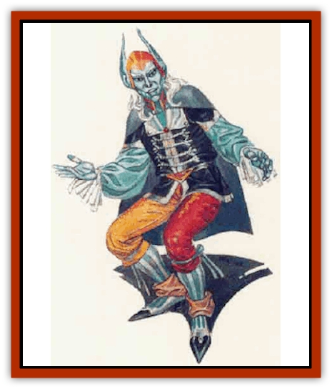

# Brownie - Quickling

| Statistic | **Brownie, Quickling** |
| --- | --- |
| **Activity Cycle:** | Night |
| **Alignment:** | Chaotic evil (neutral) |
| **Armor Class:** | -3 |
| **Climate/Terrain:** | Temperate forests |
| **Damage/Attack:** | By weapon (S/M 1d3; L 1d2) |
| **Diet:** | Omnivore |
| **Frequency:** | Very rare |
| **Hit Dice:** | 1 HD + 1d4 hp (common; leaders 3 HD; elders 4 HD) |
| **Intelligence:** | High to genius (13-18) |
| **Magic Resistance:** | Nil |
| **Morale:** | Elite (13-14) |
| **Movement:** | 96 |
| **No. Appearing:** | 4-16 |
| **No. of Attacks:** | 3 |
| **Organization:** | Clan |
| **Size:** | T (2' tall) |
| **Special Attacks:** | Spells; poison (leaders only) |
| **Special Defenses:** | Invisibility; save as Pr19 |
| **THAC0:** | 19 (common; leaders/elders 17) |
| **Treasure:** | (O,P,Q,X) |
| **XP Value:** | Normal 2,000 / Leaders: 3,000 / Elders: 4,000 |

Although they were once much like any other race of [[Brownie|brownie]], quicklings sought out dark and dangerous magical powers. It may be that they intended to do good with their powers at one time, but the evil magic was too strong for them and they were corrupted.

Quicklings are small and slender beings, looking much like miniature [[Elf|elves]] with very sharp, feral features. Their ears are unusually large and rise to points above their heads. Quickling eyes are cold and cruel with a tiny spark of yellow light. Their skin is a pale blue to blue-white and their hair is often silver or snowy white.

Quicklings dress in fine clothes of bright colors. They are fond of silver and black, often selecting fabrics and metals in these colors. Quicklings never wear any form of armor or cumbersome clothes.

Quicklings speak a tongue very similar to that of brownies and [[Brownie_Buckawn|buckawns]], but they speak very quickly. To those unfamiliar with it, their speech is nothing but a meaningless stream of noise with individual sounds and words passing so quickly that no human can follow it. If quicklings wish to communicate with other beings, they must take care to speak very slowly. Many quicklings can speak either common, [[Sprite|pixie]], or [[Halfling|halfling]], while most of them (85%) can speak true brownie.

**Combat:** Quicklings are 100% invisible when not moving; when moving they are 90% invisible. In areas where they can move rapidly from cover to cover, like a forest or boulder-strewn field, they can use their speed to make their chance of invisibility 100%.

Quicklings are far more dangerous in combat than their minute size would lead opponents to believe. This is due primarily to the great speed at which they travel and their tremendous agility. In combat, a quickling can dart about so rapidly that it attacks three times in a single round. In addition, they are visible only as blurs when moving, giving them an excellent Armor Class. Quicklings required to roll a saving throw to avoid damage due to a hostile action do so as if they were 19th-level priests.

In combat, quicklings employ their sleek, needle-like daggers to cause 1d3 points of damage to man-sized or smaller foes and 1d2 to larger ones. Quickhg leaders (see "Habitat/Society") are 75% likely to employ poisoned blades that cause unconsciousness if the victim fails a saving throw vs. poison (must be rolled after each hit).

Quicklings have certain inherent magical powers they can employ at will. While these are truly spells, the quicklings need not preform any sort of casting ritual to invoke them. Quicklings simply will the spell to activate and it does so. Only one may be active at any given time. Once per day they may invoke the following powers: *ventriloquism*, *forget*, *levitate*, *shatter*, *dig*, and *fire charm*.

**Habitat/Society:** When the ancestors of the quicklings began to experiment with the dark forces that eventually corrupted them, they had no idea what the effects would be. Where once they were a gentle race of woodland beings, quicklings are now savage hunters and cruel killers. They regard all other humanoids as enemies to be hunted down and killed.

Quicklings live in extended family units, in the same way as buckawns. Each group of quicklings is led by an individual who has 3 Hit Dice. Clans with more than ten members have two such leaders, as well as an elder who has 4 Hit Dice.

Quicklings dwell in places that are dark and evil. Adventurers have reported encountering them in groves of twisted and wicked looking trees, near poisoned or cursed springs, and in overgrown aras once ruled by powerful chaotic beings.

As a rule, quicklings avoid contact with the outside world exept when it promotes their own evil ends. In some cases, they have been known to deal with other evil races of magical natures (like imps and quasits) or powerful evil wizards and priests. On these occasions the combination of such forces is a great danger to all good beings in the area.

**Ecology:** Because of their greatly accelerated metabolism, quicklings are the shortest lived of any sylvan race. They mature less than a year after birth and are considered fully adult by the time they turn two. Old age sets in when they reach ten years and they often die before they turn 12. No known quickling has ever lived beyond 15 without the aid of powerful magic.

---
## Discovery & Documentation

**Source Publication:** MC5 Greyhawk Appendix (1989)
**Campaign Setting:** Advanced Dungeons & Dragons 2nd Edition
**Author(s):** Grant Boucher, William W. Connors, Steve Gilbert, Bruce Nesmith, Chris Mortika, Skip Williams

### Other Creatures Found in This Source Book
   * [[Aspis|Aspis]]
   * [[Beastman|Beastman]]
   * [[Bonesnapper|Bonesnapper]]
   * [[Booka|Booka]]
   * [[Brownie_Buckawn|Brownie, Buckawn]]
   * [[Crystalmist|Crystalmist]]
   * [[Dragon_Cloud|Dragon, Cloud]]
   * [[Dragon_Oerth_Greyhawk|Dragon (Oerth), Greyhawk]]
   * [[Dragonfly_Giant|Dragonfly, Giant]]
   * [[Dragonnel|Dragonnel]]
   * [[Elf_Grugach|Elf, Grugach]]
   * [[Elf_Valley|Elf, Valley]]
   * [[Golem_Necrophidius|Golem, Necrophidius]]
   * [[Grell_Wild|Grell, Wild]]
   * [[Grung|Grung]]
   * [[Hobgoblin_Norker|Hobgoblin, Norker]]
   * [[Hook_Horror|Hook Horror]]
   * [[Horgar|Horgar]]
   * [[Hound_Yeth|Hound, Yeth]]
   * [[Iguana_Giant|Iguana, Giant]]
   * [[Ingundi|Ingundi]]
   * [[Kech|Kech]]
   * [[Kyuss_Son_of|Kyuss, Son of]]
   * [[Mite|Mite]]
   * [[Needleman|Needleman]]
   * [[Plant_Carnivorous_Oerth|Plant, Carnivorous (Oerth)]]
   * [[Plant_Carnivorous_Vampire_Cactus|Plant, Carnivorous, Vampire Cactus]]
   * [[Plasmoid_General_Information|Plasmoid, General Information]]
   * [[Rat_Oerth|Rat (Oerth)]]
   * [[Raven_Crow|Raven/Crow]]
   * [[Scarecrow|Scarecrow]]
   * [[Shadow_Slow|Shadow, Slow]]
   * [[Skulk|Skulk]]
   * [[Snail|Snail]]
   * [[Sprite|Sprite]]
   * [[Taer|Taer]]
   * [[Tentamort|Tentamort]]
   * [[Turtle_Giant|Turtle, Giant]]
   * [[Tyrg|Tyrg]]
   * [[Wolf_Mist|Wolf, Mist]]
   * [[Wraith_Oerth|Wraith (Oerth)]]
   * [[Zygom|Zygom]]
