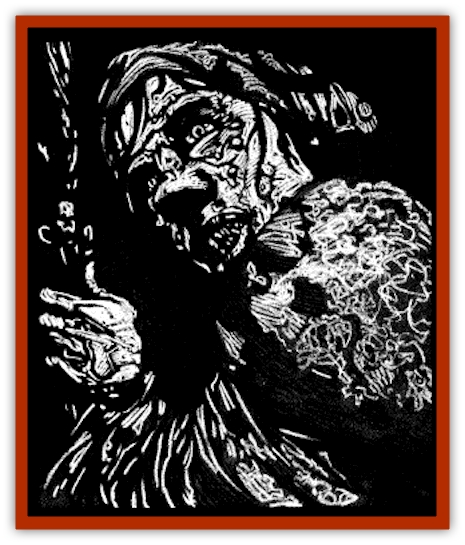

# Bruja

| Statistic | **Bruja** |
| --- | --- |
| **Activity Cycle:** | Day |
| **Alignment:** | Chaotic good |
| **Armor Class:** | 0 |
| **Climate/Terrain:** | Any Ravenloft but Tepest |
| **Damage/Attack:** | 1d6+6/1d6+6 |
| **Diet:** | Omnivore |
| **Frequency:** | Very rare |
| **Hit Dice:** | 8 |
| **Intelligence:** | Very (11-12) |
| **Magic Resistance:** | 25% |
| **Morale:** | Champion (15-16) |
| **Movement:** | 15 |
| **No. Appearing:** | 1 |
| **No. of Attacks:** | 2 |
| **Organization:** | Solitary |
| **Size:** | M (5-6' tall) |
| **Special Attacks:** | See below |
| **Special Defenses:** | See below |
| **THAC0:** | 13 |
| **Treasure:** | (D) |
| **XP Value:** | 2,000 |

The bruja are melancholy, [[Hag|hag]]like creatures that, despite their frightening countenances, are in fact kind and helpful. Cursed with foreknowledge of their own deaths, these sad creatures work in modest ways to stem the tide of evil throughout the lands of Ravenloft.

Bruja look like wretched crones with long, ratty, black hair and gnarled faces. Their skin varies in color from chalky white to ash gray and their skin has the texture of a hard forest fungus. Warts and sores mar their flesh and rotten yellow teeth lilt their mouths. The eyes of a bruja are usually milky and dull, giving the appearance of blindness. They wear simple peasant dresses that are usually devoid of patterns and decorations. Although frail in appearance, bruja are extremely strong and quick.

The bruja speak no languages of their own but have learned those of the communities and peoples of Ravenloft. They are able to converse freely with any type of wild animal that dwells near their home.

**Combat:** All bruja have a Strength of 18/00, the ability to *change self* at will, and an innate magic resistance. They often use their ability to *change self* in order to collect information and to provide assistance to travelers without revealing their true nature. Bruja have infravision (60-foot range) and their powerful senses make them impossible to surprise. Further, their stealth results in a -3 penalty to the surprise roll of any opponents when in a forest. The tremendous tracking abilities of the bruja result in a 100% chance of picking up a trail that is up to 24 hours old. For each hour past that time the likelihood of success drops by 10%.

While bruja generally use their spells to avoid direct combat. they can make use of their talonlike fingernails to deliver a violent attack that inflicts 1d6 points of damage. They gain a +3 adjustment to their attack rolls and a +6 adjustment to damage rolls because of their extraordinary strength.

Bruja can cast the following spells at will: *bless*, *change self*, *invisibility to undead*, *invisibility*, *know alignment*, *pass without trace*, and *speak with animals*. Once per day the bruja can cast *dispel evil*, *heal*, *remove curse*, *sunray* and *protection from evil, 10' radius*.

**Habitat/Society:** Because of their reclusive nature very little is known about these pensive creatures. Some say there are only three and that they once formed a dark covey like the sisters of Tepest. As a punishment for peering into forbidden aspects of the future they were cursed with a vision of their own terrible deaths. This drove them apart and slowly filled them with a disconsolate compassion for all things mortal. Whether such tales are true, no one can say.

Whatever their origins, the bruja tend to live in small houses in remote areas far from large communities. At home a bruja will generally be found in the company of 1d8 woodland and domestic animals not exceeding an accumulated total of 20 Hit Dice. Bruja use woodland animals as spies to inform them of the comings and goings within the domain where they live.

While a bruja will attempt to conceal her true identity in most encounters with others, she is susceptible to the arrogance to which all hags are prone. She is also used to dealing primarily with animals who do her bidding without question. Any long exposure to people is likely to bring out an impulsive display of power that can result in the inadvertent compromising of her disguise.

**Ecology:** Bruja have ravenous appetites and devour their food with gluttonous abandon. While they particularly enjoy raw meat, a holdover from their tainted pasts, they have acquired a taste for the nuts and berries that they gather in the forest. Bruja sometimes feast upon the flesh of intelligent creatures, but only those who have wronged them.

---
## Discovery & Documentation

**Source Publication:** Ravenloft Appendix III (1991)
**Campaign Setting:** Ravenloft
**Author(s):** Kirk Botulla

### Other Creatures Found in This Source Book
   * [[Akikage|Akikage]]
   * [[Animator_Common|Animator, Common]]
   * [[Animator_Greater|Animator, Greater]]
   * [[Animator_Minor|Animator, Minor]]
   * [[Animator_General_Information|Animator, General Information]]
   * [[Bakhna_Rakhna|Bakhna Rakhna]]
   * [[Baobhan_Sith|Baobhan Sith]]
   * [[Beetle_Scarab|Beetle, Scarab]]
   * [[Boneless|Boneless]]
   * [[Boowray|Boowray]]
   * [[Carrionette|Carrionette]]
   * [[Carrion_Stalker|Carrion Stalker]]
   * [[Cat_Midnight|Cat, Midnight]]
   * [[Cat_Skeletal|Cat, Skeletal]]
   * [[Cloaker_Resplendent|Cloaker, Resplendent]]
   * [[Cloaker_Shadow|Cloaker, Shadow]]
   * [[Cloaker_Undead|Cloaker, Undead]]
   * [[Corpse_Candle|Corpse Candle]]
   * [[Death's_Head_Tree|Death's Head Tree]]
   * [[Doppelganger_Ravenloft|Doppelganger (Ravenloft)]]
   * [[Familiar_Pseudo-|Familiar, Pseudo-]]
   * [[Familiar_Undead|Familiar, Undead]]
   * [[Feathered_Serpent|Feathered Serpent]]
   * [[Fenhound|Fenhound]]
   * [[Figurine_Ceramic|Figurine, Ceramic]]
   * [[Figurine_Crystal|Figurine, Crystal]]
   * [[Figurine_Ivory|Figurine, Ivory]]
   * [[Figurine_Obsidian|Figurine, Obsidian]]
   * [[Figurine_Porcelain|Figurine, Porcelain]]
   * [[Figurine_General_Information|Figurine, General Information]]
   * [[Fleas_of_Madness|Fleas of Madness]]
   * [[Furies|Furies]]
   * [[Geist|Geist]]
   * [[Ghost_Animal|Ghost, Animal]]
   * [[Golem_Flesh_Ravenloft|Golem, Flesh (Ravenloft)]]
   * [[Golem_Mist_Ravenloft|Golem, Mist (Ravenloft)]]
   * [[Golem_Wax_Ravenloft|Golem, Wax (Ravenloft)]]
   * [[Gremishka|Gremishka]]
   * [[Hag_Spectral|Hag, Spectral]]
   * [[Head_Hunter|Head Hunter]]
   * [[Hearth_Fiend|Hearth Fiend]]
   * [[Hebi-No-Onna|Hebi-No-Onna]]
   * [[Hound_Phantom|Hound, Phantom]]
   * [[Hound_Skeletal|Hound, Skeletal]]
   * [[Imp_Wishing|Imp, Wishing]]
   * [[Ivy_Crawling|Ivy, Crawling]]
   * [[Jack_Frost|Jack Frost]]
   * [[Jolly_Roger|Jolly Roger]]
   * [[Kizoku|Kizoku]]
   * [[Lashweed|Lashweed]]
   * [[Leech_Magical|Leech, Magical]]
   * [[Leech_Psionic|Leech, Psionic]]
   * [[Lich_Defiler|Lich, Defiler]]
   * [[Lich_Drow|Lich, Drow]]
   * [[Lich_Elemental|Lich, Elemental]]
   * [[Lich_Psionic|Lich, Psionic]]
   * [[Living_Tattoo|Living Tattoo]]
   * [[Lycanthrope_Loup-garou|Lycanthrope, Loup-garou]]
   * [[Lycanthrope_Werejackal|Lycanthrope, Werejackal]]
   * [[Lycanthrope_Werejaguar_Ravenloft|Lycanthrope, Werejaguar (Ravenloft)]]
   * [[Lycanthrope_Wereleopard|Lycanthrope, Wereleopard]]
   * [[Lycanthrope_Wereray|Lycanthrope, Wereray]]
   * [[Mist_Ferryman|Mist Ferryman]]
   * [[Moor_Man|Moor Man]]
   * [[Obedient|Obedient]]
   * [[Odem|Odem]]
   * [[Paka|Paka]]
   * [[Plant_Blood_Rose|Plant, Blood Rose]]
   * [[Plant_Fearweed|Plant, Fearweed]]
   * [[Radiant_Spirit|Radiant Spirit]]
   * [[Recluse|Recluse]]
   * [[Remnant_Aquatic|Remnant, Aquatic]]
   * [[Rushlight|Rushlight]]
   * [[Sea_Spawn_Master|Sea Spawn, Master]]
   * [[Sea_Spawn_Minion|Sea Spawn, Minion]]
   * [[Shadow_Asp|Shadow Asp]]
   * [[Shattered_Brethren|Shattered Brethren]]
   * [[Skeleton_Archer|Skeleton, Archer]]
   * [[Skeleton_Insectoid|Skeleton, Insectoid]]
   * [[Skin_Thief|Skin Thief]]
   * [[Spirit_Psionic|Spirit, Psionic]]
   * [[Strahd_Skeleton|Strahd Skeleton]]
   * [[Strahd_Zombie|Strahd Zombie]]
   * [[Unicorn_Shadow|Unicorn, Shadow]]
   * [[Vampire_Drow|Vampire, Drow]]
   * [[Vampire_Nosferatu|Vampire, Nosferatu]]
   * [[Vampire_Oriental|Vampire, Oriental]]
   * [[Virus_General_Information|Virus, General Information]]
   * [[Virus_I|Virus I]]
   * [[Virus_II|Virus II]]
   * [[Virus_III|Virus III]]
   * [[Vorlog|Vorlog]]
   * [[Will_O'Dawn|Will O'Dawn]]
   * [[Will_O'Deep|Will O'Deep]]
   * [[Will_O'Mist|Will O'Mist]]
   * [[Will_O'Sea|Will O'Sea]]
   * [[Zombie_Cannibal|Zombie, Cannibal]]
   * [[Zombie_Desert|Zombie, Desert]]
   * [[Zombie_Wolf|Zombie Wolf]]
   * [[Zombie_Fog|Zombie Fog]]
