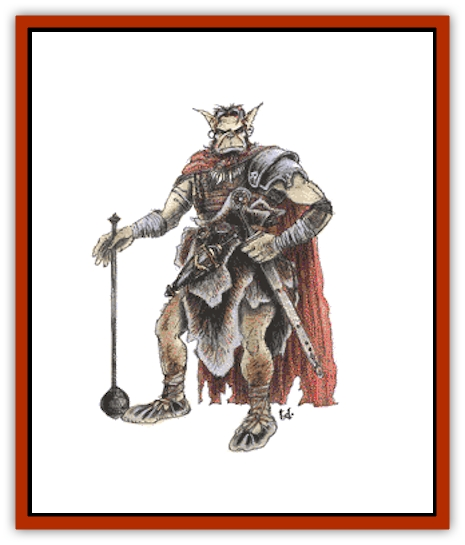

# Bugbear

| Statistic | **Bugbear** |
| --- | --- |
| **Activity Cycle:** | Any |
| **Alignment:** | Chaotic evil |
| **Armor Class:** | 5 (10) |
| **Climate/Terrain:** | Any subterranean |
| **Damage/Attack:** | 2-8 (2d4) or by weapon |
| **Diet:** | Carnivore |
| **Frequency:** | Uncommon |
| **Hit Dice:** | 3+1 |
| **Intelligence:** | Low to average (5-10) |
| **Magic Resistance:** | Nil |
| **Morale:** | Steady to Elite (11-13) |
| **Movement:** | 9 |
| **No. Appearing:** | 2-8 (2d4) |
| **No. of Attacks:** | 1 |
| **Organization:** | Tribal |
| **Size:** | L (7' tall) |
| **Special Attacks:** | Surprise, +2 to damage |
| **Special Defenses:** | Nil |
| **THAC0:** | 17 |
| **Treasure:** | Individual: J,K,L,M, (B) |
| **XP Value:** | 120 / Leader/chief/shaman: 175 |

Bugbears are giant, hairy cousins of [[Goblin|goblins]] who frequent the same areas as their smaller relatives.

Bugbears are large and very muscular, standing 7' tall. Their hides range from light yellow to yellow brown and their thick coarse hair varies in color from brown to brick red. Though vaguely humanoid in appearance, bugbears seem to contain the blood of some large carnivore. Their eyes recall those of some savage bestial animal, being greenish white with red pupils, while their ears are wedge shaped, rising from the top of their heads. A bugbear's mouth is full of long sharp fangs.

Bugbears have a nose much like that of a [[Bear|bear]] with the same fine sense of smell. It is this feature which earned them their name, despite the fact that they are not actually related to bears in any way. Their tough leathery hide and long sharp nails also look something like those of a bear, but are far more dexterous.

The typical bugbear's sight and hearing are exceptional, and they can move with amazing agility when the need arises. Bugbear eyesight extends somewhat into the infrared, giving them infravision out to 60 feet.

The bugbear language is a foul sounding mixture of gestures, grunts, and snarls which leads many to underestimate the intelligence of these creatures. In addition, most bugbears can speak the language of goblins and [[Hobgoblin|hobgoblins]].

**Combat:** Whenever possible, bugbears prefer to ambush their foes. They impose a -3 on others' surprise rolls.

If a party looks dangerous, bugbear scouts will not hesitate to fetch reinforcements. A bugbear attack will be tactically sound, if not brilliant. They will hurl small weapons, such as maces, hammers, and spears before closing with their foes. If they think they are outnumbered or overmatched, bugbears will retreat, preferring to live to fight another day.

**Habitat/Society:** Bugbears prefer to live in caves and in underground locations. A lair may consist of one large cavern or a group of caverns. They are well-adapted to this life, since they operate equally well in daylight and darkness.

If a lair is uncovered and 12 or more bugbears are encountered they will have a leader. These individuals have between 22 and 25 hit points, an Armor Class of 4, and attack as 4 Hit Die monsters. Their great strength gives them a +3 to all damage inflicted in melee combat.

If 24 or more bugbears are encountered, they will have a chief in addition to their leaders. Chiefs have between 28 and 30 hit points, an Armor Class of 3, and attack as 4 Hit Die monsters. Chiefs are so strong that they gain a +4 bonus to all damage caused in melee. Each chief will also have a sub-chief who is identical to the leaders described above.

In a lair, half of the bugbears will be females and young who will not fight except in a life or death situation. If they are forced into combat, the females attack as hobgoblins and the young as kobolds.

The species survives primarily by hunting. They have no compunctions about eating anything they can kill, including humans, goblins, and any monsters smaller than themselves. They are also fond of wine and strong ale, often drinking to excess.

Bugbears are territorial, and the size of the domains vary with the size of the group and its location. It may be several square miles in the wilderness, or a narrow, more restricted area in an underground region.

Intruders are considered a valuable source of food and treasure, and bugbears rarely negotiate. On occasion, they will parley if they think they can gain something exceptional by it. Bugbears sometimes take prisoners to use as slaves.

Extremely greedy, bugbears love glittery, shiny objects and weapons. They are always on the lookout to increase their hoards of coins, gems, and weapons through plunder and ambush.

**Ecology:** Bugbears have two main goals in life: survival and treasure. They are superb carnivores, winnowing out the weak and careless adventurer, monster and animal. Goblins are always on their toes when bugbears are present, for the weak or stupid quickly end up in the stewpot.

---
## Discovery & Documentation

**Source Publication:** MC1 Volume I (w/binder #1) (1991)
**Campaign Setting:** Advanced Dungeons & Dragons 2nd Edition
**Author(s):** Jay Batista, Scott Bennie, Grant Boucher, William W. Connors, Steve Gilbert, Heike Kubasch, James Lowder, David Edward Martin, Bruce Nesmith, Jean Rabe, Rick Swan, John J. Terra, Gary L. Thomas

### Other Creatures Found in This Source Book
   * [[Bat|Bat]]
   * [[Bear|Bear]]
   * [[Behir|Behir]]
   * [[Boar|Boar]]
   * [[Bookworm|Bookworm]]
   * [[Brownie|Brownie]]
   * [[Carrion_Crawler|Carrion Crawler]]
   * [[Cat_Great|Cat, Great]]
   * [[Catoblepas|Catoblepas]]
   * [[Dragon_General_Information|Dragon, General Information]]
   * [[Dragonfish|Dragonfish]]
   * [[Elemental_Air_Kin_Aerial_Servant|Elemental, Air Kin, Aerial Servant]]
   * [[Elemental_Earth_Kin_Sandling|Elemental, Earth Kin, Sandling]]
   * [[Elephant|Elephant]]
   * [[Gnoll|Gnoll]]
   * [[Hobgoblin|Hobgoblin]]
   * [[Homunculus|Homunculus]]
   * [[Hornet_Giant|Hornet, Giant]]
   * [[Horse|Horse]]
   * [[Hyena|Hyena]]
   * [[Jackal|Jackal]]
   * [[Jackalwere|Jackalwere]]
   * [[Korred|Korred]]
   * [[Lich|Lich]]
   * [[Lizard|Lizard]]
   * [[Lizard_Man|Lizard Man]]
   * [[Lycanthrope_General_Information|Lycanthrope, General Information]]
   * [[Lycanthrope_Seawolf|Lycanthrope, Seawolf]]
   * [[Lycanthrope_Werebear|Lycanthrope, Werebear]]
   * [[Lycanthrope_Weretiger|Lycanthrope, Weretiger]]
   * [[Lycanthrope_Werewolf|Lycanthrope, Werewolf]]
   * [[Manticore|Manticore]]
   * [[Medusa|Medusa]]
   * [[Mind_Flayer|Mind Flayer]]
   * [[Minotaur|Minotaur]]
   * [[Mudman|Mudman]]
   * [[Mummy|Mummy]]
   * [[Nixie|Nixie]]
   * [[Nymph|Nymph]]
   * [[Ogre|Ogre]]
   * [[Ooze_Slime_Jelly_I|Ooze/Slime/Jelly I]]
   * [[Ooze_Slime_Jelly_II|Ooze/Slime/Jelly II]]
   * [[Orc|Orc]]
   * [[Owl|Owl]]
   * [[Owlbear_I|Owlbear I]]
   * [[Pegasus|Pegasus]]
   * [[Piercer|Piercer]]
   * [[Pudding_Deadly|Pudding, Deadly]]
   * [[Rakshasa|Rakshasa]]
   * [[Rat|Rat]]
   * [[Ray|Ray]]
   * [[Remorhaz|Remorhaz]]
   * [[Satyr|Satyr]]
   * [[Scorpion|Scorpion]]
   * [[Selkie|Selkie]]
   * [[Shadow|Shadow]]
   * [[Skeleton|Skeleton]]
   * [[Skunk|Skunk]]
   * [[Snake|Snake]]
   * [[Spectre|Spectre]]
   * [[Spider|Spider]]
   * [[Sprite|Sprite]]
   * [[Toad_Giant|Toad, Giant]]
   * [[Treant|Treant]]
   * [[Troll|Troll]]
   * [[Umber_Hulk|Umber Hulk]]
   * [[Unicorn|Unicorn]]
   * [[Vampire|Vampire]]
   * [[Wight|Wight]]
   * [[Will_O'Wisp|Will O'Wisp]]
   * [[Wolf|Wolf]]
   * [[Wolfwere|Wolfwere]]
   * [[Wraith|Wraith]]
   * [[Wyvern|Wyvern]]
   * [[Yeti|Yeti]]
   * [[Yuan-ti|Yuan-ti]]
   * [[Zombie|Zombie]]
