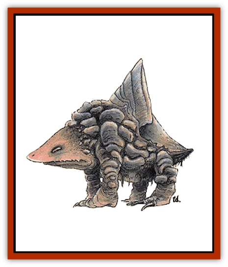

# Bulette

| Statistic | **Bulette** |
| --- | --- |
| **Activity Cycle:** | Any |
| **Alignment:** | Neutral |
| **Armor Class:** | -2/4/6 |
| **Climate/Terrain:** | Temperate/Any terrain |
| **Damage/Attack:** | 4-48/3-18/3-18 |
| **Diet:** | Carnivore |
| **Frequency:** | Very rare |
| **Hit Dice:** | 9 |
| **Intelligence:** | Animal (1) |
| **Magic Resistance:** | Nil |
| **Morale:** | Steady (11) |
| **Movement:** | 14 (3) |
| **No. Appearing:** | 1-2 |
| **No. of Attacks:** | 3 |
| **Organization:** | Solitary |
| **Size:** | L (9½' tall, 12' long) |
| **Special Attacks:** | 8' jump |
| **Special Defenses:** | Nil |
| **THAC0:** | 11 |
| **Treasure:** | Nil |
| **XP Value:** | 4,000 |

Aptly called a land[[Shark|shark]], the bulette (pronounced Boo-lay) is a terrifying predator that lives only to eat. The bulette is universally shunned, even by other monsters.

It is rumored that the bulette is a cross between an armadillo and a [[Turtle_Giant|snapping turtle]], but this is only conjecture. The bulette's head and hind portions are blue-brown, and they are covered with plates and scales ranging from gray-blue to blue-green. Nails and teeth are dull ivory. The area around the eyes is brown-black, the eyes are yellowish and the pupils are blue green.

**Combat:** A bulette will attack anything it regards as edible. The only things that it refuses to eat are [[Elf|elves]], and it dislikes [[Dwarf|dwarves]]. The bulette is always hungry, and is constantly roaming its territory in search of food. When burrowing underground, the landshark relies on vibrations to detect prey. When it senses something edible (i.e., senses movement), the bulette breaks to the surface crest first and begin its attack. The landshark has a temperament akin to the [[Wolverine|wolverine]] - stupid, mean, and fearless. The size, strength, and numbers of its opponents mean nothing. The bulette always attacks, choosing as its target the easiest or closest prey. When attacking, the bulette employs its large jaw and front feet.

The landshark can jump up to 8 feet with blinding speed, and does this to escape if cornered or injured. While in the air, the bulette strikes with all four feet, causing 3d6 points of damage for each of the rear feat as well. The landshark has two vulnerable areas: the shell under its crest is only AC 6 (but it is only raised during intense combat), and the region of the bulette's eyes is AC 4, but this is a small oval area about 8 inches across.

**Habitat/Society:** Fortunately for the rest of the world, the bulette is a solitary animal, although mated pairs (very rare) will share the same territory. In addition, other predators rarely share a territory with a landshark for fear of being eaten. The bulette has no lair, preferring to wander over its territory, above and below ground, burrowing down beneath the soil to rest. Since their appetites are so voracious, each landshark has a large territory that can range up to 30 square miles.

Bulettes consume their victims, clothing, weapons, and all, and the powerful acids in the stomach quickly digest the armor, weapons, and magical items of their victims. They are not above nibbling on chests or sacks of coins either, the bulette motto being eat first and think later. When everything in the territory is eaten, the bulette will move on in search of a new territory. The sole criteria for a suitable territory is the availability of food, so a bulette will occasionally stake out a new territory near human and halfling territories and terrorize the residents.

Very little is known of the life cycle of the bulette. They presumably hatch from eggs, but no young have ever been found, though small landsharks of 6 Hit Dice have been killed. It may be that the bulette is hatched from very small eggs, with few young surviving to maturity. Still other sages theorize that the bulette bears live young. There is also evidence that the bulette, like carp and sharks, grow larger as they get older, for unusually large landsharks of 11 feet tall and taller have been seen. Certainly no one has ever come upon the carcass of a bulette that died of old age.

**Ecology:** The bulette has a devastating effect on the ecosystem of any area it inhabits. Literally nothing that moves is safe from it - man, animal, or monster. In the process of hunting and roaming, the landshark will uproot trees of considerable size. In hilly and rocky regions, the underground movements of the bulette can start small landslides. [[Ogre|Ogres]], [[Troll|trolls]], and even some giants all move off in search of greener and safer pastures when a bulette appears. A bulette can turn a peaceful farming community into a wasteland in a few short weeks, for no sane human or demihuman will remain in a region where a bulette has been sighted.

There is only one known benefit to the existence of the bulette: The large plates behind its head make superb shields, and dwarven smiths can fashion them into shields of +1 to +3 in value. Some also claim that the soil through which a bulette has passed becomes imbued with magical, rock-dissolving properties. Many would argue, however, that these benefits are scarcely worth the price.

---
## Discovery & Documentation

**Source Publication:** MC2 Volume II (1993)
**Campaign Setting:** Advanced Dungeons & Dragons 2nd Edition
**Author(s):** Jay Batista, Scott Bennie, Grant Boucher, William W. Connors, Steve Gilbert, Heike Kubasch, James Lowder, David Edward Martin, Bruce Nesmith, Jean Rabe, Rick Swan, John J. Terra, Gary L. Thomas

### Other Creatures Found in This Source Book
   * [[Ant|Ant]]
   * [[Ant_Lion_Giant|Ant Lion, Giant]]
   * [[Ape_Carnivorous|Ape, Carnivorous]]
   * [[Baboon|Baboon]]
   * [[Badger|Badger]]
   * [[Barracuda|Barracuda]]
   * [[Beetle_Giant|Beetle, Giant]]
   * [[Bullywug|Bullywug]]
   * [[Dwarf_Duergar|Dwarf, Duergar]]
   * [[Dwarf_Gully|Dwarf, Gully]]
   * [[Eagle|Eagle]]
   * [[Eel|Eel]]
   * [[Elemental_Air_Kin|Elemental, Air Kin]]
   * [[Elemental_Water_Kin|Elemental, Water Kin]]
   * [[Elemental_Water_Kin_Water_Weird|Elemental, Water Kin, Water Weird]]
   * [[Firestar|Firestar]]
   * [[Firetail|Firetail]]
   * [[Fish_Giant|Fish, Giant]]
   * [[Frog|Frog]]
   * [[Gorgon|Gorgon]]
   * [[Hawk|Hawk]]
   * [[Heucuva|Heucuva]]
   * [[Hippocampus|Hippocampus]]
   * [[Hippogriff|Hippogriff]]
   * [[Kelpie|Kelpie]]
   * [[Kenku|Kenku]]
   * [[Killmoulis|Killmoulis]]
   * [[Kuo-Toa|Kuo-Toa]]
   * [[Lamia|Lamia]]
   * [[Lammasu|Lammasu]]
   * [[Lamprey|Lamprey]]
   * [[Leech|Leech]]
   * [[Leprechaun|Leprechaun]]
   * [[Leucrotta|Leucrotta]]
   * [[Locathah|Locathah]]
   * [[Lycanthrope_Wereboar|Lycanthrope, Wereboar]]
   * [[Lycanthrope_Werefox|Lycanthrope, Werefox]]
   * [[Mammal_Minimal|Mammal, Minimal]]
   * [[Mammal_Small|Mammal, Small]]
   * [[Mimic|Mimic]]
   * [[Morkoth|Morkoth]]
   * [[Muckdweller|Muckdweller]]
   * [[Myconid|Myconid]]
   * [[Naga|Naga]]
   * [[Obliviax|Obliviax]]
   * [[Octopus_Giant|Octopus, Giant]]
   * [[Otyugh|Otyugh]]
   * [[Piranha|Piranha]]
   * [[Plant_Dangerous_I|Plant, Dangerous I]]
   * [[Plant_Intelligent|Plant, Intelligent]]
   * [[Poltergeist|Poltergeist]]
   * [[Porcupine|Porcupine]]
   * [[Rat_Osquip|Rat, Osquip]]
   * [[Roc|Roc]]
   * [[Roper|Roper]]
   * [[Rot_Grub|Rot Grub]]
   * [[Rust_Monster|Rust Monster]]
   * [[Sahuagin|Sahuagin]]
   * [[Sea_Lion|Sea Lion]]
   * [[Sea_Horse_Giant|Sea Horse, Giant]]
   * [[Shambling_Mound|Shambling Mound]]
   * [[Shark|Shark]]
   * [[Sphinx|Sphinx]]
   * [[Squid_Giant|Squid, Giant]]
   * [[Stirge|Stirge]]
   * [[Swanmay|Swanmay]]
   * [[Tarrasque|Tarrasque]]
   * [[Tasloi|Tasloi]]
   * [[Triton|Triton]]
   * [[Troglodyte|Troglodyte]]
   * [[Urchin|Urchin]]
   * [[Urd|Urd]]
   * [[Weasel|Weasel]]
   * [[Wolverine|Wolverine]]
   * [[Yellow_Musk_Creeper|Yellow Musk Creeper]]
