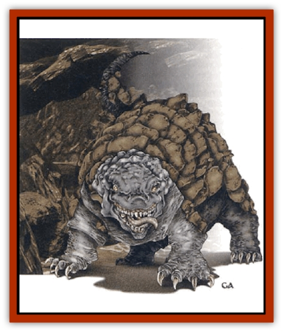

# Bulette - Gohlbrorn

| Statistic | **Bulette, Gohlbrorn** |
| --- | --- |
| **Activity Cycle:** | Any |
| **Alignment:** | Lawful evil |
| **Armor Class:** | 3 |
| **Climate/Terrain:** | Underdark |
| **Damage/Attack:** | 2d6/3d6 + special |
| **Diet:** | Carnivore |
| **Frequency:** | Rare |
| **Hit Dice:** | 5 |
| **Intelligence:** | Average (8-10) |
| **Magic Resistance:** | Nil |
| **Morale:** | Elite (13-14) |
| **Movement:** | 9, Br 18 |
| **No. Appearing:** | 3-6 |
| **No. of Attacks:** | 2 + special |
| **Organization:** | Pack |
| **Size:** | M (5-6½' long, 5' high) |
| **Special Attacks:** | Launch stones |
| **Special Defenses:** | Camouflage |
| **THAC0:** | 15 |
| **Treasure:** | Nil |
| **XP Value:** | 975 |

The gohlbrorn, a relative of the fearsome [[Bulette|bulette]], hunts throughout the cavern complexes of the Underdark. The gohlbrorn shares its larger cousin's bullet shape and thickly armored body, though it is considerably smaller and more intelligent than a bulette, and runs in packs.

The creature's hindquarters range from dark blue to deep brown; its head, which comprises a considerable portion of its body, is a dark gray. The thick scales and plates of the gohlbrorn reflect the color of the surrounding stone and rock.

The gohlbrorn possesses an inner eyelid that filters all light brighter than candlelight. This nictitating lid protects the creature from the blinding effects of *light* spells and is an invaluable aid when it hunts close to the surface world.

Gohlbrorns have their own complicated language that sounds like distant rumbling to the untrained ear. It is unknown whether these predators can reproduce the speech of other creatures; it is likely, however, that they can learn and understand languages other than their own.

**Combat:** Gohlbrorns are extremely cunning fighters. Their coloration allows them to blend in with their surroundings such that they are indistinguishable from natural stone 45% of the time. A pack of these predators often uses their natural coloring to conceal themselves so as to observe their prey before attacking. Gohlbrorns do not attack obviously powerful prey unless they believe the odds to be in their favor. Whenever possible, they tunnel ahead of their intended victims and lie in ambush just below the surface of cavern walls, ceilings, and floors. When the prey reaches the ambush site, the gohlbrorns spring out from their tunnels; opponents suffer a -3 penalty to surprise rolls.

Gohlbrorns fight in a highly organized manner; they converge from different directions and concentrate their attacks on spellcasters before engaging other enemies. Often, the gohlbrorns use hit-and-run tactics: They assault an oppenent, then dive back into their tunnels, only to attack again from a different position. Their favorite melee attack consists of a powerful claw, which inflicts 2d6 points of damage, and a ferocious bite, which inflicts 3d6 points of damage.

In addition to these attacks, a gohlbrorn can spew large rocks from its gullet. These can be hurled accurately, one per round, at enemies within 60 feet. The missiles strike with tremendous force, inflicting 1d8+1 points of damage. The creature stores these rocks as it burrows through the earth; each gohlbrorn normally has 2d4 missiles available.

A pack of gohlbrorns rarely stands its ground in a losing battle; they quickly flee if met with overwhelming force. These intelligent predators have long memories, however, and it is not uncommon to see them flee a battle, only to return later with greater numbers.

**Habitat/Society:** Gohlbrorn packs might be found wandering anywhere in the Underdark, though many prefer to hunt near large populations of easy prey (such as [[Grimlock|grimlocks]], [[Quaggoth|quaggoths]], and the like). Their intelligence and ability to coordinate their attacks make them dangerous; occasionally, races that are otherwise are enemies will cooperate to drive of or slay a gohlbrorn pack.

Although gohlbrorns have highly structured hunting groups, with the strongest acting as leader, they rarely set up permanent lairs. Mated pairs set up temporary lairs to shelter 1d6 eggs. The creatures defend their eggs to the death, although the parents abandon their hatchlings soon after the young emerge from their shells.

**Ecology:** Gohlbrorns are short-lived in comparison to other denizens of the Underdark; they actively hunt for about 20 years before age slows them down. Unlike many predators, however, they do not abandon older members of the hunting pack. In fact, the younger hunters in the pack often catch prey for older members too frail to hunt on their own.

Gohlbrorns eat just about any sort of prey they can catch. They fear [[Mind_Flayer|illithids]] and find [[Gnome|svirfneblin]], with their illusions, far too bothersome to hunt. [[Elf_Drow|Drow]], however, seem to be a much-sought-after food.

---
## Discovery & Documentation

**Source Publication:** Monstrous Compendium, 1997 Annual, Volume 4 (1995)
**Campaign Setting:** Advanced Dungeons & Dragons 2nd Edition
**Author(s):** Jon Pickens

### Other Creatures Found in This Source Book
   * [[Anemone_Giant_Sea|Anemone, Giant Sea]]
   * [[Asperii|Asperii]]
   * [[Bainligor|Bainligor]]
   * [[Beast_of_Chaos|Beast of Chaos]]
   * [[Blindheim|Blindheim]]
   * [[Bloodsipper_Far_Realm|Bloodsipper (Far Realm)]]
   * [[Child_of_the_Sea|Child of the Sea]]
   * [[Clockwork_Horror|Clockwork Horror]]
   * [[Clockwork_Swordsman|Clockwork Swordsman]]
   * [[Coral|Coral]]
   * [[Darklore|Darklore]]
   * [[Dharculus|Dharculus]]
   * [[Dolphin_Athas|Dolphin (Athas)]]
   * [[Dragon_Neutral_Moonstone|Dragon, Neutral, Moonstone]]
   * [[Dragon_Prismatic|Dragon, Prismatic]]
   * [[Dream_Stalker|Dream Stalker]]
   * [[Dragon-kin_Albino_Wyrm|Dragon-kin, Albino Wyrm]]
   * [[Echyan|Echyan]]
   * [[Firestar|Firestar]]
   * [[Firetail|Firetail]]
   * [[Fish_Ascallion|Fish, Ascallion]]
   * [[Fish_Deep_Ocean|Fish, Deep Ocean]]
   * [[Fish_Tropical|Fish, Tropical]]
   * [[Fish_Vurgens|Fish, Vurgens]]
   * [[Fogwarden|Fogwarden]]
   * [[Fraal|Fraal]]
   * [[Giant_Crag|Giant, Crag]]
   * [[Gibberling_Brood|Gibberling, Brood]]
   * [[Glutton_Sea|Glutton, Sea]]
   * [[Golden_Ammonite|Golden Ammonite]]
   * [[Golem_Brass_Minotaur|Golem, Brass Minotaur]]
   * [[Golem_Gemstone|Golem, Gemstone]]
   * [[Golem_Maggot|Golem, Maggot]]
   * [[Groundling|Groundling]]
   * [[Hermit_Sea|Hermit, Sea]]
   * [[Hound_of_Law|Hound of Law]]
   * [[Human_Amazon|Human, Amazon]]
   * [[Human_Pygmy|Human, Pygmy]]
   * [[Inquisitor|Inquisitor]]
   * [[Kercpa|Kercpa]]
   * [[Kreel|Kreel]]
   * [[Lycanthrope_Lythari|Lycanthrope, Lythari]]
   * [[Mercurial|Mercurial]]
   * [[Mold_Chromatic|Mold, Chromatic]]
   * [[Mummy_Bog|Mummy, Bog]]
   * [[Neh-thalggu|Neh-thalggu]]
   * [[Nymph_Grain|Nymph, Grain]]
   * [[Nymph_Unseelie|Nymph, Unseelie]]
   * [[Octopus_Octo-Jelly|Octopus, Octo-Jelly]]
   * [[Puddingfish|Puddingfish]]
   * [[Sea_Demon|Sea Demon]]
   * [[Shade|Shade]]
   * [[Shadowrath|Shadowrath]]
   * [[Shark_Athas|Shark (Athas)]]
   * [[Siren_Ravenloft|Siren (Ravenloft)]]
   * [[Skeleton_Variant|Skeleton, Variant]]
   * [[Skyfish|Skyfish]]
   * [[Spectral_Scion|Spectral Scion]]
   * [[Spyder_Fiend|Spyder Fiend]]
   * [[Squid_Squark|Squid, Squark]]
   * [[Tanar'ri_Lesser_Uridezu|Tanar'ri, Lesser, Uridezu]]
   * [[Troll_Mutate|Troll Mutate]]
   * [[Vaati|Vaati]]
   * [[Vampire_Cerebral|Vampire, Cerebral]]
   * [[Varkha|Varkha]]
   * [[Wizshade|Wizshade]]
   * [[Worm_Lukhorn|Worm, Lukhorn]]
   * [[Wyste|Wyste]]
   * [[Yugoloth_Lesser_Gacholoth|Yugoloth, Lesser, Gacholoth]]
   * [[Zombie_Mud|Zombie, Mud]]
