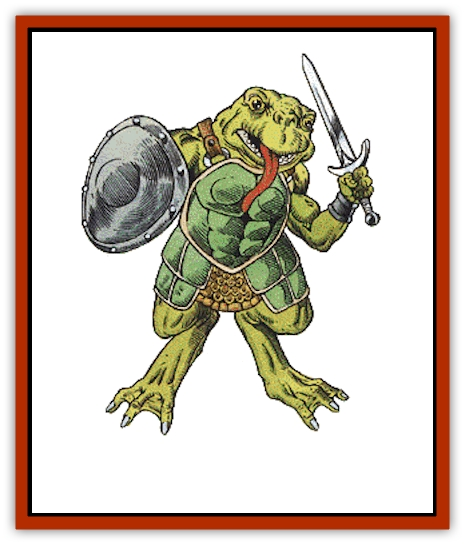

# Bullywug

| Statistic | **Bullywug** |
| --- | --- |
| **Activity Cycle:** | Any |
| **Alignment:** | Chaotic evil |
| **Armor Class:** | 6 (better with armor) |
| **Climate/Terrain:** | Tropical, subtropical, and temperate/Swamp |
| **Damage/Attack:** | 1-2/1-2/2-5 or by weapon |
| **Diet:** | Carnivore |
| **Frequency:** | Rare |
| **Hit Dice:** | 1 |
| **Intelligence:** | Low to average (5-10) |
| **Magic Resistance:** | Nil |
| **Morale:** | Average (10) |
| **Movement:** | 3, Sw 15 (9 in armor) |
| **No. Appearing:** | 10-80 |
| **No. of Attacks:** | 3 or 1 |
| **Organization:** | Tribal |
| **Size:** | S to M (4-7') |
| **Special Attacks:** | Hop |
| **Special Defenses:** | Camouflage |
| **THAC0:** | 19 |
| **Treasure:** | J,K,M,Q, (&times;5); C in lair |
| **XP Value:** | 65 |

The bullywugs are a race of bipedal, [[Frog|frog]]-like amphibians. They inhabit swamps, marshes, meres, or other dank places.

Bullywugs are covered with smooth, mottled olive green hide that is reasonably tough, giving them a natural AC of 6. They can vary in size from smaller than the average human to about seven feet in height. Their faces resemble those of enormous frogs, with wide mouths and large, bulbous eyes; their feet and hands are webbed. Though they wear no clothing, all bullywugs use weapons, armor, and shields if they are available. Bullywugs have their own language and the more intelligent ones can speak a limited form of the common tongue.

**Combat:** Bullywugs always attack in groups, trying to use their numbers to surround their enemies. Whenever they can, bullywugs attack with their hop, which can be up to 30 feet forward and 15 feet upward. When attacking with a hop, bullywugs add a +1 bonus to their attack (not damage) rolls, and double the damage if using an impaling weapon. This skill, combined with their outstanding camouflage abilities, frequently puts the bullywugs in an ideal position for an ambush (-2 penalty to opponent's surprise rolls).

**Habitat/Society:** More intelligent than frogs, all bullywugs live in organized or semi-organized socially fascist groups, cooperating for the purpose of hunting and survival. They live primarily on fish and any other game, preferring a diet of meat. They are adept hunters and fisherman, and skilled in the use and construction of snares and nets.

Bullywug society is a savage one. Males are the dominant sex, and females exist only to lay eggs. Though females and young make up about one-half of any tribe, they count for little in the social order. The only signs of respect that bullywugs ever bestow are toward their leader and their bizarre frog god. The race is chaotic evil, and totally lacking in any higher emotions or feelings.

The leader of a bullywug community is a large individual with 8 hit points. Communities of 30 or more bullywugs have five subleaders (8 hp each) and a powerful leader (2 HD, 12+ hp, +1 to damage). Communities of 60 or more bullywugs have a chieftain (3 HD, 20+ hp, +2 to damage) and five subchieftains (2 HD, 12+ hp, +1 to damage).

All bullywugs favor dank, dark places to live, since they must keep their skin moist. Most bullywugs live in the open and maintain only loose territorial boundaries. Ordinary bullywugs do not deal with incursions into their territory very efficiently, but they kill and eat interlopers if they can. They hate their large relatives (advanced bullywugs, see below) with a passion, and make war upon them at every opportunity. Bullywugs prize treasure, though it benefits them little. They value coins and jewels, and occasionally a magical item can be found amongst their hoard.

On an individual level, bullywugs lack the greed and powerlust seen in the individuals of other chaotic races, such as orcs. Fighting among members of the same group, for example, is almost nonexistent. Some would say that this is because they lack the intelligence to pick a fight, and not from a lack of spite. The tribes are lead by the dominant male, who kills and eats the previous leader when it is too old to rule. This is one of the few instances when they fight among themselves.

**Ecology:** Bullywugs tend to disrupt ecosystems, rather than fill a niche in them. They do not have the intelligence to harvest their food supplies sensibly and will fish and hunt in an area until its natural resources are depleted, and then move on to a new territory. They hate men, and will attack them on sight, but fortunately prefer to dwell in isolated regions far from human beings.

**Bullywug, Advanced**

  A small number of bullywugs are larger and more intelligent than the rest of their kind. These bullywugs make their homes in abandoned buildings and caves, and send out regular patrols and hunting parties. These groups tend to be well equipped and organized, and stake out a regular territory, which varies with the size of the group. They are more aggressive than their smaller cousins, and will fight not only other bullywugs but other monsters as well. The intelligent bullywugs also organize regular raids outside their territory for food and booty, and especially prize human flesh. Since they are chaotic evil, all trespassers, including other bullywugs, are considered threats or sources of food.

For every 10 advanced bullywugs in a community, there is a 10% chance of a 2nd-level shaman being present.

---
## Discovery & Documentation

**Source Publication:** MC2 Volume II (1993)
**Campaign Setting:** Advanced Dungeons & Dragons 2nd Edition
**Author(s):** Jay Batista, Scott Bennie, Grant Boucher, William W. Connors, Steve Gilbert, Heike Kubasch, James Lowder, David Edward Martin, Bruce Nesmith, Jean Rabe, Rick Swan, John J. Terra, Gary L. Thomas

### Other Creatures Found in This Source Book
   * [[Ant|Ant]]
   * [[Ant_Lion_Giant|Ant Lion, Giant]]
   * [[Ape_Carnivorous|Ape, Carnivorous]]
   * [[Baboon|Baboon]]
   * [[Badger|Badger]]
   * [[Barracuda|Barracuda]]
   * [[Beetle_Giant|Beetle, Giant]]
   * [[Bulette|Bulette]]
   * [[Dwarf_Duergar|Dwarf, Duergar]]
   * [[Dwarf_Gully|Dwarf, Gully]]
   * [[Eagle|Eagle]]
   * [[Eel|Eel]]
   * [[Elemental_Air_Kin|Elemental, Air Kin]]
   * [[Elemental_Water_Kin|Elemental, Water Kin]]
   * [[Elemental_Water_Kin_Water_Weird|Elemental, Water Kin, Water Weird]]
   * [[Firestar|Firestar]]
   * [[Firetail|Firetail]]
   * [[Fish_Giant|Fish, Giant]]
   * [[Frog|Frog]]
   * [[Gorgon|Gorgon]]
   * [[Hawk|Hawk]]
   * [[Heucuva|Heucuva]]
   * [[Hippocampus|Hippocampus]]
   * [[Hippogriff|Hippogriff]]
   * [[Kelpie|Kelpie]]
   * [[Kenku|Kenku]]
   * [[Killmoulis|Killmoulis]]
   * [[Kuo-Toa|Kuo-Toa]]
   * [[Lamia|Lamia]]
   * [[Lammasu|Lammasu]]
   * [[Lamprey|Lamprey]]
   * [[Leech|Leech]]
   * [[Leprechaun|Leprechaun]]
   * [[Leucrotta|Leucrotta]]
   * [[Locathah|Locathah]]
   * [[Lycanthrope_Wereboar|Lycanthrope, Wereboar]]
   * [[Lycanthrope_Werefox|Lycanthrope, Werefox]]
   * [[Mammal_Minimal|Mammal, Minimal]]
   * [[Mammal_Small|Mammal, Small]]
   * [[Mimic|Mimic]]
   * [[Morkoth|Morkoth]]
   * [[Muckdweller|Muckdweller]]
   * [[Myconid|Myconid]]
   * [[Naga|Naga]]
   * [[Obliviax|Obliviax]]
   * [[Octopus_Giant|Octopus, Giant]]
   * [[Otyugh|Otyugh]]
   * [[Piranha|Piranha]]
   * [[Plant_Dangerous_I|Plant, Dangerous I]]
   * [[Plant_Intelligent|Plant, Intelligent]]
   * [[Poltergeist|Poltergeist]]
   * [[Porcupine|Porcupine]]
   * [[Rat_Osquip|Rat, Osquip]]
   * [[Roc|Roc]]
   * [[Roper|Roper]]
   * [[Rot_Grub|Rot Grub]]
   * [[Rust_Monster|Rust Monster]]
   * [[Sahuagin|Sahuagin]]
   * [[Sea_Lion|Sea Lion]]
   * [[Sea_Horse_Giant|Sea Horse, Giant]]
   * [[Shambling_Mound|Shambling Mound]]
   * [[Shark|Shark]]
   * [[Sphinx|Sphinx]]
   * [[Squid_Giant|Squid, Giant]]
   * [[Stirge|Stirge]]
   * [[Swanmay|Swanmay]]
   * [[Tarrasque|Tarrasque]]
   * [[Tasloi|Tasloi]]
   * [[Triton|Triton]]
   * [[Troglodyte|Troglodyte]]
   * [[Urchin|Urchin]]
   * [[Urd|Urd]]
   * [[Weasel|Weasel]]
   * [[Wolverine|Wolverine]]
   * [[Yellow_Musk_Creeper|Yellow Musk Creeper]]
