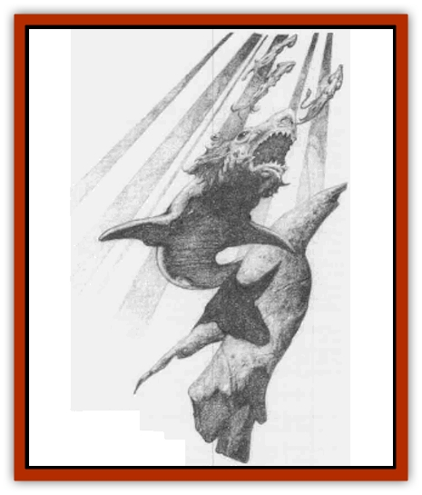

# Bunyip

| Statistic | **Bunyip** |
| --- | --- |
| **Activity Cycle:** | Any |
| **Alignment:** | Neutral |
| **Armor Class:** | 5 |
| **Climate/Terrain:** | Temperate fresh water |
| **Damage/Attack:** | 1d6 |
| **Diet:** | Carnivore |
| **Frequency:** | Rare |
| **Hit Dice:** | 5 |
| **Intelligence:** | Animal (1) |
| **Magic Resistance:** | Nil |
| **Morale:** | Average (10) |
| **Movement:** | 12 |
| **No. Appearing:** | 1 |
| **No. of Attacks:** | 1 |
| **Organization:** | Solitary |
| **Size:** | M (6' long) |
| **Special Attacks:** | Roar, sever limb |
| **Special Defenses:** | Nil |
| **THAC0:** | 15 |
| **Treasure:** | Nil |
| **XP Value:** | 175 |

The bunyip is an aquatic animal about six feet long that combines the physical characteristics of a seal and a [[Shark|shark]]. Unlike the former, however, the bunyip is utterly unable to venture onto land. Like a shark, the bunyip breathes by means of gills. Its body is covered with shaggy black hair and a long mane, which is almost always a dark gray or black in color.

Although the bunyip is not an inherently evil creature, it is very mischievous. Because of its great bulk and powerful jaws, a playful bunyip is quite likely to inflict serious injury on swimmers and can overturn small boats.

**Combat:** The bunyip is able to sense the aproach of human beings or similar creatures through a latent sense of telepathy. When the bunyip notes the presence of such creatures, it may (50% chance) decide to confront them. To do so, it lifts its head from the water and unleashes a mighty roar which forces all characters who are below 4th level to roll successful saving throws vs. wand with a -2 penalty or flee from the bunyip in panic for 2d4 rounds.

When the bunyip elects to engage in combat, it bites with its powerful jaws. Its sharp, shearing teeth inflict 1d6 points of damage, and may do more serious damage to a small creature.

A bunyip coming upon a small creature that is swimming or struggling in the water (a [[Dwarf|dwarf]], [[Gnome|gnome]], or [[Halfling|halfling]] for example) is 80% likely to attack the creature. The attack takes the form of a bite that may sever a limb from the victim. If the bunyip's attack roll is a natural 20, a limb has been removed and swallowed by the bunyip. The DM should determine which limb is lost according to the exact situation or in a random manner.

Although the bunyip does not normally attack creatures larger than a dwarf or halfling, there are exceptions. If the bunyip were attacked, for example, it would certainly defend itself if unable to flee, no matter how large the attacker.

Like a shark, a bunyip is excited by the smell and taste of blood. When a bunyip detects traces of blood in the water it may (50% chance) enter a feeding frenzy and begin attacking anythig it comes across. In such cases, the bunyip receives a bonus of +2 to its attack rolls. However, because the bunyip is unable to properly defend itself while in a ifeeding frenzy, its enemies also receive a bonus of +2 on their attack rolls.

**Habitat/Society:** The bunyip is a solitary creature that spends much of its time swimming about, leisurely feeding, and occasionally harassing other creatures. Bunyips prefer to dwell in open water, such as lakes or rivers, but can sometimes be found in swamps and marshes.

Once each year, a bunyip seeks out a mate and the two travel to the sea. Once the reach salt water, the female undergoes slight physiological changes and the actual mating occurs. Three months later, she gives birth to a single pup that remains with her for the first two years of its life. Shortly after the pup is born, the father leaves, returning to his former home to await the next mating season.

When the pup is old enough, the mother turns it out and, like the father, returns to her former home. At this point, the pup has only 3 Hit Dice and its bite causes only 1d4 points of damage. In all other ways, however, it is similar to its parents.

For the next three years, the pup will be too young to mate. With the coming of its sixth year, however, it will join the bunyip mating rituals.

**Ecology:** The diet of a bunyip is made up primarily of fish and other aquatic creatures. From time to time, they have been known to lunge at creatures on the edge of the water or at low-flying birds and such, but this is done only when the local food supply is low.

Although bunyip meat is safe for human consumption, it is unusually oily and rather strong tasting. Thus, they are not hunted by most cultures.

The hide of a bunyip can be made into a rugged leather, but this has no special qualities to set it above other animals that are easier to hunt. As a result, the bunyip is generally free frim molestation by trappers, though some few are caught by accident. Far more common - and much more of a nuisance - is a bunyip who develops the habits of springing traps or stealing from them other animals that have been caught.

---
## Discovery & Documentation

**Source Publication:** MC3 Volume III Forgotten Realms Appendix I (1989)
**Campaign Setting:** Forgotten Realms
**Author(s):** William Connors, David Martin, Rick Swan, Gary Thomas

### Other Creatures Found in This Source Book
   * [[Asperii|Asperii]]
   * [[Belabra|Belabra]]
   * [[Berbalang|Berbalang]]
   * [[Bhaergala|Bhaergala]]
   * [[Bichir|Bichir]]
   * [[Burbur|Burbur]]
   * [[Cloaker|Cloaker]]
   * [[Crawling_Claw|Crawling Claw]]
   * [[Darkenbeast|Darkenbeast]]
   * [[Dracolich|Dracolich]]
   * [[Dragon_Oriental_Carp_Yu_Lung|Dragon, Oriental, Carp (Yu Lung)]]
   * [[Dragon_Oriental_Celestial_T'ien_Lung|Dragon, Oriental, Celestial (T'ien Lung)]]
   * [[Dragon_Oriental_Coiled_Pan_Lung|Dragon, Oriental, Coiled (Pan Lung)]]
   * [[Dragon_Oriental_Earth_Li_Lung|Dragon, Oriental, Earth (Li Lung)]]
   * [[Dragon_Oriental_Lung_General_Information|Dragon, Oriental (Lung), General Information]]
   * [[Dragon_Oriental_River_Chiang_Lung|Dragon, Oriental, River (Chiang Lung)]]
   * [[Dragon_Oriental_Sea_Lung_Wang|Dragon, Oriental, Sea (Lung Wang)]]
   * [[Dragon_Oriental_Spirit_Shen_Lung|Dragon, Oriental, Spirit (Shen Lung)]]
   * [[Dragon_Oriental_Typhoon_Tun_Mi_Lung|Dragon, Oriental, Typhoon (Tun Mi Lung)]]
   * [[Dragonet_Faerie_Dragon|Dragonet, Faerie Dragon]]
   * [[Firenewt|Firenewt]]
   * [[Firestar|Firestar]]
   * [[Fish_Ascallion|Fish, Ascallion]]
   * [[Fish_Vurgens|Fish, Vurgens]]
   * [[Meazel|Meazel]]
   * [[Medusa_Maedar|Medusa, Maedar]]
   * [[Mist_Crimson_Death|Mist, Crimson Death]]
   * [[Revenant|Revenant]]
   * [[Rhaumbusun|Rhaumbusun]]
   * [[Strider_Giant|Strider, Giant]]
   * [[Thessalmonster|Thessalmonster]]
   * [[Web_Living|Web, Living]]
   * [[Wemic|Wemic]]
