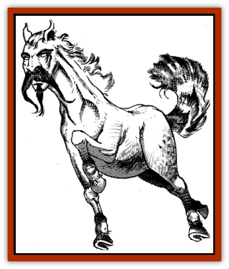

# Buraq

| Statistic | **Buraq** |
| --- | --- |
| **Activity Cycle:** | Day |
| **Alignment:** | Neutral good |
| **Armor Class:** | 4 |
| **Climate/Terrain:** | Any (Elysium and other Upper Planes) |
| **Damage/Attack:** | 1-6/1-6/2-12 |
| **Diet:** | Herbivore |
| **Frequency:** | Very rare (uncommon in Elysium, rare on other Upper Planes) |
| **Hit Dice:** | 5 |
| **Intelligence:** | High (13-14) |
| **Magic Resistance:** | 20% |
| **Morale:** | Elite (14) |
| **Movement:** | 27, Fl 27 (C) |
| **No. Appearing:** | 1-4 |
| **No. of Attacks:** | 3 |
| **Organization:** | Herd or solitary |
| **Size:** | L (6' long) |
| **Special Attacks:** | Trample |
| **Special Defenses:** | Time stop |
| **THAC0:** | 15 |
| **Treasure:** | Nil |
| **XP Value:** | 1,400 |

The buraq are the [[Horse|horses]] of heaven, companions to princes and sultans of virtue and the saviors of many holy warriors. They choose their companions and call no rider master.

The buraq are dappled grey and white horses with the face of a wise and powerful man. Larger than an ass and smaller than a mule, their coats shine with a rich luster, even by night, that signals their vibrant health and strength. The buraq's dappled coat grows more brightly colored on its hindquarters, with speckles of green, blue, brown, and black. Its tail is a long fan of red, green, gold, and blue, with "eyes" like a peacock's tail. Its silver hooves never need to be shod, and they strike the ground in complete silence, even at a full gallop.

**Combat:** Although the buraq can serve as a warhorse, it rarely takes any pleasure in such service. When it does serve in battle, it avoids the fray and prefers its master take a position of leadership without getting entangled in the melee. If necessary, it can strike with its hooves for 1d6 points of damage each or bite for 2d6 points. A foe hit by both hooves is automatically knocked down and trampled for an additional 2d6 points of damage per round until he spends a complete round getting out from under the buraq's hooves.

As a traveler, the buraq excels. It can gallop through the air at the same speed as on ground, though it requires a running start of at least three rounds before it launches itself into the air. A buraq cannot stop moving once it is airborne. A trip of any length can seem instantaneous to a buraq's rider, because, if the buraq wills it, a time stop is in effect on its back. A buraq can use this ability to preserve the life of a mortally wounded, poisoned, or starving rider until it can reach help. Some riders have crossed great distances this way and lived lives that seemed much longer than those of common folk.

A buraq can *speak with animals* at will and has the ability to *comprehend languages* three times per day.

**Habitat/Society:** The buraq is a friend to the faithful and the deserving, but before it will consent to take a rider, the rider must gain its trust. This may either be done through a lifetime of good deeds, close personal attention to the buraq (currying, combing, braiding its mane), sharing of fresh fruit and sweets, bravery and generosity, and a willingness to sacrifice the rider's goals and desires to fulfill the needs of others. The potential rider must show mercy and respect for each person while balancing his mercy with respect for the law and all the harsh justice it sometimes demands. Few meet the buraq's standards, and even a single failure is enough to drive it away, never to return.

A buraq always demands its master's care and devotion in return for its service. In return, it offers good advice and counsel, and it will serve fearlessly in the face of danger.

The buraq can travel across any terrain unerringly by day or night; it never gets lost because of its ability to navigate by the sun and by the stars. Although it can cross straits and narrow channels, it cannot cross oceans because it must rest on land every night.

Herds of buraq are said to run free at the edge of the world and in the green fields of Elysium, the Twin Paradises, the Happy Hunting Grounds, Olympus, and the Seven Heavens.

**Ecology:** The buraq has the usual needs of a fine horse, but it can survive without any physical nourishment at all. It thrives on the care and attention involved in feeding and grooming, rather than the food itself; the buraq can literally eat good intentions. Thus, it could be well maintained by a big-hearted beggar and it could wither away in the care of a distant, proud sultan.

The feathers of a buraq's tail are valuable in the creation of scrolls, especially *scrolls of protection* and clerical scrolls dealing with curative and protective magics. A buraq may occasionally visit a renowned or particularly pious congregation of the faithful or the hovel of a mystic and leave a single feather behind as a sign of the gods' favor. Combined with inks made from precious stones and gold dust, this feather may be used to inscribe either a single *scroll of protection* or a scroll of up to 14 spell levels in any combination (two 7th-level spells, two 5th-level and one 4th-level, and so on).

---
## Discovery & Documentation

**Source Publication:** MC13 Al-Qadim Appendix (1992)
**Campaign Setting:** Al-Qadim (Forgotten Realms)
**Author(s):** C. Terry Phillips

### Other Creatures Found in This Source Book
   * [[Ammut|Ammut]]
   * [[Ashira|Ashira]]
   * [[Asuras|Asuras]]
   * [[Black_Cloud_of_Vengeance|Black Cloud of Vengeance]]
   * [[Camel|Camel]]
   * [[Camel_of_the_Pearl|Camel of the Pearl]]
   * [[Centaur_Desert|Centaur, Desert]]
   * [[Copper_Automaton|Copper Automaton]]
   * [[Debbi|Debbi]]
   * [[Elephant_Bird|Elephant Bird]]
   * [[Gen|Gen]]
   * [[Genie_Noble_Dao|Genie, Noble Dao]]
   * [[Genie_Noble_Djinni|Genie, Noble Djinni]]
   * [[Genie_Noble_Efreeti|Genie, Noble Efreeti]]
   * [[Genie_Noble_Marid|Genie, Noble Marid]]
   * [[Genie_Tasked_Architect_Builder|Genie, Tasked, Architect/Builder]]
   * [[Genie_Tasked_Artist|Genie, Tasked, Artist]]
   * [[Genie_Tasked_Guardian|Genie, Tasked, Guardian]]
   * [[Genie_Tasked_Herdsman|Genie, Tasked, Herdsman]]
   * [[Genie_Tasked_Slayer|Genie, Tasked, Slayer]]
   * [[Genie_Tasked_Warmonger|Genie, Tasked, Warmonger]]
   * [[Genie_Tasked_Winemaker|Genie, Tasked, Winemaker]]
   * [[Ghost_Mount|Ghost Mount]]
   * [[Ghul|Ghul]]
   * [[Giant_Desert|Giant, Desert]]
   * [[Giant_Jungle|Giant, Jungle]]
   * [[Giant_Reef|Giant, Reef]]
   * [[Giant_Zakhara_General_Information|Giant (Zakhara), General Information]]
   * [[Hama|Hama]]
   * [[Heway|Heway]]
   * [[Living_Idol|Living Idol]]
   * [[Lycanthrope_Werehyena|Lycanthrope, Werehyena]]
   * [[Lycanthrope_Werelion|Lycanthrope, Werelion]]
   * [[Markeen|Markeen]]
   * [[Maskhi|Maskhi]]
   * [[Mason_Wasp_Giant|Mason Wasp, Giant]]
   * [[Nasnas|Nasnas]]
   * [[Pahari|Pahari]]
   * [[Rom|Rom]]
   * [[Sabu_Lord|Sabu Lord]]
   * [[Sakina|Sakina]]
   * [[Serpent_Lord|Serpent Lord]]
   * [[Serpent_Winged|Serpent, Winged]]
   * [[Silat|Silat]]
   * [[Simurgh|Simurgh]]
   * [[Stone_Maiden|Stone Maiden]]
   * [[Vishap|Vishap]]
   * [[Zaratan|Zaratan]]
   * [[Zin|Zin]]
