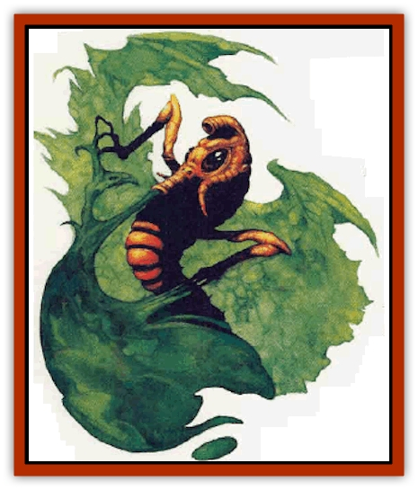

# Burbur

| Statistic | **Burbur** |
| --- | --- |
| **Activity Cycle:** | Any |
| **Alignment:** | Neutral |
| **Armor Class:** | 9 |
| **Climate/Terrain:** | Any land |
| **Damage/Attack:** | 2d4 |
| **Diet:** | Slimes, molds, mosses |
| **Frequency:** | Rare |
| **Hit Dice:** | 1-1 |
| **Intelligence:** | Animal (1) |
| **Magic Resistance:** | Nil |
| **Morale:** | Unsteady (5-7) |
| **Movement:** | 12 |
| **No. Appearing:** | 14 |
| **No. of Attacks:** | 1 (slimes, molds, and mosses only) |
| **Organization:** | Solitary |
| **Size:** | T (6&rdquo; to 1' long) |
| **Special Attacks:** | Nil |
| **Special Defenses:** | Immunities |
| **THAC0:** | 20 |
| **Treasure:** | Nil |
| **XP Value:** | 35 |

Burburs are small creatures that look much like [[Worm|worms]]. They have large, glistening black eyes and a sucking tube for a mouth, much like that of a mosquito. Just behind the creature's head are a pair of tiny forelegs of considerable dexterity. With its forelegs, a burbur can climb, grip, and manipulate objects. A burbur that has just fed will be very bloated and somewhat sluggish.

Burburs are ivory or yellow in color and have soft, moist skin. They have a somewhat spicy body odor that has been described as smelling like cinnamon.

Burburs are highly prized creatures that consume many varieties of slimes, mosses, and molds that might otherwise cause considerable harm to other creatures.

**Combat:** Burburs are gentle and harmless creatures as far as the humanoid races are concerned. They feed only on slimes, molds, or mosses; they are wholly unable to inflict damage on anv other living thing.

When it decides to feed, a burbur simply crawls out onto the body of the creature it intends to consume, extends its feeding tube and begins to siphon up its meal. Each round that it feeds, the burbur inflicts 2d4 points of damage to the slime, mold, or moss it is consuming. Once the burbur has scored a hit against the creature it is attempting to ingest, it need not roll again unless it takes a break in its feeding. A burbur ceases feeding after it has drained its victim of hit points equal to thrice its own initial value. For example, a burbur with 4 hit points will be sated after it has inflicted 12 uoints of damage upon its victim.

A burbur is utterly immune to such creatures as [[Ooze_Slime_Jelly_I|olive]] or [[Ooze_Slime_Jelly_II|green slime]], [[Obliviax|obliviax moss]], and [[Mold_I|brown, yellow, or russet molds]]. In addition, it finds these creatures to be delicacies beyond compare.

The burbur is also unaffected by [[Yellow_Musk_Creeper|yellow musk creepers]], [[Zygom|zygoms]], and [[Fungus|violet fungi]], although it finds these creatures inedible. A burbur is affected normally by oozes, jellies, poisonous vapors, and other creatures, as well as by spell attacks.

**Habitat/Society:** Burburs wander constantly in search of food. Although they are normally found alone, they have been known to gather in groups of as many as four individuals to feed on a single slime, mold, or moss.

Burburs often build small lairs that they visit from time to time to rest and recover from injuries. As a rule, these are located in out-of-the-way places and, as often as not, are protected by some creature to which the burbur is immune. For example, it is not uncommon for a burbur to seek refuge in the midst of a yellow musk creeper's coils.

Once each year, usually in the spring, a burbur will begin to swell in size. At this point it develops a bulge at the end of its tail, which forms into a second head. As the second head forms, a pair of forelegs begins to grow out from the body. Shortly thereafter, the burbur splits in half to form two separate creatures.

**Ecology:** Although a small and defenseless creature like the burbur might normally be expected to fall victim to a wide variety of other predators, this is not the case. Most animals have long ago learned that eating a burbur can be a painful and, often, fatal mistake. If the burbur has recently fed, most creatures that consume it are affected as if they had come into contact with the creature the burbur recently fed upon. Thus, those animals foolish or hungry enough to devour a burbur have been weeded out by natural selection a long time ago.

The burbur is much sought after by adventurers who find the creatures a useful ally when they do battle against slimes and similar horrors. As a rule, burburs are extremely docile and do not attack their keepers or stray unless they are underfed. In order to keep a burbur content so that it does not seek to escape its owner, it must be allowed to feed at least once per day. In the marketplace, a captured burbur can be sold for as much as 1,000 gold pieces.

---
## Discovery & Documentation

**Source Publication:** MC3 Volume III Forgotten Realms Appendix I (1989)
**Campaign Setting:** Forgotten Realms
**Author(s):** William Connors, David Martin, Rick Swan, Gary Thomas

### Other Creatures Found in This Source Book
   * [[Asperii|Asperii]]
   * [[Belabra|Belabra]]
   * [[Berbalang|Berbalang]]
   * [[Bhaergala|Bhaergala]]
   * [[Bichir|Bichir]]
   * [[Bunyip|Bunyip]]
   * [[Cloaker|Cloaker]]
   * [[Crawling_Claw|Crawling Claw]]
   * [[Darkenbeast|Darkenbeast]]
   * [[Dracolich|Dracolich]]
   * [[Dragon_Oriental_Carp_Yu_Lung|Dragon, Oriental, Carp (Yu Lung)]]
   * [[Dragon_Oriental_Celestial_T'ien_Lung|Dragon, Oriental, Celestial (T'ien Lung)]]
   * [[Dragon_Oriental_Coiled_Pan_Lung|Dragon, Oriental, Coiled (Pan Lung)]]
   * [[Dragon_Oriental_Earth_Li_Lung|Dragon, Oriental, Earth (Li Lung)]]
   * [[Dragon_Oriental_Lung_General_Information|Dragon, Oriental (Lung), General Information]]
   * [[Dragon_Oriental_River_Chiang_Lung|Dragon, Oriental, River (Chiang Lung)]]
   * [[Dragon_Oriental_Sea_Lung_Wang|Dragon, Oriental, Sea (Lung Wang)]]
   * [[Dragon_Oriental_Spirit_Shen_Lung|Dragon, Oriental, Spirit (Shen Lung)]]
   * [[Dragon_Oriental_Typhoon_Tun_Mi_Lung|Dragon, Oriental, Typhoon (Tun Mi Lung)]]
   * [[Dragonet_Faerie_Dragon|Dragonet, Faerie Dragon]]
   * [[Firenewt|Firenewt]]
   * [[Firestar|Firestar]]
   * [[Fish_Ascallion|Fish, Ascallion]]
   * [[Fish_Vurgens|Fish, Vurgens]]
   * [[Meazel|Meazel]]
   * [[Medusa_Maedar|Medusa, Maedar]]
   * [[Mist_Crimson_Death|Mist, Crimson Death]]
   * [[Revenant|Revenant]]
   * [[Rhaumbusun|Rhaumbusun]]
   * [[Strider_Giant|Strider, Giant]]
   * [[Thessalmonster|Thessalmonster]]
   * [[Web_Living|Web, Living]]
   * [[Wemic|Wemic]]
