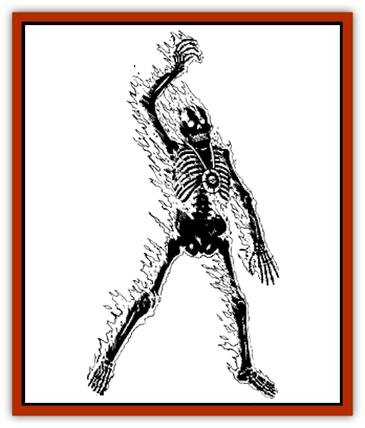

# Burnbones

| Statistic | **Burnbones** |
| --- | --- |
| **Activity Cycle:** | Any |
| **Alignment:** | Neutral evil |
| **Armor Class:** | 3 |
| **Climate/Terrain:** | Any land |
| **Damage/Attack:** | 2d10 |
| **Diet:** | None |
| **Frequency:** | Very rare |
| **Hit Dice:** | 10 |
| **Intelligence:** | High to genius (14-18) |
| **Magic Resistance:** | 40% |
| **Morale:** | Fanatic (17-18) |
| **Movement:** | 12 |
| **No. Appearing:** | 1 |
| **No. of Attacks:** | 1 |
| **Organization:** | Solitary |
| **Size:** | M (6' tall) |
| **Special Attacks:** | Searing touch, heat aura, priest spells, can cast spell and attack simultaneously |
| **Special Defenses:** | +2 or better magical weapon to hit, spell immunities, immune to poison, immune to fire, quarter damage from cold, half damage by weapon type, turned only by lawful good priests |
| **THAC0:** | 11 |
| **Treasure:** | Nil |
| **XP Value:** | 12,000 |

The early days of the Banedeath did not go well for Cyric, the (then) new god of the dead, and many of his fledgling clerics were slaughtered at the hands of powerful Banites. Cyric soon after empowered select members of his clerical faithful with a portion of his power - so much power, in fact, that these clerics' mortal forms dissolved into nothing more than mere bones and the fiery power of the Dark Sun. These new undead, burnbones, are similar to the [[Blazing_Bones|blazing bones]] found in the ruins of Myth Drannor in appearance, but that is where the similarity ends. Burnbones tend to wear the symbol of Cyric on themselves (as a holy symbol, for instance) as a sign of their devotion.

**Combat:** A burnbones causes 2d10 points of damage with its supernatural flaming touch, affecting even creatures or magical items that are immune to the harmful effects of fire or magical fire. Anyone standing within 10 feet of the creature also suffers 1d3 points of heat damage; magical spells and items can prevent this damage.

In addition to its fiery attack, a burnbones can cast priest spells as it did in life. The creature has the spellcasting abilities of a cleric of at least 12th level. If the cleric was of higher level in life, it still retains its level for spellcasting purposes after the transformation. A burnbones requires no verbal, somatic, or material components to cast spells; the creature simply points its finger, and the spell issues forth. The casting time of the spell is unchanged for initiative purposes, and the spell (or another that the creature chooses of the same level) returns to its memory after a 24-hour period. A burnbones may attack with one hand and cast a spell with another simultaneously. Because of the way in which a burnbones casts a spell, it can never be interrupted during spellcasting and lose a spell.

A burnbones is immune to all forms of normal and magical fire, and takes only a quarter of the normal damage from cold-based attacks. As an undead creature, the burnbones is also immune to *sleep*, *charm* and other mind-affecting enchantments, *hold* spells, and all poisons. Curative spells that restore hit points - such as *cure light wounds* - have the opposite effect on the creature, while the reverse of these spells cures damage.

All weapons must be of +2 enchantment or greater to have any chance of striking a burnbones. Because a burnbones is a [[Skeleton|skeletal]] creature, slashing and piercing weapons only inflict half damage. A burnbones can only be turned by a cleric or priest of a lawful good faith. A burnbones is turned as a ghost. Holy water obtained from a lawful good faith acts like strong acid against these beings, causing 2d10 points of damage per vial. Other holy water is ineffectual.

**Habitat/Society:** Burnbones were created from Cyric's priesthood, and were are chosen for their fanatical loyalty. This loyalty led quickly to a somewhat insane and paranoid state of mind after their transformations. Burnbones exist only to serve the greater glory of the Prince of Lies, bending to his every whim. To do otherwise causes the creatures insufferable pain and anguish. Considering the unstable nature of the god they serve, it is not unheard of for burnbones to be apparently working at cross purposes while still working under their god's direct orders.

Cyric created nearly a two dozen of these creatures at the onset of the Banedeath, and their numbers were soon halved by Banites and the forces of good in the Heartlands. As his enemies discovered means by which to destroy the creatures, Cyric sent some of the remaining ones into hiding until needed, and created others as reinforcements. Cyric has created new burnbones only sporadically however, for he seems to be easily distracted, with the result that only a handful of burnbones are created every year.

**Ecology:** A burnbones is infused with a portion of Cyric's power, giving Cyric complete control over it when he so wishes. All of the burnbones created at the time of the Banedeath were a minimum of 12th level before their transformation. When Cyric infuses clerics of lesser level with power enough to increase their levels as burnbones, the increased power burns out their corporeal forms in a short period of time. The greater the difference between the cleric's original level and that of the enhanced burnbones, the shorter the existence of the burnbones. (A one-level difference will generally result in a creature that lasts a year. For each level greater the difference is, subtract a month from the duration of the creature's existence.) Burnbones that are not "overcharged" last until they are destroyed.

---
## Discovery & Documentation

**Source Publication:** Ruins of Zhentil Keep (1995)
**Campaign Setting:** Forgotten Realms
**Author(s):** John Terra and Kevin Melka

### Other Creatures Found in This Source Book
   * [[Banedead|Banedead]]
   * [[Banelich|Banelich]]
   * [[Elemental_Nature|Elemental, Nature]]
   * [[Gargoyle_Guardgoyle|Gargoyle, Guardgoyle]]
   * [[Golem_Magic|Golem, Magic]]
   * [[Golem_Vault_Guardian|Golem, Vault Guardian]]
   * [[Hybsil|Hybsil]]
   * [[Magedoom|Magedoom]]
   * [[Mist_Scarlet_Dancer|Mist, Scarlet Dancer]]
   * [[Orc_Ondonti|Orc, Ondonti]]
   * [[Rat_Zhentish_Sewer|Rat, Zhentish Sewer]]
   * [[Render|Render]]
   * [[Sacaanti|Sacaanti]]
   * [[Snake_Messenger|Snake, Messenger]]
   * [[Zhentarim_Spirit|Zhentarim Spirit]]
