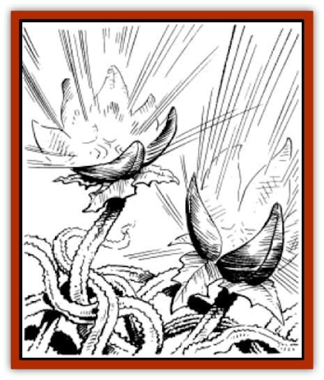

# Burnflower

| Statistic | **Burnflower** |
| --- | --- |
| **Activity Cycle:** | Day |
| **Alignment:** | Neutral |
| **Armor Class:** | 10 |
| **Climate/Terrain:** | Any |
| **Damage/Attack:** | See below |
| **Diet:** | Photosynthesis |
| **Frequency:** | Very rare |
| **Hit Dice:** | 1 per patch |
| **Intelligence:** | Non- (0) |
| **Magic Resistance:** | Nil |
| **Morale:** | N/A |
| **Movement:** | 0 |
| **No. Appearing:** | 10-100 patches (10d10) |
| **No. of Attacks:** | 1 per flower |
| **Organization:** | Patch |
| **Size:** | G (50'+) |
| **Special Attacks:** | Heat ray |
| **Special Defenses:** | Nil |
| **THAC0:** | 19 |
| **Treasure:** | O,U |
| **XP Value:** | 270 per patch |

This hearty plant has highly shiny leaves that reflect sunlight into deadly beams of energy.

Burnflowers appear as a patch of grey-green vines with closed bulb-shaped flowers. If the flowers are opened, they are found to be coated with a clear, sticky sap. The sap has a nasty, bitter flavor and is neither edible nor poisonous.

**Combat:** Burnflowers grow in large numbers. These are divided into some number of 10 foot by 10 foot patches. All attacks, damage, defenses, and experience point awards listed are for each 10 foot by 10 foot patch. Each individual flower within a patch occupies roughly one square foot, so there are 100 burnflowers in a patch.

Each burnflower opens every morning and tracks the sun all day. The highly reflective coating on the inside of each flower petal catches and reflects the rays of the sun, forming a deadly heat ray. Any creature larger than two feet that comes within 50 yards of a burnflower patch is attacked by the heat rays of all its flowers. While each patch is not particularly accurate, the amount of damage it can cause is respectable, and varies according to range.

| Distance | Damage per Patch |
| --- | --- |
| 0-20 yards | 10d4 |
| 21-40 yards | 10d3 |
| 41-50 yards | 10d2 |

Every patch within range will fire at one eligible target. An individual struck by the heat ray produced by the burnflowers is entitled to saving throw versus death ray for half damage. Protection from the burning heat rays is possible. Rock can provide cover. Magical protection from flame or heat damage may also apply. The heat ray from the burnflowers cannot penetrate the fire protection provided by the hide of a [[Drake_Athas_Fire|fire drake]].

Items on a target must also make saving throws versus normal fire or be destroyed. Magical armor has a normal chance to save, but nonmagical armor saves are made with a -2 penalty to the die roll. The save for all other items is made with a -4 penalty to the die roll. A successful save leaves the material scorched but not destroyed. However, every subsequent save by that material is modified by an additional - 1 penalty to the die roll. A failed save means the item in question has been ignited and is being consumed by the extreme heat. If the item is being carried, it must be dropped. If the item is being worn, the individual takes an additional 1d3 points of burn damage.

**Habitat/Society:** Just before dawn, burnflowers secrete small quantities of sap up from small stem pores into the petals of the closed flowers. The sap is highly reflective and protects the plant from the burning rays of the sun. The reflective protection is so good that it creates a mirror of sorts. The extreme heat the flowers generate is beneficial to the plant in several aspects. It keeps the burnflower sheltered and quite cool; the heat rays kill most animals that attempt to feed on the plant, which in turn provides the burnflower with moisture.

**Ecology:** Burnflowers are not of much use to anyone. A druid may use the plants to protect a small area during the day. Unfortunately for travellers, the reflective sap dries out after exposure to sunlight in one day, so it is not useful as a coating agent for clothes or other belongings.

---
## Discovery & Documentation

**Source Publication:** MC12 Dark Sun Appendix I - Terrors of the Desert (1991)
**Campaign Setting:** Dark Sun
**Author(s):** Tom Prusa, Louis J. Prosperi, Walter M. Baas

### Other Creatures Found in This Source Book
   * [[Animal_Herd_Athas|Animal, Herd (Athas)]]
   * [[Animal_Household_Athas|Animal, Household (Athas)]]
   * [[Antloid_Desert|Antloid, Desert]]
   * [[Banshee_Dwarf|Banshee, Dwarf]]
   * [[Beetle_Agony|Beetle, Agony]]
   * [[Bog_Wader|Bog Wader]]
   * [[Brambleweed|Brambleweed]]
   * [[B'rohg|B'rohg]]
   * [[Cat_Psionic|Cat, Psionic]]
   * [[Cha'thrang|Cha'thrang]]
   * [[Cistern_Fiend|Cistern Fiend]]
   * [[Clam_Giant|Clam, Giant]]
   * [[Cloud_Ray|Cloud Ray]]
   * [[Drake_Athas_Air|Drake (Athas), Air]]
   * [[Drake_Athas_Earth|Drake (Athas), Earth]]
   * [[Drake_Athas_Fire|Drake (Athas), Fire]]
   * [[Drake_Athas_Water|Drake (Athas), Water]]
   * [[Dune_Runner|Dune Runner]]
   * [[Dune_Trapper|Dune Trapper]]
   * [[Elemental_Athas_Greater_Air|Elemental (Athas), Greater, Air]]
   * [[Elemental_Athas_Greater_Earth|Elemental (Athas), Greater, Earth]]
   * [[Elemental_Athas_Greater_Fire|Elemental (Athas), Greater, Fire]]
   * [[Elemental_Athas_Greater_Water|Elemental (Athas), Greater, Water]]
   * [[Elemental_Athas_Lesser_Air_Earth|Elemental (Athas), Lesser, Air/Earth]]
   * [[Elemental_Athas_Lesser_Fire_Water|Elemental (Athas), Lesser, Fire/Water]]
   * [[Elemental_Athas_General_Information|Elemental (Athas), General Information]]
   * [[Erdland|Erdland]]
   * [[Esperweed|Esperweed]]
   * [[Flailer|Flailer]]
   * [[Floater|Floater]]
   * [[Giant_Athas|Giant (Athas)]]
   * [[Golem_Athas_I|Golem (Athas) I]]
   * [[Golem_Athas_II|Golem (Athas) II]]
   * [[Golem_Athas_III|Golem (Athas) III]]
   * [[Golem_Athas_General_Information|Golem (Athas), General Information]]
   * [[Halfling_Renegade|Halfling, Renegade]]
   * [[Hej-kin|Hej-kin]]
   * [[Id_Fiend|Id Fiend]]
   * [[Insect_Swarm_Athas|Insect Swarm (Athas)]]
   * [[Kank_Wild|Kank, Wild]]
   * [[Kirre|Kirre]]
   * [[Megapede|Megapede]]
   * [[Mul_Wild|Mul, Wild]]
   * [[Nightmare_Beast|Nightmare Beast]]
   * [[Plant_Carnivorous_Athas|Plant, Carnivorous (Athas)]]
   * [[Pterran|Pterran]]
   * [[Pterrax|Pterrax]]
   * [[Pulp_Bee|Pulp Bee]]
   * [[Pyreen|Pyreen]]
   * [[Rasclinn|Rasclinn]]
   * [[Razorwing|Razorwing]]
   * [[Roc_Athas|Roc (Athas)]]
   * [[Sand_Bride|Sand Bride]]
   * [[Sand_Cactus|Sand Cactus]]
   * [[Sand_Vortex|Sand Vortex]]
   * [[Scrab|Scrab]]
   * [[Silt_Horror|Silt Horror]]
   * [[Silt_Runner|Silt Runner]]
   * [[Sink_Worm|Sink Worm]]
   * [[Sloth_Athas|Sloth (Athas)]]
   * [[So-ut|So-ut]]
   * [[Spider_Cactus|Spider Cactus]]
   * [[Spider_Crystal|Spider, Crystal]]
   * [[Spirit_of_the_Land|Spirit of the Land]]
   * [[T'Chowb|T'Chowb]]
   * [[Thrax|Thrax]]
   * [[Tohr-kreen_I|Tohr-kreen I]]
   * [[Villichi|Villichi]]
   * [[Zhackal|Zhackal]]
   * [[Zombie_Plant|Zombie Plant]]
