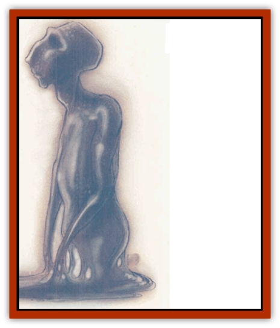

# Busen

| Statistic | **Busen** |
| --- | --- |
| **Activity Cycle:** | Any |
| **Alignment:** | Lawful neutral (good) |
| **Armor Class:** | 0 |
| **Climate/Terrain:** | Arcadia (any) |
| **Damage/Attack:** | 1d10/1d10 |
| **Diet:** | Special (see below) |
| **Frequency:** | Very rare |
| **Hit Dice:** | 8 |
| **Intelligence:** | Exceptional (16) |
| **Magic Resistance:** | 25% |
| **Morale:** | Fearless (20) |
| **Movement:** | 18 |
| **No. Appearing:** | 1-3 |
| **No. of Attacks:** | 2 |
| **Organization:** | Mostly solitary |
| **Size:** | M (6' tall) |
| **Special Attacks:** | Shape change, whirlwind |
| **Special Defenses:** | See below |
| **THAC0:** | 13 |
| **Treasure:** | Nil |
| **XP Value:** | 4,000 |

Buseni come in different forms, but they all have shiny black skin, reflecting light as a puddle of oil reflects a torch. Their true form has no visible features - no eyes, no noses, no ears, no mouths. And where ordinary creatures have bones, buseni have odd ridges just barely restrained from protruding through their skin. The communicate via telepathy.

The shape of a busen depends on its environment and the form it requires to fulfill its function. When at rest, however, its basic shape is that of a sleek humanoid with shiny, seamless skin of jet. Though it's a lawful creature, it must be flexible enough to adapt to its mission. Thus, one busen in a cave might be an ebonskinned humanoid, while another in a high mountain pass might be a slavering [[Wolf|wolf]]-thing. It takes 5 rounds for a busen to fully change its shape - a tactic obviously too dangerous to implement in battle.

Buseni are invisible in darkness until they will themselves to be seen. Furthermore, they cannot be surprised in the darkness of Arcadia's tunnels if they remain still. Their skin loses its sheen while buseni are in hiding, but picks up stray light as soon as they move.

**Combat:** In combat, buseni can attack with weaponlike protrusions that suddenly jut outward from their body. These protrusions, neither bone nor metal, take the shape of whatever weapon is most appropriate to the form a busen is in. Thus, the humanoid busen might wield a 4-foot sword that an enemy could not disarm, while the wolf busen might have claws at the tips of its feet and spurs on its joints. Regardless of the shape the protrusions take, a busen can attack twice per round and inflict 1d10 points of damage with each successful hit.

If a busen is particularly pressed in battle, it can resort to its dreaded whirlwind attack. The busen sprouts weapons all over its body and spins at a blinding speed for 1d6 rounds. (So fast is the busen that opponents suffer a -2 penalty on attack rolls.) During each of these rounds, the busen can attack four times, inflicting 2d8 points of damage for every successful hit. If it doesn't take its enemy down during those few rounds, however, its opponent will likely finish it off - the busen must rest for as many hours as it spent rounds in the whirlwind.

Buseni axe immune to all charm-, sleep-, and paralyzation-based spells. They suffer only half damage from cold-based spells, but take double damage from fire. Lightning has no effect on them. Buseni also have the ability to *detect magic* and *know alignment* at will.

**Habitat/Society:** Buseni serve as the guardians to the second layer of Arcadia. There they walk the passage ways linking the caverns of Abellio and Buxenus, pausing now and then to hide in the shadows and wait for some foolish berk to challenge their authority. Other buseni patrol the misty heights of Arcadia, their inner senses alert for any intrusion. Buseni always hover near the portal they're assigned to guard, ready to question those who'd pass without permission.

If a person or persons unknown approach the gates to Buxenus, buseni step out of their hiding places at a time calculated to shock the travelers. Communicating nothing, their bodies suddenly form weaponlike protrusions - a warning display. If the approaching party chooses to attack at this little provocation, the buseni will do their best to kill them. The buseni reason that such lawless creatures would he better dead. If the group parleys with the buseni, however, they will respond, using telepathy to establish contact. Buseni will question the group about their reasons for wanting to reach the second layer of Arcadia. If the answers are satisfactory, the group must then remove all clothing, jewelry, and weapons so that the buseni can determine the alignments of the group's members. As with the rest of the inhabitants of Arcadia, the buseni have no tolerance for evil. If the group is free of such malice, only then may they pass on to the second layer.

Just who gives the buseni their orders is unknown, and it's similarly dark as to what sort of a society the creatures have. All anyone can attest to is that three is the largest number of them ever seen together, and that those three worked together like a Mechanus-built machine. In short, there's not much known about the buseni at all.

**Ecology:** There's no natural reason why buseni look the way they do, or why they are at all. It's thought that they were spawned by the plane itself. Others think that buseni were created by some power eager to show that - despite a fearsome appearance - a creature need not necessarily be evil. Some sages therefore finger Meriadar for the buseni's creation, while still others argue it's more complicated than that. Whatever the reason, the buseni's apearance seems to indicate its suitability to the Lower Planes. However, appearance notwithstanding, the buseni's beliefs clearly place them in the Upper Planes.

Busen skins are prized in Acheron and Baator, often fetching ridiculously high prices in open bidding. The skin stretches and doesn't tear, and it's excellent clothing material for those who find stealth a necessity. A busen skin, if properly crafted, adds 25% to a rogue's chance to hide in shadows. Of course, any creature caught wearing one of these skins in Arcadia - or spied wearing one by a native of Arcadia (even if said native is traveling elsewhere) - is usually immediately attacked. Some sort of reparation is always demanded, even if it might lead to the death of the creature demanding it.

Buseni apparently receive nourishment simply by obeying their orders. They have no need to eat or kill, as long as they make sure their missions are successful.

---
## Discovery & Documentation

**Source Publication:** Planes of Law (1995)
**Campaign Setting:** Planescape
**Author(s):** Colin McComb, Wolfgang Baur

### Other Creatures Found in This Source Book
   * [[Achaierai|Achaierai]]
   * [[Archon|Archon]]
   * [[Baatezu_Lesser_Kocrachon|Baatezu, Lesser, Kocrachon]]
   * [[Bladeling|Bladeling]]
   * [[Dragon_Rust|Dragon, Rust]]
   * [[Formian|Formian]]
   * [[Gear_Spirit|Gear Spirit]]
   * [[Hellcat|Hellcat]]
   * [[Kyton|Kyton]]
   * [[Moigno|Moigno]]
   * [[Parai|Parai]]
