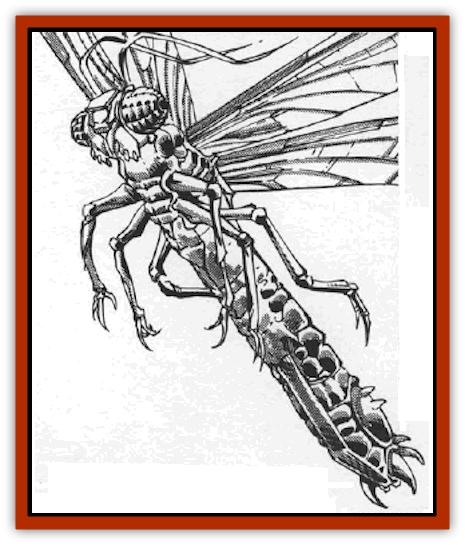

# Buzzjewel

| Statistic | **Buzzjewel** |
| --- | --- |
| **Activity Cycle:** | Any |
| **Alignment:** | Neutral |
| **Armor Class:** | -3 |
| **Climate/Terrain:** | Wildspace |
| **Damage/Attack:** | 1d8 + poison |
| **Diet:** | Gems |
| **Frequency:** | Very rare |
| **Hit Dice:** | 1+1 |
| **Intelligence:** | Animal (1) |
| **Magic Resistance:** | 45% |
| **Morale:** | Unreliable (2) |
| **Movement:** | 3, Fl 24 (A) |
| **No. Appearing:** | 10-60 |
| **No. of Attacks:** | 1 |
| **Organization:** | Swarm |
| **Size:** | T (6&rdquo; long) |
| **Special Attacks:** | Poison |
| **Special Defenses:** | See below |
| **THAC0:** | 19 |
| **Treasure:** | Special |
| **XP Value:** | 650 |

Buzzjewels are inoffensive insects native to wildspace. They travel through space in beautiful multi-colored swarms. They are attracted to light sources, much like moths. Sailors can always tell when a swarm of buzzjewels approaches, due to the loud droning noise from the insects' wings and the cloud of multicolored light reflected from their bodies.

Buzzjewel bodies are partly gemstones, with opaque coloration ranging from ruby red to emerald green to aquamarine blue. When a buzzjewel dies or is killed, its organic body shrivels away, leaving a small ornamental gemstone of 5 gp value, the remnants of the mineral meals it consumed. One buzzjewel in a thousand produces a fancy, precious, or gem/jewel gemstone.

Like other insects, buzzjewel bodies have three segments: the head, thorax, and abdomen. Buzzjewel eyes are multifaceted and quite sensitive to light. Each buzzjewel has two pairs of translucent wings similar to the dragonfly's, and three pairs of legs, which it draws close to its body during flight.

**Combat:** Though buzzjewels swarm around light sources, they are timid around living creatures. Not easily angered, a swarm of buzzjewels passively tolerates 1d4 rounds of attack. After this the buzzjewel swarm, finally infuriated, attacks the offender and everyone else in sight.

All buzzjewels have tiny sharp teeth. Since buzzjewels have no taste for living flesh, they bite, then quickly let go. They attack in swarms of 10 or 20 against one opponent (10 vs. halflings, dwarves, and other small opponents). A single attack roll determining the swarm's chance to hit. The swarm overwhelms its victims; thus, the defenders get no Dexterity bonus to AC.

Each swarm of 10 buzzjewels causes 1d8 damage. For each point of damage the swarm does, there is a 10% chance that Type N poison is injected into the wound. The poison's onset time is one round. A failed saving throw vs. poison inflicts 4d8 damage; a successful save reduces this to 2d8 damage.

The buzzjewels' magic resistance sometimes reflect spells back at the caster. If the spell fails due to the insects magic resistance, the spell is reflected back at the caster. If the spell fails because the buzzjewels saved against it, they don't reflect the spell.

**Habitat/Society:** Buzzjewels live in tiny honeycombed passages just under the surface of asteroids. They instinctively avoid worlds with humanoid populations. Buzzjewels do not require air to survive.

As a rule, buzzjewels live on asteroids high in gemstone content. Gems are their chief source of food, though the insects can eat any mineral or rock if pressed. Interestingly, pearls are poisonous to buzzjewels. A poisoned buzzjewel turns black and does not become a valuable gem.

Buzzjewels communicate by body movements, as bees do. When a buzzjewel swarm finds a new source of gems, it returns to its old lair and does a dance that tells the swarm where the new strike is. Dwarven sages have long tried to decipher the dance so they can obtain the gems, so far to no avail.

Buzzjewels can be called by various *insect summoning* spells; if summoned, they behave as groundling insects. Note, however, if the insects are summoned to be killed for their gems, the caster loses control over them, and the enraged swarm attacks instantly.

**Ecology:** Buzzjewels contribute nothing to the ecosystem. In fact, races that mine gemstones strongly dislike the little gem-eaters. The [[Gnome|gnomes]] call buzzjewels "gembane", and the only printable name that [[Dwarf|dwarves]] use is "baublebiters".

Due to the unpredictable poisonous bite of the buzzjewels, most wise folk resist the idea of catching the bugs and killing them for their gems in a get-rich-quick scheme. The low value of the dead bodies does not make it worth the risk.

The [[Dohwar|dohwar]] actually use live, caged buzzjewels as currency, much to the horror of some of other civilized races. It is rumored that the dohwar are also experimenting with buzzjewels, feeding them fancy gems to see whether, once a buzzjewel dies, it leaves behind a more valuable gem.

---
## Discovery & Documentation

**Source Publication:** MC9 Spelljammer Appendix II (1991)
**Campaign Setting:** Planescape
**Author(s):** Scott Davis, Newton Ewell, John Terra

### Other Creatures Found in This Source Book
   * [[Alchemy_Plant|Alchemy Plant]]
   * [[Allura|Allura]]
   * [[Aperusa|Aperusa]]
   * [[Autognome|Autognome]]
   * [[Bionoid|Bionoid]]
   * [[Bloodsac|Bloodsac]]
   * [[Constellate|Constellate]]
   * [[Contemplator|Contemplator]]
   * [[Dohwar|Dohwar]]
   * [[Dragon_Moon|Dragon, Moon]]
   * [[Dragon_Stellar|Dragon, Stellar]]
   * [[Dragon_Sun|Dragon, Sun]]
   * [[Dreamslayer|Dreamslayer]]
   * [[Dweomerborn|Dweomerborn]]
   * [[Fal|Fal]]
   * [[Feesu|Feesu]]
   * [[Fire_Bat|Fire Bat]]
   * [[Firebird|Firebird]]
   * [[Firelich|Firelich]]
   * [[Flowfiend|Flowfiend]]
   * [[Gadabout|Gadabout]]
   * [[Gammaroid|Gammaroid]]
   * [[Gonn|Gonn]]
   * [[Gossamer|Gossamer]]
   * [[Grav|Grav]]
   * [[Great_Dreamer|Great Dreamer]]
   * [[Greatswan|Greatswan]]
   * [[Grell_Colonial|Grell, Colonial]]
   * [[Gullion|Gullion]]
   * [[Insectare|Insectare]]
   * [[Lhee|Lhee]]
   * [[Mercurial_Slime|Mercurial Slime]]
   * [[Meteorspawn|Meteorspawn]]
   * [[Monitor|Monitor]]
   * [[Owl_Space|Owl, Space]]
   * [[Pristatic|Pristatic]]
   * [[Scro|Scro]]
   * [[Selkie_Star|Selkie, Star]]
   * [[Silatic|Silatic]]
   * [[Skullbird|Skullbird]]
   * [[Sleek|Sleek]]
   * [[Sluk|Sluk]]
   * [[Space_Swine|Space Swine]]
   * [[Sphinx_Astro-|Sphinx, Astro-]]
   * [[Spirit_Warrior|Spirit Warrior]]
   * [[Starfly_Plant|Starfly Plant]]
   * [[Stargazer|Stargazer]]
   * [[Undead_Stellar|Undead, Stellar]]
   * [[Witchlight_Marauder|Witchlight Marauder]]
   * [[Xixchil|Xixchil]]
   * [[Yitsan|Yitsan]]
   * [[Zurchin|Zurchin]]
