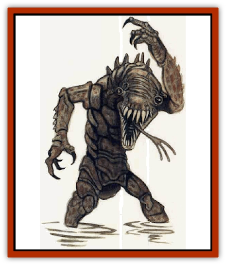

# Bvanen

| Statistic | **Bvanen** |
| --- | --- |
| **Activity Cycle:** | Night |
| **Alignment:** | Neutral good |
| **Armor Class:** | 4 |
| **Climate/Terrain:** | Mountain (cliff) |
| **Damage/Attack:** | 1d3/1d3/1d4+1 |
| **Diet:** | Omnivore |
| **Frequency:** | Very rare |
| **Hit Dice:** | 3+1 |
| **Intelligence:** | Very (11-12) |
| **Magic Resistance:** | Nil |
| **Morale:** | Average (8-10) |
| **Movement:** | 6, Sw 12 |
| **No. Appearing:** | 3-12 |
| **No. of Attacks:** | 3 |
| **Organization:** | Tribal |
| **Size:** | M (5' tall) |
| **Special Attacks:** | Secreted ooze |
| **Special Defenses:** | See below |
| **THAC0:** | 17 |
| **Treasure:** | Nil |
| **XP Value:** | 420 |

**Psionics Summary**

| Level | Dis/Sci/Dev | Attack/Defense | Score | PSPs |
| --- | --- | --- | --- | --- |
| 3 | 2/3/10 | EW,II,MT/MB,MBk,TS | 10 | 40 |

**Psychometabolism -** *Science:* animal affinity; *Devotions:* displacement, flesh armor, immovability.

**Telepathy -** *Sciences:* domination, mind link; *Devotions:* attraction, contact, ego whip, id insinuation, mind thrust, phobia amplification.

Bvanen are a race of intelligent, benevolent amphibians that dwell in the hot swamplands of Athas. Their appearance is somewhat frightening: raised, independently rotating eye turrets, prominent backbone-ridged carapace, chitinous bellyplates, impressively clawed forepaws, and a toothy mouth from which flicks a tri-forked tongue. Their hesitant, distrustful nature often forces them into conflicts they would otherwise choose to avoid. They have their own language.

**Combat:** These amphibians use only their claws and bite, never weapons. They are not strong fighters. They do have a special attack power, however, which they use to partially immobilize their foes. Every bvanen secretes a sticky, quickhardening ooze through pores on its skin. This hardened ooze provides not only a protective shell around the bvanen, but a weapon that can be used to stick to foes on a successful claw attack roll instead of inflicting damage. On the round after the bvanen attack hits, the foe cannot use the struck body part (roll 1d8: 1, head; 2-3, right arm; 4-5, left arm; 6-8, either leg) until a bend bars roll is made (either by the character or a companion - monsters without Strength ratings use a saving throw vs. paralysis if larger than man-size, at -2 if man-sized or smaller). A hit to the head indicates that a foe of equal or smaller size may suffocate as if drowning. A group of bvanen can quickly incapacitate an enemy when working together.

This secretion has one other use. It seals the bvanen's wounds as soon as they are inflicted. Bvanen are therefore immune to the effects of swords of wounding and similar magical weapons that cause bleeding. Further, the ooze and its healing ability effectively reduce all damage taken by 1 point.

Approximately 1 in 6 bvanen possesses the listed psionic powers.

**Habitat/Society:** Bvanen live in partially submerged caves in hot swamplands and also in temporary camps. They use their hardened secretions to build nests out of wood and plants. Bvanen society is divided into two groups: caretakers and hunter/warriors.

Caretakers see to the needs of the tribe and the tribe's domesticated animals. Every bvanen camp or village has domesticates animals - [[Fish_Giant|giant fish]], [[Frog|giant frogs]], [[Insect_Giant|giant insects]], and others. These are used for transport, food, and sometimes as guardians.

The bvanen indicate rank and position within their society by a series of scars on their flesh. They have a strict hierarchy; each individual has a specific place within the social structure. The scar symbols show rank, becoming more intricate as an individual rises in the social order.

Although they are generally a kind and gentle race, the bvanen are reclusive and suspicious of strangers, often choosing to fight defensively rather than risk letting their guard down and trusting a potential enemy.

**Ecology:** It is unknown whether the bvanen are natural creatures or bred from the sorcerous soup of the swamp by a forgotten wizard. They are extremely rare, and might be found only in a single area on an entire world. They hunt and raise animals for food, but they will never knowingly eat an intelligent creature.

---
## Discovery & Documentation

**Source Publication:** Monstrous Compendium, 1996 Annual, Volume 3 (1995)
**Campaign Setting:** Advanced Dungeons & Dragons 2nd Edition
**Author(s):** Jon Pickens

### Other Creatures Found in This Source Book
   * [[Alaghi|Alaghi]]
   * [[Alhoon|Alhoon]]
   * [[Aranea_Savage_Coast|Aranea (Savage Coast)]]
   * [[Arcane_Head|Arcane Head]]
   * [[Banedead|Banedead]]
   * [[Banelich|Banelich]]
   * [[Bat_Bonebat|Bat, Bonebat]]
   * [[Beetle|Beetle]]
   * [[Belgoi|Belgoi]]
   * [[Bladeling|Bladeling]]
   * [[Braxat|Braxat]]
   * [[Bunyip|Bunyip]]
   * [[Burbur|Burbur]]
   * [[Cat_Great_Snow_Tiger|Cat, Great, Snow Tiger]]
   * [[Chosen_One|Chosen One]]
   * [[Chronovoid|Chronovoid]]
   * [[Cildabrin|Cildabrin]]
   * [[Coffer_Corpse|Coffer Corpse]]
   * [[Disenchanter|Disenchanter]]
   * [[Dog_Temporal|Dog, Temporal]]
   * [[Dragon_Cerilia|Dragon (Cerilia)]]
   * [[Dragon_Ghost|Dragon, Ghost]]
   * [[Dragon_Lesser_Undead|Dragon, Lesser Undead]]
   * [[Dragon_Neutral_Amber|Dragon, Neutral, Amber]]
   * [[Dread_Warrior|Dread Warrior]]
   * [[Dreamweaver|Dreamweaver]]
   * [[Dream_Spawn_Greater_Ennui|Dream Spawn, Greater, Ennui]]
   * [[Dream_Spawn_Lesser_Morph|Dream Spawn, Lesser, Morph]]
   * [[Dwarf_Arctic|Dwarf, Arctic]]
   * [[Dwarf_Urdunnir|Dwarf, Urdunnir]]
   * [[Eel_Giant_Moray|Eel, Giant Moray]]
   * [[Elemental_Fire_Kin_Tome_Guardian|Elemental, Fire Kin, Tome Guardian]]
   * [[Elf_Rockseer|Elf, Rockseer]]
   * [[Ethyk|Ethyk]]
   * [[Faerie_Faerie_Fiddler|Faerie, Faerie Fiddler]]
   * [[Faerie_Petty_Bramble|Faerie, Petty, Bramble]]
   * [[Faerie_Petty_Gorse|Faerie, Petty, Gorse]]
   * [[Faerie_Petty|Faerie, Petty]]
   * [[Firenewt|Firenewt]]
   * [[Formian|Formian]]
   * [[Gargoyle_II|Gargoyle II]]
   * [[Giant_Cerilia|Giant (Cerilia)]]
   * [[Goblin_Cerilia|Goblin (Cerilia)]]
   * [[Golem_Magic|Golem, Magic]]
   * [[Golem_Shaboath|Golem, Shaboath]]
   * [[Hag_Bheur|Hag, Bheur]]
   * [[Hamadryad|Hamadryad]]
   * [[Hound_of_Ill-Omen|Hound of Ill-Omen]]
   * [[Human_Cerilia|Human (Cerilia)]]
   * [[Hybsil|Hybsil]]
   * [[Ibrandlin|Ibrandlin]]
   * [[Imp_Chaos|Imp, Chaos]]
   * [[Ixitxachitl_Ixzan|Ixitxachitl, Ixzan]]
   * [[Jabberwock|Jabberwock]]
   * [[Kyton|Kyton]]
   * [[Kyuss_Son_of|Kyuss, Son of]]
   * [[Lillend|Lillend]]
   * [[Life-Shaped_Creation_Guardian|Life-Shaped Creation, Guardian]]
   * [[Life-Shaped_Creation_Transport|Life-Shaped Creation, Transport]]
   * [[Lycanthrope_Werecrocodile|Lycanthrope, Werecrocodile]]
   * [[Lycanthrope_Werespider|Lycanthrope, Werespider]]
   * [[Magedoom|Magedoom]]
   * [[Manotaur|Manotaur]]
   * [[Mastiff_Shadow|Mastiff, Shadow]]
   * [[Meazel|Meazel]]
   * [[Mist_Scarlet_Dancer|Mist, Scarlet Dancer]]
   * [[Needleman|Needleman]]
   * [[Orc_Neo-Orog|Orc, Neo-Orog]]
   * [[Orc_Ondonti|Orc, Ondonti]]
   * [[Owlbear_II|Owlbear II]]
   * [[Pegataur|Pegataur]]
   * [[Phaerimm|Phaerimm]]
   * [[Reggelid|Reggelid]]
   * [[Render|Render]]
   * [[Saurial|Saurial]]
   * [[Scalamagdrion|Scalamagdrion]]
   * [[Sharn|Sharn]]
   * [[Snake_Messenger|Snake, Messenger]]
   * [[Spirit_Forest_Uthraki|Spirit, Forest, Uthraki]]
   * [[Spirit_Forest_Wood_Man|Spirit, Forest, Wood Man]]
   * [[Spirit_Ice_Orglash|Spirit, Ice, Orglash]]
   * [[Spirit_Rock_Thomil|Spirit, Rock, Thomil]]
   * [[Strider_Giant|Strider, Giant]]
   * [[Tembo|Tembo]]
   * [[Temporal_Glider|Temporal Glider]]
   * [[Temporal_Stalker|Temporal Stalker]]
   * [[Tether_Beast|Tether Beast]]
   * [[Thessalmonster|Thessalmonster]]
   * [[Time_Dimensional|Time Dimensional]]
   * [[Tomb_Tapper|Tomb Tapper]]
   * [[Undead_Dragon_Slayer|Undead Dragon Slayer]]
   * [[Unicorn_Black_Toril|Unicorn, Black (Toril)]]
   * [[Vaath|Vaath]]
   * [[Vortex_Spider|Vortex Spider]]
   * [[Weredragon|Weredragon]]
   * [[Zhentarim_Spirit|Zhentarim Spirit]]
