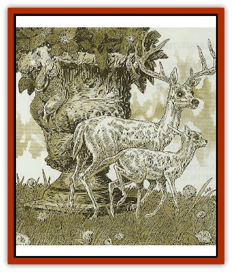
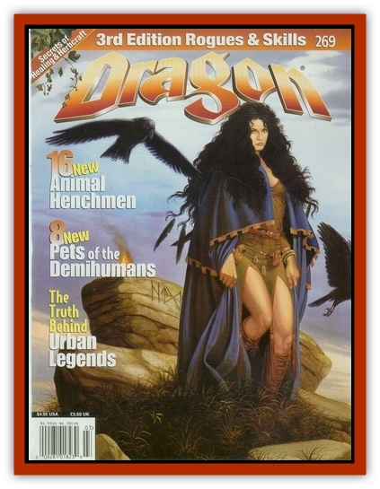

# Byut

| Statistic | **Byut** |
| --- | --- |
| **Activity Cycle:** | Day |
| **Alignment:** | Neutral |
| **Armor Class:** | 7 |
| **Climate/Terrain:** | Any elven inhabited |
| **Damage/Attack:** | 1-2 |
| **Diet:** | Herbivore |
| **Frequency:** | Rare |
| **Hit Dice:** | 1 |
| **Intelligence:** |  |
| **Magic Resistance:** | Nil |
| **Morale:** | Unreliable (3) |
| **Movement:** | 12 |
| **No. Appearing:** | Varies |
| **No. of Attacks:** | 1 |
| **Organization:** | Herd |
| **Size:** | S (1' tall) |
| **Special Attacks:** | Nil |
| **Special Defenses:** | Camouflage, musk |
| **THAC0:** | 19 |
| **Treasure:** | Nil |
| **XP Value:** | 35 |

The fey deer was a favorite [[Elf|elven]] pet in centuries past, but their numbers have dwindled. Now they are found only in the houses of elven royalty or the very wealthy. Their name, *byut*, is an old elven term of endearment usually reserved for mischievous children. Bred for their diminutive size and gentle nature, this animal resembles its larger cousins in many respects. The adult male fey deer has a full rack of antlers that can reach a spread of up to 6 inches across. Its hooves are softer than those of the mundane deer, having a spongy texture, and its eyes are unusually large.

Its most striking feature, however, is made obvious when the animal is frightened. Its normally light gray coat changes color to blend in with its surroundings. When thus concealed, the fey deer is impossible to spot in natural surroundings and has a 90% chance of blending in with any other type of setting, even in bright light.

**Combat:** The fey deer avoids combat at all costs, fleeing if possible, vanishing if necessary. If discovered and cornered, male fey deer can attack with their antlers for 1-2 points of damage. The fey deer can also release a strong musk, usually used in mating, from glands in its neck. This musk is inhaled by any breathing creature within a 6-foot radius. Anyone inhaling this sweet musk must make a saving throw vs. poison or stand entranced in a euphoric state for 1-6 rounds. The fey deer always uses the time gained by this maneuver to escape its enraptured foe.

**Habitat/Society:** The fey deer is a domesticated animal. No members of the species exist in the wild, and their numbers are few. There are rumors that secluded gray elven communities have secret glades that house small herds of these precious animals, but this information has never been verified.

Female fey deer can give birth to one or two fawns every three years in the spring. Given their delicate nature, however, birthing becomes more dangerous for older females. Because of the high risk involved, elves rarely breed fey deer past the age of ten, and the average doe will give birth to only 3-4 fawns in her lifetime. The typical life span of a fey deer is only twenty years, though some owners use spells and potions to prolong their adored pet's life as long as possible.

**Ecology:** The fey deer was bred to live in the main hall or garden of elven owners, and there are few who would doubt that in the wild, despite its camouflage ability, this species would die out completely. There have been a number of attempts to reintroduce the species into the wild, though these have universally met with dismal failure. Even under the best circumstances, these pampered animals are not sturdy enough to live long in the wild, and the herds are gradually whittled down by disease and accidental death. Most elven communities have given this up as a lost cause, though the rumors of hidden herds still circulate.

Another rumor is that long ago an elven ranger dedicated his life to reintroducing the fey deer into the wild and was successful. If this is true, there may be a herd of feral fey deer living quietly somewhere in a verdant forest. Most elves scoft at this notion, although even the most ardent skeptic admits that the animal's natural camouflage makes this rumor difficult to dismiss completely. There has even been the occasional "feral fey deer" sighting. Though this is usually a case of mistaken identity or an outright fabrication, there are some reports that have never been verified one way or another. Those who dedicate their lives to chasing down these elusive phantoms have so far met with frustration.

Hair combed from fey deer can be woven to help make *cloaks of elvenkind*.

---
## Discovery & Documentation

**Source Publication:** Dragon269 (2000)
**Campaign Setting:** Dragon Magazine
**Author(s):** Jack Pitsker, David Day

### Other Creatures Found in This Source Book
   * [[Brak_Twan_Dwarven_Tunnel_Hound|Brak Twan (Dwarven Tunnel Hound)]]
   * [[Guttar_Dwarven_Ox|Guttar (Dwarven Ox)]]
