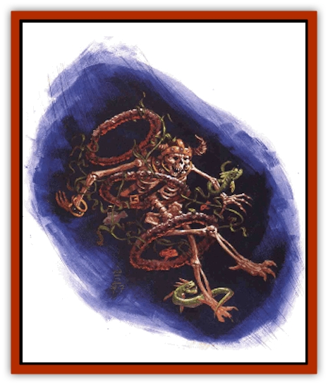

# Bzastra

| Statistic | **Bzastra** |
| --- | --- |
| **Activity Cycle:** | Any |
| **Alignment:** | Neutral (rarely, any) |
| **Armor Class:** | 6 (or 0) |
| **Climate/Terrain:** | Elemental Plane of Water |
| **Damage/Attack:** | 2d6 |
| **Diet:** | Omnivore |
| **Frequency:** | Very rare |
| **Hit Dice:** | 5 |
| **Intelligence:** | Average to genius (10-18) |
| **Magic Resistance:** | Nil |
| **Morale:** | Steady (11-12) |
| **Movement:** | Sw 9 |
| **No. Appearing:** | 1d6 |
| **No. of Attacks:** | 1 |
| **Organization:** | Varies |
| **Size:** | M (5' tall) |
| **Special Attacks:** | Telekinesis |
| **Special Defenses:** | Telekinesis |
| **THAC0:** | 15 |
| **Treasure:** | V |
| **XP Value:** | 650 |

*From the notebooks of Ctan Ftau:*

What strange life is spawned on the endless planes, where all things are surely possible, given enough time? Indeed, infinite time and infinite space means infinite potential, and the proof is all around us, on each plane of our multiverse.

Take, for example, the case of the bzastra. Most folks don't know of this creature of the Elemental Plane of Water, for it is both rare and reclusive. Nonetheless, it's the product of strange chance and random possibility.

As near as anyone can determine, there were once small creatures on Water that appeared to be rings of coral but were actually beasts of scaly flesh. These unintelligent, unobtrusive animals fed on the rich kelp beds of the plane.

Then, at some point (probably long ago), chance stepped in. A few of these ring creatures came upon a waterborne plant called a blue waterwhip - a bit of aquatic flora that seemed no different from the millions of other simple seaweeds thriving in the Endless Ocean. No one knew, however, that the blue waterwhip gave off a low-frequency aura of energy, invisible in all spectrums. Somehow, this energy interacted with the chemical nature of the ring creatures, bringing them together - linking them in a heretofore unknown way. On that day, the first bzastra was born.

 

This intelligent creature is formed from the union of a blue waterwhip and three to six of the ring beasts. The rings stack horizontally atop one another, the plant's blue vine threaded in and out between them. The bzastra exists only in this symbiotic fusion. If separated, the rings and the waterwhip resume their simplistic, unintelligent existences.

Unemotional, logical creatures, bzastra have no real passions or goals other than survival. On rare occasions, however, an individual bzastra encounters someone or something that exerts a powerful influence and bends it to the cause of good or evil (or, even more rarely, law or chaos).

Despite the sheer impossibility of their existence, bzastra have formed a complex society of clever, free-thinking individuals. With their strange evolution came amazing powers that allowed them to communicate telepathically with any creature, protect themselves against the predators of their watery plane, and reach high above their meager beginnings.

**Combat:** The bzastra manipulates energy currents that run through the plane of Water. These subtle, invisible waves enable the creature to affect matter in a way that resembles a powerful and delicate telekinesis.

First and foremost, the creature can defend itself by lashing out with the energy, inflicting 2d6 points of damage per attack. Alternatively, a bzastra can immobilize a single creature as if it had cast a *hold person* or *hold monster* spell (though the victim can remain free if he succeeds at a saving throw versus paralyzation). Lastly, a bzastra can project the energy all around it, forming a kind of telekinetic shield that improves its Armor Class by 6 steps (giving it an AC of 0). However, the creature can do nothing else while using its power to maintain the shield.

In addition, a bzastra's energy-control abilities enable it to use the following spell-like powers once per round, at will: *animal growth*, *blink*, *ESP*, *plant growth*, *suggestion*, and *water breathing* (on others). Through telekinesis, a bzastra can also manipulate an object of up to 200 pounds with a high degree of dexterity. The creature can use each of these spell-like power independently of its above-mentioned offensive and defensive capabilities.

The energy given off by the waterwhip must be at least somewhat magical in nature, because a *dispel magic* spell renders a bzastra into its component parts: a few ring beasts and a strand of blue waterwhip. The spell causes no physical damage. No one's found any other method of separating the parts of the creature without killing it in the process.

**Habitat/Society:** Scholars assume that when the first bzastra was created by accidental contact between the ring creatures and the blue waterwhip, it used its newfound intelligence and powers to maneuver other rings and waterwhips together, thus forming more of its kind. Indeed, bzastra occasionally refer to a "time mover", and it's thought that it is this first individual to which they refer.

Bzastra construct homes for themselves out of water plants, most frequently relying on none other than the blue waterwhip. Their globelike lairs consist of vines woven together and provide only privacy, not protection. More than just homes, however, the constructs ride the currents of the plane of Water, carrying the bzastra inside safely along. Each creature builds a separate lair, though at times a group of them may link their individual dwellings together with vine tethers.

Whether alone or in a community, bzastra prize private contemplation. Many spend weeks and months in quiet meditation, focusing on topics that outsiders can barely guess at. Given their apparently random evolutionary leap, some scholars believe that the bzastra contemplate the beauty of chance. Of course, the scholars who offer this theory are Xaositects, so a berk should take their "wisdom" with a grain of salt.

When active, bzastra spend their time building homes, feeding on microscopic life, and exploring their plane. Inquisitive and scholarly in their pursuits, they even record some of their findings on animal shells (using their telekinesis). Those who've tumbled to the creatures' written language are said to have learned a great many secrets about the Elemental Plane of Water.

Bzastra aren't likely to be hostile, but will defend themselves if attacked. They may also try to steal interesting objects from intelligent creatures that cross their path. Generally, they do this only to further their knowledge and satisfy their curiosity, though sometimes they may figure out how to operate a magical item they've obtained and use it for their own sake.

**Ecology:** Bzastra feed on microscopic or near-microscopic animals and plants like plankton and kelp. Although some bzastra are made of as few as three ring beasts or as many as six, any differences that this might cause or reflect remain a mystery.

Chant has it, however, that the bzastra gather all the ring creatures they can find and secrete them away. They keep the rings safe and sound like children, occasionally forcing evolution on them through the introduction of a blue waterwhip. This speculation is probably true, since no one has ever actually seen one of the mysterious ring crealures on its own in the wild. Blue waterwhip, on the other hand, thrives throughout the Elemental Plane of Water, though it exhibits no known effects on any other creatures.

---
## Discovery & Documentation

**Source Publication:** Planescape III (1996)
**Campaign Setting:** Planescape
**Author(s):** Monte Cook

### Other Creatures Found in This Source Book
   * [[Animental|Animental]]
   * [[Archomental_Evil|Archomental, Evil]]
   * [[Archomental_Good|Archomental, Good]]
   * [[Belker|Belker]]
   * [[Chososion|Chososion]]
   * [[Darklight|Darklight]]
   * [[Devete|Devete]]
   * [[Devourer_Planescape|Devourer (Planescape)]]
   * [[Dharum_Suhn|Dharum Suhn]]
   * [[Egarus|Egarus]]
   * [[Elemental_Athas_Lesser_Air_Earth|Elemental (Athas), Lesser, Air/Earth]]
   * [[Elemental_Athas_Lesser_Fire_Water|Elemental (Athas), Lesser, Fire/Water]]
   * [[Elemental_Fire_Kin_Salamander_II|Elemental, Fire Kin, Salamander II]]
   * [[Entrope|Entrope]]
   * [[Facet|Facet]]
   * [[Frost_Salamander|Frost Salamander]]
   * [[Fundamental_Air_Earth|Fundamental, Air/Earth]]
   * [[Fundamental_Fire_Water|Fundamental, Fire/Water]]
   * [[Fundamental_All_Elements|Fundamental, All Elements]]
   * [[Garmorm|Garmorm]]
   * [[Homunculus_Elemental|Homunculus, Elemental]]
   * [[Immoth|Immoth]]
   * [[Khargra|Khargra]]
   * [[Klyndes|Klyndes]]
   * [[Magran|Magran]]
   * [[Menglis|Menglis]]
   * [[Nathri|Nathri]]
   * [[Ooze_Sprite|Ooze Sprite]]
   * [[Paraelemental|Paraelemental]]
   * [[Phirblas|Phirblas]]
   * [[Psurlon|Psurlon]]
   * [[Quasielemental_Negative|Quasielemental, Negative]]
   * [[Quasielemental_Positive|Quasielemental, Positive]]
   * [[Rast|Rast]]
   * [[Ravid|Ravid]]
   * [[Ruvoka|Ruvoka]]
   * [[Scile|Scile]]
   * [[Shad|Shad]]
   * [[Shocker|Shocker]]
   * [[Sislan|Sislan]]
   * [[Suisseen|Suisseen]]
   * [[Terithran|Terithran]]
   * [[Thoqqua|Thoqqua]]
   * [[Trilloch|Trilloch]]
   * [[Tsnng|Tsnng]]
   * [[Ungulosin|Ungulosin]]
   * [[Vacuous|Vacuous]]
   * [[Wavefire|Wavefire]]
   * [[Xag-Ya_Xeg-Yi|Xag-Ya/Xeg-Yi]]
   * [[Xill|Xill]]
