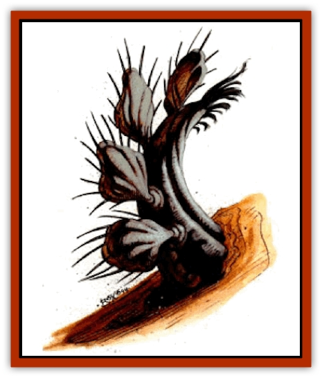

# Cactus - Hunting

| Statistic | **Cactus, Hunting** |
| --- | --- |
| **Activity Cycle:** | Day |
| **Alignment:** | Neutral |
| **Armor Class:** | 6 |
| **Climate/Terrain:** | Any |
| **Damage/Attack:** | 1d3 or 1d6 |
| **Diet:** | Omnivore |
| **Frequency:** | Rare |
| **Hit Dice:** | 5+5 |
| **Intelligence:** | Special |
| **Magic Resistance:** | Nil |
| **Morale:** | Elite (13) |
| **Movement:** | 9 |
| **No. Appearing:** | 1-2 |
| **No. of Attacks:** | 10 or 1 |
| **Organization:** | Solitary |
| **Size:** | S (3' high) |
| **Special Attacks:** | Poison |
| **Special Defenses:** | Nil |
| **THAC0:** | 15 |
| **Treasure:** | Nil |
| **XP Value:** | 1,400 |

**Psionics Summary**

| Level | Dis/Sci/Dev | Attack/Defense | Score | PSPs |
| --- | --- | --- | --- | --- |
| 5 | 2/0/6 | MT/MB | 8 | 25 |

**Telepathy -** *Sciences:* nil; *Devotions:* aversion, contact, life detection, mind thrust.

**Clairsentience -** *Sciences:* nil; *Devotions:* psionic sense, see sound.

Hunting cacti are a pale green color. They stand 3 feet high and have a number of oval shaped pods attached to the main trunk. They have no sensory organs, so they rely on their psionic abilities to detect prey.

**Combat:** Hunting cacti attack with multiple spines that they shoot from the pods on their body. As many as 10 spines can be fired per round, at as many as six different targets, with a maximum range of 30 feet. The hollow spines are 3 inches long and have a small sac of nerve poison in the tip. Any creature hit by a spine must successfully save vs. poison or be paralyzed for 3-6 rounds. This save must be made for each spine that hits. Each spine inflicts 1-6 (1d6) points of damage.

The cactus has 11-30 pods on its body and each pod has 10 spines. Once the cactus detects a paralyzed victim it moves to within 5 feet of it. It then inserts a feeding spine into the motionless victim and drains 1-6 hp each round. The feeding spine automatically hits a paralyzed creature. The cactus continues to feed until it is attacked or until it drains 30 points from its victims. Any attacks that cause damage to the cactus cause it to withdraw the feeding spine and face the new threat.

Any hit from an edged weapon severs a feeding spine. New spines can be regrown at a rate of one per day. If it feels threatened, the cactus uses its aversion power to send its attacker away.

Hunting cacti generally kill one member of a party, herd, or flock, and leave the rest. Once they have a food source, they continue a battle only if any remaining creatures press the attack or try to steal their food.

**Habitat/Society:** Hunting cacti are normally found alone, although they are occasionally found in pairs. They build no lair, resting wherever they happen to be. They often rest among a group of normal cacti if one is available.

Hunting cacti prefer meat, but can survive on plants indefinitely. Although the cacti regard this as a form of cannibalism, they prefer consuming plants to starvation.

Hunting cacti possess an alien intelligence and, although communication through psionics is possible, the cacti do not understand that animals are sentient beings. The cacti regard any communication as coming from a plant, refusing to accept that a "meat-creature" could have any more intelligence than is required to eat, move, and reproduce. Hunting cacti have an intelligence of 15 (exceptional).

Hunting cacti reproduce by pairs. First, cacti detach a new pod. Then these pods are placed side-by-side on the ground and link up to form one larger pod. Within one day, the new cacti grow a trunk and new pods begin to grow. Hunting cacti grow at the rate of 3 inches per month, from their original height of 6 inches. Their life span is not known as none have been successfully kept in captivity.

**Ecology:** Hunting cacti are not part of the food chain as they are not native to Athas. They eat anything they can catch, but they are not preyed upon by any Athasian animal. They are occasionally attacked by the thirsty travellers who expect to find water inside a non-sentient plant. The spines of hunting cacti can be used as blowgun darts, with or without the nerve poison.

---
## Discovery & Documentation

**Source Publication:** Dark Sun Appendix II - Terrors Beyond Tyr (1991)
**Campaign Setting:** Dark Sun
**Author(s):** Jim Atkiss, Steve Brown, Timothy B. Brown, Andrew P. Morris, Bruce Nesmith, Wes Nicholson, Bill Slavicsek

### Other Creatures Found in This Source Book
   * [[Aarakocra_Athas|Aarakocra (Athas)]]
   * [[Animal_Domestic_Athas_II|Animal, Domestic (Athas) II]]
   * [[Aviarag|Aviarag]]
   * [[Baazrag|Baazrag]]
   * [[Baazrag_Boneclaw|Baazrag, Boneclaw]]
   * [[Bloodgrass|Bloodgrass]]
   * [[Cactus_Rock|Cactus, Rock]]
   * [[Cilops|Cilops]]
   * [[Crodlu|Crodlu]]
   * [[Dagorran|Dagorran]]
   * [[Dhaot|Dhaot]]
   * [[Drake_Lesser_Athas_General_Information|Drake, Lesser (Athas), General Information]]
   * [[Drake_Lesser_Athas_Magma|Drake, Lesser (Athas), Magma]]
   * [[Drake_Lesser_Athas_Rain|Drake, Lesser (Athas), Rain]]
   * [[Drake_Lesser_Athas_Silt|Drake, Lesser (Athas), Silt]]
   * [[Drake_Lesser_Athas_Sun|Drake, Lesser (Athas), Sun]]
   * [[Dray|Dray]]
   * [[Drik|Drik]]
   * [[Dune_Reaper|Dune Reaper]]
   * [[Dwarf_Athas|Dwarf (Athas)]]
   * [[Elemental_Beast_Athas_Air|Elemental Beast (Athas), Air]]
   * [[Elemental_Beast_Athas_Earth|Elemental Beast (Athas), Earth]]
   * [[Elemental_Beast_Athas_Fire|Elemental Beast (Athas), Fire]]
   * [[Elemental_Beast_Athas_Water|Elemental Beast (Athas), Water]]
   * [[Elf_Athas|Elf (Athas)]]
   * [[Fael|Fael]]
   * [[Feylaar|Feylaar]]
   * [[Fordorran|Fordorran]]
   * [[Giant_Half-giant|Giant, Half-giant]]
   * [[Giant_Shadow|Giant, Shadow]]
   * [[Golem_Athas_Magma|Golem (Athas), Magma]]
   * [[Golem_Athas_Salt|Golem (Athas), Salt]]
   * [[Golem_Athas_General_Information|Golem (Athas), General Information]]
   * [[Gorak|Gorak]]
   * [[Halfling_Athas|Halfling (Athas)]]
   * [[Human_Athas|Human (Athas)]]
   * [[Jhakar|Jhakar]]
   * [[Kaisharga|Kaisharga]]
   * [[Kes'trekel|Kes'trekel]]
   * [[Klar|Klar]]
   * [[Krag|Krag]]
   * [[Kragling|Kragling]]
   * [[Lirr|Lirr]]
   * [[Mastyrial|Mastyrial]]
   * [[Meorty|Meorty]]
   * [[Mul|Mul]]
   * [[Nikaal|Nikaal]]
   * [[Paraelemental_Beast_General_Information|Paraelemental Beast, General Information]]
   * [[Paraelemental_Beast_Magma|Paraelemental Beast, Magma]]
   * [[Paraelemental_Beast_Rain|Paraelemental Beast, Rain]]
   * [[Paraelemental_Beast_Silt|Paraelemental Beast, Silt]]
   * [[Paraelemental_Beast_Sun|Paraelemental Beast, Sun]]
   * [[Pakubrazi|Pakubrazi]]
   * [[Psionocus|Psionocus]]
   * [[Psurlon|Psurlon]]
   * [[Raaig|Raaig]]
   * [[Retriever_Obsidian|Retriever, Obsidian]]
   * [[Ruktoi|Ruktoi]]
   * [[Ruvoka_Athas|Ruvoka (Athas)]]
   * [[Sand_Howler|Sand Howler]]
   * [[Scorpion_Athas|Scorpion (Athas)]]
   * [[Seed_Brain|Seed, Brain]]
   * [[Silt_Horror_Black|Silt Horror, Black]]
   * [[Silt_Horror_Magma|Silt Horror, Magma]]
   * [[Silt_Horror_Red|Silt Horror, Red]]
   * [[Silt_Spawn|Silt Spawn]]
   * [[Slig|Slig]]
   * [[Spider_Athas|Spider (Athas)]]
   * [[Spinewyrm|Spinewyrm]]
   * [[Ssurran|Ssurran]]
   * [[Stalking_Horror|Stalking Horror]]
   * [[Tarek|Tarek]]
   * [[Tari|Tari]]
   * [[Thri-kreen|Thri-kreen]]
   * [[T'liz|T'liz]]
   * [[Tohr-kreen_II|Tohr-kreen II]]
   * [[Tohr-kreen_III|Tohr-kreen III]]
   * [[Trin|Trin]]
   * [[Tul'k|Tul'k]]
   * [[Undead_Athas_General_Information|Undead (Athas), General Information]]
   * [[Wraith_Athas|Wraith (Athas)]]
   * [[Xerichou|Xerichou]]
   * [[Zombie_Thinking|Zombie, Thinking]]
