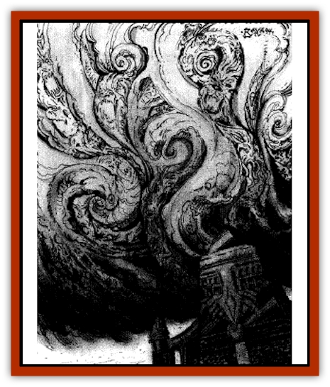

# Caller in Darkness

| Statistic | **Caller in Darkness** |
| --- | --- |
| **Activity Cycle:** | Any |
| **Alignment:** | Neutral evil |
| **Armor Class:** | Nil |
| **Climate/Terrain:** | Giustenal environs |
| **Damage/Attack:** | Special |
| **Diet:** | Spiritual energy |
| **Frequency:** | Unique |
| **Hit Dice:** | Nil |
| **Intelligence:** | Genius (18) |
| **Magic Resistance:** | Nil |
| **Morale:** | Fearless (20) |
| **Movement:** | Nil |
| **No. Appearing:** | 1 |
| **No. of Attacks:** | Special |
| **Organization:** | Solitary |
| **Size:** | Special |
| **Special Attacks:** | See below |
| **Special Defenses:** | See below |
| **THAC0:** | Nil |
| **Treasure:** | Nil |
| **XP Value:** | Special |

**Psionics Summary**

| Level | Dis/Sci/Dev | Attack/Defense | Score | PSPs |
| --- | --- | --- | --- | --- |
| 18 | All/All/All | All/All | 16 | 750 |

The Caller in Darkness is just one name applied to the entity that haunts the ruins of ancient Giustenal. Most who have traveled through the area know the stories of some unknown being or object of incredible power that seeks to make contact with vulnerable minds. It calls to those with even the smallest amount of talent in the Way, driving them mad and making them commit foul acts of violence.

The Caller is a multitude of spirits trapped in a supernatural storm that exists in the Ethereal Plane adjacent to Giustenal. In the physical world, the Caller has no shape. It can only interact through the use of psionics. On the Ethereal Plane, it appears as a huge whirlwind full of swirling, howling spirits.

The Caller's native language is the tongue of ancient Giustenal. It communicates via psionics, using visions and projecting images to contact other psionic minds.

**Combat:** To maintain its own existence, the Caller in Darkness probes a five-mile area around the ruins. It searches with psionic signals, waiting for someone to respond to its psionic call. It tries to overwhelm that person's mind and draw him or her to the ruins. Those contacted by the Caller who die within Giustenal's walls are sucked into the spirit storm and become part of the group consciousness.

The Caller is very particular about who it searches for. It is only interested in psionicists or those with wild talents. It ignores those who have no natural capacity with the Way. Further, it is only interested in the same minds as those who were living in Giustenal at the time of the city's destruction - humans, [[Elf_Athas|elves]], half-elves, [[Dwarf_Athas|dwarves]], and [[Halfling_Athas|halflings]].

Outside the ruined walls but within the Caller's range, any use of psionics by those the Caller seeks has a chance of attracting its attention. Every use of a power has a base 25% chance of attracting the Caller. This base is increased by the number of PSPs expended to initiate and maintain the power. (The check is made after the power expires.) Once the Caller notices a psionic mind, it attacks with a powerful form of contact. It can attempt to contact a noticed character outside the ruins once per day. The character must make a saving throw versus spells. Failure indicates that contact has been established. If contact isn't established, nothing else occurs that day but the character has a feeling of dread.

Once contact is established outside Giustenal, a victim begins to experience delusions. These manifest as visions of loved ones or something else the victim most desires. The victim understands the voices and visions, but he or she speaks in the ancient language of Giustenal. These illusions are benevolent and draw the character toward the ruins. Every hour after contact, the victim must make another saving throw versus spells. Success or failure, the victim wants to enter the ancient city. Success means the victim doesn't have to drop everything and rush ahead. Failure means the compulsion overwhelms the character and he or she begins the final trek to Giustenal. At this point, the victim may even attempt to kill his companions - especially if they try to stop him from reaching the ruins.

Inside the ruins, the base chance to notice the use of a psionic power is 50%, increased by spent PSPs. Contact attacks can be made twice a day in the city. Visions inside the city turn dark. The people of Giustenal died in horror. Fear gave the supernatural storm its power, and the Caller seeks to replicate that terror in its victims before they die. Once a victim begins to experience terrifying visions (many related to the destruction of the city), others nearby suffer from fear spill-over. This spill-over affects everyone, regardless of race or psionic ability.

Every half hour inside the walls, characters (other than those who have been contacted by the Caller) must make saving throws versus paralyzation to control their rising fear. After a number of failed rolls equal to one-quarter of the character's Wisdom (rounded up), the character succumbs to his fear and acts as though a fear spell was cast.

Contacted characters are hit with a series of increasingly malevolent visions, one every half hour. With each vision, a character must make a saving throw versus paralyzation. The saving throw receives a penalty based on how many visions have been experienced. On the first, the penalty is -1; the second, -2, and so on. Each failure causes the loss of 1d4 points of Wisdom. When a character's Wisdom drops to 0, the Caller can finally unleash its most devastating attack - causing the character to take his or her own life.

A contacted character who dies within the walls of Giustenal is sucked into the spirit storm. While trapped in the storm, the character can't be resurrected or raised. The natural duration of imprisonment for new victims is 100+2d20 years. A *wish* or other spell capable of selecting spirits from the Ethereal Plane can draw victims from the Caller's grasp.

The Caller can follow a character it notices as long as the character remains within its range. The range only extends along the surface. Once the character enters the tunnels beneath Giustenal, the Caller can no longer follow him. It can concentrate attacks on multiple victims in a single day, so all psionic users are in danger while in the Giustenal region.

**Habitat/Society:** While the Caller consists of thousands of individual spirits, it believes itself to be a single entity. It was created from the mass carnage inflicted on Giustenal by the sorcerer-kings who killed [[Dregoth|Dregoth]]. The vortices which funnel the elemental powers of the sorcerer-kings produced a separate whirlwind in the Ethereal Plane adjacent to Giustenal. The spirits of the city's dead were caught in the storm, and over the centuries their powerful psionic energies have merged into a group consciousness.

**Ecology:** As the supernatural winds slowly abate, some of the spirits have been released. The group consciousness doesn't see this as a good thing. It believes that it is dying. The Caller seek more psionic souls to add to the storm.

---
## Discovery & Documentation

**Source Publication:** City by the Silt Sea (1994)
**Campaign Setting:** Dark Sun
**Author(s):** Shane Lacy Hensley

### Other Creatures Found in This Source Book
   * [[Beetle_Dragon|Beetle, Dragon]]
   * [[Dray|Dray]]
   * [[Dregoth|Dregoth]]
   * [[Dwarf_Cursed_Dead|Dwarf, Cursed Dead]]
   * [[Kalin|Kalin]]
   * [[Krag|Krag]]
   * [[Kragling|Kragling]]
   * [[Pit_Snatcher|Pit Snatcher]]
   * [[Silt_Serpent|Silt Serpent]]
   * [[Silt_Spawn|Silt Spawn]]
   * [[Venger|Venger]]
   * [[Wall_Walker|Wall Walker]]
