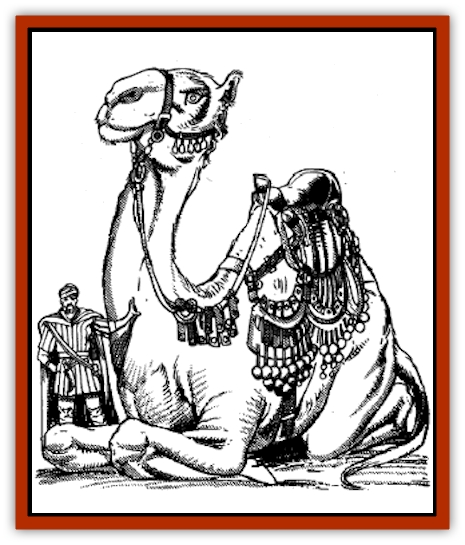

# Camel of the Pearl

| Statistic | **Camel of the Pearl** |
| --- | --- |
| **Activity Cycle:** | Day |
| **Alignment:** | Lawful good |
| **Armor Class:** | 6 |
| **Climate/Terrain:** | Any |
| **Damage/Attack:** | 1-8/2-12 |
| **Diet:** | Omnivore |
| **Frequency:** | Rare |
| **Hit Dice:** | 5 |
| **Intelligence:** | High (13-14) |
| **Magic Resistance:** | 10% |
| **Morale:** | Elite (14) |
| **Movement:** | 24 |
| **No. Appearing:** | 1 (2-12) |
| **No. of Attacks:** | 2 |
| **Organization:** | Solitary |
| **Size:** | G (30' tall) |
| **Special Attacks:** | Trample |
| **Special Defenses:** | Spells |
| **THAC0:** | 15 |
| **Treasure:** | Nil |
| **XP Value:** | 1,400 |

[[Camel|Camels]] of the pearl are said to have been carved from a single great pearl by Jisan of the floods at the dawn of the world, and they have served the cause of good and righteousness ever since. Their deep, enormous eyes reflect both their tranquility and their great power.

Camels of the pearl are gigantic, positively elephantine animals with white fur, pearly eyes, and great power. They speak as humans do, and know the language of giants, genies, and others as well. They generally kneel when speaking to smaller creatures, so as not to intimidate them with their size. Camels of the pearl who have decided to serve as steeds are often fitted with rich bridles, saddles, and trappings of silk, silver, samite, bronze, and carefully-gilded leather. Somehow, though, even the richest gear only makes a camel of the pearl seem more humble.

**Combat:** Camels of the pearl are powerful healers and teachers. They have all the spell abilities of a 7th-level cleric with a 17 Wisdom. In addition, they can *cure disease* or *neutralize poison* at will by licking the face of an afflicted person. Three times per day they can *create food and water* to feed the hungry or the poor.

Camels of the pearl can blight the ventures of those who abuse their station or responsibilities, generally by teaching others to resist and to demand fair treatment. They can also create fool's gold to bribe evil creatures with or to buy them off.

Camels of the pearl do not spit, but if severely provoked they can fight as well as war camels. They can bite for 1-8 points of damage and trample for 2d6. A successful trampling attack forces the opponent to remain prone, giving the camel an additional +4 to hit on future trampling attacks. If a camel of the pearl misses a trampling attack, its foe may regain its feet if it undertakes no other action that round.

A camel of the pearl may become invisible at will.

**Habitat/Society:** Camels of the pearl seek out people and places where they can be of service. They are glad to shoulder burdens, but they also insist that those they help help themselves. They often serve noble djinn and some desert giants as steeds and symbols of authority.

**Ecology:** Camels of the pearl are omnivores, eating insects, whole plants, grain, prepared foods, and even fish. They have a definite sweet tooth and can sometimes be persuaded to stay in an area longer than they might otherwise if they are plied with sugar, honey, date wine, mead, confections, or sweet fruit. They can travel without food or water for up to a month.

Camels of the pearl most enjoy the company of other lawful good beings, but they are also willing to try to convert others through their good example. They frequently minister to those who would exploit them, but camels of the pearl are wise enough to see through these attempts and leave any situation where their good works are twisted to selfish ends.

**The White Mirage**

  There are legends of the greatest camel of the pearl, a beast created to serve the gods as their steed, carved from the heart of the pearl that gave birth to all such camels. This animal is said to be near immortal, still roaming the world thousands of years after its birth, providing for the needy and calling down curses on those who harm it or those who oppose the will of the Loregiver.

The White Mirage is most commonly encountered in the deep desert by stranded or dying travelers, most of whom claim that it led them to an oasis and healed them before leaving them on a caravan route to be picked up by passing merchants.

It has all the abilities of the lesser camels of the pearl as well as the spell abilities of a 20th-level priest. It appears only to travelers who are both good and industrious; pious sluggards do not gain its sympathy, nor do hard-working cheats. Those who are both lazy and malicious will only regret meeting the White Mirage; it may curse them with poverty, barrenness, the attentions of genies, the evil eye, or rapid aging and decline. The curses visited on such misguided souls generally mirror the sufferings they have visited on others. In rare cases, they are given warnings of what will come if they don't change their ways.

---
## Discovery & Documentation

**Source Publication:** MC13 Al-Qadim Appendix (1992)
**Campaign Setting:** Al-Qadim (Forgotten Realms)
**Author(s):** C. Terry Phillips

### Other Creatures Found in This Source Book
   * [[Ammut|Ammut]]
   * [[Ashira|Ashira]]
   * [[Asuras|Asuras]]
   * [[Black_Cloud_of_Vengeance|Black Cloud of Vengeance]]
   * [[Buraq|Buraq]]
   * [[Camel|Camel]]
   * [[Centaur_Desert|Centaur, Desert]]
   * [[Copper_Automaton|Copper Automaton]]
   * [[Debbi|Debbi]]
   * [[Elephant_Bird|Elephant Bird]]
   * [[Gen|Gen]]
   * [[Genie_Noble_Dao|Genie, Noble Dao]]
   * [[Genie_Noble_Djinni|Genie, Noble Djinni]]
   * [[Genie_Noble_Efreeti|Genie, Noble Efreeti]]
   * [[Genie_Noble_Marid|Genie, Noble Marid]]
   * [[Genie_Tasked_Architect_Builder|Genie, Tasked, Architect/Builder]]
   * [[Genie_Tasked_Artist|Genie, Tasked, Artist]]
   * [[Genie_Tasked_Guardian|Genie, Tasked, Guardian]]
   * [[Genie_Tasked_Herdsman|Genie, Tasked, Herdsman]]
   * [[Genie_Tasked_Slayer|Genie, Tasked, Slayer]]
   * [[Genie_Tasked_Warmonger|Genie, Tasked, Warmonger]]
   * [[Genie_Tasked_Winemaker|Genie, Tasked, Winemaker]]
   * [[Ghost_Mount|Ghost Mount]]
   * [[Ghul|Ghul]]
   * [[Giant_Desert|Giant, Desert]]
   * [[Giant_Jungle|Giant, Jungle]]
   * [[Giant_Reef|Giant, Reef]]
   * [[Giant_Zakhara_General_Information|Giant (Zakhara), General Information]]
   * [[Hama|Hama]]
   * [[Heway|Heway]]
   * [[Living_Idol|Living Idol]]
   * [[Lycanthrope_Werehyena|Lycanthrope, Werehyena]]
   * [[Lycanthrope_Werelion|Lycanthrope, Werelion]]
   * [[Markeen|Markeen]]
   * [[Maskhi|Maskhi]]
   * [[Mason_Wasp_Giant|Mason Wasp, Giant]]
   * [[Nasnas|Nasnas]]
   * [[Pahari|Pahari]]
   * [[Rom|Rom]]
   * [[Sabu_Lord|Sabu Lord]]
   * [[Sakina|Sakina]]
   * [[Serpent_Lord|Serpent Lord]]
   * [[Serpent_Winged|Serpent, Winged]]
   * [[Silat|Silat]]
   * [[Simurgh|Simurgh]]
   * [[Stone_Maiden|Stone Maiden]]
   * [[Vishap|Vishap]]
   * [[Zaratan|Zaratan]]
   * [[Zin|Zin]]
