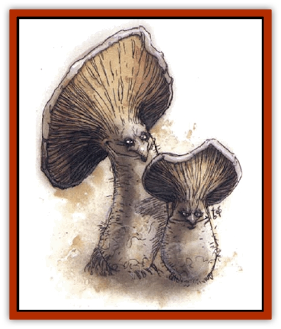

# Campestri

| Statistic | **Campestri** |
| --- | --- |
| **Activity Cycle:** | Day (inactive in bright sunlight) |
| **Alignment:** | Neutral |
| **Armor Class:** | 8 |
| **Climate/Terrain:** | Saltwater swamps |
| **Damage/Attack:** | 1 |
| **Diet:** | Herbivore |
| **Frequency:** | Rare |
| **Hit Dice:** | 1 |
| **Intelligence:** | Semi- (2-4) |
| **Magic Resistance:** | Nil |
| **Morale:** | Unsteady (5-7) |
| **Movement:** | 12 |
| **No. Appearing:** | 4d6 per herd |
| **No. of Attacks:** | 1 |
| **Organization:** | Herd |
| **Size:** | T-S (3&rdquo; per hp) |
| **Special Attacks:** | Spores, sound imitation |
| **Special Defenses:** | Surprised only on 1 or 2 |
| **THAC0:** | 20 |
| **Treasure:** | Nil |
| **XP Value:** | 65 |

Campestri resemble [[Myconid|myconids]] without arms and have a stronger resemblance to mushrooms than their more highly evolved cousins. Campestris are happy-go-lucky creatures with few cares or worries. The fungus creatures are a bit smarter than a [[Cat_Small|domestic cat]] - just smart enough to have developed a warped sense of humor and some rudimentary powers of reason. Each "herd" of mushrooms also has a collective intelligence equal to about 6-7 on the Intelligence scale. A druid or other character with the herbalism proficiency may have heard of the dancing mushrooms in old legends, but PCs should not have any specific information about campestri habits and abilities.

Campestris vary widely in color, from white to tan to dark brown, but they always have red or purple caps and speckles. They move by expanding and contracting their "root-balls".

**Combat:** Once per day, each campestri can release a cloud of spores that acts as a *slow* spell upon all creatures within a 10-foot radius. The effect lasts for 1d4+4 rounds (save vs. spell for half duration). Campestri are very sensitive to sound and vibrations, so they are surprised only on a roll of 1 or 2.

Campestris can butt creatures at a high rate of speed for a single point of damage, but they use this attack mainly as a distraction. They will also swarm spellcasters this way to prevent spellcasting.

**Habitat/Society:** Campestris are captivated by any sort of singing, even incredibly bad singing. If anyone sings or plays an instrument, the campestris will happily sing along. The mushrooms can easily imitate both words and music. Once they have run through a song or piece of music three or four times, they remember it, although they have a tendency to mix and match parts of different tunes. The campestris will dance all around whoever is singing to them, enjoying themselves immensely. If one of the PCs sings a song to the campestris, the DM should sing back the words a little warped. For example, suppose a PC bard sings, "Mary had a little lamb, whose fleece was white as snow" (one of the campestris' all-time favorites). In respond, the campestris madly caper around the PC while singing, "Murray hada weedleam, hoose fleas was wideasno!" (The DM should repeat the lyrics in an obnoxious, nasal falsetto, twisting them in a new way each time until he or she gets tired or the players start to throw things.)

If the PC bard puts up with the campestris' sometimes annoying habits and teaches them to sing on key (a very patient bard might even be able to get them to sing and dance like a chorus line), the DM can award a bonus of 150 XP for good role-playing. If the player does an exceptional job (if everyone at the gaming session laughs), the PC might deserve 200-300 XP. In order to earn this bonus, the player should actually sing the song that the character wants to teach the campestris. Player talent does not count here, only that the player is willing to sing. The DM's own judgment determines when the PC bard has put enough effort into teaching the campestris to sing.

**Ecology:** Campestris are very useful creatures to have around, if one happens to live in an area with salty soil. The mushroom creatures "eat" salty soil, filter out the salt, and excrete a slippery paste of purified soil (stripped of things nourishing to fungus, of course).

Eating salt also serves as a defend mechanism because it makes campestris taste as salty as caviar. [[Bullywug|Bullywugs]] consider them a delicacy, but most other intelligent creatures avoid them.

---
## Discovery & Documentation

**Source Publication:** Monstrous Compendium, 1994 Annual, Volume 1 (1995)
**Campaign Setting:** Advanced Dungeons & Dragons 2nd Edition
**Author(s):** David Wise

### Other Creatures Found in This Source Book
   * [[Abyss_Ant|Abyss Ant]]
   * [[Achaierai|Achaierai]]
   * [[Afanc|Afanc]]
   * [[Al-Jahar|Al-Jahar]]
   * [[Baelnorn|Baelnorn]]
   * [[Baneguard|Baneguard]]
   * [[Banelar|Banelar]]
   * [[Bird_Talking|Bird, Talking]]
   * [[Blazing_Bones|Blazing Bones]]
   * [[Caniquine|Caniquine]]
   * [[Cat_Winged|Cat, Winged]]
   * [[Crypt_Servant|Crypt Servant]]
   * [[Death's_Head_Tree|Death's Head Tree]]
   * [[Dog_Saluqi|Dog, Saluqi]]
   * [[Dragon_Electrum|Dragon, Electrum]]
   * [[Dragon_Fang|Dragon, Fang]]
   * [[Dragon_Linnorm_Corpse_Tearer|Dragon, Linnorm, Corpse Tearer]]
   * [[Dragon_Linnorm_Dread|Dragon, Linnorm, Dread]]
   * [[Dragon_Linnorm_Flame|Dragon, Linnorm, Flame]]
   * [[Dragon_Linnorm_Forest|Dragon, Linnorm, Forest]]
   * [[Dragon_Linnorm_Frost|Dragon, Linnorm, Frost]]
   * [[Dragon_Linnorm_Gray|Dragon, Linnorm, Gray]]
   * [[Dragon_Linnorm_Land|Dragon, Linnorm, Land]]
   * [[Dragon_Linnorm_Midgard|Dragon, Linnorm, Midgard]]
   * [[Dragon_Linnorm_Rain|Dragon, Linnorm, Rain]]
   * [[Dragon_Linnorm_Sea|Dragon, Linnorm, Sea]]
   * [[Dragon_Neutral_Jacinth|Dragon, Neutral, Jacinth]]
   * [[Dragon_Neutral_Jade|Dragon, Neutral, Jade]]
   * [[Dragon_Neutral_Pearl|Dragon, Neutral, Pearl]]
   * [[Dread|Dread]]
   * [[Dragon-kin|Dragon-kin]]
   * [[Elemental_Earth_Kin_Chrysmal|Elemental, Earth Kin, Chrysmal]]
   * [[Elemental_Earth_Kin_Earth_Weird|Elemental, Earth Kin, Earth Weird]]
   * [[Elemental_Fire_Kin_Azer|Elemental, Fire Kin, Azer]]
   * [[Elemental_Sandman|Elemental, Sandman]]
   * [[Elemental_Wind_Walker|Elemental, Wind Walker]]
   * [[Elemental_Vermin|Elemental Vermin]]
   * [[Feystag|Feystag]]
   * [[Flame_Skull|Flame Skull]]
   * [[Foulwing|Foulwing]]
   * [[Gambado|Gambado]]
   * [[Garbug|Garbug]]
   * [[Genie_Tasked_Administrator|Genie, Tasked, Administrator]]
   * [[Genie_Tasked_Deceiver|Genie, Tasked, Deceiver]]
   * [[Genie_Tasked_Harim_Servant|Genie, Tasked, Harim Servant]]
   * [[Genie_Tasked_Messenger|Genie, Tasked, Messenger]]
   * [[Genie_Tasked_Miner|Genie, Tasked, Miner]]
   * [[Genie_Tasked_Oathbinder|Genie, Tasked, Oathbinder]]
   * [[Gibbering_Mouther|Gibbering Mouther]]
   * [[Gnasher|Gnasher]]
   * [[Gnasher_Winged|Gnasher, Winged]]
   * [[Golem_Brain|Golem, Brain]]
   * [[Golem_Hammer|Golem, Hammer]]
   * [[Golem_Metagolem|Golem, Metagolem]]
   * [[Golem_Spiderstone|Golem, Spiderstone]]
   * [[Gorynych|Gorynych]]
   * [[Greelox|Greelox]]
   * [[Helmed_Horror|Helmed Horror]]
   * [[Jarbo|Jarbo]]
   * [[Laraken|Laraken]]
   * [[Lich_Psionic|Lich, Psionic]]
   * [[Living_Steel|Living Steel]]
   * [[Lock_Lurker|Lock Lurker]]
   * [[Loxo|Loxo]]
   * [[Lycanthrope_Loup_de_Noir|Lycanthrope, Loup de Noir]]
   * [[Lycanthrope_Werebadger|Lycanthrope, Werebadger]]
   * [[Lycanthrope_Werejaguar|Lycanthrope, Werejaguar]]
   * [[Lythlyx|Lythlyx]]
   * [[Magebane|Magebane]]
   * [[Marrashi|Marrashi]]
   * [[Metalmaster|Metalmaster]]
   * [[Mimic_House_Hunter|Mimic, House Hunter]]
   * [[Naga_Bone|Naga, Bone]]
   * [[Nautilus_Giant|Nautilus, Giant]]
   * [[Nightshade_Toril|Nightshade (Toril)]]
   * [[Nishruu|Nishruu]]
   * [[Noran|Noran]]
   * [[Opinicus|Opinicus]]
   * [[Ormyrr|Ormyrr]]
   * [[Parasite|Parasite]]
   * [[Pasari-Niml|Pasari-Niml]]
   * [[Plant_Vampire_Moss|Plant, Vampire Moss]]
   * [[Pteraman|Pteraman]]
   * [[Rautym|Rautym]]
   * [[Shadeling|Shadeling]]
   * [[Skum|Skum]]
   * [[Snake_Giant_Cobra|Snake, Giant Cobra]]
   * [[Snake_Stone|Snake, Stone]]
   * [[Spectral_Wizard|Spectral Wizard]]
   * [[Spell_Weaver|Spell Weaver]]
   * [[Spider_Brain|Spider, Brain]]
   * [[Suwyze|Suwyze]]
   * [[Tatalla|Tatalla]]
   * [[Tick_Heart|Tick, Heart]]
   * [[Tree_Dark|Tree, Dark]]
   * [[Tree_Singing|Tree, Singing]]
   * [[Tressym|Tressym]]
   * [[Troll_Snow|Troll, Snow]]
   * [[Tuyewera|Tuyewera]]
   * [[Ulitharid|Ulitharid]]
   * [[Undead_Dwarf|Undead Dwarf]]
   * [[Undead_Lake_Monster|Undead Lake Monster]]
   * [[Whipsting|Whipsting]]
   * [[Windghost|Windghost]]
   * [[Wolf_Dread|Wolf, Dread]]
   * [[Wolf_Stone|Wolf, Stone]]
   * [[Wolf_Vampiric|Wolf, Vampiric]]
   * [[Wraith_Shimmering|Wraith, Shimmering]]
   * [[Xantravar|Xantravar]]
   * [[Xaver|Xaver]]
