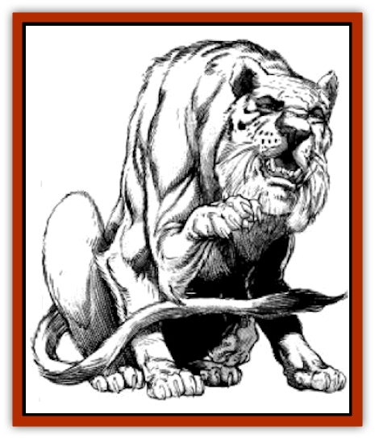

# Cantobele

| Statistic | **Cantobele** |
| --- | --- |
| **Activity Cycle:** | Any |
| **Alignment:** | Neutral evil |
| **Armor Class:** | 7 |
| **Climate/Terrain:** | Swamps and forests |
| **Damage/Attack:** | See below |
| **Diet:** | Carnivore |
| **Frequency:** | Rare |
| **Hit Dice:** | 2 to 4 |
| **Intelligence:** | Average to high (8-13) |
| **Magic Resistance:** | Nil |
| **Morale:** | Champion (15-16) |
| **Movement:** | 12 |
| **No. Appearing:** | 1 |
| **No. of Attacks:** | 8 |
| **Organization:** | Solitary |
| **Size:** | L (7-9' long) |
| **Special Attacks:** | Spell use |
| **Special Defenses:** | Immune to cold |
| **THAC0:** | 2 HD: 19 / 3 HD: 18 / 4 HD: 17 |
| **Treasure:** | All possible |
| **XP Value:** | 2 HD: 650 / 3 HD: 975 / 4 HD: 1,400 |

Cantobeles are large, heavily-muscled creatures that are sleek in the manner of the [[Cat_Great|great cats]]. A cantobele has a long, broad tail with very short fur, ending in a tuft of long, black hairs. The rest of the creature's body is covered with thick, double-coated fur, ranging in color from gray-white to tawny, depending on habitat and season. The adult cantobele changes color with the season for camouflage, but darker, more intense coloration denotes youth. The long mane of the cantobele matches its body and tail fur. A cantobele's eyes are startlingly human in appearance and display a great intelligence. The irises are brown or mauve.

Cantobeles are encountered in wilderness areas, particularly in swamps and forested ravines. A cantobele has a high-pitched, soft, feminine voice, and uses it effectively to lure prey and deceive hostile creatures. Hiding in underbrush, it employs its voice in combination with its innate ability of *ESP* (90 yard range) and *tongues*. Cantobeles hide from view until their prey is close enough to spring upon. The name of the creature derives from the strange, beautiful ringing sound, like the chorus of chiming bells, which the cantobele emits after making a kill.

**Combat:** Cantobeles fight with all three pairs of legs and with their powerful fangs. A cantobele's tail can also strike, but it is usually used for balance when the creature uses all its claws. Cantobeles prefer to spring upon opponents, knocking them flat and raking and biting before the victim can rise to protect itself.

When a cantobele attempts to knock an opponent off its feet, the victim must roll a successful Dexterity check with a -4 penalty to maintain balance. If the check fails, the victim falls, and the cantobele attacks with a +4 bonus with each of its attacks. The following chart lists the damage the cantobele causes according to its Hit Dice total.

| Hit Dice | Claw | Bite | Tail |
| --- | --- | --- | --- |
| 2 | 1-4 | 2-8 | 1-6 |
| 3 | 1-6 | 3-12 | 1-8 |
| 4 | 1-8 | 4-16 | 1-10 |

A cantobele can cast one *misdirection* spell per day. It commonly uses this spell to lure heavily armed foes away from its lair. It can cast one *ice storm* spell every 12 hours as well. When casting any of these spells, the cantobele can take no other action during that round.

Cantobeles are immune to cold-based attacks, including naturally occurring frigid weather. They have 110-foot infravision and eyes that filter out glare. Cantobeles are never blinded or dazzled by snow or bright lights. Their second eyelid continually filters out the intense light to protect their eyes.

Their claws and six-legged gait make them sure-footed on the slickest ice, in deep snow, or on tree boughs. Spells such as *grease* and *fumble* have no effect on them. They can climb any surface, except sheer walls and cliffs, at their normal movement rate. Sheer surfaces reduce their movement by one-half.

**Habitat/Society:** Cantobeles prefer to live in deserted and humid climes. They are most prevalent in the Impresk and Shalane Lake areas where the waters swamp the surrounding territories. They also live in the Rebban River area in vast numbers. Elsewhere, they are rarely seen, if ever. Cantobeles mate once every three years during early spring, becoming catatonic and dying if a mate is not found within two months of their breeding time. The male cantobele bears the young and cares for them for one year. A litter numbers between four and sixteen young, but five to eight (1d4 +4) is most common.

**Ecology:** Many cities near Shalane Lake have placed a bounty on the cantobele in recent years as a response to alleged man-eating tendencies. Cities such as Surke pay as much as 50 gold pieces for a verified kill. There is no limit to the bounty. Because such bounties exist, many sages fear the animal will become extinct. These same sages now offer a bounty of their own. They pay 65 gold pieces per cantobele if it is captured alive, so they can be placed in more deserted locations such as the Rifhake Lake in the center of the Great Rift.

---
## Discovery & Documentation

**Source Publication:** MC11 Forgotten Realms Appendix II (1991)
**Campaign Setting:** Advanced Dungeons & Dragons 2nd Edition
**Author(s):** Tim Beach, Tim Brown, William W. Connors, Dale Donovan, Ed Greenwood, Jeff Grubb, Bruce Heard, Slade Henson, Rob King, Colin McComb, Roger E. Moore, Bruce Nesmith, Jon Pickens, Jean Rabe, Dori Watry, Skip Williams

### Other Creatures Found in This Source Book
   * [[Alaghi|Alaghi]]
   * [[Alguduir|Alguduir]]
   * [[Beguiler|Beguiler]]
   * [[Bird_Toril|Bird (Toril)]]
   * [[Carapace|Carapace]]
   * [[Cat_Toril|Cat (Toril)]]
   * [[Chitine|Chitine]]
   * [[Cildabrin|Cildabrin]]
   * [[Dimensional_Warper|Dimensional Warper]]
   * [[Dragon_Deep|Dragon, Deep]]
   * [[Fachan_Toril|Fachan (Toril)]]
   * [[Fael|Fael]]
   * [[Feyr|Feyr]]
   * [[Firetail|Firetail]]
   * [[Frost|Frost]]
   * [[Gaund|Gaund]]
   * [[Gloomwing|Gloomwing]]
   * [[Golden_Ammonite|Golden Ammonite]]
   * [[Golem_Lightning|Golem, Lightning]]
   * [[Hamadryad|Hamadryad]]
   * [[Harrier|Harrier]]
   * [[Harrla|Harrla]]
   * [[Haun|Haun]]
   * [[Haundar|Haundar]]
   * [[Hendar|Hendar]]
   * [[Inquisitor|Inquisitor]]
   * [[Lhiannan_Shee|Lhiannan Shee]]
   * [[Loxo|Loxo]]
   * [[Manni|Manni]]
   * [[Manscorpion|Manscorpion]]
   * [[Mara|Mara]]
   * [[Morin|Morin]]
   * [[Naga_Dark|Naga, Dark]]
   * [[Orpsu|Orpsu]]
   * [[Plant_Carnivorous_Black_Willow|Plant, Carnivorous, Black Willow]]
   * [[Plant_Carnivorous_Toril|Plant, Carnivorous (Toril)]]
   * [[Plant_Dangerous_I|Plant, Dangerous I]]
   * [[Ring-Worm|Ring-Worm]]
   * [[Rohch|Rohch]]
   * [[Sand_Cat|Sand Cat]]
   * [[Saurial|Saurial]]
   * [[Sha'az|Sha'az]]
   * [[Silver_Dog|Silver Dog]]
   * [[Simpathetic|Simpathetic]]
   * [[Skuz|Skuz]]
   * [[Spider_Monkey|Spider, Monkey]]
   * [[Tren|Tren]]
