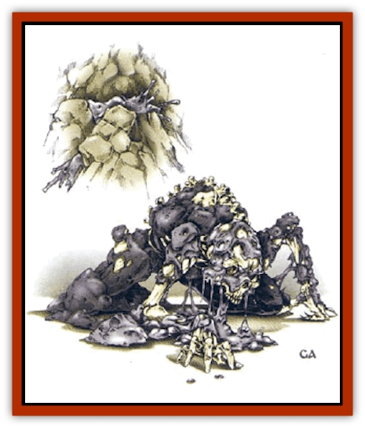

# Carapace

| Statistic | **Carapace** |
| --- | --- |
| **Activity Cycle:** | Any |
| **Alignment:** | Neutral |
| **Armor Class:** | 10 or special |
| **Climate/Terrain:** | Underdark |
| **Damage/Attack:** | 1d2 |
| **Diet:** | Carnivore, fungivore |
| **Frequency:** | Very rare |
| **Hit Dice:** | 1+1 to 2+2 |
| **Intelligence:** | Non- (0) |
| **Magic Resistance:** | Nil |
| **Morale:** | Unreliable (2-4) |
| **Movement:** | 1 |
| **No. Appearing:** | 1 |
| **No. of Attacks:** | 1 |
| **Organization:** | Solitary |
| **Size:** | S (1' diameter) |
| **Special Attacks:** | See below |
| **Special Defenses:** | See below |
| **THAC0:** | 19 |
| **Treasure:** | Nil |
| **XP Value:** | 175 |

Also called the *coffin shell creature*, a carapace is an aggressive, mobile [[Fungus|fungus]] native to the Underdark. It adapts itself on contact with almost any vertebrate creature, from reptiles to mammals to fish, creating a symbiotic exoskeleton. It does not attach itself to invertebrates, such as insects, spiders, or octopi. In its natural state, the carapace looks like a soft, gray spongy mass about a foot in diameter, though it can extend tendrils from its central mass to snare a host, then pull itself into contact with the host's body.

**Combat:** The carapace lies hidden in beds of other fungi or clings to cavern walls and ceilings. In its natural state, the carapace has an Armor Class of 10. Whenever the carapace successfully strikes a target, or is struck by the unprotected living flesh of a predator or attacker, it creates a sticky, gluey bond between the two creatures. Unless the fungus is dispatched within the next round, the bond solidifies, and the carapace begins to spread its mass out over the host's skin. Attacks that physically damage the spreading carapace inflict equal damage on the host creature, though it can be delayed without harm to the host by a *cure disease* spell.

If the carapace is not removed within a certain time that depends on the size of the host, it hardens into a protective hornlike shell that improves the host's Armor Class by 2 (for instance, a [[Snake|giant snake]] with AC 6 would become AC 4). The carapace can cover any size creature, given enough time, since it tranforms some of the host's mass as well as spreading its own. The process takes a single day for tiny creatures (size T), two days for small creatures (size S), four days for man-sized creatures (size M), a week to 10 days for large creatures (size L), at least two weeks for huge creatures (size H), and up to a month for gargantuan creatures (size G). When this process is complete, the host creature permanently loses one point of Constitution. The host's joints are not stiffened, as the carapace adapts to the host's body structure.

Once the host is entirely covered, the carapace cannot be removed without damaging the host's body. At this point the carapace has become fully integrated with the host's skin and has no independent existence. A *cure disease* spell is no longer effective against it. After the carapace has covered the entire skin of the host, the host body becomes noticeably thinner and paler; this is when many of the host's companions first notice any change. The hardened carapace gives the host some benefits: it can regenerate the host at 1 hit point per round for up to a day in exchange for another point of Constitution. It will do so to keep its host at at least half the host's full hit points. (If the total number of hit points regenerated by the carapace in one day is less than or equal to the host's Constitution, no Constitution is lost if the number of regenerated hit points is less than is rolled on 3d6).

The carapace absorbs poisons and mental attacks, making the host immune to poisons, mind-affecting spells, and psionic attacks. If the host is psionic, the carapace absorbs the host's PSPs as well. A hardened carapace is immune to fire, further protecting the host.

**Habitat/Society:** The carapace, in its soft form, uses its limited mobility to move about searching for hosts. It can crawl on walls and ceilings and attach itself to almost any surface. It is attracted by any heat and motion, and avoids direct sunlight and negative energy. When not attached to a host, the soft form of the carapace can subsist for months on a diet of less-dangerous fungus and slime-molds. When such fungi are abundant, a soft carapace slowly grows to the 2+2 HD size, then divides into two 1+1 HD carapaces. In its soft state, the carapace is vulnerable to spells effective against fungi, such as the 7th-level priest spell *sunray*, and to subterranean creatures that eat fungi, such as [[Slug_Giant|giant slugs]], [[Worm|purple worms]], and [[Burbur|burburs]].

A hardened carapace slowly leeches away the bones of the host, becoming the host's exoskeleton in a process that is not particularly painful. As the carapace slowly fuses with the host's spinal and brain tissue, the host's alignment shifts irreversibly to neutral, though the host's lawful or chaotic tendencies are unaffected.

Once the host dies, the host tissue within the carapace is consumed by the growth of new spongy carapace fungus. When the host's body is entirely consumed (which may take several weeks) the dead outer carapace splits, revealing one or more new soft carapaces. The host body breeds a new carapace per 3 feet of height or body length.

**Ecology:** The carapace is a symbiont, thought to have been created by a slime-lord of the [[Tanar'ri_General_Information|tanar'ri]] long ago. Only the most desperate Underdark creature might join with a carapace, but slave-warriors among the [[Dwarf_Derro|derro]] and [[Aboleth|aboleths]] are sometimes forced to become their hosts.

---
## Discovery & Documentation

**Source Publication:** MC11 Forgotten Realms Appendix II (1991)
**Campaign Setting:** Advanced Dungeons & Dragons 2nd Edition
**Author(s):** Tim Beach, Tim Brown, William W. Connors, Dale Donovan, Ed Greenwood, Jeff Grubb, Bruce Heard, Slade Henson, Rob King, Colin McComb, Roger E. Moore, Bruce Nesmith, Jon Pickens, Jean Rabe, Dori Watry, Skip Williams

### Other Creatures Found in This Source Book
   * [[Alaghi|Alaghi]]
   * [[Alguduir|Alguduir]]
   * [[Beguiler|Beguiler]]
   * [[Bird_Toril|Bird (Toril)]]
   * [[Cantobele|Cantobele]]
   * [[Cat_Toril|Cat (Toril)]]
   * [[Chitine|Chitine]]
   * [[Cildabrin|Cildabrin]]
   * [[Dimensional_Warper|Dimensional Warper]]
   * [[Dragon_Deep|Dragon, Deep]]
   * [[Fachan_Toril|Fachan (Toril)]]
   * [[Fael|Fael]]
   * [[Feyr|Feyr]]
   * [[Firetail|Firetail]]
   * [[Frost|Frost]]
   * [[Gaund|Gaund]]
   * [[Gloomwing|Gloomwing]]
   * [[Golden_Ammonite|Golden Ammonite]]
   * [[Golem_Lightning|Golem, Lightning]]
   * [[Hamadryad|Hamadryad]]
   * [[Harrier|Harrier]]
   * [[Harrla|Harrla]]
   * [[Haun|Haun]]
   * [[Haundar|Haundar]]
   * [[Hendar|Hendar]]
   * [[Inquisitor|Inquisitor]]
   * [[Lhiannan_Shee|Lhiannan Shee]]
   * [[Loxo|Loxo]]
   * [[Manni|Manni]]
   * [[Manscorpion|Manscorpion]]
   * [[Mara|Mara]]
   * [[Morin|Morin]]
   * [[Naga_Dark|Naga, Dark]]
   * [[Orpsu|Orpsu]]
   * [[Plant_Carnivorous_Black_Willow|Plant, Carnivorous, Black Willow]]
   * [[Plant_Carnivorous_Toril|Plant, Carnivorous (Toril)]]
   * [[Plant_Dangerous_I|Plant, Dangerous I]]
   * [[Ring-Worm|Ring-Worm]]
   * [[Rohch|Rohch]]
   * [[Sand_Cat|Sand Cat]]
   * [[Saurial|Saurial]]
   * [[Sha'az|Sha'az]]
   * [[Silver_Dog|Silver Dog]]
   * [[Simpathetic|Simpathetic]]
   * [[Skuz|Skuz]]
   * [[Spider_Monkey|Spider, Monkey]]
   * [[Tren|Tren]]
