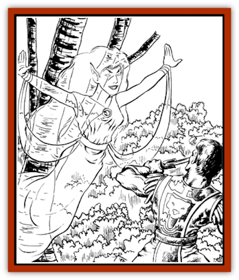

# Cariad Ysbryd

| Statistic | **Cariad Ysbryd** |
| --- | --- |
| **Activity Cycle:** | Any |
| **Alignment:** | Neutral good |
| **Armor Class:** | 0 |
| **Climate/Terrain:** | Temperate wilderness |
| **Damage/Attack:** | 1-4 |
| **Diet:** | None |
| **Frequency:** | Very rare |
| **Hit Dice:** | 5 |
| **Intelligence:** | Exceptional (15-16) |
| **Magic Resistance:** | 50% |
| **Morale:** | Fanatic (17-18) |
| **Movement:** | 18 |
| **No. Appearing:** | 1 |
| **No. of Attacks:** | 1 |
| **Organization:** | Solitary |
| **Size:** | M (5-6' tall) |
| **Special Attacks:** | Singing |
| **Special Defenses:** | See below |
| **THAC0:** | 15 |
| **Treasure:** | O,R |
| **XP Value:** | 1,400 (for neutral or evil characters only; good characters lose the same experience for slaying a cariad ysbryd) |

A cariad ysbryd, or "ghost lover", is the spirit of a decidedly good female (usually sylvan) [[Elf|elf]] who has chosen to remain among the living after death so that she may continue to perform good deeds. While technically undead, a cariad ysbryd loves all living things and harms only those who do not share her love of life. Accordingly, the only things she is capable of truly hating are other undead.

A cariad ysbryd appears in undeath just as she did in life, only more beautiful. Dressed in her finest clothes, she glows faintly and bears a serene expression even when in combat. One can hear a cariad ysbryd before one sees her, for she constantly sings a beautiful, wordless song.

**Combat:** A cariad ysbryd would rather prevent combat than win it, a philosophy her song enforces on her surroundings. The sound causes all intelligent creatures within hearing (50' radius) not currently engaged in combat to make a saving throw vs. spells or become "becalmed" with feelings of peace and contentment that causes them to end all hostilities for 1-12 rounds. When the targets recover, they have to continue making saving throws every round if they remain within the area of the song's effect.

People affected by the cariad ysbryd's song will not be able to attack even if attacked. They can perform actions or employ magical items and spells in self-defense, but they cannot initiate violence while becalmed.

If a cariad ysbryd is forced into combat, she has two weapons. Her preferred weapon is her touch, which causes 1-4 hp damage to a hostile living creature (a definition not limited to those attacking the cariad ysbryd) or to undead of any disposition.

Her second weapon is a variation on her continuous song. Usable once per day, this special tune causes all evil creatures in a 30' radius to suffer 3d6 hp damage from the frightening beauty of the song if they fail saving throws vs. death magic. The tonal changes of the song releases anyone currently becalmed by her normal song, but after this use of her voice to attack, her song returns to its normal form, and those within range must once again make saving throws against its calming power.

Unfortunately, the cariad ysbryd is loathe to use the harmful version of her song because it is linked to another of her abilities. Once per day, she can change the tone of her song so that, in addition to its calming properties, it combines the effects of *remove fear*, *neutralize poison* and *heal* spells on all within 30'. This power to heal or harm with her song is intimately connected; if she has used the power to harm that day, it cannot heal, and if she has used it to heal, it cannot harm. Under most circumstances, she will try to save her voice for its healing properties instead of squandering it on violence.

The worst enemy of a cariad ysbryd is
her evil counterpart, the groaning spirit or [[Banshee|banshee]] that is the spirit of an evil female elf. If one encounters the other, she will abandon all other activities in order to devote every effort towards destroying her opposite. When a cariad ysbryd fights a banshee, her normal song changes to a horrific shriek (entirely out of sorts with her still-serene visage), and she uses her killing song without hesitation, doing double damage to the banshee if it fails the saving throw.

A cariad ysbryd can be hit only by +1 or better weapons (or by monsters of 4+1 or more hit dice), and is immune to the effects of *charm*, *sleep*, *hold*, and cold/electricity-based spells. Unholy water splashed on them causes 1-4 hp damage, and they can be killed by a *dispel good* spell. A cariad ysbryd can be turned (but not commanded) by an evil cleric as if she were a spectre, but good clerics cannot affect one at all. Although a cariad ysbryd isn't evil, other spells that specifically target undead, such as *invisibility to undead*, have full effect.

**Habitat/Society:** As an undead creature, the cariad ysbryd has no society. A cariad ysbryd has no grandiose plan to make the world a better place; she is content to improve the conditions of the area she calls home, an area five miles in diameter around the spot where she died.

A cariad ysbryd can sense living creatures anywhere in the area she protects, and if strangers enter the area she knows of it immediately. Mere entrance to the area is not enough to force a reaction from her, but if new entrants harm any living thing within that area (including each other), or if one of them is already afflicted or wounded in some way, she makes her way to them while singing her song to halt those who may react in fear and anger, and to heal wounded people.

A cariad ysbryd doesn't prize treasure, but some creatures make gifts for her that she will not refuse. Thus, one will find small bags of coins, statuary, and other valuables scattered around her demesne without rhyme or reason.

**Ecology:** Because a cariad ysbryd's song keeps her vicinity free of the anger and evil of intelligent creatures, her lair has the appearance of an untouched wilderness, even if there are humans or other higher creatures dwelling in her area. While the natural cycle of life and death (including the violent but necessary acts of predators) still takes place there, it cannot be intruded on by the darker emotions of intelligent creatures.

Humanoids, demihumans, and men who chose to live in cariad ysbryd-maintained areas could prosper as well. The ease of living in her presence for a week or more serves as a restorative to a man's spirit. Under constant, willing exposure to a cariad ysbryd's song, intelligent creatures heal from fatigue, wounds, and illnesses at twice their normal rate.

In addition certain artists gain particular benefits from associating with a cariad ysbyrd, as her singing serves as inspiration to singers, poets and bards. Spending 1-6 months in the company of a cariad ysbyrd gives a bard a permanent bonus (equivalent to an extra level of ability) when using his voice for special effect such as inspiring his friends or countering the effects of a [[Harpy|harpy's]] song.

---
## Discovery & Documentation

**Source Publication:** Dragon185 (1992)
**Campaign Setting:** Dragon Magazine
**Author(s):** Timothy B. Brown, Brom

### Other Creatures Found in This Source Book
   * [[Watroach|Watroach]]
