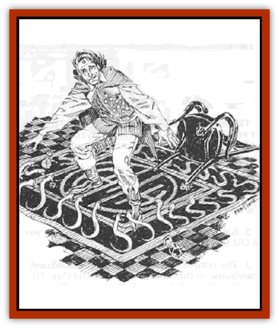

# Carpet Snake

| Statistic | **Carpet Snake** |
| --- | --- |
| **Activity Cycle:** | Any |
| **Alignment:** | Chaotic evil |
| **Armor Class:** | 5 |
| **Climate/Terrain:** | Any |
| **Damage/Attack:** | 1-3 |
| **Diet:** | Carnivore |
| **Frequency:** | Very rare |
| **Hit Dice:** | 3 |
| **Intelligence:** | Semi (3) |
| **Magic Resistance:** | Nil |
| **Morale:** | Average (8) |
| **Movement:** | 15 |
| **No. Appearing:** | 1-20 |
| **No. of Attacks:** | 1 |
| **Organization:** | Solitary |
| **Size:** | S (4-6' long) |
| **Special Attacks:** | Class B Poison |
| **Special Defenses:** | See below |
| **THAC0:** | 17 |
| **Treasure:** | Nil |
| **XP Value:** | 175 |

Carpet [[Snake|snakes]] are a most unusual and frightening monster. They can be especially deadly due to their poison and method of attack. Victims can find themselves completely surrounded by these snakes before realizing they are under attack.

These serpents spend most of their lives in a dormant state. They are able to change their physical composition in order to blend with a rug or carpet. In this state, they can exist up to one year without feeding. They are completely dormant and do not eat, sleep, or breathe. Any food that has been ingested is absorbed slowly, sustaining them over a long period. A small [[Rat|rat]] can sustain a carpet snake up to six months.

Carpet snakes become active on command of a master or when sensing the presence of prey. They can be taught to recognize up to five masters and four simple commands. They will never attack their masters, and will generally attack anything that moves unless halted by a master's command.

**Combat:** When a carpet snake senses motion or vibrations caused by any creature walking on its carpet, it begins to take shape in 2-4 rounds. It can sense the presence of a master and will not form unless commanded to do so. The carpet will first appear to writhe on the second round after the carpet was initially walked upon. At first, victims may guess this to be an hallucination or illusion, but as the snakes begin to take shape, they will realize the danger at hand (at foot, actually).

The snakes require two rounds to fully form. During this stage, they are treated as AC 10.

If an opponent is small enough for a carpet snake to swallow, it generally fights to the death in hopes of a meal. With larger opponents, carpet snakes return to carpet-form if reduced to 3 hp.

A carpet snake may return to carpet-form in one round. It cannot be wounded in this form. Even if the carpet is slashed, the snake may reform. If the carpet is cut and the pieces are carried more than 20 yards apart, or the carpet is burned, the snakes cannot form.

If an attempt is made to sever a snake into two pieces, the attempt is not successful unless the blow inflicts damage equal or greater than half the snake's total hit points. In such a case, the carpet snake would immediately revert to carpet form and may reform in 24 hours.

Carpet snakes that are reduced to 0 hp are killed. Those that revert to carpet form to escape cannot reform until 24 hours have elapsed.

**Habitat/Society:** Carpet snakes were originally created by magical means, but are able to reproduce as normal snakes. When a clutch of eggs is laid, the female snake generally remains in snake form to guard them. Most breeding takes place in controlled environments, such as a nursery established by an evil being. When carpet snakes breed spontaneously, their masters generally move the female and her eggs to protected quarters.

Carpet snakes will live in any rug ar carpet, or, if nothing suitable is available, may live in clothing or other fabric. They appear to be woven dirctly into the article, and close examination reveals nothing of their true nature.

If a master is present, carpet snakes will allow themselves to be rolled up or folded in a rug without taking shape. The rug and snakes can be transported in this manner. If a master orders an attack in this state, the snakes form normally but require 1-2 rounds to crawl from the rug.

**Ecology:** Carpet snakes are always red in color with black eyes. In carpet form, they may be coiled, twisted, or straight. They appear to be simply part of the fabric, and maintain whatever shape they held when they converted to carpet form.

If a carpet snake is killed, it collapses into a pile of fibrous red dust. The dust may not reform and is useless. Carpet snakes have a lifespan of up to 50 years.

---
## Discovery & Documentation

**Source Publication:** WGA1 Falcon's Revenge (1989)
**Campaign Setting:** Greyhawk
**Author(s):** Richard W and Anne Brown

### Other Creatures Found in This Source Book
   * [[Grythok|Grythok]]
   * [[Scryxull|Scryxull]]
