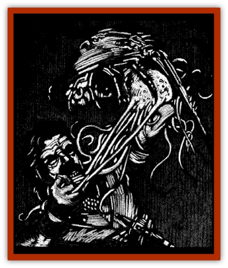

# Carrion Stalker

| Statistic | **Carrion Stalker** |
| --- | --- |
| **Activity Cycle:** | Any |
| **Alignment:** | Neutral |
| **Armor Class:** | 2 |
| **Climate/Terrain:** | Any subterranean |
| **Damage/Attack:** | 1d6 or special |
| **Diet:** | Carnivore |
| **Frequency:** | Uncommon |
| **Hit Dice:** | 4 |
| **Intelligence:** | Non- (0) |
| **Magic Resistance:** | Nil |
| **Morale:** | Average (9-10) |
| **Movement:** | 9 |
| **No. Appearing:** | 1d6 |
| **No. of Attacks:** | 1 or 1d4+5 |
| **Organization:** | Solitary |
| **Size:** | T (12&rdquo; long) |
| **Special Attacks:** | Paralysis, spawning |
| **Special Defenses:** | Nil |
| **THAC0:** | 17 |
| **Treasure:** | (B) |
| **XP Value:** | 650 |

An encounter with a carrion stalker may well be the most horrifying experience a traveler can have. These ghastly creatures actually live within decaying bodies and lie in wait for a bypasses to serve as a new nest for their disgusting larvae.

The carrion stalker looks something like a horseshoe crab but also sports the tentacles of a jellyfish. They are occasionally seen scuttling about dank mausoleums and moldering cemeteries with their vile tendrils trailing behind them. Carrion stalkers grow to 1' in length at maturity. Their fine but strong tendrils can grow to lengths of 15 feet. They range in color from glossy black to bone white, but are most commonly a putrid combination of gray and pink.

Carrion stalkers are not intelligent and act only upon their instinctive needs to feed and reproduce. As such, they have no language, although they do produce a piercing squeal when attacking unwary travelers.

**Combat:** Carrion stalkers spend most of their wretched lives lurking within the decaying bodies of the dead. When a warm-blooded creature comes within 15 feet of these havens, however, they attack with blinding speed. Because of their speed and the difficulty in spotting them, stalkers impose a -2 penalty on their victims' surprise and initiative rolls.

A carrion stalker attack begins when it lashes out with a storm of eight slender tendrils. Each of these makes a separate Attack Roll and is covered with painful stingers that inflict 1d4 points of damage. If even a single tendril scores a hit, the victim must make a saving throw vs. paralysis or become entangled. A -1 penalty is imposed on this roll for every tentacle that succeeded in hitting the target.

Once caught by these leathery cords, the victim (or a would-be rescuer) must make a bend bars/lift gates roll to escape. While caught in the painful embrace of these stinging members, the victim will suffer an additional point of damage per tendril each round. Tentacles that failed to grapple the target in previous rounds will continue to strike at the victim until either all eight are secured or the prey has broken free.

Once grappled. the helpless victim is dragged toward the corpse at a rate of 3 feet per round. As soon as the prey is within 3 feet, a cloud of larvae bursts from the stalker. Between 4 and 9 (1d6+3) of the disgusting grubs will land on the victim and begin to burrow into his flesh on the next round. The young carrion stalkers are AC 8, have l hit point, and do 1 point of damage per round to the victim until they are destroyed. Anyone working to free an entangled victim must make a saving throw vs. breath weapon or be infested with 1d4 grubs himself.

Adult and larval carrion stalkers are immune to all manner of poisons or disease, but can be injured or destroyed by most other forms of attack. It is worth noting, however, that the nature of these creatures makes it hard to attack them without injuring their victim. Because of this, damage from most attacks is divided evenly between the carrion stalker and its victim.

**Habitat/Society:** Carrion stalkers appear to have no social order although they are often found nesting near one another. The larva that infest a host body will ultimately kill each other in competition for food. Thus, only two or three will grow to maturity within the corpse. Carrion stalkers are sexless and any adult is capable of generating offspring every 2d4 weeks.

**Ecology:** Carrion stalkers are parasites who survive by devouring the bodies of their hosts, even after its death. They breed and die rapidly, surviving just long enough to spawn a few times.

---
## Discovery & Documentation

**Source Publication:** Ravenloft Appendix III (1991)
**Campaign Setting:** Ravenloft
**Author(s):** Kirk Botulla

### Other Creatures Found in This Source Book
   * [[Akikage|Akikage]]
   * [[Animator_Common|Animator, Common]]
   * [[Animator_Greater|Animator, Greater]]
   * [[Animator_Minor|Animator, Minor]]
   * [[Animator_General_Information|Animator, General Information]]
   * [[Bakhna_Rakhna|Bakhna Rakhna]]
   * [[Baobhan_Sith|Baobhan Sith]]
   * [[Beetle_Scarab|Beetle, Scarab]]
   * [[Boneless|Boneless]]
   * [[Boowray|Boowray]]
   * [[Bruja|Bruja]]
   * [[Carrionette|Carrionette]]
   * [[Cat_Midnight|Cat, Midnight]]
   * [[Cat_Skeletal|Cat, Skeletal]]
   * [[Cloaker_Resplendent|Cloaker, Resplendent]]
   * [[Cloaker_Shadow|Cloaker, Shadow]]
   * [[Cloaker_Undead|Cloaker, Undead]]
   * [[Corpse_Candle|Corpse Candle]]
   * [[Death's_Head_Tree|Death's Head Tree]]
   * [[Doppelganger_Ravenloft|Doppelganger (Ravenloft)]]
   * [[Familiar_Pseudo-|Familiar, Pseudo-]]
   * [[Familiar_Undead|Familiar, Undead]]
   * [[Feathered_Serpent|Feathered Serpent]]
   * [[Fenhound|Fenhound]]
   * [[Figurine_Ceramic|Figurine, Ceramic]]
   * [[Figurine_Crystal|Figurine, Crystal]]
   * [[Figurine_Ivory|Figurine, Ivory]]
   * [[Figurine_Obsidian|Figurine, Obsidian]]
   * [[Figurine_Porcelain|Figurine, Porcelain]]
   * [[Figurine_General_Information|Figurine, General Information]]
   * [[Fleas_of_Madness|Fleas of Madness]]
   * [[Furies|Furies]]
   * [[Geist|Geist]]
   * [[Ghost_Animal|Ghost, Animal]]
   * [[Golem_Flesh_Ravenloft|Golem, Flesh (Ravenloft)]]
   * [[Golem_Mist_Ravenloft|Golem, Mist (Ravenloft)]]
   * [[Golem_Wax_Ravenloft|Golem, Wax (Ravenloft)]]
   * [[Gremishka|Gremishka]]
   * [[Hag_Spectral|Hag, Spectral]]
   * [[Head_Hunter|Head Hunter]]
   * [[Hearth_Fiend|Hearth Fiend]]
   * [[Hebi-No-Onna|Hebi-No-Onna]]
   * [[Hound_Phantom|Hound, Phantom]]
   * [[Hound_Skeletal|Hound, Skeletal]]
   * [[Imp_Wishing|Imp, Wishing]]
   * [[Ivy_Crawling|Ivy, Crawling]]
   * [[Jack_Frost|Jack Frost]]
   * [[Jolly_Roger|Jolly Roger]]
   * [[Kizoku|Kizoku]]
   * [[Lashweed|Lashweed]]
   * [[Leech_Magical|Leech, Magical]]
   * [[Leech_Psionic|Leech, Psionic]]
   * [[Lich_Defiler|Lich, Defiler]]
   * [[Lich_Drow|Lich, Drow]]
   * [[Lich_Elemental|Lich, Elemental]]
   * [[Lich_Psionic|Lich, Psionic]]
   * [[Living_Tattoo|Living Tattoo]]
   * [[Lycanthrope_Loup-garou|Lycanthrope, Loup-garou]]
   * [[Lycanthrope_Werejackal|Lycanthrope, Werejackal]]
   * [[Lycanthrope_Werejaguar_Ravenloft|Lycanthrope, Werejaguar (Ravenloft)]]
   * [[Lycanthrope_Wereleopard|Lycanthrope, Wereleopard]]
   * [[Lycanthrope_Wereray|Lycanthrope, Wereray]]
   * [[Mist_Ferryman|Mist Ferryman]]
   * [[Moor_Man|Moor Man]]
   * [[Obedient|Obedient]]
   * [[Odem|Odem]]
   * [[Paka|Paka]]
   * [[Plant_Blood_Rose|Plant, Blood Rose]]
   * [[Plant_Fearweed|Plant, Fearweed]]
   * [[Radiant_Spirit|Radiant Spirit]]
   * [[Recluse|Recluse]]
   * [[Remnant_Aquatic|Remnant, Aquatic]]
   * [[Rushlight|Rushlight]]
   * [[Sea_Spawn_Master|Sea Spawn, Master]]
   * [[Sea_Spawn_Minion|Sea Spawn, Minion]]
   * [[Shadow_Asp|Shadow Asp]]
   * [[Shattered_Brethren|Shattered Brethren]]
   * [[Skeleton_Archer|Skeleton, Archer]]
   * [[Skeleton_Insectoid|Skeleton, Insectoid]]
   * [[Skin_Thief|Skin Thief]]
   * [[Spirit_Psionic|Spirit, Psionic]]
   * [[Strahd_Skeleton|Strahd Skeleton]]
   * [[Strahd_Zombie|Strahd Zombie]]
   * [[Unicorn_Shadow|Unicorn, Shadow]]
   * [[Vampire_Drow|Vampire, Drow]]
   * [[Vampire_Nosferatu|Vampire, Nosferatu]]
   * [[Vampire_Oriental|Vampire, Oriental]]
   * [[Virus_General_Information|Virus, General Information]]
   * [[Virus_I|Virus I]]
   * [[Virus_II|Virus II]]
   * [[Virus_III|Virus III]]
   * [[Vorlog|Vorlog]]
   * [[Will_O'Dawn|Will O'Dawn]]
   * [[Will_O'Deep|Will O'Deep]]
   * [[Will_O'Mist|Will O'Mist]]
   * [[Will_O'Sea|Will O'Sea]]
   * [[Zombie_Cannibal|Zombie, Cannibal]]
   * [[Zombie_Desert|Zombie, Desert]]
   * [[Zombie_Wolf|Zombie Wolf]]
   * [[Zombie_Fog|Zombie Fog]]
