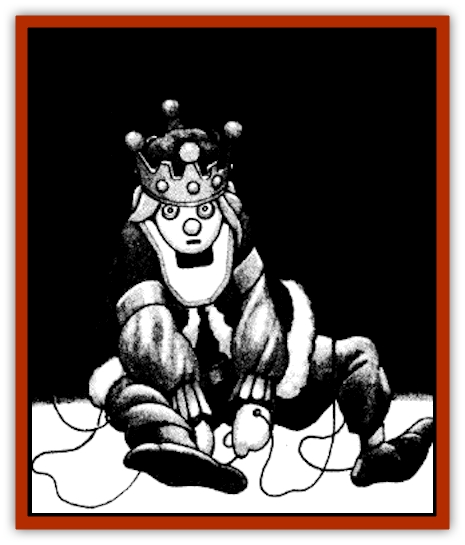

# Carrionette

| Statistic | **Carrionette** |
| --- | --- |
| **Activity Cycle:** | Any |
| **Alignment:** | Chaotic evil |
| **Armor Class:** | 6 |
| **Climate/Terrain:** | Odiare |
| **Damage/Attack:** | 1 point |
| **Diet:** | None |
| **Frequency:** | Very rare |
| **Hit Dice:** | 2 |
| **Intelligence:** | Average (8-10) |
| **Magic Resistance:** | Nil |
| **Morale:** | Fearless (19-20) |
| **Movement:** | 6 |
| **No. Appearing:** | 1 or 2d4 |
| **No. of Attacks:** | 1 |
| **Organization:** | Solitary or pack |
| **Size:** | T (6&rdquo; to 2' tall) |
| **Special Attacks:** | Paralyzation and domination |
| **Special Defenses:** | See below |
| **THAC0:** | 19 |
| **Treasure:** | Nil |
| **XP Value:** | 975 |

Easily mistaken for a common toy, the carrionette is as foul and sinister a creature as one will find in the Demiplane of Dread. Its sharp needles literally paralyze men with fear.

Carrionettes are [[Golem_III|living, animated puppets]] or marionettes. They are essentially wooden dolls, painted and clothed, which have come to life. All of their limbs are jointed and have small holes for a puppeteer's strings. Carrionettes vary in height from 6 inches to 2 feet. They can look like anything, from clowns and knights to farm animals or monsters. Most, however, look like people.

Carrionettes can speak the favored language of their creator as well as any tongue appropriate to their shape. For example, a carrionette in the image of a drow would be able to speak the language of those sinister elves. The voice of a carrionette is hollow and shrill.

**Combat:** Carrionettes must have miniature, sharp weapons to attack with and cause damage; they cannot use blunt weapons. They can only do 1 point of damage per attack and the nature of its weapon does not affect how much damage the carrionette does. Typical weapons for carrionettes are large sewing needles, small kitchen knives, razor blades, and the like.

Each carrionette carries a small quiver of ten silver needles. They can throw these needles like spears, aiming at a leg or an arm. The needle has a maximum range of 15 feet and trails a magical silver cord attached to the carrionette's hand. A hit by the needle does no damage but requires the victim to make a saving throw vs. paralyzation. If the roll fails, that limb becomes paralyzed and the silver cord becomes invisible. A character who has a single paralyzed leg moves at half speed. The needle itself is not magical. The magical energy cord is created by the carrionette itself. If the character can remove the needle, he regains use of that limb in 1d4 rounds.

An immobilized character, whether paralyzed, asleep, or unconscious, is particularly vulnerable to the carrionette. The evil puppet can drive a needle into the base of the character's neck. which has the effect of transferring the essence of the carrionette into the person and vice versa. The person inhabiting the doll's body is inanimate for a full hour after the transferral. The carrionette in the person's body is unconscious for only a round, after which it can remove any and all needles stuck in its new body.

The carrionette has two other special abilities. It can climb walls like a thief, with an 85% chance of success. This chance increases to 95% if the puppet can use a string and needle or other aid. Secondly. the carrionette is able to employ a *ventriloquism* spell at will.

As one might expect, carrionettes are immune to poison, cold, electricity, and all mind-affecting spells. A *warp wood* spell instantly destroys one of these creatures.

The person in the carrionette's body need not give up all hope of rescue, for he can recover his normal body with effort. The carionette cannot destroy the doll body, for that would kill its own essence as well as the spirit of the person trapped in it. Therefore, the carrionette tends to lock up its former body or send it far away. To return things to normal, a silver needle must be driven into the live body (it does no damage). The doll body must hold either the needle or a silver wire no more than 15 feet long attached to the needle. When this is done, the doll's essence is instantly returned to its body, which remains inert for an hour. The person's essence is returned to his body and is active again in a single round.

**Habitat/Society:** Carrionettes are parasites that live off humans and human society. They tend to hide in plain sight, such as in children's toy rooms, toy shops, theaters, or other places where marionettes and puppets are not unusual. They can remain inanimate for extremely long periods of time, until they find a reason to exert themselves.

Carrionettes are driven by a single desire: to get a host. They desperately want to have a living body. Usually they operate in packs to drag down the bodies of the living, but they are known to operate alone. Carrionettes have no social structure. They do not interact with each other except when in a pack. Once a carrionette has a human body, it ignores other carrionettes, though it is capable of detecting their presence.

**Ecology:** A carrionette can be made of almost anything. Among the most common materials used are wood, straw, ceramic, cloth, and tin. For game purposes they are all treated the same. It takes a month to craft the carrionette body, something only a dedicated craftsman can do.

---
## Discovery & Documentation

**Source Publication:** Ravenloft Appendix III (1991)
**Campaign Setting:** Ravenloft
**Author(s):** Kirk Botulla

### Other Creatures Found in This Source Book
   * [[Akikage|Akikage]]
   * [[Animator_Common|Animator, Common]]
   * [[Animator_Greater|Animator, Greater]]
   * [[Animator_Minor|Animator, Minor]]
   * [[Animator_General_Information|Animator, General Information]]
   * [[Bakhna_Rakhna|Bakhna Rakhna]]
   * [[Baobhan_Sith|Baobhan Sith]]
   * [[Beetle_Scarab|Beetle, Scarab]]
   * [[Boneless|Boneless]]
   * [[Boowray|Boowray]]
   * [[Bruja|Bruja]]
   * [[Carrion_Stalker|Carrion Stalker]]
   * [[Cat_Midnight|Cat, Midnight]]
   * [[Cat_Skeletal|Cat, Skeletal]]
   * [[Cloaker_Resplendent|Cloaker, Resplendent]]
   * [[Cloaker_Shadow|Cloaker, Shadow]]
   * [[Cloaker_Undead|Cloaker, Undead]]
   * [[Corpse_Candle|Corpse Candle]]
   * [[Death's_Head_Tree|Death's Head Tree]]
   * [[Doppelganger_Ravenloft|Doppelganger (Ravenloft)]]
   * [[Familiar_Pseudo-|Familiar, Pseudo-]]
   * [[Familiar_Undead|Familiar, Undead]]
   * [[Feathered_Serpent|Feathered Serpent]]
   * [[Fenhound|Fenhound]]
   * [[Figurine_Ceramic|Figurine, Ceramic]]
   * [[Figurine_Crystal|Figurine, Crystal]]
   * [[Figurine_Ivory|Figurine, Ivory]]
   * [[Figurine_Obsidian|Figurine, Obsidian]]
   * [[Figurine_Porcelain|Figurine, Porcelain]]
   * [[Figurine_General_Information|Figurine, General Information]]
   * [[Fleas_of_Madness|Fleas of Madness]]
   * [[Furies|Furies]]
   * [[Geist|Geist]]
   * [[Ghost_Animal|Ghost, Animal]]
   * [[Golem_Flesh_Ravenloft|Golem, Flesh (Ravenloft)]]
   * [[Golem_Mist_Ravenloft|Golem, Mist (Ravenloft)]]
   * [[Golem_Wax_Ravenloft|Golem, Wax (Ravenloft)]]
   * [[Gremishka|Gremishka]]
   * [[Hag_Spectral|Hag, Spectral]]
   * [[Head_Hunter|Head Hunter]]
   * [[Hearth_Fiend|Hearth Fiend]]
   * [[Hebi-No-Onna|Hebi-No-Onna]]
   * [[Hound_Phantom|Hound, Phantom]]
   * [[Hound_Skeletal|Hound, Skeletal]]
   * [[Imp_Wishing|Imp, Wishing]]
   * [[Ivy_Crawling|Ivy, Crawling]]
   * [[Jack_Frost|Jack Frost]]
   * [[Jolly_Roger|Jolly Roger]]
   * [[Kizoku|Kizoku]]
   * [[Lashweed|Lashweed]]
   * [[Leech_Magical|Leech, Magical]]
   * [[Leech_Psionic|Leech, Psionic]]
   * [[Lich_Defiler|Lich, Defiler]]
   * [[Lich_Drow|Lich, Drow]]
   * [[Lich_Elemental|Lich, Elemental]]
   * [[Lich_Psionic|Lich, Psionic]]
   * [[Living_Tattoo|Living Tattoo]]
   * [[Lycanthrope_Loup-garou|Lycanthrope, Loup-garou]]
   * [[Lycanthrope_Werejackal|Lycanthrope, Werejackal]]
   * [[Lycanthrope_Werejaguar_Ravenloft|Lycanthrope, Werejaguar (Ravenloft)]]
   * [[Lycanthrope_Wereleopard|Lycanthrope, Wereleopard]]
   * [[Lycanthrope_Wereray|Lycanthrope, Wereray]]
   * [[Mist_Ferryman|Mist Ferryman]]
   * [[Moor_Man|Moor Man]]
   * [[Obedient|Obedient]]
   * [[Odem|Odem]]
   * [[Paka|Paka]]
   * [[Plant_Blood_Rose|Plant, Blood Rose]]
   * [[Plant_Fearweed|Plant, Fearweed]]
   * [[Radiant_Spirit|Radiant Spirit]]
   * [[Recluse|Recluse]]
   * [[Remnant_Aquatic|Remnant, Aquatic]]
   * [[Rushlight|Rushlight]]
   * [[Sea_Spawn_Master|Sea Spawn, Master]]
   * [[Sea_Spawn_Minion|Sea Spawn, Minion]]
   * [[Shadow_Asp|Shadow Asp]]
   * [[Shattered_Brethren|Shattered Brethren]]
   * [[Skeleton_Archer|Skeleton, Archer]]
   * [[Skeleton_Insectoid|Skeleton, Insectoid]]
   * [[Skin_Thief|Skin Thief]]
   * [[Spirit_Psionic|Spirit, Psionic]]
   * [[Strahd_Skeleton|Strahd Skeleton]]
   * [[Strahd_Zombie|Strahd Zombie]]
   * [[Unicorn_Shadow|Unicorn, Shadow]]
   * [[Vampire_Drow|Vampire, Drow]]
   * [[Vampire_Nosferatu|Vampire, Nosferatu]]
   * [[Vampire_Oriental|Vampire, Oriental]]
   * [[Virus_General_Information|Virus, General Information]]
   * [[Virus_I|Virus I]]
   * [[Virus_II|Virus II]]
   * [[Virus_III|Virus III]]
   * [[Vorlog|Vorlog]]
   * [[Will_O'Dawn|Will O'Dawn]]
   * [[Will_O'Deep|Will O'Deep]]
   * [[Will_O'Mist|Will O'Mist]]
   * [[Will_O'Sea|Will O'Sea]]
   * [[Zombie_Cannibal|Zombie, Cannibal]]
   * [[Zombie_Desert|Zombie, Desert]]
   * [[Zombie_Wolf|Zombie Wolf]]
   * [[Zombie_Fog|Zombie Fog]]
