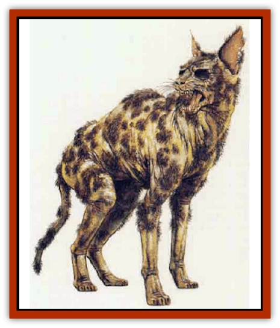

# Cat - Crypt

| Statistic | **Large** | **Normal** |
| --- | --- | --- |
| **Activity Cycle:** | Night | Night |
| **Alignment:** | Chaotic neutral | Chaotic neutral |
| **Armor Class:** | 7 | 7 |
| **Climate/Terrain:** | Crypt/tomb | Crypt/tomb |
| **Damage/Attack:** | 1d4/1d4/1d8 | 1d2/1d2/1d2 |
| **Diet:** | None | None |
| **Frequency:** | Very rare | Very rare |
| **Hit Dice:** | 4+1 | 1+1 |
| **Intelligence:** | Animal (1) | Animal (1) |
| **Magic Resistance:** | Nil | Nil |
| **Morale:** | Special | Special |
| **Movement:** | 15 | 12 |
| **No. Appearing:** | 1-8 | 1-12 |
| **No. of Attacks:** | 3 | 3 |
| **Organization:** | Group | Group |
| **Size:** | S (48&rdquo; long) | T (18-28&rdquo; long) |
| **Special Attacks:** | Disease, rear claw rake (1d4/1d4) | Disease, rear claw rake (1d2/1d2) |
| **Special Defenses:** | Nil | Nil |
| **THAC0:** | 17 | 19 |
| **Treasure:** | W (by group) | W (by group) |
| **XP Value:** | 650 | 120 |

Crypt cats are [[Cat_Small|domestic cats]] that have been [[Mummy|mummified]]. They serve as tomb guards or the minions of an undead master. Crypt cats are created by coating the corpse of a cat with a thin layer of clay that contains magical salves and oils. When dry, it is painted with brilliant colors in the pattern of the cat's fur. Often, copious amounts of gilt paint are used.

When crypt cats animate for the first time, they shed the hard clay covering. Their true bodies are dry and shrunken, with mangy clumps of fur clinging to the hide; lumps of dry clay cling to the little fur that remains. Their teeth are yellowed and broken, and their eyes are mere husks that rattle in gaping sockets.

Crypt cats rest in stone sarcophagi or wooden coffins that have been elaborately carved and painted. The decoration almost always involves cats at play in an afterlife filled with mice and birds. In some cases, the sarcophagus is painted to resemble the cat it houses. In many cases, crypt cats have been fitted with expensive pieces of jewelry. Some wear golden bells while others wear a tiny gold ring through their ear. Usually, opening the sarcophagus or coffin of a crypt cat is sufficient to wake it (90% chance).

**Combat:** Crypt cats attack with two claws and a bite. If both claws hit, they rake with their rear claws (two more attacks). Anyone struck by a crypt cat must successfully save vs. poison for each scratch or bite, or become diseased. This sickness manifests itself as a red inflammation around the wound. The wound will never completely heal, even if magical curing is used; one point of damage from each wound will not heal until a *cure disease* or *heal* spell has been cast upon the wounded creature.

Crypt cats are immune to *charm*, *hold*, *sleep*, and death magic, nor are they harmed by poison. They are turned as ghasts unless in the presence of a more powerful undead master, in which case they cannot be turned unless the master is also turned; the cats are affected first.

**Habitat/Society:** Crypt cats begin life as pampered pets or as sacred animals of a cat-worshiping cult. Their bodies are placed in tombs beside those of their master, so that their spirits might accompany that person into the afterlife. They will fight until destroyed to defend this former master. They will also rise from their sarcophagi to defend the tomb against desecration or robbery.

If buried with a master who has become an undead creature, active crypt cats can rise any time their master is active, unless ordered by the master to remain within the tomb.

**Ecology:** Crypt cats are found in burial chambers, often with other nonmagical [[Mummy_Creature|mummified]] cat remains. The composition of the clay that animates a crypt cat is unknown, although it is assumed that high level necromantic spells are involved.

It is possible (albeit rare) to find a crypt cat that has been removed from its tomb. If a sarcophagus containing a crypt cat is removed from a tomb or crypt without first being opened, the chance that the crypt cat will awaken when the container is opened drops to 75%. If the lid is left off or the body removed from the container, the crypt cat will awaken within 1d4 hours.

**Large Crypt Cat**

  Sometimes the bodies of larger felines are made into crypt cats. The disease of a large crypt cat is more potent: two points of damage per wound will remain until the disease is magically cured. They are turned as wraiths.

Alternately, any species of feline can be used (see [[Cat_Great|Cat, Great]] for more details). These attack and inflict damage as a living great cat of the same type and have the disease-causing ability of large crypt cats.

---
## Discovery & Documentation

**Source Publication:** Monstrous Compendium, 1995 Annual, Volume 2 (1995)
**Campaign Setting:** Advanced Dungeons & Dragons 2nd Edition
**Author(s):** Jon Pickens

### Other Creatures Found in This Source Book
   * [[Aboleth_Savant|Aboleth, Savant]]
   * [[Addazahr|Addazahr]]
   * [[Amiq_Rasol|Amiq Rasol]]
   * [[Arch-Shadow|Arch-Shadow]]
   * [[Automaton_Scaladar|Automaton, Scaladar]]
   * [[Automaton_Trobriand's|Automaton, Trobriand's]]
   * [[Bat_Sporebat|Bat, Sporebat]]
   * [[Beetle_Dragon|Beetle, Dragon]]
   * [[Bi-nou|Bi-nou]]
   * [[Boggle|Boggle]]
   * [[Brownie_Dobie|Brownie, Dobie]]
   * [[Brownie_Quickling|Brownie, Quickling]]
   * [[Cat_Great_Cath_Shee|Cat, Great, Cath Shee]]
   * [[Centaur-kin_Dorvesh|Centaur-kin, Dorvesh]]
   * [[Centaur-kin_Gnoat|Centaur-kin, Gnoat]]
   * [[Centaur-kin_Ha'pony|Centaur-kin, Ha'pony]]
   * [[Centaur-kin_Zebranaur|Centaur-kin, Zebranaur]]
   * [[Chronolily|Chronolily]]
   * [[Curst|Curst]]
   * [[Darktentacles|Darktentacles]]
   * [[Dinosaur_Aquatic|Dinosaur, Aquatic]]
   * [[Dinosaur_II|Dinosaur II]]
   * [[Dinosaur_III|Dinosaur III]]
   * [[Doppelganger_Greater|Doppelganger, Greater]]
   * [[Dragon_Brine|Dragon, Brine]]
   * [[Dragon_Half-|Dragon, Half-]]
   * [[Dragon-kin_Sea_Wyrm|Dragon-kin, Sea Wyrm]]
   * [[Dwarf_Wild|Dwarf, Wild]]
   * [[Ekimmu|Ekimmu]]
   * [[Elemental_Nature|Elemental, Nature]]
   * [[Elf_Winged|Elf, Winged]]
   * [[Fish_Great_Glacier|Fish (Great Glacier)]]
   * [[Fish_Subterranean|Fish, Subterranean]]
   * [[Fish_Toril|Fish (Toril)]]
   * [[Flareater|Flareater]]
   * [[Flumph|Flumph]]
   * [[Froghemoth|Froghemoth]]
   * [[Ghost_Casurua|Ghost, Casurua]]
   * [[Ghost_Ker|Ghost, Ker]]
   * [[Ghul|Ghul]]
   * [[Ghul-Kin|Ghul-Kin]]
   * [[Giant_Half-giant|Giant, Half-giant]]
   * [[Golem_Burning_Man|Golem, Burning Man]]
   * [[Golem_Phantom_Flyer|Golem, Phantom Flyer]]
   * [[Gulguthhydra|Gulguthhydra]]
   * [[Hakeashar|Hakeashar]]
   * [[Horse_Moon-|Horse, Moon-]]
   * [[Human_Dragonslayer|Human, Dragonslayer]]
   * [[Human_Vistana|Human, Vistana]]
   * [[Jellyfish_Giant|Jellyfish, Giant]]
   * [[Kalin|Kalin]]
   * [[Kholiathra|Kholiathra]]
   * [[Laerti|Laerti]]
   * [[Leucrotta_Greater|Leucrotta, Greater]]
   * [[Lich_Suel|Lich, Suel]]
   * [[Lurker_Shadow|Lurker, Shadow]]
   * [[Lycanthrope_Werepanther|Lycanthrope, Werepanther]]
   * [[Lycanthrope_Wereshark|Lycanthrope, Wereshark]]
   * [[Mammal_Herd_II|Mammal, Herd II]]
   * [[Marl|Marl]]
   * [[Meenlock|Meenlock]]
   * [[Mimic_Greater|Mimic, Greater]]
   * [[Mold_II|Mold II]]
   * [[Mummy_Creature|Mummy, Creature]]
   * [[Nyth|Nyth]]
   * [[Ooze_Slime_Jelly_Ghaunadan|Ooze/Slime/Jelly, Ghaunadan]]
   * [[Palimpsest|Palimpsest]]
   * [[Peltast|Peltast]]
   * [[Plant_Dangerous_II|Plant, Dangerous II]]
   * [[Pleistocene_Animal|Pleistocene Animal]]
   * [[Pudding_Subterranean|Pudding, Subterranean]]
   * [[Raggamoffyn|Raggamoffyn]]
   * [[Snake_Serpent|Snake, Serpent]]
   * [[Snake_Serpent_Vine|Snake, Serpent Vine]]
   * [[Sphinx_Draco-|Sphinx, Draco-]]
   * [[Sprite_Seelie_Faerie|Sprite, Seelie Faerie]]
   * [[Sprite_Unseelie_Faerie|Sprite, Unseelie Faerie]]
   * [[Squealer|Squealer]]
   * [[Turtle_Giant|Turtle, Giant]]
   * [[Umpleby|Umpleby]]
   * [[Vizier's_Turban|Vizier's Turban]]
   * [[Wall_Walker|Wall Walker]]
   * [[Webbird|Webbird]]
   * [[Yak-Man|Yak-Man]]
   * [[Zorbo|Zorbo]]
