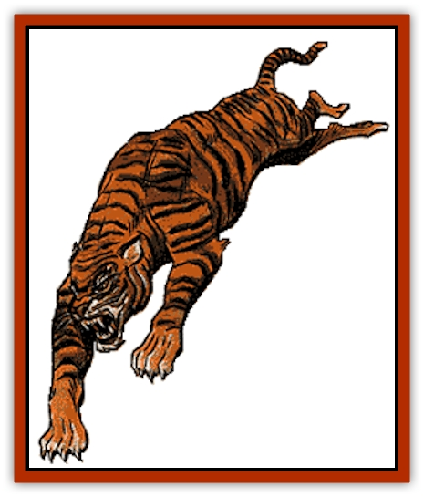

# Cat - Great

| Statistic | **Cheetah** | **Common Lion** | **Giant Lynx** | **Jaguar** | **Leopard** | **Mountain Lion** | **Smilodon** | **Spotted Lion** | **Wild Tiger** |
| --- | --- | --- | --- | --- | --- | --- | --- | --- | --- |
| **Activity Cycle:** | Day | Day | Night | Any | Any | Dawn or dusk | Night | Day | Night |
| **Alignment:** | Neutral | Neutral | Neutral | Neutral | Neutral | Neutral | Neutral | Neutral | Neutral |
| **Armor Class:** | 5 | 5/6 | 6 | 6 | 6 | 6 | 6 | 5/6 | 6 |
| **Climate/Terrain:** | Warm plains and grasslands | Warm plains and grasslands | Subarctic forest | Tropical jungle | Tropical jungle or forest | Any warm or temperate | Subarctic to tropical forest | Warm plains and desert | Subarctic to tropical forest |
| **Damage/Attack:** | 1-2/1-2/1-8 | 1-4/1-4/1-10 | 1-2/1-2/1-2 | 1-3/1-3/1-8 | 1-3/1-3/1-6 | 1-3/1-3/1-6 | 2-5 (1d4+1)/ / 2-5 (1d4+1)/ / 2-12 (2d6) | 1-4/1-4/1-12 | 2-5 (1d4+1)/2-5 (1d4+1)/1-10 |
| **Diet:** | Carnivore | Carnivore | Carnivore | Carnivore | Carnivore | Carnivore | Carnivore | Carnivore | Carnivore |
| **Frequency:** | Uncommon | Uncommon | Rare | Uncommon | Uncommon | Uncommon | Uncommon | Rare | Uncommon |
| **Hit Dice:** | 3 | 5+2 | 2+2 | 4+1 | 3+2 | 3+1 | 7+2 | 6+2 | 5+5 |
| **Intelligence:** | Animal (1) | Semi- (2-4) | Very (11-12) | Semi- (2-4) | Semi- (2-4) | Semi- (2-4) | Animal (1) | Semi- (2-4) | Semi- (2-4) |
| **Magic Resistance:** | Nil | Nil | Nil | Nil | Nil | Nil | Nil | Nil | Nil |
| **Morale:** | Average / (8-10) | Average / (8-10) | Average / (8-10) | Average / (8-10) | Average / (8-10) | Average / (8-10) | Steady / (11-12) | Average / (8-10) | Average / (8-10) |
| **Movement:** | 15, sprint 45 | 12 | 12 | 15 | 15 | 12 | 12 | 12 | 12 |
| **No. Appearing:** | 1-4 | 2-12 (2d6) | 1-4 | 1-2 | 1-2 | 1-2 | 1-2 | 2-8 (2d4) | 1-4 |
| **No. of Attacks:** | 3 | 3 | 3 | 3 | 3 | 3 | 3 | 3 | 3 |
| **Organization:** | Family group | Pride | Solitary | Solitary | Solitary | Solitary | Solitary | Pride | Solitary |
| **Size:** | M (4-4½' long) | M (4½-6½' long) | M (4½' long) | L (5-6' long) | M (4-4½' long) | M (4-5' long) | L (8-12' long) | L (4½-6½' long) | L (6-9' long) |
| **Special Attacks:** | Rear claws / 1-2 each | Rear claws / 2-7 (1d6+1) each | Rear claws / 1-3 each | Rear claws / 2-5 (1d4+1) each | Rear claws / 1-4 each | Rear claws / 1-4 each | Rear claws / 2-8 (2d4) | Rear claws / 2-8 (2d4) each | Rear claws / 2-8 (2d4) |
| **Special Defenses:** | Surprised / only on a 1 | Surprised / only on a 1 | See below | Surprised / only on a 1 | Surprised / only on a 1 | Surprised / only on a 1 | Surprised / only on a 1 | Surprised / only on a 1 | Surprised / only on a 1 |
| **THAC0:** | 17 | 15 | 19 | 17 | 17 | 17 | 11(13) | 15 | 15 |
| **Treasure:** | Nil | Nil | Nil | Nil | Nil | Nil | Nil | Nil | Nil |
| **XP Value:** | 175 | 650 | 175 | 420 | 270 | 270 | 1,400 | 975 | 650 |

The great cats are among the most efficient of all predators.

**Cheetah**

  The cheetah is a medium-sized, lightly built cat. Its fur is sand colored and it is covered with dark spots. The cheetah is unique among cats because of its non-retractable claws.

A skilled hunter endowed with natural camouflage, victims of a cheetah attack suffer a -3 on their surprise roll. They are famed for their tremendous bursts of speed, and can run at triple speed (45 feet per round) for three rounds. The cat must rest 3 turns before sprinting again. Cheetahs can spring 10 feet upward or 20 feet forward. If both forepaws hit during an attack the cheetah is able to rake for 1-2 points of damage with each of its rear claws. If defending their young, cheetahs receive a +2 on their attack and damage rolls and will fight to the death.

Cheetahs inhabit warm plains and grasslands, often sharing their range with lions. Their favorite prey are the antelope that inhabit the plains, and they rarely attack men. Cheetahs are territorial, but may live alone, in pairs and in groups. The female raises a litter of 2-4 young alone. The young, who stay with their mother for as long as 2 years, can be completely trained and domesticated.

The fortunes of the cheetah rise and fall with those of its prey; when the population of antelope and other game declines, so does that of the cheetah.

**Jaguar**

  The jaguar is a powerful cat with a deep chest and muscular limbs. Its color ranges from light yellow to brownish red, and it is covered with dark spots.

The jaguar will attack anything that it perceives as a threat. It relies on stealth to close with its prey, often pouncing from above. The jaguar can leap 30' to attack. If both of its forepaws strike it will rake with its two rear claws for 2-5 (1d4+1) points of damage each.

The jaguar inhabits jungles, spending a great deal of time in tree tops. It climbs, swims, and stalks superbly. Jaguars are solitary and territorial, meeting only to mate. If found in a lair, there is a 75% chance there will be 1-3 cubs. Cubs do not fight effectively.

Their strength and ferocity make jaguars one of the most feared predators of the jungle.

**Leopard**

  The leopard is a graceful cat with a long body and relatively short legs. Its color varies from buff to tawny, and its spots are rosette shaped.

Leopards prefer to leap on their prey, imposing a -3 on the surprise rolls of their victims. Leopards can spring upward 20 feet or ahead 25 feet. If they strike successfully with both forepaws, they rake with their rear claws for 1-4 points each.

Leopards are solitary, inhabiting warm deserts, forest, plains, and mountains. They hunt both day and night preying on animals up to the size of large antelopes. They swim and climb well, and will often sit in treetops sunning themselves. Leopards will also drag their prey to safety in the treetops to devour in peace. The female bears 1-3 young, and cares for them for up to two years. If found in the lair, there is a 25% chance that there will be cubs there. The young have no effective attack.

A skilled predator, the leopard is often threatened by human incursions. In areas where it is hunted, it is nocturnal.

**Lion**

  Among the largest and most powerful of the great cats, lions have yellow or golden brown fur. The males are distinguished by their flowing manes.

Both male and female lions are fierce fighters. Lions hunt in prides, with females doing most of the actual hunting. Since their senses are so keen, lions can only be surprised on a 1. All lions can leap as far as 30 feet. Males have an Armor Class of 5 in their forequarters and 6 in their hindquarters while females are Armor Class 6 in all areas. If a lion hits with both forepaws, it can rake with its rear claws doing 2-7 points damage each.

Lions prefer warmer climates, thriving in deserts, jungles, grasslands, and swamps. They live and hunt in prides, and are extremely territorial. A pride usually consists of 1-3 males and 1-10 females. Lions frequently kill animals the size of zebras or giraffes. Lionesses will cooperate when hunting, driving their prey into an ambush. They have been known to attack domestic livestock, but will almost never attack men. A lair will contain from 1-10 cubs which are 30%-60% grown. Cubs are unable to fight. Lions are poor climbers and dislike swimming.

Lions flourish only when the supply of game is adequate. Their size and strength have made them a favorite target of human hunters.

**Mountain Lion**

  Not a true lion, this brownish cat is lankier than its large cousins. Except for their size, males and females are difficult to tell apart.

The mountain lion is more cautious and less aggressive than its larger relatives. They can spring upward 15 feet or ahead 20 feet to attack or retreat. If they score hits with both of their forepaws, they will rake with their back ones for 1-4 points of damage each. It will not attack men unless threatened.

Mountain lions range in warm and temperate mountains, forests, swamps, and plains. They are solitary, with males and females each maintaining separate territories. Their favorite prey are deer. The female rears 2-4 cubs alone, which remain with her for 1-2 years.

The mountain lion is flexible and elusive. It is adept at surviving on the fringes of human civilization.

**Spotted Lion**

  Spotted lions are large, fierce, dappled versions of the lion. They are generally found in the plains of the [[Pleistocene_Animal|Pleistocene]] epoch, and rarely occur elsewhere.

**Giant Lynx**

  The giant lynx is distinguished by its tufted ears and cheeks, short bobbed tail, and dappled coloring. It has a compact muscular body, with heavy legs and unusually large paws.

The giant lynx is the most intelligent of the great cats and uses its wits in combat. When hiding, a giant lynx will avoid detection 90% of the time. The lynx can leap up to 15 feet and imposes a -6 on the surprise rolls of its prey. It has a 75% chance of detecting traps. If a giant lynx strikes with both forepaws, it attempts a rear claw rake, causing 1-3 points of damage per claw. The giant lynx almost never attacks men.

The giant lynx prefers cold coniferous and scrub forests. They can communicate in their own language with others of its kind, which greatly increases its chances of survival. The nocturnal lynx stalks or ambushes its prey, catching rodents, young deer, grouse, and other small game. The cubs remain with their mother for 6 months.

The giant lynx has all the advantages of the great cats plus the added bonus of a high intelligence which makes it even more adaptable.

**Tiger**

  The tiger is the largest and most feared of the great cats. Tigers have reddish-orange fur and dark vertical stripes.

A tiger is a redoubtable foe in battle and is surprised only on a 1. They are experts in stalking and often hunt in pairs or groups. They can leap 10 feet upward, and spring forward 30 feet to 50 feet to attack. If they strike successfully with both forepaws, their rear claws rake for 2-8 (2d4) points of damage per claw.

This species ranges from the subarctic to the tropics, generally inhabiting wooded or covered terrain. Tigers are nocturnal, solitary, graceful climbers and swimmers who are capable of sustained high speed. These animals rarely fight among themselves, but will protect their territories ferociously. They are also the most unpredictable and dangerous of the great cats, not hesitating to attack men. Their favorite prey includes cattle, wild pigs and deer. Females raise their 1-3 cubs alone. The cubs remain with their mother for several years. If encountered in the lair, there is a 25% chance that the cubs will be present.

Feared by men, tigers are hunted aggressively, and are threatened by the destruction of forests. In the untamed wilderness, however, the tiger occupies the top predatory niche.

**Smilodon**

  Although not truly a member of the cat family, the so-called sabre-toothed tiger is similar to them in many ways. Smilodons are known for their 6 inches long fangs which are capable of inflicting terrible wounds. Their powerful jaws and large teeth give them a +2 on their attack rolls. They are similar to normal tigers but are found only during the Pleistocene epoch.

---
## Discovery & Documentation

**Source Publication:** Monstrous Manual (1995)
**Campaign Setting:** Advanced Dungeons & Dragons 2nd Edition
**Author(s):** Tim Beach

### Other Creatures Found in This Source Book
   * [[Aarakocra|Aarakocra]]
   * [[Aboleth|Aboleth]]
   * [[Ankheg|Ankheg]]
   * [[Arcane|Arcane]]
   * [[Argos|Argos]]
   * [[Aurumvorax|Aurumvorax]]
   * [[Baatezu_Lesser_Abishai|Baatezu, Lesser, Abishai]]
   * [[Baatezu_General_Information|Baatezu, General Information]]
   * [[Baatezu_Greater_Pit_Fiend|Baatezu, Greater, Pit Fiend]]
   * [[Banshee|Banshee]]
   * [[Basilisk|Basilisk]]
   * [[Bat|Bat]]
   * [[Bear|Bear]]
   * [[Beetle_Giant|Beetle, Giant]]
   * [[Behir|Behir]]
   * [[Beholder_and_Beholder-kin_I|Beholder and Beholder-kin I]]
   * [[Beholder_and_Beholder-kin_II|Beholder and Beholder-kin II]]
   * [[Bird|Bird]]
   * [[Brain_Mole|Brain Mole]]
   * [[Broken_One|Broken One]]
   * [[Brownie|Brownie]]
   * [[Bugbear|Bugbear]]
   * [[Bulette|Bulette]]
   * [[Bullywug|Bullywug]]
   * [[Carrion_Crawler|Carrion Crawler]]
   * [[Catoblepas|Catoblepas]]
   * [[Cat_Small|Cat, Small]]
   * [[Cave_Fisher|Cave Fisher]]
   * [[Centaur|Centaur]]
   * [[Centipede|Centipede]]
   * [[Chimera|Chimera]]
   * [[Cloaker|Cloaker]]
   * [[Cockatrice|Cockatrice]]
   * [[Couatl|Couatl]]
   * [[Crabman|Crabman]]
   * [[Crawling_Claw|Crawling Claw]]
   * [[Crocodile|Crocodile]]
   * [[Crustacean_Giant|Crustacean, Giant]]
   * [[Crypt_Thing|Crypt Thing]]
   * [[Death_Knight|Death Knight]]
   * [[Deepspawn|Deepspawn]]
   * [[Dinosaur_I|Dinosaur I]]
   * [[Displacer_Beast|Displacer Beast]]
   * [[Dog|Dog]]
   * [[Dog_Moon|Dog, Moon]]
   * [[Dolphin|Dolphin]]
   * [[Doppelganger|Doppelganger]]
   * [[Dracolich|Dracolich]]
   * [[Dragon_Brown|Dragon, Brown]]
   * [[Dragon_Chromatic_Black|Dragon, Chromatic, Black]]
   * [[Dragon_Chromatic_Blue|Dragon, Chromatic, Blue]]
   * [[Dragon_Chromatic_Green|Dragon, Chromatic, Green]]
   * [[Dragon_Cloud|Dragon, Cloud]]
   * [[Dragon_Chromatic_Red|Dragon, Chromatic, Red]]
   * [[Dragon_Chromatic_White|Dragon, Chromatic, White]]
   * [[Dragon_Deep|Dragon, Deep]]
   * [[Dragon_Gem_Amethyst|Dragon, Gem, Amethyst]]
   * [[Dragon_Gem_Crystal|Dragon, Gem, Crystal]]
   * [[Dragon_Gem_Emerald|Dragon, Gem, Emerald]]
   * [[Dragon_Gem_Sapphire|Dragon, Gem, Sapphire]]
   * [[Dragon_Gem_Topaz|Dragon, Gem, Topaz]]
   * [[Dragon_Metallic_Brass|Dragon, Metallic, Brass]]
   * [[Dragon_Metallic_Bronze|Dragon, Metallic, Bronze]]
   * [[Dragon_Metallic_Copper|Dragon, Metallic, Copper]]
   * [[Dragon_Mercury|Dragon, Mercury]]
   * [[Dragon_Metallic_Gold|Dragon, Metallic, Gold]]
   * [[Dragon_Mist|Dragon, Mist]]
   * [[Dragon_Metallic_Silver|Dragon, Metallic, Silver]]
   * [[Dragon_General_Information|Dragon, General Information]]
   * [[Dragon_Shadow|Dragon, Shadow]]
   * [[Dragon_Steel|Dragon, Steel]]
   * [[Dragon_Yellow|Dragon, Yellow]]
   * [[Dragonne|Dragonne]]
   * [[Dragon_Turtle|Dragon Turtle]]
   * [[Dragonet_Faerie_Dragon|Dragonet, Faerie Dragon]]
   * [[Dragonet_Fire_Drake|Dragonet, Fire Drake]]
   * [[Dragonet_Pseudodragon|Dragonet, Pseudodragon]]
   * [[Dryad|Dryad]]
   * [[Dwarf_Derro|Dwarf, Derro]]
   * [[Dwarf|Dwarf]]
   * [[Elemental_Athas_General_Information|Elemental (Athas), General Information]]
   * [[Elemental_Air_Kin|Elemental, Air Kin]]
   * [[Elemental_Earth_Kin|Elemental, Earth Kin]]
   * [[Elemental_Fire_Kin|Elemental, Fire Kin]]
   * [[Elemental_Water_Kin|Elemental, Water Kin]]
   * [[Elemental_of_Chaos_Air_Earth|Elemental of Chaos, Air/Earth]]
   * [[Elemental_of_Chaos_Fire_Water|Elemental of Chaos, Fire/Water]]
   * [[Elemental_Composite|Elemental, Composite]]
   * [[Elemental_Air_Earth|Elemental, Air/Earth]]
   * [[Elemental_Fire_Water|Elemental, Fire/Water]]
   * [[Elemental_General_Information|Elemental, General Information]]
   * [[Elephant|Elephant]]
   * [[Elf|Elf]]
   * [[Elf_Aquatic|Elf, Aquatic]]
   * [[Elf_Drow|Elf, Drow]]
   * [[Ettercap|Ettercap]]
   * [[Eyewing|Eyewing]]
   * [[Feyr|Feyr]]
   * [[Fish|Fish]]
   * [[Frog|Frog]]
   * [[Fungus|Fungus]]
   * [[Galeb_Duhr|Galeb Duhr]]
   * [[Gargantua|Gargantua]]
   * [[Gargoyle_I|Gargoyle I]]
   * [[Genie|Genie]]
   * [[Ghost|Ghost]]
   * [[Ghoul|Ghoul]]
   * [[Giant_Cloud|Giant, Cloud]]
   * [[Giant_Cyclops|Giant, Cyclops]]
   * [[Giant_Desert|Giant, Desert]]
   * [[Giant_Ettin|Giant, Ettin]]
   * [[Giant_Firbolg|Giant, Firbolg]]
   * [[Giant_Fire|Giant, Fire]]
   * [[Giant_Fog|Giant, Fog]]
   * [[Giant_Fomorian|Giant, Fomorian]]
   * [[Giant_Frost|Giant, Frost]]
   * [[Giant_Hill|Giant, Hill]]
   * [[Giant_Jungle|Giant, Jungle]]
   * [[Giant_Mountain|Giant, Mountain]]
   * [[Giant_Reef|Giant, Reef]]
   * [[Giant_Stone|Giant, Stone]]
   * [[Giant_Storm|Giant, Storm]]
   * [[Giant_Verbeeg|Giant, Verbeeg]]
   * [[Giant_Wood|Giant, Wood]]
   * [[Gibberling|Gibberling]]
   * [[Giff|Giff]]
   * [[Gith|Gith]]
   * [[Gith_Pirate_of|Gith, Pirate of]]
   * [[Githyanki|Githyanki]]
   * [[Githzerai|Githzerai]]
   * [[Gloomwing|Gloomwing]]
   * [[Gnoll|Gnoll]]
   * [[Gnome|Gnome]]
   * [[Gnome_Spriggan|Gnome, Spriggan]]
   * [[Goblin|Goblin]]
   * [[Golem_General_Information|Golem, General Information]]
   * [[Golem_I_Greater_Golem|Golem I (Greater Golem)]]
   * [[Golem_II_Lesser_Golem|Golem II (Lesser Golem)]]
   * [[Golem_III|Golem III]]
   * [[Golem_IV|Golem IV]]
   * [[Golem_V|Golem V]]
   * [[Golem_VI_Stone_Variants|Golem VI (Stone Variants)]]
   * [[Gorgon|Gorgon]]
   * [[Grell_Colonial|Grell, Colonial]]
   * [[Gremlin_Jermlaine|Gremlin, Jermlaine]]
   * [[Gremlin|Gremlin]]
   * [[Griffon|Griffon]]
   * [[Grimlock|Grimlock]]
   * [[Grippli|Grippli]]
   * [[Hag|Hag]]
   * [[Halfling|Halfling]]
   * [[Harpy|Harpy]]
   * [[Hatori|Hatori]]
   * [[Haunt|Haunt]]
   * [[Hell_Hound|Hell Hound]]
   * [[Heucuva|Heucuva]]
   * [[Hippocampus|Hippocampus]]
   * [[Hippogriff|Hippogriff]]
   * [[Hobgoblin|Hobgoblin]]
   * [[Homunculus|Homunculus]]
   * [[Hook_Horror|Hook Horror]]
   * [[Horse|Horse]]
   * [[Human|Human]]
   * [[Hydra|Hydra]]
   * [[Imp|Imp]]
   * [[Insect_Giant|Insect, Giant]]
   * [[Insect_Swarm|Insect Swarm]]
   * [[Intellect_Devourer|Intellect Devourer]]
   * [[Invisible_Stalker|Invisible Stalker]]
   * [[Ixitxachitl|Ixitxachitl]]
   * [[Jackalwere|Jackalwere]]
   * [[Kenku|Kenku]]
   * [[Ki-rin|Ki-rin]]
   * [[Kirre|Kirre]]
   * [[Kobold|Kobold]]
   * [[Kuo-Toa|Kuo-Toa]]
   * [[Lamia|Lamia]]
   * [[Lammasu|Lammasu]]
   * [[Leech|Leech]]
   * [[Leprechaun|Leprechaun]]
   * [[Leucrotta|Leucrotta]]
   * [[Lich|Lich]]
   * [[Living_Wall|Living Wall]]
   * [[Lizard|Lizard]]
   * [[Lizard_Man|Lizard Man]]
   * [[Locathah|Locathah]]
   * [[Lurker|Lurker]]
   * [[Lycanthrope_General_Information|Lycanthrope, General Information]]
   * [[Lycanthrope_Seawolf|Lycanthrope, Seawolf]]
   * [[Lycanthrope_Werebear|Lycanthrope, Werebear]]
   * [[Lycanthrope_Wereboar|Lycanthrope, Wereboar]]
   * [[Lycanthrope_Werebat|Lycanthrope, Werebat]]
   * [[Lycanthrope_Werefox|Lycanthrope, Werefox]]
   * [[Lycanthrope_Wererat|Lycanthrope, Wererat]]
   * [[Lycanthrope_Wereraven|Lycanthrope, Wereraven]]
   * [[Lycanthrope_Weretiger|Lycanthrope, Weretiger]]
   * [[Lycanthrope_Werewolf|Lycanthrope, Werewolf]]
   * [[Mammal|Mammal]]
   * [[Mammal_Giant|Mammal, Giant]]
   * [[Mammal_Herd_I|Mammal, Herd I]]
   * [[Mammal_Small|Mammal, Small]]
   * [[Manscorpion|Manscorpion]]
   * [[Manticore|Manticore]]
   * [[Medusa_Maedar|Medusa, Maedar]]
   * [[Medusa|Medusa]]
   * [[Mephit_General_Information|Mephit, General Information]]
   * [[Merman|Merman]]
   * [[Mimic|Mimic]]
   * [[Mind_Flayer|Mind Flayer]]
   * [[Minotaur|Minotaur]]
   * [[Mist_Crimson_Death|Mist, Crimson Death]]
   * [[Mist_Vampiric|Mist, Vampiric]]
   * [[Mold_I|Mold I]]
   * [[Moldman|Moldman]]
   * [[Mongrelman|Mongrelman]]
   * [[Morkoth|Morkoth]]
   * [[Muckdweller|Muckdweller]]
   * [[Mudman|Mudman]]
   * [[Mummy_Greater|Mummy, Greater]]
   * [[Mummy|Mummy]]
   * [[Myconid|Myconid]]
   * [[Naga|Naga]]
   * [[Naga_Dark|Naga, Dark]]
   * [[Neogi|Neogi]]
   * [[Nightmare|Nightmare]]
   * [[Nymph|Nymph]]
   * [[Octopus_Giant|Octopus, Giant]]
   * [[Ogre|Ogre]]
   * [[Ogre_Half-|Ogre, Half-]]
   * [[Ooze_Slime_Jelly_I|Ooze/Slime/Jelly I]]
   * [[Ooze_Slime_Jelly_II|Ooze/Slime/Jelly II]]
   * [[Ooze_Slime_Jelly_Slithering_Tracker|Ooze/Slime/Jelly, Slithering Tracker]]
   * [[Orc|Orc]]
   * [[Otyugh|Otyugh]]
   * [[Owlbear_I|Owlbear I]]
   * [[Pegasus|Pegasus]]
   * [[Peryton|Peryton]]
   * [[Phantom|Phantom]]
   * [[Phoenix|Phoenix]]
   * [[Piercer|Piercer]]
   * [[Plant_Dangerous_I|Plant, Dangerous I]]
   * [[Plant_Intelligent|Plant, Intelligent]]
   * [[Poltergeist|Poltergeist]]
   * [[Pudding_Deadly|Pudding, Deadly]]
   * [[Quaggoth|Quaggoth]]
   * [[Rakshasa|Rakshasa]]
   * [[Rat|Rat]]
   * [[Rat_Osquip|Rat, Osquip]]
   * [[Remorhaz|Remorhaz]]
   * [[Revenant|Revenant]]
   * [[Roc|Roc]]
   * [[Roper|Roper]]
   * [[Rust_Monster|Rust Monster]]
   * [[Sahuagin|Sahuagin]]
   * [[Satyr|Satyr]]
   * [[Scorpion|Scorpion]]
   * [[Sea_Lion|Sea Lion]]
   * [[Selkie|Selkie]]
   * [[Shadow|Shadow]]
   * [[Shedu|Shedu]]
   * [[Sirine|Sirine]]
   * [[Skeleton|Skeleton]]
   * [[Skeleton_Giant|Skeleton, Giant]]
   * [[Skeleton_Warrior|Skeleton, Warrior]]
   * [[Slaad|Slaad]]
   * [[Slug_Giant|Slug, Giant]]
   * [[Snake|Snake]]
   * [[Snake_Winged|Snake, Winged]]
   * [[Spectre|Spectre]]
   * [[Sphinx|Sphinx]]
   * [[Spider|Spider]]
   * [[Sprite|Sprite]]
   * [[Squid_Giant|Squid, Giant]]
   * [[Stirge|Stirge]]
   * [[Su-Monster|Su-Monster]]
   * [[Swanmay|Swanmay]]
   * [[Tabaxi|Tabaxi]]
   * [[Tako|Tako]]
   * [[Tanar'ri_True_Balor|Tanar'ri, True, Balor]]
   * [[Tanar'ri_True_Marilith|Tanar'ri, True, Marilith]]
   * [[Tarrasque|Tarrasque]]
   * [[Tasloi|Tasloi]]
   * [[Thought_Eater|Thought Eater]]
   * [[Thri-kreen|Thri-kreen]]
   * [[Titan|Titan]]
   * [[Toad_Giant|Toad, Giant]]
   * [[Treant|Treant]]
   * [[Triton|Triton]]
   * [[Troglodyte|Troglodyte]]
   * [[Troll|Troll]]
   * [[Umber_Hulk|Umber Hulk]]
   * [[Unicorn|Unicorn]]
   * [[Urchin|Urchin]]
   * [[Vampire|Vampire]]
   * [[Wemic|Wemic]]
   * [[Whale|Whale]]
   * [[Wight|Wight]]
   * [[Will_O'Wisp|Will O'Wisp]]
   * [[Wolf|Wolf]]
   * [[Wolfwere|Wolfwere]]
   * [[Worm|Worm]]
   * [[Wraith|Wraith]]
   * [[Wyvern|Wyvern]]
   * [[Xorn|Xorn]]
   * [[Yeti|Yeti]]
   * [[Yuan-ti_Histachii|Yuan-ti, Histachii]]
   * [[Yuan-ti|Yuan-ti]]
   * [[Yugoloth_Guardian|Yugoloth, Guardian]]
   * [[Zaratan|Zaratan]]
   * [[Zombie|Zombie]]
