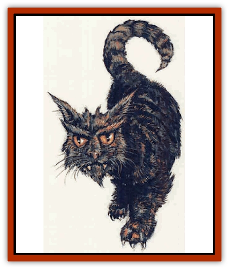

# Cat - Great - Cath Shee

| Statistic | **Cat, Great, Cath Shee** |
| --- | --- |
| **Activity Cycle:** | Any |
| **Alignment:** | Chaotic Neutral (good tendencies) |
| **Armor Class:** | 4 |
| **Climate/Terrain:** | Forests |
| **Damage/Attack:** | 1-8/1-6/1-6 |
| **Diet:** | Carnivore |
| **Frequency:** | Rare |
| **Hit Dice:** | 4+3 |
| **Intelligence:** | Low (6) |
| **Magic Resistance:** | 10% |
| **Morale:** | Champion (15) |
| **Movement:** | 18 |
| **No. Appearing:** | 1 |
| **No. of Attacks:** | 3 |
| **Organization:** | Solitary |
| **Size:** | M (4' at shoulder) |
| **Special Attacks:** | Rear claw kick, frenzy |
| **Special Defenses:** | <i>Teleportation</i> |
| **THAC0:** | 15 |
| **Treasure:** | Nil |
| **XP Value:** | 975 |

The cath shee, or faerie [[Cat_Great|cat]], is a large, greenish-gray creature with large, tufted ears, and wide, golden eyes. Cath shee can weigh as much as 400 lbs. These creatures are clever and independent, but sometimes can be persuaded to become a companion to a Green [[Elf|elf]] or Silver elf ranger.

Once, cath shee were found in relative abundance on the mainland, but today are found only on the island of Evermeet.

Normally, cath shee are solitary creatures, and highly efficient predators. An inborn natural ability enables cath shee to teleport instantly, and without error, up to 100 yards. This ability is used to escape from enemies and to attack prey. They are also naturally somewhat magic-resistant (10%).

There are many legends about cath shee in elven society. Some claim that cath shee were created by Corellon Larethian to serve as companions to the elves. Others believe that they are reincarnated elves who have been sent back to Toril by the Seldarine to defend the elven nations, or to atone for misdeeds in their previous lives.

**Combat:** Cath shee are ferocious fighters, and often lie in wait for prey, then use their teleport ability to attack with complete surprise. If both of a cath shee's claws strike, it will then kick with its back legs, hitting automatically and inflicting 2d6 points of damage.

While normally solitary and relatively unsocial, mated cath shee pairs will fight furiously for each other, and for their offspring if any are threatened. If a cath shee's mate or litter is threatened, it will go into a frenzy, attacking at +4 to hit and damage and will never check Morale.

**Habitat/Society:** Cath shee are solitary creatures, associating with each other only in spring, during mating, and remaining together in mated pairs through the summer if kittens are born.

For the rest of the year, cath shee tend to keep to themselves, staking out territories as large as several square miles in area, and defending them, even against others of their own kind.

**Ecology:** Cath shee are highly efficient carnivores, preying on other mammals, primarily rabbits and small rodents. Their natural teleportation abilities help make sure that a cath shee's prey rarely escapes.

Cath shee sometimes consent to serve as companions (never pets) to Green or Silver elves. An elf who wishes to approach a cath shee must roll 1d20 and refer to the "Threatening" column of the Encounter Reaction Table (DMG, Chapter 11), applying any Charisma modifications. On a reaction of "friendly," the cath shee has agreed to become the elf's companion. Another check (this time on the "Friendly" column) is required every six months thereafter.

---
## Discovery & Documentation

**Source Publication:** Monstrous Compendium, 1995 Annual, Volume 2 (1995)
**Campaign Setting:** Advanced Dungeons & Dragons 2nd Edition
**Author(s):** Jon Pickens

### Other Creatures Found in This Source Book
   * [[Aboleth_Savant|Aboleth, Savant]]
   * [[Addazahr|Addazahr]]
   * [[Amiq_Rasol|Amiq Rasol]]
   * [[Arch-Shadow|Arch-Shadow]]
   * [[Automaton_Scaladar|Automaton, Scaladar]]
   * [[Automaton_Trobriand's|Automaton, Trobriand's]]
   * [[Bat_Sporebat|Bat, Sporebat]]
   * [[Beetle_Dragon|Beetle, Dragon]]
   * [[Bi-nou|Bi-nou]]
   * [[Boggle|Boggle]]
   * [[Brownie_Dobie|Brownie, Dobie]]
   * [[Brownie_Quickling|Brownie, Quickling]]
   * [[Cat_Crypt|Cat, Crypt]]
   * [[Centaur-kin_Dorvesh|Centaur-kin, Dorvesh]]
   * [[Centaur-kin_Gnoat|Centaur-kin, Gnoat]]
   * [[Centaur-kin_Ha'pony|Centaur-kin, Ha'pony]]
   * [[Centaur-kin_Zebranaur|Centaur-kin, Zebranaur]]
   * [[Chronolily|Chronolily]]
   * [[Curst|Curst]]
   * [[Darktentacles|Darktentacles]]
   * [[Dinosaur_Aquatic|Dinosaur, Aquatic]]
   * [[Dinosaur_II|Dinosaur II]]
   * [[Dinosaur_III|Dinosaur III]]
   * [[Doppelganger_Greater|Doppelganger, Greater]]
   * [[Dragon_Brine|Dragon, Brine]]
   * [[Dragon_Half-|Dragon, Half-]]
   * [[Dragon-kin_Sea_Wyrm|Dragon-kin, Sea Wyrm]]
   * [[Dwarf_Wild|Dwarf, Wild]]
   * [[Ekimmu|Ekimmu]]
   * [[Elemental_Nature|Elemental, Nature]]
   * [[Elf_Winged|Elf, Winged]]
   * [[Fish_Great_Glacier|Fish (Great Glacier)]]
   * [[Fish_Subterranean|Fish, Subterranean]]
   * [[Fish_Toril|Fish (Toril)]]
   * [[Flareater|Flareater]]
   * [[Flumph|Flumph]]
   * [[Froghemoth|Froghemoth]]
   * [[Ghost_Casurua|Ghost, Casurua]]
   * [[Ghost_Ker|Ghost, Ker]]
   * [[Ghul|Ghul]]
   * [[Ghul-Kin|Ghul-Kin]]
   * [[Giant_Half-giant|Giant, Half-giant]]
   * [[Golem_Burning_Man|Golem, Burning Man]]
   * [[Golem_Phantom_Flyer|Golem, Phantom Flyer]]
   * [[Gulguthhydra|Gulguthhydra]]
   * [[Hakeashar|Hakeashar]]
   * [[Horse_Moon-|Horse, Moon-]]
   * [[Human_Dragonslayer|Human, Dragonslayer]]
   * [[Human_Vistana|Human, Vistana]]
   * [[Jellyfish_Giant|Jellyfish, Giant]]
   * [[Kalin|Kalin]]
   * [[Kholiathra|Kholiathra]]
   * [[Laerti|Laerti]]
   * [[Leucrotta_Greater|Leucrotta, Greater]]
   * [[Lich_Suel|Lich, Suel]]
   * [[Lurker_Shadow|Lurker, Shadow]]
   * [[Lycanthrope_Werepanther|Lycanthrope, Werepanther]]
   * [[Lycanthrope_Wereshark|Lycanthrope, Wereshark]]
   * [[Mammal_Herd_II|Mammal, Herd II]]
   * [[Marl|Marl]]
   * [[Meenlock|Meenlock]]
   * [[Mimic_Greater|Mimic, Greater]]
   * [[Mold_II|Mold II]]
   * [[Mummy_Creature|Mummy, Creature]]
   * [[Nyth|Nyth]]
   * [[Ooze_Slime_Jelly_Ghaunadan|Ooze/Slime/Jelly, Ghaunadan]]
   * [[Palimpsest|Palimpsest]]
   * [[Peltast|Peltast]]
   * [[Plant_Dangerous_II|Plant, Dangerous II]]
   * [[Pleistocene_Animal|Pleistocene Animal]]
   * [[Pudding_Subterranean|Pudding, Subterranean]]
   * [[Raggamoffyn|Raggamoffyn]]
   * [[Snake_Serpent|Snake, Serpent]]
   * [[Snake_Serpent_Vine|Snake, Serpent Vine]]
   * [[Sphinx_Draco-|Sphinx, Draco-]]
   * [[Sprite_Seelie_Faerie|Sprite, Seelie Faerie]]
   * [[Sprite_Unseelie_Faerie|Sprite, Unseelie Faerie]]
   * [[Squealer|Squealer]]
   * [[Turtle_Giant|Turtle, Giant]]
   * [[Umpleby|Umpleby]]
   * [[Vizier's_Turban|Vizier's Turban]]
   * [[Wall_Walker|Wall Walker]]
   * [[Webbird|Webbird]]
   * [[Yak-Man|Yak-Man]]
   * [[Zorbo|Zorbo]]
