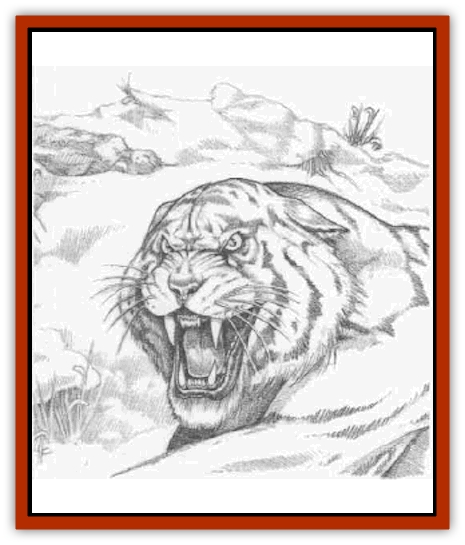

# Cat - Great - Snow Tiger

| Statistic | **Cat, Great, Snow Tiger** |
| --- | --- |
| **Activity Cycle:** | Day |
| **Alignment:** | Neutral |
| **Armor Class:** | 5 |
| **Climate/Terrain:** | Subarctic to temperate wilderness |
| **Damage/Attack:** | 1d6/1d6/1d10 |
| **Diet:** | Carnivore |
| **Frequency:** | Uncommon |
| **Hit Dice:** | 6+3 |
| **Intelligence:** | Semi- (2-4) |
| **Magic Resistance:** | Nil |
| **Morale:** | Average (8-10) |
| **Movement:** | 12 |
| **No. Appearing:** | 14 |
| **No. of Attacks:** | 3 |
| **Organization:** | Solitary |
| **Size:** | L (7-10' long) |
| **Special Attacks:** | Rear claws (2d4 each), speed burst |
| **Special Defenses:** | Never surprised, camouflage |
| **THAC0:** | 15 |
| **Treasure:** | Nil |
| **XP Value:** | 975 |

The great snow [[Cat_Great|tiger]] is a carnivorous beast, native to cold temperate mountains and subarctic brush. Snow tigers are vividly portrayed in legends, where they are credited with all manner of cunning, intelligence, and ferocity. Though dangerous predators and a fierce challenge to hunt, snow tigers are simply another large predator fighting for survival in cold, harsh climates.

Snow tigers change color with the season as do other subarctic and arctic species. During spring and summer they are pale brown, striped with green. In fall the snow tiger's coat slowly fades to white and black stripes.

**Combat:** Regardless of season, the tiger blends in quite effectively with its surroundings and is treated as a hidden object, gaining automatic surprise when attacking from hiding, unless other factors intervene. Their keen senses, honed by their harsh environment, prevent them from being surprised.

When attacking, snow tigers are capable of blinding bursts of speed, moving at double rate for 1d4 rounds without a penalty to attack or damage rolls.

The snow tiger attacks with a savage bite and raking claws. Like other great cats, the snow tiger has large and powerful rear claws. If both front claw attacks hit in a single round, the tiger automatically rakes with both rear claws, which rip opponents for 2d4 points of damage each.

**Habitat/Society:** Normally solitary, snow tigers may be encountered in mated pairs during spring and summer. During this period there is a 25% chance that a pair will have 1-2 cubs (no combat abilities). Rashemaar hunters sometimes take cubs and raise them as pets, training them to hunt. In order to be successfully trained, the cub must be less than three months old and the trainer must make three successive animal training proficiency checks. Only one check may be made per week, and if one fails the trainer must start all over again. Once a cub is over three months old, it cannot he trained and is usually returned to the wild.

**Ecology:** A cunning and resourceful predator, snow tigers prefer larger prey such as deer, mountain goats, sheep, and horses. During the depths of winter, snow tigers are sometimes reduced to stalking mice, rabbits, foxes, and other small game.

A few are intelligent enough to realize that humans are relatively easy prey, but this is rare. Most snow tigers avoid humans, and attack only if cornered or starving.

Snow tigers ars found throughout northern and eastern Faer�n, though they are most common in Rashemen. There, berserkers revere its speed, strength, and hunting skill, and often try to simulate its appeareance and behaviour - there is a Rashemaar Snow Tiger berserker lodge.

The Rashemaar admiration for the snow tiger does not preclude hunting the beast; in fact, it is considered a singular honor to have taken one single-handedly. Hunting snow tigers alone, unarmored, and armed only with a broad sword or a bow is a popular sport among Rashemaar nobles. Tales of intelligent tigers luring prey to its doom are but tales.

Cloaks of snow tiger fur are symbols of status among the Rashemaar and some barbarian tribes. They are never sold and may be worn only by the individual who successfully slew that tiger. Individuals who wear cloaks they are not entitled to wear are usually attacked by Rashemaar who learn their secret.

---
## Discovery & Documentation

**Source Publication:** Monstrous Compendium, 1996 Annual, Volume 3 (1995)
**Campaign Setting:** Advanced Dungeons & Dragons 2nd Edition
**Author(s):** Jon Pickens

### Other Creatures Found in This Source Book
   * [[Alaghi|Alaghi]]
   * [[Alhoon|Alhoon]]
   * [[Aranea_Savage_Coast|Aranea (Savage Coast)]]
   * [[Arcane_Head|Arcane Head]]
   * [[Banedead|Banedead]]
   * [[Banelich|Banelich]]
   * [[Bat_Bonebat|Bat, Bonebat]]
   * [[Beetle|Beetle]]
   * [[Belgoi|Belgoi]]
   * [[Bladeling|Bladeling]]
   * [[Braxat|Braxat]]
   * [[Bunyip|Bunyip]]
   * [[Burbur|Burbur]]
   * [[Bvanen|Bvanen]]
   * [[Chosen_One|Chosen One]]
   * [[Chronovoid|Chronovoid]]
   * [[Cildabrin|Cildabrin]]
   * [[Coffer_Corpse|Coffer Corpse]]
   * [[Disenchanter|Disenchanter]]
   * [[Dog_Temporal|Dog, Temporal]]
   * [[Dragon_Cerilia|Dragon (Cerilia)]]
   * [[Dragon_Ghost|Dragon, Ghost]]
   * [[Dragon_Lesser_Undead|Dragon, Lesser Undead]]
   * [[Dragon_Neutral_Amber|Dragon, Neutral, Amber]]
   * [[Dread_Warrior|Dread Warrior]]
   * [[Dreamweaver|Dreamweaver]]
   * [[Dream_Spawn_Greater_Ennui|Dream Spawn, Greater, Ennui]]
   * [[Dream_Spawn_Lesser_Morph|Dream Spawn, Lesser, Morph]]
   * [[Dwarf_Arctic|Dwarf, Arctic]]
   * [[Dwarf_Urdunnir|Dwarf, Urdunnir]]
   * [[Eel_Giant_Moray|Eel, Giant Moray]]
   * [[Elemental_Fire_Kin_Tome_Guardian|Elemental, Fire Kin, Tome Guardian]]
   * [[Elf_Rockseer|Elf, Rockseer]]
   * [[Ethyk|Ethyk]]
   * [[Faerie_Faerie_Fiddler|Faerie, Faerie Fiddler]]
   * [[Faerie_Petty_Bramble|Faerie, Petty, Bramble]]
   * [[Faerie_Petty_Gorse|Faerie, Petty, Gorse]]
   * [[Faerie_Petty|Faerie, Petty]]
   * [[Firenewt|Firenewt]]
   * [[Formian|Formian]]
   * [[Gargoyle_II|Gargoyle II]]
   * [[Giant_Cerilia|Giant (Cerilia)]]
   * [[Goblin_Cerilia|Goblin (Cerilia)]]
   * [[Golem_Magic|Golem, Magic]]
   * [[Golem_Shaboath|Golem, Shaboath]]
   * [[Hag_Bheur|Hag, Bheur]]
   * [[Hamadryad|Hamadryad]]
   * [[Hound_of_Ill-Omen|Hound of Ill-Omen]]
   * [[Human_Cerilia|Human (Cerilia)]]
   * [[Hybsil|Hybsil]]
   * [[Ibrandlin|Ibrandlin]]
   * [[Imp_Chaos|Imp, Chaos]]
   * [[Ixitxachitl_Ixzan|Ixitxachitl, Ixzan]]
   * [[Jabberwock|Jabberwock]]
   * [[Kyton|Kyton]]
   * [[Kyuss_Son_of|Kyuss, Son of]]
   * [[Lillend|Lillend]]
   * [[Life-Shaped_Creation_Guardian|Life-Shaped Creation, Guardian]]
   * [[Life-Shaped_Creation_Transport|Life-Shaped Creation, Transport]]
   * [[Lycanthrope_Werecrocodile|Lycanthrope, Werecrocodile]]
   * [[Lycanthrope_Werespider|Lycanthrope, Werespider]]
   * [[Magedoom|Magedoom]]
   * [[Manotaur|Manotaur]]
   * [[Mastiff_Shadow|Mastiff, Shadow]]
   * [[Meazel|Meazel]]
   * [[Mist_Scarlet_Dancer|Mist, Scarlet Dancer]]
   * [[Needleman|Needleman]]
   * [[Orc_Neo-Orog|Orc, Neo-Orog]]
   * [[Orc_Ondonti|Orc, Ondonti]]
   * [[Owlbear_II|Owlbear II]]
   * [[Pegataur|Pegataur]]
   * [[Phaerimm|Phaerimm]]
   * [[Reggelid|Reggelid]]
   * [[Render|Render]]
   * [[Saurial|Saurial]]
   * [[Scalamagdrion|Scalamagdrion]]
   * [[Sharn|Sharn]]
   * [[Snake_Messenger|Snake, Messenger]]
   * [[Spirit_Forest_Uthraki|Spirit, Forest, Uthraki]]
   * [[Spirit_Forest_Wood_Man|Spirit, Forest, Wood Man]]
   * [[Spirit_Ice_Orglash|Spirit, Ice, Orglash]]
   * [[Spirit_Rock_Thomil|Spirit, Rock, Thomil]]
   * [[Strider_Giant|Strider, Giant]]
   * [[Tembo|Tembo]]
   * [[Temporal_Glider|Temporal Glider]]
   * [[Temporal_Stalker|Temporal Stalker]]
   * [[Tether_Beast|Tether Beast]]
   * [[Thessalmonster|Thessalmonster]]
   * [[Time_Dimensional|Time Dimensional]]
   * [[Tomb_Tapper|Tomb Tapper]]
   * [[Undead_Dragon_Slayer|Undead Dragon Slayer]]
   * [[Unicorn_Black_Toril|Unicorn, Black (Toril)]]
   * [[Vaath|Vaath]]
   * [[Vortex_Spider|Vortex Spider]]
   * [[Weredragon|Weredragon]]
   * [[Zhentarim_Spirit|Zhentarim Spirit]]
