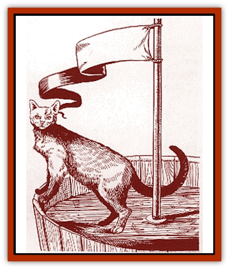

# Cat - Marine

| Statistic | **Cat, Marine** |
| --- | --- |
| **Activity Cycle:** | Any |
| **Alignment:** | Neutral |
| **Armor Class:** | 6 |
| **Climate/Terrain:** | Shipboard |
| **Damage/Attack:** | 1/1/1d2 |
| **Diet:** | Carnivore |
| **Frequency:** | Rare |
| **Hit Dice:** | 2+1 |
| **Intelligence:** | Semi- (2-4) |
| **Magic Resistance:** | Nil |
| **Morale:** | Average (8-10) |
| **Movement:** | 12 |
| **No. Appearing:** | 1d2 |
| **No. of Attacks:** | 3 |
| **Organization:** | Solitary |
| **Size:** | S (2' long) |
| **Special Attacks:** | Rear claws |
| **Special Defenses:** | Surprised only on a 1 |
| **THAC0:** | 19 |
| **Treasure:** | Nil |
| **XP Value:** | 120 |

Found only on sailing vessels, this rare breed of [[Cat_Small|cat]] is thought to bring luck on long voyages.

Marine cats are slightly larger and faster than normal cats and tend to be longer-lived as well. Most tend to be female, so males are both rare and valuable. Coloration resembles that of regular cats, with a tendency toward dark shades and bright eye color.

*The Red Curse:* Marine cats are occasionally born with Legacies, but they never require cinnabryl. They always acquire Legacies such as Swim, Breathe Water, or another similarly water-oriented Legacy. Such marine cats are very rare, and sailors consider them even luckier than normal. No vessel captain would dare part with such a cat.

**Combat:** These cats attack with both front claws and a bite. They can be very nasty if threatened, often aiming straight for an opponent's eyes. If the marine cat is being somehow held by its attacker and both of its front claw attacks succeed, it can attack with its back claws that round as well. These rear claws each inflict 1d2 points of damage.

**Habitat/Society:** Marine cats leave their vessels only for a brief tour of the docks. Though they sometimes visit other ships, they never board one that has its own marine cat. This is simply a manner of etiquette. Marine cats meet each other either on the docks or if one captain brings his cat to "visit" the other's ship. These creatures are never taken by sailors from other ships, because it is very bad luck to steal another ship's marine cat.

On the vessel a marine cat can get into any area. Sailors often find their cats up in the rigging, in locked staterooms, or sleeping in the weapons magazines. A marine cat loves to generate surprise and will seek to position itself high enough that when a nearby person turns around he is staring right into the cat's unblinking eyes.

Sailors often feed their cats by hand, offering pieces of fish and beef from their own plates. Marine cats also hunt the cargo holds, feeding on rats and keeping the ship free of [[Voat|voats]]. Strangers taking passage on the vessel will find themselves under constant scrutiny by the cat, who likes change only when it is the one causing it.

Marine cats, lucky or not, do seem to protect the welfare of the ship. If someone is not where he is supposed to be, likely as not he will step on the cat's tail, causing it to cry out and notifying everyone nearby of his presence. When a lookout falls asleep, oblivious to a nearby danger, the cat may then decide that the man's earring makes a perfect toy.

**Ecology:** Marine cats feed on rats, voats, and whatever table scraps the sailors give them. They are an interesting addition to shipboard life that sailors seem to enjoy.

---
## Discovery & Documentation

**Source Publication:** Monstrous Compendium Savage Coast Appendix (Online Exclusive) (1995)
**Campaign Setting:** Mystara
**Author(s):** Loren L Coleman, Ted James, Thomas Zuvich, Cindi M. Rice

### Other Creatures Found in This Source Book
   * [[Aranea_Savage_Coast|Aranea (Savage Coast)]]
   * [[Arashaeem|Arashaeem]]
   * [[Batracine|Batracine]]
   * [[Cinnavixen|Cinnavixen]]
   * [[Clockwork_Swordsman|Clockwork Swordsman]]
   * [[Critter_Temple|Critter, Temple]]
   * [[Cursed_One|Cursed One]]
   * [[Deathmare|Deathmare]]
   * [[Dragon_Savage_Coast_Crimson|Dragon (Savage Coast), Crimson]]
   * [[Dragon_Savage_Coast_Red_Hawk|Dragon (Savage Coast), Red Hawk]]
   * [[Echyan|Echyan]]
   * [[Ee'aar|Ee'aar]]
   * [[Enduk|Enduk]]
   * [[Fachan_Savage_Coast|Fachan (Savage Coast)]]
   * [[Feliquine|Feliquine]]
   * [[Fiend_Narvaezan|Fiend, Narvaezan]]
   * [[Frelôn|Frelôn]]
   * [[Ghriest|Ghriest]]
   * [[Glutton_Sea|Glutton, Sea]]
   * [[Goatman|Goatman]]
   * [[Golem_Naâruk|Golem, Naâruk]]
   * [[Golem_Savage_Coast|Golem (Savage Coast)]]
   * [[Grudgling|Grudgling]]
   * [[Heraldic_Servant_I|Heraldic Servant I]]
   * [[Heraldic_Servant_II|Heraldic Servant II]]
   * [[Heraldic_Servant_III|Heraldic Servant III]]
   * [[Heraldic_Servant_IV|Heraldic Servant IV]]
   * [[Heraldic_Servant_V|Heraldic Servant V]]
   * [[Heraldic_Servant_General_Information|Heraldic Servant, General Information]]
   * [[Hermit_Sea|Hermit, Sea]]
   * [[Jorri|Jorri]]
   * [[Juhrion|Juhrion]]
   * [[Kla'a-tah|Kla'a-tah]]
   * [[Leech_Legacy|Leech, Legacy]]
   * [[Lich_Inheritor|Lich, Inheritor]]
   * [[Lizard_Kin_Savage_Coast|Lizard Kin (Savage Coast)]]
   * [[Lupasus|Lupasus]]
   * [[Lupin|Lupin]]
   * [[Lyra_Bird_Saragón|Lyra Bird, Saragón]]
   * [[Malfera|Malfera]]
   * [[Manscorpion_Nimmurian|Manscorpion, Nimmurian]]
   * [[Mythuínn_Folk|Mythuínn Folk]]
   * [[Neshezu|Neshezu]]
   * [[Nikt'oo|Nikt'oo]]
   * [[Nosferatu|Nosferatu]]
   * [[Omm-wa|Omm-wa]]
   * [[Omshirim|Omshirim]]
   * [[Parasite_Savage_Coast|Parasite (Savage Coast)]]
   * [[Phanaton|Phanaton]]
   * [[Plant_Savage_Coast|Plant (Savage Coast)]]
   * [[Pudding_Vermilion|Pudding, Vermilion]]
   * [[Rakasta|Rakasta]]
   * [[Ray_Forest|Ray, Forest]]
   * [[Shedu_Greater_Savage_Coast|Shedu, Greater (Savage Coast)]]
   * [[Shimmerfish|Shimmerfish]]
   * [[Skinwing|Skinwing]]
   * [[Spawn_of_Nimmur|Spawn of Nimmur]]
   * [[Spider-spy|Spider-spy]]
   * [[Spirit_Heroic|Spirit, Heroic]]
   * [[Spirit_Walleran|Spirit, Walleran]]
   * [[Succulus|Succulus]]
   * [[Swampmare|Swampmare]]
   * [[Symbiont_Shadow|Symbiont, Shadow]]
   * [[Tortle|Tortle]]
   * [[Troll_Legacy|Troll, Legacy]]
   * [[Trosip|Trosip]]
   * [[Tyminid|Tyminid]]
   * [[Utukku|Utukku]]
   * [[Voat|Voat]]
   * [[Voat_Herathian|Voat, Herathian]]
   * [[Vulturehound|Vulturehound]]
   * [[Wallara|Wallara]]
   * [[Wurmling|Wurmling]]
   * [[Wynzet|Wynzet]]
   * [[Yeshom|Yeshom]]
   * [[Zombie_Red|Zombie, Red]]
