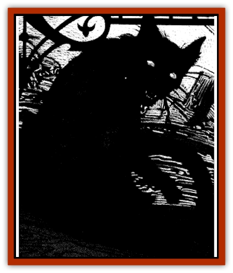

# Cat - Midnight

| Statistic | **Cat, Midnight** |
| --- | --- |
| **Activity Cycle:** | Night |
| **Alignment:** | Lawful evil |
| **Armor Class:** | 4 |
| **Climate/Terrain:** | Any non-arctic urban |
| **Damage/Attack:** | 1d2/1d2; rake 1d2/1d2 |
| **Diet:** | Life force |
| **Frequency:** | Very rare |
| **Hit Dice:** | 3+6 |
| **Intelligence:** | Average (8-10) |
| **Magic Resistance:** | 25% |
| **Morale:** | Elite (13-14) |
| **Movement:** | 18 |
| **No. Appearing:** | 1 |
| **No. of Attacks:** | 3 |
| **Organization:** | Solitary |
| **Size:** | T (1' tall) |
| **Special Attacks:** | Spirit drain, curse |
| **Special Defenses:** | Nil |
| **THAC0:** | 17 |
| **Treasure:** | Nil |
| **XP Value:** | 1,400 |

Little is known about these brooding creatures save that they are found most frequently in the company of evil spellcasters. While they are often sought out for their rumored ability to lift curses, they are greatly feared for their ability to bestow the same. The most dreadful and least understood power of these ebon felines, however, is their ability to consume the very spirit of a living being, leaving behind a drained and empty shell.

Midnight cats are easily mistaken for ordinary [[Cat_Small|house cats]] with lustrous coats of soft, ink-black fur. A closer examination, however, will reveal that their luminous yellow-green eyes are utterly pupilless and glow with an inner light in even the darkest of places.

Midnight cats can speak a crude form of common but generally choose to do so only when laying a curse upon an enemy. When they wish to, these creatures can converse freely with non-magical felines, although they have no power to command them in any way.

**Combat:** Midnight cats share all of the predatory skill of their more common cousins. In addition, their powerful eyes enable them to see perfectly well in anything but absolute darkness (such as that created by the spell of that name). Their natural stealth imposes a -3 penalty on the surprise rolls of their opponents and they themselves are surprised only on a roll of 1 on 1d10. Midnight cats have a 99% chance of moving silently and an 85% chance of hiding in shadows. They are good climbers and can scale trees or similar objects at half their normal movement rate without any die roll. They can make a standing jump of 10 feet and easily leap up to 20' with a running start.

The midnight cat can use its claws to defend itself, striking with both of its front claws for 1d2 points of damage each. If it hits with both of these, it can automatically rake with its rear claws for an additional 1d2 points of damage each.

A midnight cat is quick to take offense and will cast embarrassing and frustrating curses at the least infraction. Troublesome curses may be cast on opponents that a cat is especially displeased with. Dangerous or lethal curses can be laid by a midnight cat only when it is gravely threatened (reduced to fewer than 5 hit points).

A midnight cat can lift troublesome, embarrassing, or frustrating curses at will. It is very difficult to persuade them to lift any curse, however, unless they are paid for their efforts. Generally, this recompense takes the form of evil deeds done on behalf of the sinister feline.

The midnight cat sustains itself by devouring the spirits of the living. As this ability can only be used upon sleeping victims, it is seldom effective in combat. To satisfy its hunger, the beast crawls onto its victim's chest and inhales sharply near the victim's lips. If a saving throw vs. breath weapon fails, a thin trail of vapor issues from the lips of the victim and courses into the mouth of the cat. A victim of this attack cannot heal new or existing damage by magical or natural means, cannot be cured of a disease, and loses the ability to employ any form of magical spells or turn undead. These symptoms persist until either the victim dies of the midnight cat is killed.

**Habitat/Society:** These coy, epicurean creatures insist on being waited upon by others and will only hunt for their food when forced to do so. Midnight cats usually adopt a "master" upon whom they rely for these creature comforts. As a rule, they choose spellcasters as companions. They seem to be able to detect when a *find familiar* spell has been cast by such people and are able to make themselves the subject of the spell.

**Ecology:** The midnight cat was first discovered in the domain of Tepest and is believed to be a dark strain of the [[Cat_Small|elven cat]].

---
## Discovery & Documentation

**Source Publication:** Ravenloft Appendix III (1991)
**Campaign Setting:** Ravenloft
**Author(s):** Kirk Botulla

### Other Creatures Found in This Source Book
   * [[Akikage|Akikage]]
   * [[Animator_Common|Animator, Common]]
   * [[Animator_Greater|Animator, Greater]]
   * [[Animator_Minor|Animator, Minor]]
   * [[Animator_General_Information|Animator, General Information]]
   * [[Bakhna_Rakhna|Bakhna Rakhna]]
   * [[Baobhan_Sith|Baobhan Sith]]
   * [[Beetle_Scarab|Beetle, Scarab]]
   * [[Boneless|Boneless]]
   * [[Boowray|Boowray]]
   * [[Bruja|Bruja]]
   * [[Carrionette|Carrionette]]
   * [[Carrion_Stalker|Carrion Stalker]]
   * [[Cat_Skeletal|Cat, Skeletal]]
   * [[Cloaker_Resplendent|Cloaker, Resplendent]]
   * [[Cloaker_Shadow|Cloaker, Shadow]]
   * [[Cloaker_Undead|Cloaker, Undead]]
   * [[Corpse_Candle|Corpse Candle]]
   * [[Death's_Head_Tree|Death's Head Tree]]
   * [[Doppelganger_Ravenloft|Doppelganger (Ravenloft)]]
   * [[Familiar_Pseudo-|Familiar, Pseudo-]]
   * [[Familiar_Undead|Familiar, Undead]]
   * [[Feathered_Serpent|Feathered Serpent]]
   * [[Fenhound|Fenhound]]
   * [[Figurine_Ceramic|Figurine, Ceramic]]
   * [[Figurine_Crystal|Figurine, Crystal]]
   * [[Figurine_Ivory|Figurine, Ivory]]
   * [[Figurine_Obsidian|Figurine, Obsidian]]
   * [[Figurine_Porcelain|Figurine, Porcelain]]
   * [[Figurine_General_Information|Figurine, General Information]]
   * [[Fleas_of_Madness|Fleas of Madness]]
   * [[Furies|Furies]]
   * [[Geist|Geist]]
   * [[Ghost_Animal|Ghost, Animal]]
   * [[Golem_Flesh_Ravenloft|Golem, Flesh (Ravenloft)]]
   * [[Golem_Mist_Ravenloft|Golem, Mist (Ravenloft)]]
   * [[Golem_Wax_Ravenloft|Golem, Wax (Ravenloft)]]
   * [[Gremishka|Gremishka]]
   * [[Hag_Spectral|Hag, Spectral]]
   * [[Head_Hunter|Head Hunter]]
   * [[Hearth_Fiend|Hearth Fiend]]
   * [[Hebi-No-Onna|Hebi-No-Onna]]
   * [[Hound_Phantom|Hound, Phantom]]
   * [[Hound_Skeletal|Hound, Skeletal]]
   * [[Imp_Wishing|Imp, Wishing]]
   * [[Ivy_Crawling|Ivy, Crawling]]
   * [[Jack_Frost|Jack Frost]]
   * [[Jolly_Roger|Jolly Roger]]
   * [[Kizoku|Kizoku]]
   * [[Lashweed|Lashweed]]
   * [[Leech_Magical|Leech, Magical]]
   * [[Leech_Psionic|Leech, Psionic]]
   * [[Lich_Defiler|Lich, Defiler]]
   * [[Lich_Drow|Lich, Drow]]
   * [[Lich_Elemental|Lich, Elemental]]
   * [[Lich_Psionic|Lich, Psionic]]
   * [[Living_Tattoo|Living Tattoo]]
   * [[Lycanthrope_Loup-garou|Lycanthrope, Loup-garou]]
   * [[Lycanthrope_Werejackal|Lycanthrope, Werejackal]]
   * [[Lycanthrope_Werejaguar_Ravenloft|Lycanthrope, Werejaguar (Ravenloft)]]
   * [[Lycanthrope_Wereleopard|Lycanthrope, Wereleopard]]
   * [[Lycanthrope_Wereray|Lycanthrope, Wereray]]
   * [[Mist_Ferryman|Mist Ferryman]]
   * [[Moor_Man|Moor Man]]
   * [[Obedient|Obedient]]
   * [[Odem|Odem]]
   * [[Paka|Paka]]
   * [[Plant_Blood_Rose|Plant, Blood Rose]]
   * [[Plant_Fearweed|Plant, Fearweed]]
   * [[Radiant_Spirit|Radiant Spirit]]
   * [[Recluse|Recluse]]
   * [[Remnant_Aquatic|Remnant, Aquatic]]
   * [[Rushlight|Rushlight]]
   * [[Sea_Spawn_Master|Sea Spawn, Master]]
   * [[Sea_Spawn_Minion|Sea Spawn, Minion]]
   * [[Shadow_Asp|Shadow Asp]]
   * [[Shattered_Brethren|Shattered Brethren]]
   * [[Skeleton_Archer|Skeleton, Archer]]
   * [[Skeleton_Insectoid|Skeleton, Insectoid]]
   * [[Skin_Thief|Skin Thief]]
   * [[Spirit_Psionic|Spirit, Psionic]]
   * [[Strahd_Skeleton|Strahd Skeleton]]
   * [[Strahd_Zombie|Strahd Zombie]]
   * [[Unicorn_Shadow|Unicorn, Shadow]]
   * [[Vampire_Drow|Vampire, Drow]]
   * [[Vampire_Nosferatu|Vampire, Nosferatu]]
   * [[Vampire_Oriental|Vampire, Oriental]]
   * [[Virus_General_Information|Virus, General Information]]
   * [[Virus_I|Virus I]]
   * [[Virus_II|Virus II]]
   * [[Virus_III|Virus III]]
   * [[Vorlog|Vorlog]]
   * [[Will_O'Dawn|Will O'Dawn]]
   * [[Will_O'Deep|Will O'Deep]]
   * [[Will_O'Mist|Will O'Mist]]
   * [[Will_O'Sea|Will O'Sea]]
   * [[Zombie_Cannibal|Zombie, Cannibal]]
   * [[Zombie_Desert|Zombie, Desert]]
   * [[Zombie_Wolf|Zombie Wolf]]
   * [[Zombie_Fog|Zombie Fog]]
