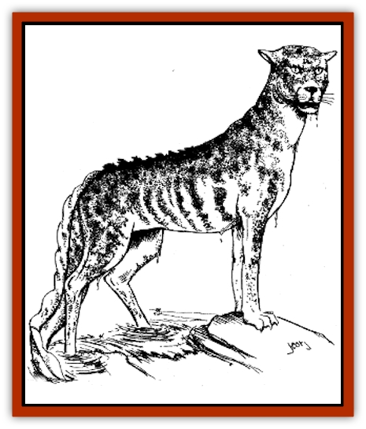
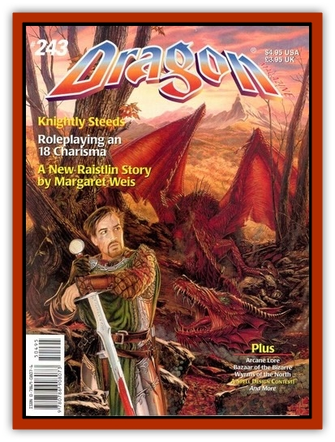

# Cat - Moat

| Statistic | **Cat, Moat** |
| --- | --- |
| **Activity Cycle:** | Any |
| **Alignment:** | Neutral |
| **Armor Class:** | 6 |
| **Climate/Terrain:** | Aquatic (usually moats) |
| **Damage/Attack:** | 1-3/1-3/1-6 |
| **Diet:** | Carnivore |
| **Frequency:** | Very rare |
| **Hit Dice:** | 3 |
| **Intelligence:** | Semi- (2-4) |
| **Magic Resistance:** | Nil |
| **Morale:** | Average (8-10) |
| **Movement:** | 15, sprint 30, swim 12 |
| **No. Appearing:** | 1-4 |
| **No. of Attacks:** | 3 |
| **Organization:** | Solitary or family group |
| **Size:** | M (4-5' long) |
| **Special Attacks:** | Surprise, rear claws 1-4/1-4 |
| **Special Defenses:** | Surprised only on a 1 |
| **THAC0:** | 17 |
| **Treasure:** | Nil |
| **XP Value:** | 175 |

Moat cats are magical crossbreeds of newts and large cats such as cheetahs or mountain lions. Amphibious, they must keep their skin wet, and thus make perfect guardians for a wizard's castle moat.

Coloration differs from animal to animal but generally follows that of the newt used in the creature's creation. Black, red, and brown are common colors for moat cats, but in each case there is often a series of spots of contrasting colors - white mottling on a black-skinned moat cat, for instance, or black mottling on a red one. Gills are located on either side of the head, just behind the jaw. The eyes of a moat cat are in almost all cases cat-like: green, with vertical pupils.

**Combat:** Moat cats have kept the standard cat-like physiognomy, except for their tails, which are thicker and generally more lizardlike, and their skin, which is sleek and smooth. They attack with their teeth and front claws. If both front claws hit, they may rake with their back claws for an additional 1d4 hp damage each. Moat cats, able to breathe water or air with equal ease, often stay completely submerged, then spring up to attack intruders. Opponents suffer a penalty of -3 to their surprise rolls when this occurs.

Those that flee the moat for the safety of dry land are in for a surprise, as moat cats are not restricted to the water. In fact, they are quite mobile on land, able to reach a speed of 30 for three rounds before tiring. However, after three rounds of sprinting the moat cat must rest up for a full three turns before sprinting again.

**Habitat/Society:** Since moat cats must remain near water, they are unlikely to travel far from the moats where they are placed. They usually stray only a mile or so, and then only to hunt, returning to the moat to feed and sleep. This inadvertent loyalty keeps the creatures near the wizard's moat.

Perhaps because of their amphibious nature, moat cats do not need to feed as often as would a great cat of a comparable size. Each adult moat cat requires a sheep or similarly sized creature every other week or so. They are gluttonous during feasting but then become somewhat lethargic during the next day while they digest. One way to try to get past a moat cat is to provide it with food, but this tactic isn't always successful, as moat cats prefer to hunt down their own food rather than be fed by others. An intruder dumping a slain goat into a moat cat's moat in the hopes of slipping past it while it eats will probably find the creature ignoring the proffered meal in favor of the intruder himself.

**Ecology:** Besides being able to breathe water and requiring moisture on their skin to prevent them from drying up (moat cats take 1d6 hp damage every full hour they are out of water), they also lay jellylike eggs in the water. These eggs will hatch into 20-50 (1d4+1 x 10) moat cat cubs, over half of which will end up being devoured by the adults. Usually only 1-4 of a given litter survive to full adulthood.

The "cub" stage of a moat cat's development is similar to that of the "tadpole" stage of most frogs and toads. As a cub, the moat cat has no limbs, but swims by means of its powerful tail. Moat cat cubs have 1 HD, swim at a speed of 6 and bite for 1-3 hp damage. After a year, they gain another hit die, grow legs, and begin to move about on land. At this point, they  will be taught how to hunt by the parents, and by two years of age they will have achieved full adult status. Moat cats have a life span of about 12 to 15 years.

Like true amphibians, moat cats cannot survive in salt water. They will occasionally make their homes in rivers, lakes or ponds, but wizards who create moat cats make them specifically as guard animals for their castle moats. Moat cats can be trained to some degree, but training must begin at a very early age in order for it to take effect. Most wizards have a few *charm monster* or *hold monster* spells ready for use when dealing with their moat cat guardians, to prevent them from attacking expected guests.

It should be noted that moat cats are silent creatures. Like the newts that are used in their creation, they make no vocalizations, so no great cat's growl or roar will alert prey to the moat cat's existence. More often than not, intruders first become aware of the aquatic predator when it pounces up at them�and by then, its usually far too late.

---
## Discovery & Documentation

**Source Publication:** Dragon243 (1998)
**Campaign Setting:** Dragon Magazine
**Author(s):** Steve Berman, Roger Raupp, Johnathan M. Richards, George Vrbanic

### Other Creatures Found in This Source Book
   * [[Armadillephant|Armadillephant]]
   * [[Duckbunny|Duckbunny]]
   * [[Horse_Spider-|Horse, Spider-]]
   * [[Turtle_Dragonfly|Turtle, Dragonfly]]
