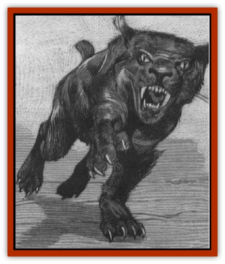

# Cat - Plains

| Statistic | **Cat, Plains** |
| --- | --- |
| **Activity Cycle:** | Night |
| **Alignment:** | Neutral |
| **Armor Class:** | 5 |
| **Climate/Terrain:** | Temperate grasslands |
| **Damage/Attack:** | 1d4/1d4/1d6 |
| **Diet:** | Carnivore |
| **Frequency:** | Rare |
| **Hit Dice:** | 4+1 |
| **Intelligence:** | Semi- (2-4) |
| **Magic Resistance:** | Nil |
| **Morale:** | Average (8-10) |
| **Movement:** | 15 |
| **No. Appearing:** | 1d4 |
| **No. of Attacks:** | 3 |
| **Organization:** | Solitary |
| **Size:** | Large (5' long) |
| **Special Attacks:** | Leap, rear claws |
| **Special Defenses:** | Move silently |
| **THAC0:** | 17 |
| **Treasure:** | Nil |
| **XP Value:** | 420 |

Plains cats are large black [[Cat_Great|felines]] with bobbed tails. The males have distinctive white tufts of hair at the ends of their ears.

When a plains cat roars, the sound is amazingly like that of a human scream. A female and her litter will hunt as a group, the mother using her roar-scream to startle prey into moving and giving away its location to her young.

**Combat:** Plains cats have a 90% chance of moving with absolute silence through the grasslands. They hunt at night, relying upon their black pelts to make them all but invisible.

A plains cat's first attack will be a sudden leap out of the darkness. Plains cats are capable of leaping 25 feet up or 30 feet ahead. If they strike successfully with both forepaws, they automatically rake with their rear claws for 1d4 points each. The plains cat's second and subsequent attacks will be with both forepaws and teeth.

Immature plains cats have 2 Hit Dice and can only leap half the distance of an adult. They also inflict half the damage of an adult.

**Habitat/Society:** Plains cats make their dens in caves near grasslands. They live a solitary existence, and the only time more than one plains cat is encountered is when a female is out bunting with her offspring. Females can bear one to three offspring per litter (but in the perpetually warm domain of Nova Vaasa, they can bear two litters per year).

To find a mate, a plains cat emits a call that can be heard for several miles. If there is a response, a series of call-and-responses will be uttered. To the untrained ear, these roars sound like agonized screams.

**Ecology:** Plains cats are primarily found in the Ravenloft domain of Nova Vaasa, although a few range into the grasslands of neighboring Hazlan. They prey upon the wild herds of [[Horse|horses]] in Nova Vaasa, and occasionally upon human travelers foolish enough to pass through the grasslands at night.

Plains cats are most numerous in the southwestern corner of Nova Vaasa, where the foothills of the Balinok Mountains offer a number of caves they can use for dens. Plains cats are capable of traveling great distances while hunting, and so they can be found even on the eastern fringes of the domain.

The people of Nova Vaasa believe that the white ear tufts of the male plains cat are a potent charm for anyone about to embark on an endeavor where stealth and silence will be essential. Thieves often wear finger rings of braided plains cat hair as a good luck charm.

The fur of a plains cat is a rich, glossy black. A pelt will fetch a high price in the markets of Nova Vaasa. Items trimmed with plains cat fur have a cost that is out of the reach of a common citizen.

---
## Discovery & Documentation

**Source Publication:** The Awakening (1994)
**Campaign Setting:** Ravenloft
**Author(s):** Lisa Smedman, Richard Pike-Brown 

### Other Creatures Found in This Source Book
   * [[Cat_Crypt|Cat, Crypt]]
   * [[Elemental_Smoke|Elemental, Smoke]]
