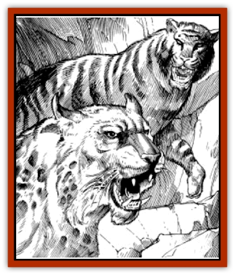

# Cat - Psionic

| Statistic | **Tagster** | **Tigone** |
| --- | --- | --- |
| **Activity Cycle:** | Night | Any |
| **Alignment:** | Neutral | Neutral |
| **Armor Class:** | 6 | 6 |
| **Climate/Terrain:** | Sandy Wastes, Tablelands | Mountains, Hinterlands |
| **Damage/Attack:** | 1-3/1-3/1-8/1-4/1-4 | 1-3/1-3/1-10/1-4/1-4 |
| **Diet:** | Carnivore | Carnivore |
| **Frequency:** | Uncommon | Uncommon |
| **Hit Dice:** | 4+2 | 5+2 |
| **Intelligence:** | Semi- (2) | Semi- (2) |
| **Magic Resistance:** | Nil | Nil |
| **Morale:** | Average (9) | Average (9) |
| **Movement:** | 15 | 12 |
| **No. Appearing:** | 1 | 1-4 |
| **No. of Attacks:** | 5 | 5 |
| **Organization:** | Solitary | Pride |
| **Size:** | M (4') | M (5-7') |
| **Special Attacks:** | Psionic | Psionic |
| **Special Defenses:** | Psionic | Psionic |
| **THAC0:** | 17 | 15 |
| **Treasure:** | Nil | Nil |
| **XP Value:** | 270 | 420 |

**Psionics Summary**

| Level | Dis/Sci/Dev | Attack/Defense | Score | PSPs |
| --- | --- | --- | --- | --- |
| 6 | 2/2/10 | -/IF,MB | 16 | 100 |

**Clairsentience -** *Science:* clairvoyance; *Devotions:* all-round vision, danger sense, know direction, poison sense, radial navigation.

**Telepathy -** *Science:* domination; *Devotions:* awe, contact, ESP, invincible foes, life detection.

These [[Cat_Great|great cats]] are gifted with psionic powers that they use to stalk prey. Like all cats, they prefer to kill with their natural weapons.

## Tagster

The tagster has short yellowish-brown fur with whitish underparts. Sometimes spotted, tagsters always have some type of a distinctive dark marking (spot on tail, foot, etc.).

**Combat:** Tagsters use their psionics to locate and track their prey. Psionics are not used close to the victim to avoid alerting them to the tagster's presence. A favorite tactic is to charge an opponent from the flank in order to catch them by surprise. Tagsters use their front claws (1d3) first on their victim before attempting their bite attack (1d8). They will also rake the victim with their rear claws (1d4). The kill is then dragged away to a place of safety before being devoured.

**Habitat/Society:** These solitary creatures roam desert trade routes and the tablelands, establishing territories. During the yearly mating season, tagsters are known to congregate. Two male tagsters often fight to the death for the affection of a female. This fight can be heard for miles. If interrupted, the two cats will slay the intruder together before attempting to finish off each other.

**Ecology:** These predators illustrate the "only the strong survive" rule of life on Athas. Slow, ill, or injured herd animals are sometimes abandoned by herders so that the tagster does not attack the main flock or herd.

## Tigone

Tigones are large, feline creatures which are dark green in color and have black or yellowish-brown vertical striping. Growing to a length of 7', they can weigh over 250 pounds.

**Combat:** Psionically endowed, tigones use a mix of stealth and power to slay foes and prey. Tigones hunt in concentric circles using their radial navigation ability; they start at a spot on the fringe of their territory and working around toward the center. When attacking, they prefer to leap onto their victim from above, driving their victim to a prone position where they can use their size to keep their opponent pinned. They attack with their forepaws (1d3) while simultaneously raking with their rear claws (1d4) and biting (1d10).

**Habitat/Society:** Native of the Hinterlands, tigones have been known to roam the Ringing Mountains. They are fearful predators and will attack almost any creature violating their territory. Because of their coloration, a tigone is almost impossible to see when holding perfectly still in the underbrush. They also move very quietly through any terrain. They dislike warm environments and soon die if forced into the desert.

**Ecology:** Highly sought for gladiatorial games, most tigones do not survive the trip across the desert. They bring a handsome price if successfully transported to a sorcerer-king's city. [[Halfling_Athas|Halflings]] prize tigones as hunting partners because of their psionic tracking and hunting skills.

---
## Discovery & Documentation

**Source Publication:** MC12 Dark Sun Appendix I - Terrors of the Desert (1991)
**Campaign Setting:** Dark Sun
**Author(s):** Tom Prusa, Louis J. Prosperi, Walter M. Baas

### Other Creatures Found in This Source Book
   * [[Animal_Herd_Athas|Animal, Herd (Athas)]]
   * [[Animal_Household_Athas|Animal, Household (Athas)]]
   * [[Antloid_Desert|Antloid, Desert]]
   * [[Banshee_Dwarf|Banshee, Dwarf]]
   * [[Beetle_Agony|Beetle, Agony]]
   * [[Bog_Wader|Bog Wader]]
   * [[Brambleweed|Brambleweed]]
   * [[B'rohg|B'rohg]]
   * [[Burnflower|Burnflower]]
   * [[Cha'thrang|Cha'thrang]]
   * [[Cistern_Fiend|Cistern Fiend]]
   * [[Clam_Giant|Clam, Giant]]
   * [[Cloud_Ray|Cloud Ray]]
   * [[Drake_Athas_Air|Drake (Athas), Air]]
   * [[Drake_Athas_Earth|Drake (Athas), Earth]]
   * [[Drake_Athas_Fire|Drake (Athas), Fire]]
   * [[Drake_Athas_Water|Drake (Athas), Water]]
   * [[Dune_Runner|Dune Runner]]
   * [[Dune_Trapper|Dune Trapper]]
   * [[Elemental_Athas_Greater_Air|Elemental (Athas), Greater, Air]]
   * [[Elemental_Athas_Greater_Earth|Elemental (Athas), Greater, Earth]]
   * [[Elemental_Athas_Greater_Fire|Elemental (Athas), Greater, Fire]]
   * [[Elemental_Athas_Greater_Water|Elemental (Athas), Greater, Water]]
   * [[Elemental_Athas_Lesser_Air_Earth|Elemental (Athas), Lesser, Air/Earth]]
   * [[Elemental_Athas_Lesser_Fire_Water|Elemental (Athas), Lesser, Fire/Water]]
   * [[Elemental_Athas_General_Information|Elemental (Athas), General Information]]
   * [[Erdland|Erdland]]
   * [[Esperweed|Esperweed]]
   * [[Flailer|Flailer]]
   * [[Floater|Floater]]
   * [[Giant_Athas|Giant (Athas)]]
   * [[Golem_Athas_I|Golem (Athas) I]]
   * [[Golem_Athas_II|Golem (Athas) II]]
   * [[Golem_Athas_III|Golem (Athas) III]]
   * [[Golem_Athas_General_Information|Golem (Athas), General Information]]
   * [[Halfling_Renegade|Halfling, Renegade]]
   * [[Hej-kin|Hej-kin]]
   * [[Id_Fiend|Id Fiend]]
   * [[Insect_Swarm_Athas|Insect Swarm (Athas)]]
   * [[Kank_Wild|Kank, Wild]]
   * [[Kirre|Kirre]]
   * [[Megapede|Megapede]]
   * [[Mul_Wild|Mul, Wild]]
   * [[Nightmare_Beast|Nightmare Beast]]
   * [[Plant_Carnivorous_Athas|Plant, Carnivorous (Athas)]]
   * [[Pterran|Pterran]]
   * [[Pterrax|Pterrax]]
   * [[Pulp_Bee|Pulp Bee]]
   * [[Pyreen|Pyreen]]
   * [[Rasclinn|Rasclinn]]
   * [[Razorwing|Razorwing]]
   * [[Roc_Athas|Roc (Athas)]]
   * [[Sand_Bride|Sand Bride]]
   * [[Sand_Cactus|Sand Cactus]]
   * [[Sand_Vortex|Sand Vortex]]
   * [[Scrab|Scrab]]
   * [[Silt_Horror|Silt Horror]]
   * [[Silt_Runner|Silt Runner]]
   * [[Sink_Worm|Sink Worm]]
   * [[Sloth_Athas|Sloth (Athas)]]
   * [[So-ut|So-ut]]
   * [[Spider_Cactus|Spider Cactus]]
   * [[Spider_Crystal|Spider, Crystal]]
   * [[Spirit_of_the_Land|Spirit of the Land]]
   * [[T'Chowb|T'Chowb]]
   * [[Thrax|Thrax]]
   * [[Tohr-kreen_I|Tohr-kreen I]]
   * [[Villichi|Villichi]]
   * [[Zhackal|Zhackal]]
   * [[Zombie_Plant|Zombie Plant]]
