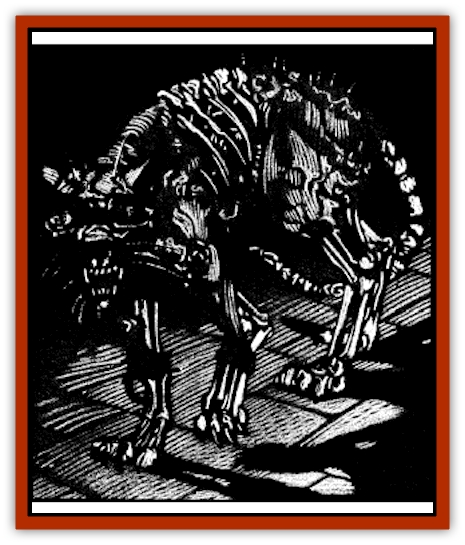

# Cat - Skeletal

| Statistic | **Cat, Skeletal** |
| --- | --- |
| **Activity Cycle:** | Night |
| **Alignment:** | Neutral |
| **Armor Class:** | 6 |
| **Climate/Terrain:** | Any |
| **Damage/Attack:** | 1d2/1d2; rake 1d2/1d2 |
| **Diet:** | None |
| **Frequency:** | Uncommon |
| **Hit Dice:** | 1 |
| **Intelligence:** | Non- (0) |
| **Magic Resistance:** | Nil |
| **Morale:** | Fearless (19-20) |
| **Movement:** | 18 |
| **No. Appearing:** | 4-40 (4d10) |
| **No. of Attacks:** | 3 |
| **Organization:** | Pack |
| **Size:** | T (1' tall) |
| **Special Attacks:** | Cling |
| **Special Defenses:** | Spell immunity |
| **THAC0:** | 19 |
| **Treasure:** | Nil |
| **XP Value:** | 65 |

Skeletal [[Cat_Small|cats]] are the ambulatory remains of pets who have clawed their way back from the grave to avenge themselves upon masters who treated them poorly or ended their lives. These creatures are not terribly dangerous by themselves, but often form packs that are nearly unstoppable.

Skeletal cats appear to be animated feline [[Skeleton|skeletons]]. Unlike the skeletons summoned by spellcasters, these self-willed creatures often have tatters of fur and desiccated flesh clinging to their bones. Until the flesh of the creature completely rots away, it exudes the odor of rotting carrion.

Skeletal cats have no language, but are known for the ominous caterwauling that often fills the night prior to an attack.

**Combat:** Skeletal cats are agile hunters. They move with surprising grace causing opponents to suffer a -3 penalty on surprise rolls. Because their naturally sharp senses have been heightened in death, a skeletal cat can never be surprised.

Skeletal cats can attack as their living counterparts with claws and teeth. Each attack delivers 1d2 points of damage to their victim. If they hit with both claws they can use their rear claws to rake their victim, doing an additional 1d2 points with each rear claw. Anyone bitten by a skeletal cat has a 10% chance of contracting a debilitating disease (as per the *cause disease* spell) that can only be treated with a *cure disease* spell.

If a skeletal cat successfully rakes its victim, it will cling to him. One cat can cling to a person per foot of height, so that six may attach themselves to the average man. A victim suffers a -1 penalty on its Attack or Damage Rolls and a -2 to his Movement Rate for each such creature clinging to it. A clinging cat may rake again on the next round.

Skeletal cats are immune to all *sleep*, *charm*, *fear*, and *hold* spells. Cold-based, poison, or paralyzation attacks do them no harm and edged or piercing weapons inflict only half damage. Blunt weapons and fire do normal damage to them. These creatures are never required to make morale checks.

Skeletal cats retain the aversion to water that they had in life. As such, water-based attacks will cause a skeletal cat to flee if there is an open escape route. If the cat is cornered, however, it will fight with renewed vigor resulting in a +2 bonus to its Attack Rolls. Water can never drive a skeletal cat away from the specific target of its vengeance (see "Habitat/Society"). Holy water does no damage to skeletal cats but can still be used to drive them off.

**Habitat/Society:** It can scarce be argued that cats are the most noble and majestic of household pets. When one of these stately creatures suffers and dies from the abuse of a cruel master, it sometimes returns in the form of a skeletal cat. The first objective of these undead creatures is to hunt down and destroy the person who caused their suffering in life.

Once a skeletal cat has slain its former master, it will be released from its compulsion for vengeance, but not from the curse of undeath. Such a creature will wander about by night, eventually joining with others of its kind to form a drifting pack of evil hunters.

Skeletal cats are occasionally seen undertaking pathetic mockeries of their habits from life. One might be seen playing with a ball of yarn or trying futilely to drink milk from a saucer. These creatures may even jump into the lap of a human and appear docile in every way.

**Ecology:** Skeletal cats have no natural role in the world and serve no purpose other than to avenge themselves upon the living. They require no nourishment. although they sometimes kill small rodents and birds out of habit.

---
## Discovery & Documentation

**Source Publication:** Ravenloft Appendix III (1991)
**Campaign Setting:** Ravenloft
**Author(s):** Kirk Botulla

### Other Creatures Found in This Source Book
   * [[Akikage|Akikage]]
   * [[Animator_Common|Animator, Common]]
   * [[Animator_Greater|Animator, Greater]]
   * [[Animator_Minor|Animator, Minor]]
   * [[Animator_General_Information|Animator, General Information]]
   * [[Bakhna_Rakhna|Bakhna Rakhna]]
   * [[Baobhan_Sith|Baobhan Sith]]
   * [[Beetle_Scarab|Beetle, Scarab]]
   * [[Boneless|Boneless]]
   * [[Boowray|Boowray]]
   * [[Bruja|Bruja]]
   * [[Carrionette|Carrionette]]
   * [[Carrion_Stalker|Carrion Stalker]]
   * [[Cat_Midnight|Cat, Midnight]]
   * [[Cloaker_Resplendent|Cloaker, Resplendent]]
   * [[Cloaker_Shadow|Cloaker, Shadow]]
   * [[Cloaker_Undead|Cloaker, Undead]]
   * [[Corpse_Candle|Corpse Candle]]
   * [[Death's_Head_Tree|Death's Head Tree]]
   * [[Doppelganger_Ravenloft|Doppelganger (Ravenloft)]]
   * [[Familiar_Pseudo-|Familiar, Pseudo-]]
   * [[Familiar_Undead|Familiar, Undead]]
   * [[Feathered_Serpent|Feathered Serpent]]
   * [[Fenhound|Fenhound]]
   * [[Figurine_Ceramic|Figurine, Ceramic]]
   * [[Figurine_Crystal|Figurine, Crystal]]
   * [[Figurine_Ivory|Figurine, Ivory]]
   * [[Figurine_Obsidian|Figurine, Obsidian]]
   * [[Figurine_Porcelain|Figurine, Porcelain]]
   * [[Figurine_General_Information|Figurine, General Information]]
   * [[Fleas_of_Madness|Fleas of Madness]]
   * [[Furies|Furies]]
   * [[Geist|Geist]]
   * [[Ghost_Animal|Ghost, Animal]]
   * [[Golem_Flesh_Ravenloft|Golem, Flesh (Ravenloft)]]
   * [[Golem_Mist_Ravenloft|Golem, Mist (Ravenloft)]]
   * [[Golem_Wax_Ravenloft|Golem, Wax (Ravenloft)]]
   * [[Gremishka|Gremishka]]
   * [[Hag_Spectral|Hag, Spectral]]
   * [[Head_Hunter|Head Hunter]]
   * [[Hearth_Fiend|Hearth Fiend]]
   * [[Hebi-No-Onna|Hebi-No-Onna]]
   * [[Hound_Phantom|Hound, Phantom]]
   * [[Hound_Skeletal|Hound, Skeletal]]
   * [[Imp_Wishing|Imp, Wishing]]
   * [[Ivy_Crawling|Ivy, Crawling]]
   * [[Jack_Frost|Jack Frost]]
   * [[Jolly_Roger|Jolly Roger]]
   * [[Kizoku|Kizoku]]
   * [[Lashweed|Lashweed]]
   * [[Leech_Magical|Leech, Magical]]
   * [[Leech_Psionic|Leech, Psionic]]
   * [[Lich_Defiler|Lich, Defiler]]
   * [[Lich_Drow|Lich, Drow]]
   * [[Lich_Elemental|Lich, Elemental]]
   * [[Lich_Psionic|Lich, Psionic]]
   * [[Living_Tattoo|Living Tattoo]]
   * [[Lycanthrope_Loup-garou|Lycanthrope, Loup-garou]]
   * [[Lycanthrope_Werejackal|Lycanthrope, Werejackal]]
   * [[Lycanthrope_Werejaguar_Ravenloft|Lycanthrope, Werejaguar (Ravenloft)]]
   * [[Lycanthrope_Wereleopard|Lycanthrope, Wereleopard]]
   * [[Lycanthrope_Wereray|Lycanthrope, Wereray]]
   * [[Mist_Ferryman|Mist Ferryman]]
   * [[Moor_Man|Moor Man]]
   * [[Obedient|Obedient]]
   * [[Odem|Odem]]
   * [[Paka|Paka]]
   * [[Plant_Blood_Rose|Plant, Blood Rose]]
   * [[Plant_Fearweed|Plant, Fearweed]]
   * [[Radiant_Spirit|Radiant Spirit]]
   * [[Recluse|Recluse]]
   * [[Remnant_Aquatic|Remnant, Aquatic]]
   * [[Rushlight|Rushlight]]
   * [[Sea_Spawn_Master|Sea Spawn, Master]]
   * [[Sea_Spawn_Minion|Sea Spawn, Minion]]
   * [[Shadow_Asp|Shadow Asp]]
   * [[Shattered_Brethren|Shattered Brethren]]
   * [[Skeleton_Archer|Skeleton, Archer]]
   * [[Skeleton_Insectoid|Skeleton, Insectoid]]
   * [[Skin_Thief|Skin Thief]]
   * [[Spirit_Psionic|Spirit, Psionic]]
   * [[Strahd_Skeleton|Strahd Skeleton]]
   * [[Strahd_Zombie|Strahd Zombie]]
   * [[Unicorn_Shadow|Unicorn, Shadow]]
   * [[Vampire_Drow|Vampire, Drow]]
   * [[Vampire_Nosferatu|Vampire, Nosferatu]]
   * [[Vampire_Oriental|Vampire, Oriental]]
   * [[Virus_General_Information|Virus, General Information]]
   * [[Virus_I|Virus I]]
   * [[Virus_II|Virus II]]
   * [[Virus_III|Virus III]]
   * [[Vorlog|Vorlog]]
   * [[Will_O'Dawn|Will O'Dawn]]
   * [[Will_O'Deep|Will O'Deep]]
   * [[Will_O'Mist|Will O'Mist]]
   * [[Will_O'Sea|Will O'Sea]]
   * [[Zombie_Cannibal|Zombie, Cannibal]]
   * [[Zombie_Desert|Zombie, Desert]]
   * [[Zombie_Wolf|Zombie Wolf]]
   * [[Zombie_Fog|Zombie Fog]]
