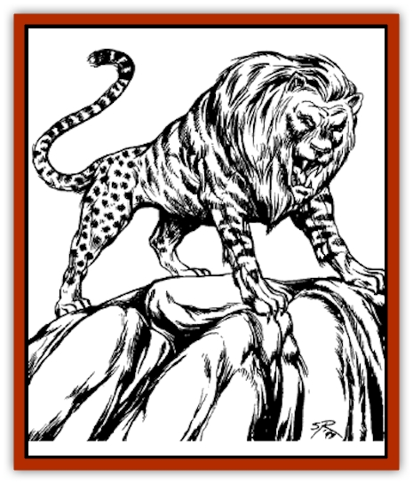

# Cat - War

| Statistic | **Cat, War** |
| --- | --- |
| **Activity Cycle:** | Any |
| **Alignment:** | Lawful neutral |
| **Armor Class:** | 0 |
| **Climate/Terrain:** | Any |
| **Damage/Attack:** | 2-8/2-8/2-24 |
| **Diet:** | Carnivore |
| **Frequency:** | Very rare |
| **Hit Dice:** | 10 |
| **Intelligence:** | Exceptional (16) |
| **Magic Resistance:** | Nil |
| **Morale:** | Champion (16) |
| **Movement:** | 18 |
| **No. Appearing:** | 13 |
| **No. of Attacks:** | 3 |
| **Organization:** | Pack |
| **Size:** | L (6' at shoulder) |
| **Special Attacks:** | Rear claws, 2-12 each |
| **Special Defenses:** | Nil |
| **THAC0:** | 11 |
| **Treasure:** | Nil |
| **XP Value:** | 6,000 |

As the Council of Thirteen rules the rats of Nehwon, so do the War Cats rule the [[Cat_Great|felines]]. A military aristocracy of all cat races, the War Cats may be summoned to do battle against anyone or anything that threatens felines. One method of summoning is by blowing upon a small enchanted tin whistle. In other circumstances, the War Cats appear without conscious summoning.

**Combat:** When summoned, the War Cats attack the most obvious threat to felines. They slash with two front claws and bite with their green-glowing teeth. If both forepaws hit, a War Cat automatically inflicts an additional 2d6 points of damage with each of its two rear claws.

**Habitat/Society:** The War Cats wander from place to place throughout Nehwon, dealing with threats to those they protect. The aristocracy of thirteen is a permanent council; should a member die or be slain, the remaining council members select a cat of suitable bravery, independence, and loyalty to take its place. This cat then transforms into a War Cat, taking on all the above statistics in 1-6 days.

**Ecology:** The War Cats may be considered archetypal felines, combining typical qualities of all cat species. The War Cats hunt individually, but they share all kills. They may act singly but always appear as a group. They are aggressive carnivores, seeking out the most challenging and powerful prey in an area, hunting it to maintain their predatory skills. As enchanted creatures, War Cats never age and can only be killed by accident or in battle. They have little tolerance for known enemies of cat-kind ([[Dog|canines]], [[Rat|rats]], and big game hunters, for example), and they stalk and slay such individuals in the most efficient and savage manner possible.

---
## Discovery & Documentation

**Source Publication:** Lankhmar: City of Adventure (2nd Ed.) (1993)
**Campaign Setting:** Lankhmar
**Author(s):** Bruce Nesmith, Douglas Niles, and Ken Rolston

### Other Creatures Found in This Source Book
   * [[Astral_Wolf|Astral Wolf]]
   * [[Behemoth|Behemoth]]
   * [[Bird_of_Tyaa|Bird of Tyaa]]
   * [[Cloaker_Sea|Cloaker, Sea]]
   * [[Cold_Woman|Cold Woman]]
   * [[Devourer_Lankhmar|Devourer (Lankhmar)]]
   * [[Ghoul_Kleshite|Ghoul, Kleshite]]
   * [[Ghoul_Lankhmar|Ghoul (Lankhmar)]]
   * [[Gladiator_Lizard|Gladiator Lizard]]
   * [[Horag|Horag]]
   * [[Howler|Howler]]
   * [[Ice_Gnome|Ice Gnome]]
   * [[Invisible_of_Stardock|Invisible of Stardock]]
   * [[Lizard|Lizard]]
   * [[Ophidian|Ophidian]]
   * [[Ray_Invisible_Flying|Ray, Invisible Flying]]
   * [[Scorpion|Scorpion]]
   * [[Simorgyan|Simorgyan]]
   * [[Snow_Serpent|Snow Serpent]]
   * [[Thunder_Children|Thunder Children]]
   * [[Wraith-Spider|Wraith-Spider]]
   * [[Zombie_Sea|Zombie, Sea]]
